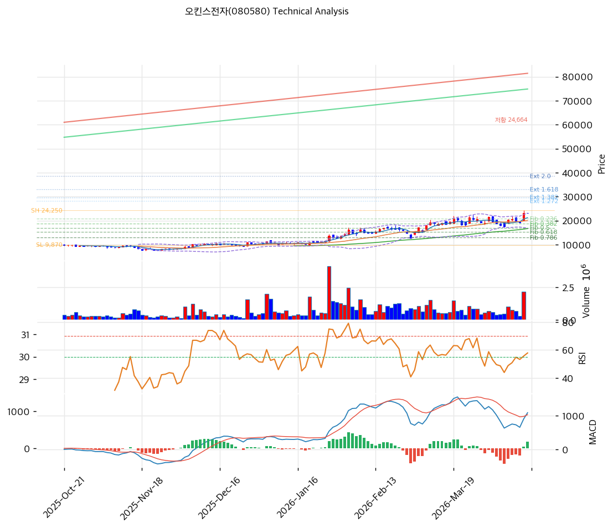

# 오킨스전자(080580) 기술적 분석

2026-04-15 | T2 Technical Analysis

---

## 차트

---

## 1. 가격 현황

| 항목 | 값 |
|------|-----|
| 현재가 | 23,250원 (0.00%) |
| 52주 고가 | 23,250원 |
| 52주 저가 | 10,060원 |
| 52주 범위 위치 | 100.0% |
| 거래량 | 데이터 미수집 (0.0x) |

※ 현재가가 52주 고가와 동일 — 신고가 돌파 상태

---

## 2. 차트 패턴 분석

### 2.1 캔들스틱 패턴

| 패턴 | 위치 | 신뢰도 | 해석 |
|------|------|--------|------|
| 신고가 도달 | 2026-04-15 기준 | 강 | 52주 최고가 갱신 — 강한 매수세 지속 시그널, 단기 과열 가능성 병존 |
| 상승 추세 지속 | 최근 수개월 | 중 | MA5(21,268원) → MA20(20,060원) → MA60(16,704원) 정배열로 추세 강도 확인 |

※ 거래량 데이터 미수집으로 캔들별 세부 패턴 확인 제한

### 2.2 가격 구조 패턴

- **상승 추세 채널** (신뢰도: 강)
  지지 추세선(기울기 +168.9원/일, 현재 교차가 18,966원)과 저항 추세선(기울기 +171.5원/일, 현재 교차가 24,664원)이 4개 포인트씩으로 상승 채널을 형성하고 있다. 현재가(23,250원)는 채널 상단(24,664원)에 근접해 있어 단기 조정 가능성을 내포한다. 채널 하단(18,966원)이 중기 지지선 역할을 한다.

- **신고가 돌파 구간** (신뢰도: 강)
  52주 고가(23,250원)를 현재가와 일치하는 신고가 상태로, 전통적으로 오버헤드 저항이 없는 구간이다. 피보나치 확장 목표가(28,161원, 29,743원)가 다음 저항으로 작동한다.

### 2.3 다이버전스

- **RSI 다이버전스 없음** (신뢰도: 중)
  RSI(14) 62.9로 중립 구간에서 가격 상승과 함께 동반 상승 중 — 추세 지속 시사. 현재 기준 뚜렷한 하락 다이버전스는 미관찰.

- **MACD 히스토그램 확대** (신뢰도: 강)
  MACD(1,089) > Signal(903), 히스토그램 +186으로 확대 중 — 상승 모멘텀 지속을 지지하는 히든 다이버전스 구조.

### 2.4 패턴 종합 판단

현재 차트는 강한 상승 추세 채널 내에서 52주 신고가를 기록하고 있으며, 이동평균선 정배열·MACD 매수 구간·스토캐스틱 골든크로스가 동시에 나타나 단기 강세 구도가 유효하다. 다만 현재가가 볼린저밴드 상단(23,165원)에 거의 밀착해 있고 52주 고가권에서 저항 없이 진입한 만큼, 상승 지속 시에는 피보나치 확장 1.272(28,161원)가 1차 목표가로 작동하며, 단기 조정 시 채널 지지선(18,966원)이 방어선이 된다.

---

## 3. 이동평균선 — 정배열 (강세)

| MA | 값 | 현재가 괴리율 | 위치 |
|----|-----|--------------|------|
| MA5 | 21,268원 | +9.3% | 위 |
| MA20 | 20,060원 | +15.9% | 위 |
| MA60 | 16,704원 | +39.2% | 위 |
| MA120 | — | — | — |
| MA200 | — | — | — |

**해석**: MA5 → MA20 → MA60 완전 정배열로 단기·중기·장기 추세가 모두 상승 기조. 현재가의 MA60 대비 괴리율이 +39.2%로 중기적으로 과열권에 근접한 수준이며, 조정 시 MA20(20,060원)이 1차 지지 역할을 한다.

---

## 4. 보조 지표

### RSI(14) — 62.9 (중립)

RSI 62.9는 과매수(70 이상)에 진입하기 직전 구간으로, 추가 상승 여력이 남아 있으나 모멘텀 둔화 시 과매수 경고가 빠르게 발생할 수 있다.

### MACD(12,26,9)

| 항목 | 값 |
|------|-----|
| MACD | 1,089 |
| Signal | 903 |
| Histogram | +186 |
| 크로스 상태 | 매수 구간 (확대 중) |

**해석**: MACD가 Signal 위에 위치하며 히스토그램이 확대되고 있어 상승 모멘텀이 강화되는 국면이다.

### 볼린저밴드(20, 2σ)

| 항목 | 값 |
|------|-----|
| 상단 | 23,165원 |
| 중단 (MA20) | 20,060원 |
| 하단 | 16,954원 |
| 밴드 폭 | 31.0% |
| 현재 위치 | 상단 근접 |

**해석**: 밴드 폭 31.0%로 비교적 넓게 확장된 상태이며, 현재가가 상단(23,165원)을 소폭 상회해 밴드 이탈 구간에 진입했다. 이탈 후 추세 지속 시 추가 확장 가능, 수렴 전환 시 중단(MA20, 20,060원)까지 되돌림 가능.

### 스토캐스틱(14, 3, 3)

| 항목 | 값 |
|------|-----|
| Slow %K | 69.1 |
| Slow %D | 58.7 |
| 크로스 상태 | 골든크로스 |
| 판단 | 중립 (과매수 70 근접) |

---

## 5. 지지/저항 — 추세선 · 피보나치 · PRZ 통합

### 5.1 피보나치 되돌림/확장

| 구분 | 비율 | 가격 | 현재가 대비 |
|------|------|------|-----------|
| Swing High | — | 24,250원 | — |
| 되돌림 | 0.236 | 20,856원 | -10.3% |
| 되돌림 | 0.382 | 18,757원 | -19.3% |
| 되돌림 | 0.5 | 17,060원 | -26.6% |
| 되돌림 | 0.618 | 15,363원 | -33.9% |
| 되돌림 | 0.786 | 12,947원 | -44.3% |
| Swing Low | — | 9,870원 | — |
| 확장 | 1.272 | 28,161원 | +21.1% |
| 확장 | 1.382 | 29,743원 | +27.9% |
| 확장 | 1.618 | 33,137원 | +42.5% |
| 확장 | 2.0 | 38,630원 | +66.1% |

※ 피보나치 기준: 상승 추세 (Swing Low 9,870원 → Swing High 24,250원)

### 5.2 추세선

| 추세선 | 방향 | 현재 교차가 | 포인트 수 | 해석 |
|--------|------|-----------|---------|------|
| 지지선 | 상승 | 18,966원 | 4개 | 상승 채널 하단, 중기 지지선 |
| 저항선 | 상승 | 24,664원 | 4개 | 상승 채널 상단, 단기 목표가 |

### 5.3 PRZ (Potential Reversal Zone)

| 방향 | 가격 범위 | 신뢰도 | 근거 |
|------|---------|--------|------|
| 지지 | 23,250원 | 강 | 피봇 R1, 피봇 R2, 피봇 S1, 피봇 S2 집중 |
| 지지 | 20,856~21,268원 | 약 | 피보나치 0.236 되돌림 + MA5 |
| 지지 | 18,757~18,966원 | 약 | 피보나치 0.382 되돌림 + 추세선 지지 |
| 지지 | 16,704~17,060원 | 약 | MA60 + 피보나치 0.5 되돌림 |

### 5.4 종합 지지/저항 테이블

| 구분 | 가격 | 근거 |
|------|------|------|
| 저항 | 24,664원 | 추세선 저항 (상승 채널 상단) |
| 저항 | 28,161원 | 피보나치 1.272 확장 |
| 저항 | 29,743원 | 피보나치 1.382 확장 |
| **현재가** | **23,250원** | — |
| 지지 | 21,062원 | PRZ (약) — 피보나치 0.236 + MA5 |
| 지지 | 20,060원 | MA20 |
| 지지 | 18,862원 | PRZ (약) — 피보나치 0.382 + 추세선 지지 |
| 지지 | 16,882원 | PRZ (약) — MA60 + 피보나치 0.5 |

---

## 6. 시그널 종합

| 지표 | 내용 | 시그널 |
|------|------|--------|
| **차트 패턴** | 상승 채널 상단 근접, 52주 신고가 갱신 | 🟢 |
| 이동평균선 | 정배열, MA20 +15.9% 위 | 🟢 |
| RSI | 62.9 — 중립 (과매수 접근) | ⚪ |
| MACD | 매수구간, 히스토그램 확대 | 🟢 |
| 볼린저밴드 | 상단 밀착(밴드 폭 31.0%), 이탈 경계 | ⚪ |
| 스토캐스틱 | 골든크로스, K=69.1 (과매수 직전) | ⚪ |
| 거래량 | 데이터 미수집 (0.0x) | ⚪ |

**종합 판단**: 🟢 매수 3개 / 🔴 매도 0개 / ⚪ 중립 4개 → **매수우위**

현재 기술적 구도는 정배열·MACD 매수·스토캐스틱 골든크로스가 동시에 작동하는 강세 구조이나, RSI·볼린저밴드·스토캐스틱 모두 과매수 임계치에 근접해 있어 추가 상승 시 단기 과열 경고 신호가 동반될 가능성이 높다. 단기적으로는 채널 상단(24,664원) 또는 피보나치 확장 1.272(28,161원) 도달 이후 조정 여부 확인이 필요하다.

---

## 7. 전략 제안

### 보유 중인 경우
- **홀드** (추세 강세 지속 중)
- 익절 라인: 24,664원 (추세선 저항 = 상승 채널 상단) / 2차 28,161원 (피보나치 1.272 확장)
- 손절 라인: 20,060원 (MA20 이탈 시 추세 훼손)
- 리스크/리워드: 24,664원 목표 기준 약 1:0.6 (단기), 28,161원 기준 약 1:2.1 (중기)

### 진입 대기인 경우
- **관망** (현재가가 52주 고가 = 신고가 돌파 구간이므로 추격 매수 신중)
- 1차 진입가: 21,062원 (PRZ — 피보나치 0.236 + MA5 지지)
- 2차 진입가: 18,862원 (PRZ — 피보나치 0.382 + 추세선 지지)
- 진입 조건: 조정 후 위 지지 구간에서 거래량 동반 반등 캔들 확인 후 진입
