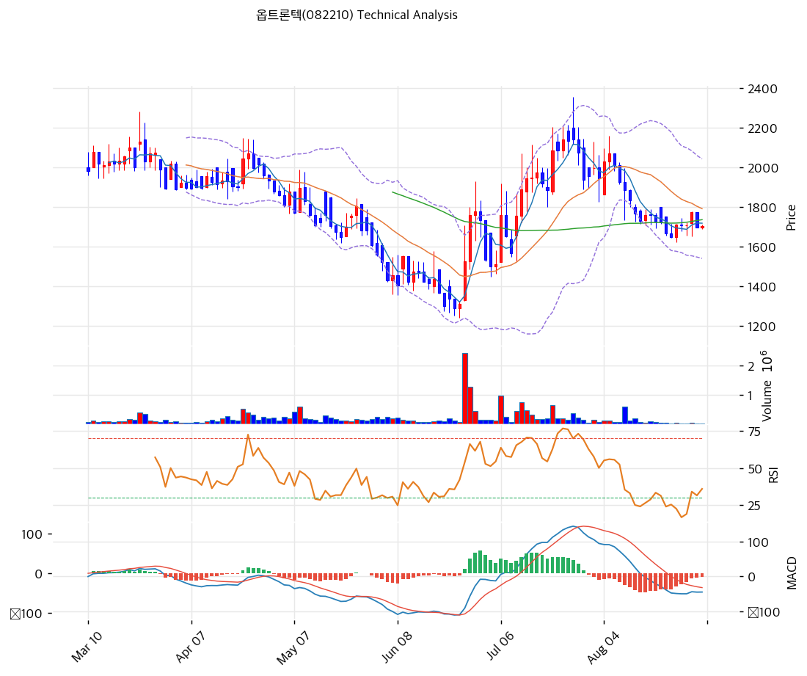

# 옵트론텍(082210) 기술적 분석

---

## 차트

---

## 가격 현황

| 항목 | 값 |
|---|---|
| 현재가 | **1,705원** (+0.41%) |
| 시가총액 | 596억원 (상장주식수 34,963,330주) |
| 52주 고가 | **2,420원** |
| 52주 저가 | **1,292원** |
| **52주 범위 위치** | **36.6%** |
| 고점 대비 | -29.5% |
| 저점 대비 | +32.0% |
| **거래량** | **11,517주** (20일 평균 대비 **0.12배**) |
| 상장주식수 대비 회전율 | 0.03% |

⚠️ **거래량 11,517주는 상장주식수 34,963,330주의 0.03%다.** 20일 평균의 0.12배로, 매수세와 매도세가 동시에 손을 놓은 상태다. 이 거래량에서 형성된 가격은 지지선이든 저항선이든 신뢰도가 낮다.

---

## 차트 패턴

### 캔들스틱 패턴

| 패턴 | 위치 | 신뢰도 | 해석 |
|---|---|---|---|
| **망치형** (긴 아래꼬리) | 6월 중순 1,292원 저점 | **강** | 차트 구간 내 최대 거래량(약 230만 주)을 동반한 아래꼬리. 저가 매물을 소화하고 종가를 끌어올린 반전 캔들이며, 이후 7월 급반등으로 확인됐다 |
| 연속 양봉 (적삼병 성격) | 6월 말\~7월 초 | 중 | 저점 확인 직후 양봉이 이어지며 1,700원대를 회복. 반등 초기 매수세 유입 구간 |
| **유성형** (긴 위꼬리 음봉) | 7월 말 고점 부근 | 중 | 장중 2,340원 부근까지 올랐다가 밀린 위꼬리. 고점 매물 출회 신호였고 8월 하락이 뒤따랐다 |
| 연속 음봉 (흑삼병 성격) | 8월 초 | 중 | 고점 이탈 후 음봉이 이어지며 2,000원선을 내줬다. 되돌림 국면 진입 |
| **도지성 소형 캔들 군집** | 8월 하순~현재 | 중 | 몸통이 거의 없는 캔들이 1,700원대에 밀집. 거래량 고갈과 겹쳐 방향성 상실 상태 |

※ 주요 캔들 패턴: 망치형, 역망치형, 장악형(상승/하락), 도지, 샛별/석별, 적삼병/흑삼병, 하라미, 유성형, 교수형 등

### 가격 구조 패턴

- **하락 채널** (신뢰도: 강)
  3월 2,100원대에서 6월 1,292원까지 약 3개월간 이어진 하락이다. 지지 추세선은 기울기 -2.24로 접점 6개를 확보했고 현재 교차가는 1,268원이다. 6월 저점 이후 주가는 채널 상단으로 튀어나왔지만 추세선 자체의 기울기는 여전히 아래를 향한다.

- **V자 반등** (신뢰도: 중)
  1,292원에서 7월 말 2,300원대까지 약 6주 만에 회복했다. 대량 거래를 동반한 저점 반전이었고 중간 되돌림 없이 직선으로 올랐다. 눌림목을 만들지 않고 오른 구간은 되밀릴 때도 속도가 빠르다. 8월 하락이 그 반증이다.

- **고점 낮추기** (신뢰도: 중)
  7월 반등의 고점은 52주 고가 2,420원에 닿지 못했다. 직전 고점을 회복하지 못한 반등이며, 6월 저점 1,292원과 7월 고점 사이 상승분의 절반을 현재 반납한 상태다.

- **수렴 박스와 밴드 스퀴즈** (신뢰도: 중)
  8월 하순 이후 주가는 피봇 S2 1,682원과 PRZ① 상단 1,737원 사이에 갇혀 있다. 볼린저 밴드 폭은 28.0%로 6월 급락기와 7월 급등기에 벌어졌던 폭이 다시 좁혀졌고, 5개 이동평균선이 1,719\~1,818원 99원 폭에 몰렸다. 방향이 정해지면 이탈 폭이 커지는 구조다. 다만 스퀴즈는 방향을 알려주지 않는다.

※ 주요 구조 패턴: 이중천정/바닥, 헤드앤숄더(정/역), 삼각수렴(대칭/상승/하락), 쐐기형(상승/하락), 깃발형, 페넌트, 컵앤핸들, 박스권 등

### 다이버전스

- **MACD 히스토그램 하락 다이버전스** (신뢰도: 중)
  7월 중순 히스토그램이 최대치를 찍은 뒤, 주가는 7월 말까지 고점을 더 높였는데 히스토그램은 줄었다. 가격보다 상승 동력이 먼저 꺾인 형태이며 8월 하락으로 해소됐다. 현재 시점에서는 이미 실현된 신호다.

- **RSI 저점 회복** (신뢰도: 약)
  8월 하순 RSI는 20대 초반까지 내려갔다가 현재 43.1로 올라왔다. 같은 기간 주가는 1,700원 부근에서 거의 움직이지 않았다. 가격이 저점을 더 낮추지 않았으므로 정식 상승 다이버전스로 보기는 어렵다. 매도 압력이 소진됐다는 정도로 읽는 것이 정확하다.

※ RSI·MACD 기반 | 상승 다이버전스 = 가격↓ 지표↑ (반등 시사), 하락 다이버전스 = 가격↑ 지표↓ (하락 시사), 히든 다이버전스 = 기존 추세 지속 시사

### 패턴 종합 판단

6월 저점의 망치형과 7월 말의 유성형은 각각 제 역할을 끝냈다. 반전 신호도 소진 신호도 이미 가격에 반영됐다. 지금 차트를 지배하는 것은 8월 하순 이후의 수렴이다. 소형 캔들 군집, 거래량 0.12배, 5개 이평선 밀집, 밴드 폭 축소가 같은 자리에 모여 있다.

상충하는 부분이 하나 있다. MACD는 여전히 매도 구간(-45.0)인데 RSI는 20대에서 43.1까지 회복했다. 후행 지표와 선행 지표 사이에 시차가 벌어진 구간이며, 이 시차가 좁혀지는 방향이 단기 방향이다.

방향성 신호는 없고 에너지 축적 신호만 있다.

---

## 이동평균선 (비정배열, 약세)

| MA | 값 | 현재가 괴리율 | 위치 |
|---|---|---|---|
| MA5 | 1,719원 | -0.8% | 아래 |
| **MA20** | **1,792원** | **-4.9%** | 아래 |
| MA60 | 1,737원 | -1.8% | 아래 |
| MA120 | 1,806원 | -5.6% | 아래 |
| MA200 | 1,818원 | -6.2% | 아래 |

**해석**: 5개선이 모두 현재가 위에 있다. 정배열도 완전한 역배열도 아니다. 배열 순서는 MA200 1,818원, MA120 1,806원, MA20 1,792원, MA60 1,737원, MA5 1,719원으로 장기선이 위에 단기선이 아래에 놓인 약세 배열이다.

다만 최대 괴리가 MA200 대비 -6.2%에 그친다. 이격 부담이 없다는 뜻이며, 과매도 반등을 기대할 자리도 아니라는 뜻이기도 하다.

**5개선이 99원(현재가의 5.8%) 폭에 몰려 있다.** 한 번 움직이면 여러 선을 동시에 통과하는 구조다. 가장 가까운 저항은 MA5 1,719원과 MA60 1,737원이고, 그 위가 MA20·MA120·MA200이 겹치는 1,792\~1,818원 밀집대다.

---

## 보조 지표

### RSI(14) 43.1 (중립)

과매수 70과 과매도 30 사이, 중간선 아래에 있다. 8월 하순 20대 초반에서 올라온 자리이며 50선은 아직 회복하지 못했다. 방향은 위를 향하지만 강도는 약하다.

### MACD(12,26,9)

| 항목 | 값 |
|---|---|
| MACD | -45.0 |
| Signal | -36.0 |
| Histogram | -9.0 |
| 크로스 상태 | **매도** 구간 (수축 중) |

**해석**: MACD가 시그널 아래에 있어 매도 구간이다. 다만 히스토그램 -9.0은 8월 하락기의 골보다 얕고 음의 폭이 줄고 있다. 하락 압력 자체는 약해지는 중이다. 두 선 모두 0선 아래에 있어 추세 전환을 말하려면 시그널선 상향 돌파가 먼저 나와야 한다.

### 볼린저밴드(20, 2σ)

| 항목 | 값 |
|---|---|
| 상단 | 2,043원 |
| 중단 (MA20) | 1,792원 |
| 하단 | 1,542원 |
| 밴드 폭 | **28.0%** |
| 현재 위치 | 중간 (하단에서 32.5% 지점) |

**해석**: 현재가는 하단 1,542원과 상단 2,043원 사이 32.5% 지점으로 중단선 아래에 있다. 밴드 폭 28.0%는 6월 급락과 7월 급등 때 크게 벌어졌던 폭이 다시 좁혀진 결과다. 거래량 고갈과 겹치면 스퀴즈 이후 방향 결정 구간으로 본다. 밴드가 좁아졌다는 사실만으로 상방을 예상할 근거는 없다.

### 스토캐스틱(14, 3, 3)

| 항목 | 값 |
|---|---|
| Slow %K | 37.4 |
| Slow %D | 31.6 |
| 크로스 상태 | **골든크로스** |
| 판단 | 중립 |

%K가 %D를 위로 통과했다. 과매도 구간을 벗어난 직후의 반등 신호이지만 두 값 모두 50 아래다. 50선 위로 올라서고 유지돼야 의미가 생긴다.

---

## 수급

| 항목 | 수치 |
|---|---|
| 외국인 20일 순매수 | +71,689주 |
| **외국인 5일 순매수** | **-6,729주** |
| 기관 20일 순매수 | 0주 |
| **8/10 외국인 단일 순매수** | **+168,218주** |
| 8/10 제외 19거래일 합계 | **-96,529주** |

⚠️ **8월 10일 하루 외국인 순매수 168,218주가 20일 누적을 혼자 끌어올렸다.** 그날을 빼면 나머지 19거래일 합계는 96,529주 순매도다.

8월 12일부터 21일까지는 연속 순매도였고 최근 5일도 6,729주 순매도다. 기관은 20일간 순매수 0주로 참여 자체가 없다. 20일 누적 +71,689주라는 숫자만 보면 외국인이 사들인 것처럼 보이지만, 실제 흐름은 하루 매수 뒤 이어진 계속된 매도다.

---

## 지지·저항

### 피보나치 되돌림/확장

| 구분 | 비율 | 가격 | 현재가 대비 |
|---|---|---|---|
| Swing High | — | 2,140원 | +25.5% |
| 되돌림 | 0.236 | 1,940원 | +13.8% |
| 되돌림 | 0.382 | 1,816원 | +6.5% |
| **되돌림** | **0.5** | **1,716원** | **+0.6%** |
| 되돌림 | 0.618 | 1,616원 | -5.2% |
| 되돌림 | 0.786 | 1,473원 | -13.6% |
| Swing Low | — | 1,292원 | -24.2% |
| 확장 | 1.272 | 2,371원 | +39.1% |
| 확장 | 1.382 | 2,464원 | +44.5% |
| 확장 | 1.618 | 2,664원 | +56.2% |
| 확장 | 2.0 | 2,988원 | +75.3% |

※ 피보나치 기준: 상승 추세 (Swing Low 1,292원 → Swing High 2,140원)
※ 이 표의 Swing High 2,140원은 52주 고가 2,420원과 다른 값이다. 피보나치 레벨을 읽을 때 두 기준을 섞지 말 것
※ 되돌림 = 직전 상승분에서 되돌아온 비율, 확장 = 추세 방향 목표가

**현재가 1,705원은 0.5 되돌림 1,716원 바로 아래에 있다.** 6월 저점부터 7월 고점까지 오른 폭의 절반을 정확히 반납한 자리다. 0.5 되돌림은 되돌림 구간 중 방어 여부가 가장 자주 갈리는 지점이며, 지금은 11원 차이로 아래에 있다.

### 추세선

| 추세선 | 방향 | 현재 교차가 | 포인트 수 | 해석 |
|---|---|---|---|---|
| 지지선 | 하락 | 1,268원 | 6개 | 기울기 -2.24. 3월부터 6월 저점까지 이어진 하락 지지선이다. 현재가와 437원(-25.6%) 떨어져 있어 당장의 방어선 역할은 하지 못한다 |
| 저항선 | 상승 | 2,305원 | 6개 | 기울기 0.01로 사실상 수평. 현재가 대비 +35.2% 위에 있어 상단 제약은 멀다 |

두 선의 간격이 1,000원 이상 벌어져 있다. 추세선만으로는 현재 구간을 설명하지 못하며, 실질 판단은 이평선과 피봇에 의존해야 한다.

### PRZ (Potential Reversal Zone)

| 방향 | 가격 범위 | 신뢰도 | 근거 |
|---|---|---|---|
| 저항 | **1,682\~1,737원** (중심 1,712원) | **강** | 피봇 S2, S1, R1, R2, 피보나치 0.5 되돌림, MA5, MA60 |
| 저항 | **1,792\~1,818원** (중심 1,808원) | **강** | MA20, MA120, MA200, 피보나치 0.382 되돌림 |

※ PRZ = 추세선·피보나치·피봇·MA 등 복수 지표가 겹치는 가격 구간. 겹치는 소스가 많을수록 반전 확률 상승

⚠️ **산출상 두 구간 모두 방향이 저항으로 잡혔지만, PRZ①은 현재가 1,705원을 안에 품고 있다.** 실제로는 지지와 저항이 겹친 균형 구간이며, 종가가 이 55원 폭을 어느 쪽으로 벗어나는지가 단기 방향이다. PRZ②는 이평선 3개가 겹쳐 상단 저항 중 가장 두껍다.

### 종합 지지·저항

| 구분 | 가격 | 근거 |
|---|---|---|
| 저항 | 2,420원 | 52주 고가 |
| 저항 | 2,043원 | 볼린저 상단 |
| 저항 | 1,940원 | 피보나치 0.236 되돌림 |
| **강 저항** | **1,792\~1,818원** | **PRZ② (MA20, MA120, MA200, 피보나치 0.382), 볼린저 중단** |
| 저항 | 1,737원 | MA60, PRZ① 상단 |
| 저항 | 1,724원 | 피봇 R2 |
| 저항 | 1,719원 | MA5 |
| 저항 | 1,716원 | 피보나치 0.5 되돌림 |
| 저항 | 1,714원 | 피봇 R1 |
| **현재가** | **1,705원** | 피봇 P 1,703원과 거의 일치 |
| 지지 | 1,693원 | 피봇 S1 |
| **강 지지** | **1,682원** | **피봇 S2, PRZ① 하단** |
| 지지 | 1,616원 | 피보나치 0.618 되돌림 |
| 지지 | 1,542원 | 볼린저 하단 |
| 지지 | 1,473원 | 피보나치 0.786 되돌림 |
| **최종 지지** | **1,292원** | **52주 저가, 6월 중순 대량거래 반전 저점** |
| 최종 지지 | 1,268원 | 하락 지지 추세선 교차가 |

현재가 위아래 30원 안에 피봇 5개와 이평선 2개, 피보나치 0.5 되돌림이 몰려 있다. 이 좁은 구간을 벗어나기 전까지 지지와 저항을 구분하는 것 자체가 무의미하다.

**실질적으로 의미 있는 다음 지지는 1,616원(피보나치 0.618)**이고, **다음 저항은 1,792\~1,818원 밀집대**다. 그 사이 구간은 거래량이 붙지 않은 상태에서 만들어진 자리라 방어력이 검증되지 않았다.

---

## 시그널 종합

| 지표 | 내용 | 시그널 |
|---|---|---|
| **차트 패턴** | 6월 망치형 반전과 7월 유성형 소진 이후 수렴. 소형 캔들 군집, MACD 하락 다이버전스는 8월 하락으로 해소 | ⚪ |
| 이동평균선 | 비정배열, MA20 -4.9% | ⚪ |
| RSI | 43.1, 중립 | ⚪ |
| MACD | 매도 구간 | 🔴 |
| 볼린저밴드 | 중간, 밴드 폭 28.0% | ⚪ |
| 스토캐스틱 | 골든크로스, K=37.4 | ⚪ |
| 거래량 | 0.12x, 약함 | ⚪ |

**종합 판단**: 🟢 매수 0개 / 🔴 매도 1개 / ⚪ 중립 5개 → **매도우위**

※ 집계는 이동평균선 이하 6개 지표 기준이다. 차트 패턴 행은 이미지 판독에 따른 정성 판단이라 집계에 넣지 않았다

**매수 신호가 하나도 없다.** 그렇다고 매도 신호가 쌓인 것도 아니고 여섯 중 다섯이 중립이다. 지금 차트는 방향을 가진 상태가 아니라 방향을 만들기 전 상태다.

거래량 0.12배는 양쪽 모두 손을 놓았다는 뜻이다. 이 상태에서 나오는 첫 대량 거래가 방향을 정한다. 상방 조건은 1,737원과 1,792원을 차례로 회복하는 것이고, 하방 조건은 1,682원 종가 이탈이다. 그 전까지는 지표 다섯 개가 중립을 가리키는 이유가 있다.

---

## 전략

### 보유 중인 경우

- **비중축소**
- 익절 라인: **2,468원** (산출값. 52주 고가 2,420원과 피보나치 1.382 확장 2,464원을 모두 넘는 자리라 도달 조건이 까다롭다)
- 손절 라인: **1,682원** (피봇 S2, PRZ① 하단)
- 리스크/리워드: 산술상 33:1 (익절까지 +44.8%, 손절까지 -1.3%)

⚠️ **손절선 1,682원은 현재가에서 23원, 1.3% 아래다.** 일중 변동만으로도 닿는 거리이며 손익비 33:1은 실전 수치가 아니다. 손절을 실제로 운용하려면 구조가 깨지는 자리로 내려 잡아야 한다. 피보나치 0.618 되돌림 1,616원(-5.2%)이나 볼린저 하단 1,542원(-9.6%)이 그 후보다.

비중축소 근거는 세 가지다. 5개 이평선이 모두 현재가 위에 있고, MACD가 매도 구간이며, 외국인은 8월 10일 이후 계속 순매도다. 상방을 밀어줄 재료가 지표상 확인되지 않는다.

### 진입 대기인 경우

- **진입가능**
- 1차 진입가: **1,693원** (피봇 S1, 현재가 대비 -0.7%)
- 2차 진입가: **1,792원** (MA20이자 볼린저 중단, PRZ② 하단, 현재가 대비 +5.1%)
- 진입 조건: 1차는 눌림목 분할 매수, 2차는 밀집대 돌파 확인 매수다. 성격이 반대이므로 같은 자금으로 섞지 않는다

1차 1,693원은 현재가에서 12원 아래다. 사실상 현재가 진입이며, 그만큼 손절 여유도 없다. 2차 1,792원은 MA20·MA120·MA200이 겹치는 저항대의 하단이라, 이 자리를 거래량 동반해 넘으면 8월 하락 추세가 끝났다고 볼 근거가 생긴다.

어느 쪽이든 20일 평균 거래량 회복이 전제다. 현재 거래량 11,517주를 0.12배로 역산하면 20일 평균은 9만 주대다. 지금의 1만 주대 거래에서 잡은 진입가는 슬리피지조차 통제되지 않는다.

**진입 보류 조건**: 1,682원 종가 이탈. 이 경우 다음 확인 지점은 피보나치 0.618 되돌림 1,616원이며, 그 아래는 볼린저 하단 1,542원까지 지지가 비어 있다.
