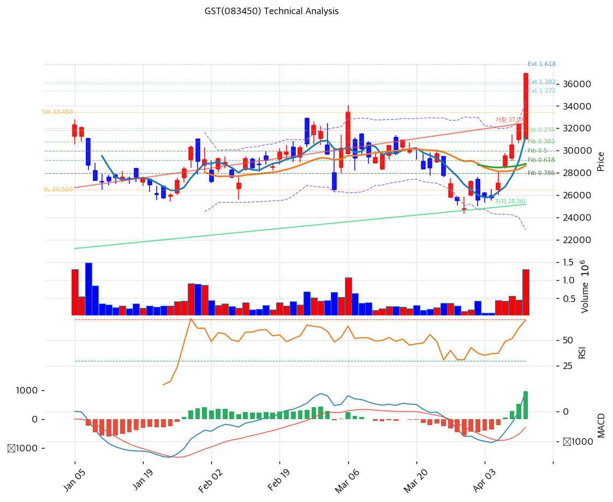

# GST(083450) 기술적 분석

2026-04-13 | T2 Technical Analysis

---

## 차트

---

## 1. 가격 현황

| 항목 | 값 |
|------|-----|
| 현재가 | 36,900원 (+14.06%) |
| 52주 고가 | 37,000원 |
| 52주 저가 | 15,550원 |
| 52주 범위 위치 | 100.0% |
| 거래량 | 20일 평균 대비 4.37x |

---

## 2. 차트 패턴 분석

### 2.1 캔들스틱 패턴

| 패턴 | 위치 | 신뢰도 | 해석 |
|------|------|--------|------|
| 대형 양봉 (장대양봉) | 당일 (2026-04-13) | 강 | 거래량 4.37배 동반 +14% 급등봉. 강력한 매수세 유입 시그널이나 단기 과열 가능성 병존 |
| 52주 신고가 돌파 시도 | 당일 | 중 | 37,000원 52주 고가에 근접(36,900원). 돌파 시 추가 상승 여력 확인 필요 |

※ 주요 캔들 패턴: 망치형, 역망치형, 장악형(상승/하락), 도지, 샛별/석별, 적삼병/흑삼병, 하라미, 유성형, 교수형 등

### 2.2 가격 구조 패턴

- **상승 추세 채널** (신뢰도: 강)
  지지 추세선(기울기 +59.99, 현재 교차가 28,361원, 접촉점 6개)과 저항 추세선(기울기 +88.05, 현재 교차가 37,156원, 접촉점 6개)이 뚜렷한 상승 채널을 형성하고 있다. 현재 주가(36,900원)는 채널 상단(37,156원) 부근까지 도달한 상태로, 채널 상단 돌파 성공 여부가 다음 목표가 결정의 분기점이다.

- **52주 신고가 박스권 돌파 시도** (신뢰도: 중)
  52주 고가 37,000원은 장기 저항선으로, 현재가 36,900원은 사실상 이 저항에 닿아 있다. 돌파 후 종가 확인 시 신고가 모멘텀이 발생할 수 있으나, 돌파 실패 시 강한 차익실현 매물 구간이다.

### 2.3 다이버전스

- **RSI 상승 다이버전스 부재 / 과매수 진입** (신뢰도: 강)
  RSI(14) 70.1로 과매수 영역 진입. 가격과 RSI가 동반 상승하는 구간으로 현재는 모멘텀 지속형이나, RSI가 70 이상에서 꺾일 경우 하락 다이버전스로 전환 가능성이 높다.

- **MACD 히스토그램 확대 (추세 지속 시사)** (신뢰도: 강)
  MACD(703) > Signal(-238)로 매수 구간이며 히스토그램 +941로 확대 중. 단기 추세 지속을 시사하는 모멘텀 신호이나, 히스토그램이 수축 전환되면 추세 약화 경고로 해석해야 한다.

### 2.4 패턴 종합 판단

당일 거래량 4.37배의 장대양봉은 단기 강력한 매수세 확인 신호다. 그러나 RSI 70.1 과매수, 스토캐스틱 K=94.9 극단적 과매수, 볼린저밴드 상단 밀착이 동시에 나타나 단기 조정 압력이 높다. 상승 추세 채널 내에서 상단 저항(37,156원) 부근에 위치해 있어, 채널 돌파 시 추가 상승이 가능하나 실패 시 강한 되돌림이 예상된다. 상충 시그널: MACD 히스토그램 확대(추세 지속)와 RSI·스토캐스틱 과매수(단기 경고)가 공존한다.

---

## 3. 이동평균선 — 비정배열 (단기 강세)

| MA | 값 | 현재가 괴리율 | 위치 |
|----|-----|--------------|------|
| MA5 | 31,280원 | +18.0% | 위 |
| MA20 | 28,658원 | +28.8% | 위 |
| MA60 | 28,816원 | +28.1% | 위 |
| MA120 | 27,705원 | +33.2% | 위 |
| MA200 | 24,820원 | +48.7% | 위 |

**해석**: 현재가가 MA5~MA200 전체 이동평균선 위에 위치하나, MA5(31,280원) < MA20(28,658원)의 단기 비정배열 구조다. 모든 이동평균 대비 +18~49%의 극단적 괴리율은 단기 과열을 명확히 시사한다. MA20(28,658원)과 MA60(28,816원)이 거의 동일한 가격대에서 강한 지지선 역할을 할 것으로 예상된다.

---

## 4. 보조 지표

### RSI(14) — 70.1 (🔴 과매수)

RSI 70.1로 과매수 임계값(70)을 막 상회한 상태로, 추가 상승 시 RSI가 추가 확장될 수 있으나 일반적으로 70 초과 진입 후 조기 되돌림 발생 확률이 높아진다.

### MACD(12,26,9)

| 항목 | 값 |
|------|-----|
| MACD | 703.0 |
| Signal | -238.0 |
| Histogram | +941.0 |
| 크로스 상태 | 매수 구간 (확대 중) |

**해석**: MACD가 Signal을 상향 돌파한 매수 구간이며 히스토그램이 +941로 확대되고 있어 단기 모멘텀은 상승 지속을 시사한다.

### 볼린저밴드(20, 2σ)

| 항목 | 값 |
|------|-----|
| 상단 | 34,386원 |
| 중단 (MA20) | 28,658원 |
| 하단 | 22,929원 |
| 밴드 폭 | 40.0% |
| 현재 위치 | 상단 근접 (상단 돌파) |

**해석**: 현재가(36,900원)가 볼린저 상단(34,386원)을 이미 돌파한 상태로, 밴드 폭 40%의 확장이 지속되고 있다. 상단 밴드 이탈은 강한 추세의 신호이기도 하지만 평균 회귀 압력이 누적되고 있어 중단(MA20 28,658원)으로의 되돌림 경계가 필요하다.

### 스토캐스틱(14, 3, 3)

| 항목 | 값 |
|------|-----|
| Slow %K | 94.9 |
| Slow %D | 86.2 |
| 크로스 상태 | 골든크로스 |
| 판단 | 과매수 |

---

## 5. 지지/저항 — 추세선 · 피보나치 · PRZ 통합

### 5.1 피보나치 되돌림/확장

| 구분 | 비율 | 가격 | 현재가 대비 |
|------|------|------|-----------|
| Swing High | — | 33,450원 | — |
| 되돌림 | 0.236 | 31,810원 | -13.8% |
| 되돌림 | 0.382 | 30,795원 | -16.5% |
| 되돌림 | 0.5 | 29,975원 | -18.8% |
| 되돌림 | 0.618 | 29,155원 | -21.0% |
| 되돌림 | 0.786 | 27,987원 | -24.2% |
| Swing Low | — | 26,500원 | — |
| 확장 | 1.272 | 35,340원 | -4.2% |
| 확장 | 1.382 | 36,105원 | -2.2% |
| 확장 | 1.618 | 37,745원 | +2.3% |
| 확장 | 2.0 | 40,400원 | +9.5% |

※ 피보나치 기준: 상승 추세 (Swing Low 26,500원 → Swing High 33,450원)
※ 되돌림 = 직전 추세에서 되돌아온 비율, 확장 = 추세 방향 목표가

### 5.2 추세선

| 추세선 | 방향 | 현재 교차가 | 포인트 수 | 해석 |
|--------|------|-----------|---------|------|
| 지지선 | 상승 | 28,361원 | 6개 | 중장기 상승 추세의 바닥을 연결하는 핵심 지지선. 이탈 시 추세 전환 신호 |
| 저항선 | 상승 | 37,156원 | 6개 | 상승 채널 상단. 현재가(36,900원)가 근접해 있어 돌파 시 추가 강세 신호 |

### 5.3 PRZ (Potential Reversal Zone)

| 방향 | 가격 범위 | 신뢰도 | 근거 |
|------|---------|--------|------|
| 저항 | 37,156~37,745원 | 약 | 추세선 저항(37,156원) + 피보나치 1.618 확장(37,745원) |
| 저항 | 40,400~40,967원 | 약 | 피보나치 2.0 확장(40,400원) + 피봇 R2(40,967원) |
| 지지 | 30,795~31,810원 | 중 | 피보나치 0.382 되돌림(30,795원) + MA5(31,280원) + 피보나치 0.236 되돌림(31,810원) |
| 지지 | 27,705~29,155원 | 강 | MA120(27,705원) + 피보나치 0.786 되돌림(27,987원) + 추세선 지지(28,361원) + MA20(28,658원) + MA60(28,816원) + 피봇 S2(28,967원) + 피보나치 0.618 되돌림(29,155원) |

※ PRZ = 추세선·피보나치·피봇·MA 등 복수 지표가 겹치는 가격 구간. 겹치는 소스가 많을수록 반전 확률 상승.

### 5.4 종합 지지/저항 테이블

| 구분 | 가격 | 근거 |
|------|------|------|
| 저항 | 40,684원 | PRZ (약) — 피보나치 2.0 확장(40,400원), 피봇 R2(40,967원) |
| 저항 | 38,933원 | 피봇 R1 |
| 저항 | 37,450원 | PRZ (약) — 추세선 저항(37,156원), 피보나치 1.618 확장(37,745원) |
| **현재가** | **36,900원** | — |
| 지지 | 32,933원 | 피봇 S1 |
| 지지 | 31,295원 | PRZ (중) — 피보나치 0.382 되돌림(30,795원), MA5(31,280원), 피보나치 0.236 되돌림(31,810원) |
| 지지 | 28,521원 | PRZ (강) — MA120, MA20, MA60, 추세선 지지, 피봇 S2, 피보나치 0.618·0.786 되돌림 집중 |

---

## 6. 시그널 종합

| 지표 | 내용 | 시그널 |
|------|------|--------|
| **차트 패턴** | 장대양봉+거래량 폭발, 상승 채널 상단 근접, 52주 신고가 도달 | 🟢 |
| 이동평균선 | 비정배열, MA20 +28.8% 극단 괴리 | 🔴 |
| RSI | 70.1 — 과매수 | 🔴 |
| MACD | 매수 구간, 히스토그램 확대 | 🟢 |
| 볼린저밴드 | 상단 밀착/돌파, 밴드 폭 40% | ⚪ |
| 스토캐스틱 | 골든크로스, K=94.9 — 극단 과매수 | 🔴 |
| 거래량 | 4.37x — 강력 동반 | 🟢 |

**종합 판단**: 🟢 매수 3개 / 🔴 매도 3개 / ⚪ 중립 1개 → **중립 (단기 과열 경계)**

당일 +14% 급등과 거래량 4.37배는 강력한 매수세 유입을 확인시켜 준다. 그러나 RSI 70.1, 스토캐스틱 K=94.9, 볼린저밴드 상단 돌파가 동시에 발생한 극단 과열 구간으로, 단기 조정 가능성이 높다. 중기적으로는 상승 추세 채널(지지 28,361원)이 유효하며, 1차 지지는 PRZ(중) 구간인 30,795~31,810원, 핵심 지지는 PRZ(강) 구간 27,705~29,155원이다.

---

## 7. 전략 제안

### 보유 중인 경우
- **비중축소**
- 익절 라인: 37,638원 (추세선 저항 37,156원 + 피보나치 1.618 확장 37,745원 PRZ 중간값 기준)
- 손절 라인: 28,967원 (피봇 S2, PRZ 강 구간 하단)
- 리스크/리워드: 목표 +2.0% / 손절 -21.5% → 단기 비대칭 불리, 비중 축소 권고

### 진입 대기인 경우
- **관망**
- 1차 진입가: 32,933원 (피봇 S1, 조정 후 반등 확인 시)
- 2차 진입가: 28,658원 (MA20, PRZ 강 구간 중심부)
- 진입 조건: 거래량 축소 + 조정 후 PRZ 지지 확인 + MACD 히스토그램 재확대 신호 동반 시 진입
