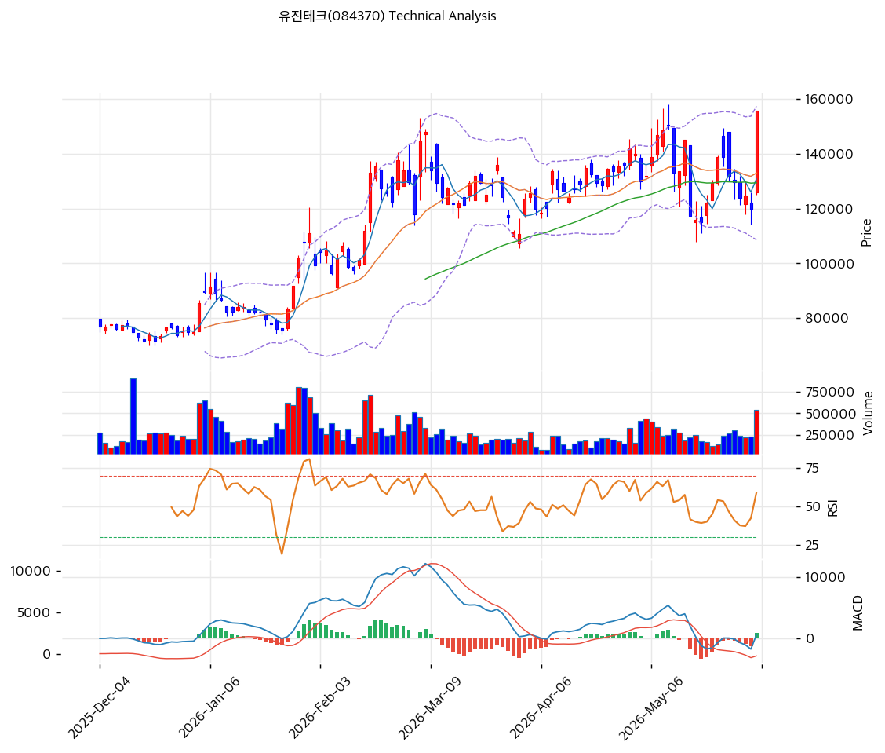

# 유진테크(084370) 기술적 분석 보고서

---

## 가격 위치

현재가 **155,700원** (+29.97%) — **52주 신고가** 갱신, 52주 위치 **100%** (고가 155,700원 / 저가 32,000원). 1년 **+387%** (32,000→155,700). DRAM 증설 capex 사이클 수혜 + 어닝 모멘텀. 거래량비 **2.18배 폭증**. RSI 62.2 중립. 당일 +30% 급등으로 단기 과열.

## 이동평균선

| 이평선 | 값 | 이격도 | 위치 |
|------|---:|----:|:---:|
| MA5 | 130,820원 | +19.0% | 위 |
| MA20 | 132,975원 | +17.1% | 위 |
| MA60 | 129,423원 | +20.3% | 위 |
| MA120 | 111,877원 | +39.2% | 위 |
| MA200 | 95,474원 | +63.1% | 위 |

**정배열(단기 혼조, aligned False)** — 현재가는 모든 이평선 위이나, MA5(130,820)<MA20(132,975)로 단기선이 박스권 후 당일 +30% 급등으로 이탈. MA200 대비 +63.1% 이격. 박스권(MA20·MA60 13만원대) 상단 돌파 직후.

## 모멘텀 지표

- **RSI 62.2 (중립)** — 70 미만, 과매수 직전. 추가 모멘텀 여유
- **MACD 594 / 시그널 -267 / 히스토 +861** — 매수 전환 + 강한 (+) 히스토. 급등 모멘텀 강화
- **스토캐스틱 K=56.5 / D=43.0** — 골든크로스, 중립
- **볼린저밴드** — 상단 157,356 / 중심 132,975 / 하단 108,594, 폭 36.7%, **상단 돌파**. 변동성 확대
- **거래량비 2.18x** — 평균 2.2배 폭증, 급등 매수 쇄도

## 피보나치 되돌림 (스윙 32,000 / 155,700)

| 레벨 | 가격 | 성격 |
|------|---:|------|
| 0.236 | 126,500원 | 1차 지지 (MA60·MA20 근접) |
| 0.382 | 108,400원 | 2차 지지 (BB 하단·MA120) |
| 0.5 | 93,850원 | 중기 지지 (MA200 근접) |
| 0.618 | 79,250원 | 깊은 조정 |
| 0.786 | 58,400원 | 추가 조정 |

## 지지/저항 (S&R)

- **저항**: 155,700원(52주 고가) / 158,814원(피봇 R1·전략 TP) / 157,356원(BB 상단)
- **지지**: 135,300원(피봇 S1) / **132,975원(MA20·PRZ)** / 129,423원(MA60) / 126,500원(피보 0.236) / 114,900원(전략 SL) / 111,877원(MA120)

## 종합 시그널 & 전략

**시그널: 매수 1 / 매도 0 / 중립 5 → 매수우위** (급등 모멘텀 + MACD 강세)

- **전략**: HOLD(홀드) — **TP 158,814원 / SL 114,900원**. WAIT(관망) e1 135,300원 / e2 132,975원
- **눌림목 매수**: 1년 +387% + 당일 +30% + 거래량 2.18배로 **신고가 추격 비추**. 조정 시 **MA20 132,975원 ~ 피보 0.236 126,500원 분할 매수**, 깊은 조정 시 MA120 111,877원
- **상방**: 52주 고가 155,700원 돌파 시 158,814원 → 서승연 목표 173,000원. DRAM 증설·실적 모멘텀이 동력
- **하방**: MA20 132,975원 이탈 시 126,500원 → MA120 111,877원. capex 사이클 의존으로 둔화 시 조정 폭 큼
- **변곡점**: DRAM 증설(P4·P5·M15X) 진행이 추세 분기점. 당일 +30% 급등 직후 단기 변동성 극대, 외국인 +59만주 순매수는 긍정
