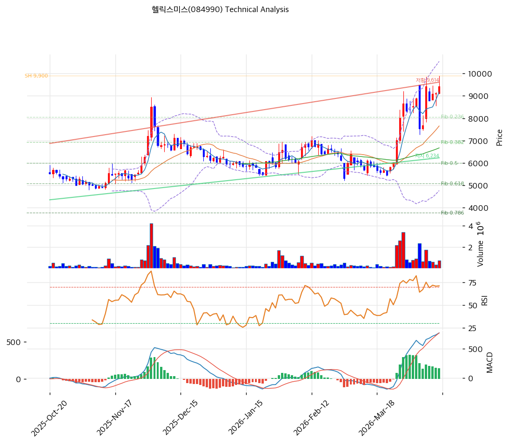

# 헬릭스미스(084990) 기술적 분석

2026-04-14 | T2 Technical Analysis

---

## 차트

---

## 1. 가격 현황

| 항목 | 값 |
|------|-----|
| 현재가 | 9,430원 (+3.40%) |
| 52주 고가 | 9,430원 |
| 52주 저가 | 2,185원 |
| 52주 범위 위치 | 100.0% |
| 거래량 | 20일 평균 대비 0.78x |

---

## 2. 차트 패턴 분석

### 2.1 캔들스틱 패턴

| 패턴 | 위치 | 신뢰도 | 해석 |
|------|------|--------|------|
| 강세 캔들 (양봉) | 2026-04-14 (당일) | 중 | 전일 대비 +3.40% 상승 마감으로 단기 매수세 유입 확인, 그러나 거래량이 평균의 0.78배로 뒷받침 부족 |
| 신고가 갱신 | 52주 고가 동가 | 중 | 현재가 9,430원이 52주 고가와 동일하여 상단 저항 부재 구간이나, 고점에서의 매도세 출현 경계 필요 |

※ 주요 캔들 패턴: 망치형, 역망치형, 장악형(상승/하락), 도지, 샛별/석별, 적삼병/흑삼병, 하라미, 유성형, 교수형 등

### 2.2 가격 구조 패턴

- **상승 추세 지속** (신뢰도: 강)
  2025년 저점 2,185원에서 현재 9,430원까지 약 +332% 상승한 강력한 상승 추세다. 모든 이동평균선(MA5~MA200)이 현재가 아래에 위치하는 완벽한 정배열 구조이며, 6개 포인트로 형성된 상승 지지 추세선(현재 교차가 6,234원)이 하방을 지지하고 있다. 추세 유지 조건은 9,053원(피봇 S1) 위 유지다.

- **신고가 구간 저항 부재** (신뢰도: 중)
  52주 고가(9,430원)를 현재가가 터치하고 있어 선행 저항선이 존재하지 않는 구간이다. 다음 저항은 피봇 R1(9,853원), 피보나치 1.272 확장선(12,018원)으로 단기 목표가 산출 가능하나, 거래량 감소(0.78x) 상태에서의 신고가 돌파는 신뢰도가 낮다.

※ 주요 구조 패턴: 이중천정/바닥, 헤드앤숄더(정/역), 삼각수렴(대칭/상승/하락), 쐐기형(상승/하락), 깃발형, 페넌트, 컵앤핸들, 박스권 등

### 2.3 다이버전스

- **RSI 중립 (65.5) — 다이버전스 미확인** (신뢰도: 중)
  RSI 65.5는 과매수(70) 직전 구간으로, 강한 상승 추세가 지속되는 가운데 아직 과매수 경보가 발령되지는 않았다. 가격 상승 속도에 비해 RSI가 상대적으로 낮다면 히든 강세 다이버전스로 해석될 수 있으나, 현 데이터에서 명확한 다이버전스 신호는 확인되지 않는다.

- **스토캐스틱 과매수 — 하락 다이버전스 경계** (신뢰도: 중)
  K=84.2, D=82.4로 과매수 구간(80 이상)에 진입했다. 골든크로스 상태이나 과매수 구간에서의 골든크로스는 추세 지속보다 단기 고점 형성 신호로 해석될 수 있다. 가격이 추가 상승하나 스토캐스틱이 하락 전환될 경우 하락 다이버전스로 발전 가능하다.

※ RSI·MACD 기반 | 상승 다이버전스 = 가격↓ 지표↑ (반등 시사), 하락 다이버전스 = 가격↑ 지표↓ (하락 시사), 히든 다이버전스 = 기존 추세 지속 시사

### 2.4 패턴 종합 판단

캔들스틱은 당일 양봉이나 거래량 부족으로 신뢰도가 제한된다. 가격 구조는 완벽한 상승 추세이며 52주 고가를 터치한 모멘텀이 강하다. 다이버전스 측면에서는 스토캐스틱이 과매수 구간에 진입하여 단기 조정 압력이 잠재한다. 종합하면 중기 추세는 강세이나 단기(1~2주)에서는 과매수 지표에 의한 숨 고르기 또는 소폭 조정 가능성을 배제하기 어렵다.

---

## 3. 이동평균선 — 정배열 (강세)

| MA | 값 | 현재가 괴리율 | 위치 |
|----|-----|--------------|------|
| MA5 | 9,168원 | +2.9% | 아래 |
| MA20 | 7,654원 | +23.2% | 아래 |
| MA60 | 6,674원 | +41.3% | 아래 |
| MA120 | 6,321원 | +49.2% | 아래 |
| MA200 | 5,662원 | +66.6% | 아래 |

**해석**: MA5 < MA20 < MA60 < MA120 < MA200 < 현재가의 완전 정배열 구조로 중장기 상승 추세가 확고하게 형성되어 있다. 현재가가 MA20 대비 +23.2%, MA200 대비 +66.6% 이격되어 있어 단기 과열 우려가 있으나, 강한 추세에서는 이격이 확대되는 경향이 있다. MA5(9,168원)와 MA20(7,654원)이 가장 가까운 지지선으로 작동한다.

---

## 4. 보조 지표

### RSI(14) — 65.5 (중립)

RSI 65.5는 중립 구간(50~70) 상단으로, 아직 과매수 판정 기준(70)에 도달하지 않아 추가 상승 여지가 남아 있다. 현 수준에서 RSI가 70을 돌파하면 단기 과매수 경보가 발령되므로 주의가 필요하다.

### MACD(12,26,9)

| 항목 | 값 |
|------|-----|
| MACD | 770 |
| Signal | 622 |
| Histogram | +147 |
| 크로스 상태 | 매수 구간 (수축 중) |

**해석**: MACD(770)이 Signal(622) 위에 위치하는 골든크로스 매수 구간이나, 히스토그램(+147)이 수축 중으로 매수 모멘텀이 약화되는 신호다. 히스토그램이 0선 아래로 내려오면 MACD 데드크로스 발생으로 단기 추세 전환 신호가 된다.

### 볼린저밴드(20, 2σ)

| 항목 | 값 |
|------|-----|
| 상단 | 10,539원 |
| 중단 (MA20) | 7,654원 |
| 하단 | 4,768원 |
| 밴드 폭 | 75.4% |
| 현재 위치 | 중간 |

**해석**: 현재가 9,430원은 중단(7,654원)과 상단(10,539원) 사이의 중간 위치로, 상단까지 약 1,109원(+11.8%) 추가 상승 여지가 있다. 밴드 폭 75.4%는 상당히 넓은 수준으로 변동성이 크게 확대된 상태를 의미하며, 밴드 수축(스퀴즈) 후 방향 결정 국면보다는 이미 확장 국면에 있다.

### 스토캐스틱(14, 3, 3)

| 항목 | 값 |
|------|-----|
| Slow %K | 84.2 |
| Slow %D | 82.4 |
| 크로스 상태 | 골든크로스 |
| 판단 | 과매수 |

---

## 5. 지지/저항 — 추세선 · 피보나치 · PRZ 통합

### 5.1 피보나치 되돌림/확장

| 구분 | 비율 | 가격 | 현재가 대비 |
|------|------|------|-----------|
| Swing High | — | 9,900원 | +5.0% |
| 되돌림 | 0.236 | 8,063원 | -14.5% |
| 되돌림 | 0.382 | 6,926원 | -26.5% |
| 되돌림 | 0.5 | 6,008원 | -36.3% |
| 되돌림 | 0.618 | 5,089원 | -46.0% |
| 되돌림 | 0.786 | 3,781원 | -59.9% |
| Swing Low | — | 2,115원 | -77.6% |
| 확장 | 1.272 | 12,018원 | +27.4% |
| 확장 | 1.382 | 12,874원 | +36.5% |
| 확장 | 1.618 | 14,711원 | +56.0% |
| 확장 | 2.0 | 17,685원 | +87.5% |

※ 피보나치 기준: 상승 추세 (Swing Low 2,115원 → Swing High 9,900원)
※ 되돌림 = 직전 추세에서 되돌아온 비율, 확장 = 추세 방향 목표가

현재가(9,430원)는 Swing High(9,900원)에 근접한 상태로, 되돌림 구간보다는 확장 구간 진입 여부가 주요 관심사다. 1.272 확장선(12,018원)이 단기 목표가이며, 조정 시 0.236 되돌림(8,063원)이 1차 지지로 작동한다.

### 5.2 추세선

| 추세선 | 방향 | 현재 교차가 | 포인트 수 | 해석 |
|--------|------|-----------|---------|------|
| 지지선 | 상승 | 6,234원 | 6개 | 저점을 잇는 상승 지지선으로 현재 현재가보다 -33.9% 아래에 위치. 중기 하방 한계선으로 유효 |
| 저항선 | 상승 | 9,614원 | 6개 | 고점을 잇는 상승 저항선으로 현재 현재가보다 +2.0% 위에 위치. 단기 돌파 여부가 추가 상승의 관건 |

### 5.3 PRZ (Potential Reversal Zone)

| 방향 | 가격 범위 | 신뢰도 | 근거 |
|------|---------|--------|------|
| 지지 | 9,053~9,168원 | 약 | 피봇 S1(9,053원) + MA5(9,168원) |

※ PRZ = 추세선 · 피보나치 · 피봇 · MA 등 복수 지표가 겹치는 가격 구간. 겹치는 소스가 많을수록 반전 확률 상승.

현재 유일한 PRZ는 9,053~9,168원 구간(신뢰도 약)으로, 피봇 S1과 MA5만 겹쳐 반전 강도가 제한적이다. 보다 강력한 지지 PRZ는 8,063원(피보 0.236) 부근에서 MA 계열과 겹치는 시점에 형성될 수 있다.

### 5.4 종합 지지/저항 테이블

| 구분 | 가격 | 근거 |
|------|------|------|
| 저항 | 12,018원 | 피보나치 1.272 확장 (단기 목표가) |
| 저항 | 9,853원 | 피봇 R1 |
| 저항 | 9,614원 | 추세선 저항 (상승, 6포인트) |
| **현재가** | **9,430원** | — |
| 지지 | 9,110원 | PRZ (약) — 피봇 S1 + MA5 |
| 지지 | 9,053원 | 피봇 S1 |
| 지지 | 8,677원 | 피봇 S2 |
| 지지 | 8,063원 | 피보나치 0.236 되돌림 |
| 지지 | 7,654원 | MA20 |
| 지지 | 6,926원 | 피보나치 0.382 되돌림 |
| 지지 | 6,234원 | 추세선 지지 (상승, 6포인트) |

---

## 6. 시그널 종합

| 지표 | 내용 | 시그널 |
|------|------|--------|
| **차트 패턴** | 완전 정배열 상승 추세, 52주 신고가 터치, 스토캐스틱 과매수 경계 | 🟢 |
| 이동평균선 | 정배열, MA20 +23.2% 이격 — 추세 강세 / 단기 과열 | 🔴 |
| RSI | 65.5 — 중립 (과매수 직전) | ⚪ |
| MACD | 매수 구간, 히스토그램 수축 중 | ⚪ |
| 볼린저밴드 | 중간 위치, 밴드 폭 75.4% (변동성 확대) | ⚪ |
| 스토캐스틱 | K=84.2, 골든크로스이나 과매수 구간 진입 | 🔴 |
| 거래량 | 0.78x — 약함 (평균 미만) | ⚪ |

**종합 판단**: 🟢 매수 1개 / 🔴 매도 2개 / ⚪ 중립 4개 → **매도우위**

중기 추세는 완벽한 정배열 강세 구조이나 단기 기술적 지표에서 과열 신호가 누적되고 있다. MA20 대비 +23.2% 이격, 스토캐스틱 과매수 진입, MACD 히스토그램 수축의 삼중 경보가 단기 조정 가능성을 높인다. 52주 신고가에서의 저거래량 돌파는 추세 지속의 신뢰도를 낮추므로, 단기적으로는 9,053~9,168원 PRZ 구간으로의 되돌림 후 재진입을 검토하는 것이 합리적이다.

---

## 7. 전략 제안

### 보유 중인 경우
- **비중축소**
- 익절 라인: 9,614원 (추세선 저항 돌파 확인 후 9,853원 R1 목표)
- 손절 라인: 8,677원 (피봇 S2 이탈 시)
- 리스크/리워드: (9,614 - 9,430) / (9,430 - 8,677) = 184 / 753 ≈ 1:4.1 (불리)

### 진입 대기인 경우
- **관망**
- 1차 진입가: 9,053원 (피봇 S1 + PRZ 하단, 조정 시 매수)
- 2차 진입가: 7,654원 (MA20, 더 깊은 조정 시)
- 진입 조건: 거래량 20일 평균 이상 동반한 지지 확인 후 진입 (거래량 없는 반등은 재진입 보류)
