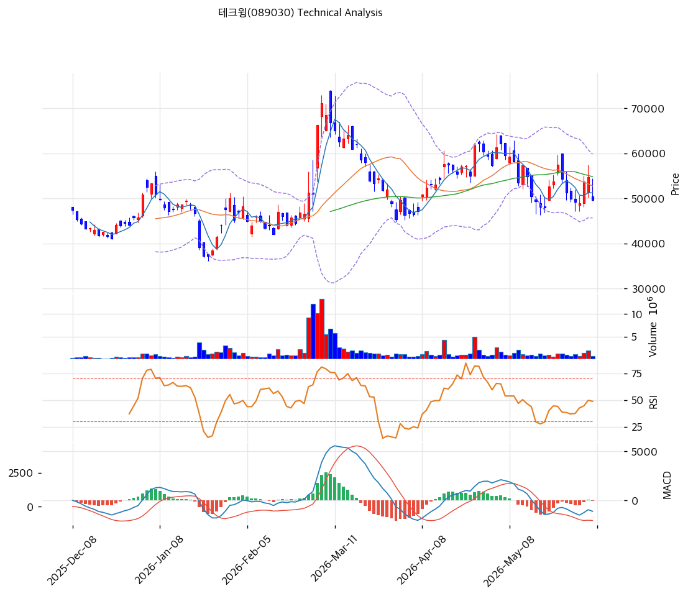

# 기술적분석

***

## 가격 위치

현재가 **49,550원** (-9.41%) — 1년 위치 51.6%(고점 71,100원 대비 **-30%**, 저점 26,650원 대비 +86%). 당일 -9.41% 급락. 큐브프로버 성장 기대 vs 순이익 변동·부채 부담으로 고점 대비 조정·횡보. RSI 44.0 중립, 거래량비 0.71x. 외국인 순매수 vs 기관 매도.

## 이동평균선

| 이평선   |       값 |   이격도 |  위치 |
| ----- | ------: | ----: | :-: |
| MA5   | 51,220원 | -3.2% |  아래 |
| MA20  | 52,730원 | -5.9% |  아래 |
| MA60  | 54,799원 | -9.5% |  아래 |
| MA120 | 50,942원 | -2.6% |  아래 |
| MA200 | 50,379원 | -1.5% |  아래 |

**역배열 초입(aligned False)** — 현재가가 모든 이평선 아래이나 이격은 -1.5\~9.5%로 작음(이평선 5\~5.5만원대 밀집). 고점 후 조정·횡보 국면. MA200 50,379원·MA120 50,942원이 근접 지지/저항.

## 모멘텀 지표

* **RSI 44.0 (중립)** — 침체\~중립. 과매도는 아님
* **MACD -1,119 / 시그널 -1,039 / 히스토 -80** — 매도 + 하락. 하락 모멘텀 잔존
* **스토캐스틱 K=46.8 / D=41.2** — 골든크로스, 중립
* **볼린저밴드** — 상단 59,799 / 중심 52,730 / 하단 45,661, 폭 26.8%, **중간**. 변동성 보통
* **거래량비 0.71x** — 거래 위축

## 피보나치 되돌림 (스윙 26,650 / 71,100)

| 레벨    |      가격 | 성격            |
| ----- | ------: | ------------- |
| 0.236 | 60,610원 | 반등 시 저항       |
| 0.382 | 54,120원 | 저항 (MA60 근접)  |
| 0.5   | 48,875원 | **현재가 부근 지지** |
| 0.618 | 43,630원 | 깊은 조정         |
| 0.786 | 36,160원 | 추가 조정         |

## 지지/저항 (S\&R)

* **저항**: 51,220원(MA5) / 52,730원(MA20·BB 중심) / 54,120원(피보 0.382·MA60) / 60,610원(피보 0.236)
* **지지**: **50,379원(MA200)·50,942원(MA120)** / 48,875원(피보 0.5) / 45,661원(BB 하단) / 43,630원(피보 0.618)

## 종합 시그널 & 전략

**시그널: 매수 0 / 매도 1 / 중립 5 → 매도우위** (조정·횡보, 모멘텀 약화)

* **전략**: 관망\~분할. 고점 -30% 조정 후 이평선 밀집 횡보. 큐브프로버 성장 기대 vs 순이익·부채 부담으로 방향 탐색
* **눌림목 매수**: RSI 44·피보 0.5(48,875원) 부근으로 **MA200·MA120 50,000원 \~ 피보 0.5 48,875원 분할 매수** 가능. BB 하단 45,661원·피보 0.618 43,630원이 추가 지지
* **상방**: MA20 52,730원 회복 시 피보 0.382 54,120원 → 0.236 60,610원. 큐브프로버 HBM 수주가 추세 반전 트리거
* **하방**: 피보 0.5 48,875원·BB 하단 45,661원 이탈 시 43,630원. 순이익 부진·부채 우려 시 조정
* **변곡점**: 큐브프로버 공급 확대·HBM 채택 + 본업 영업이익 회복이 추세 핵심. PER 196x·부채 298%로 변동성 큼, 영업이익 기준 추세 확인
