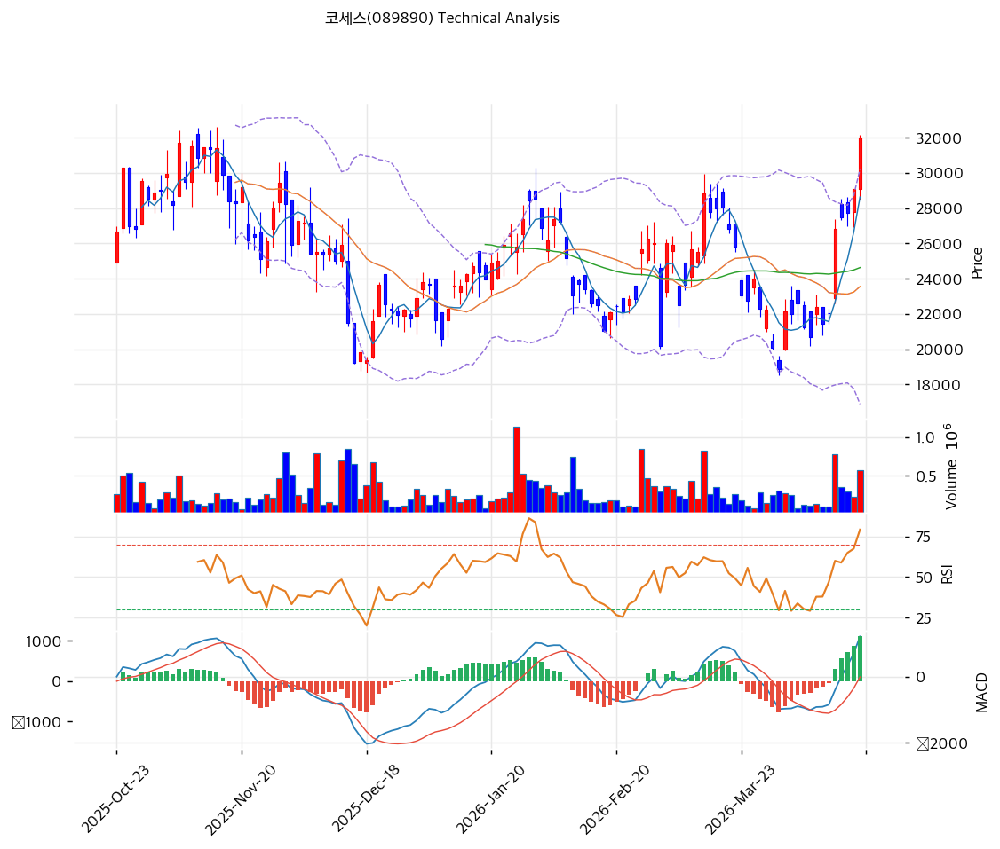

# 코세스(089890) 기술적 분석

2026-04-18 | T2 Technical Analysis

---

## 차트

---

## 1. 가격 현황

| 항목 | 값 |
|------|-----|
| 현재가 | 32,000원 (+9.97%) |
| 52주 고가 | 32,000원 |
| 52주 저가 | 6,010원 |
| 52주 범위 위치 | 100.0% |
| 거래량 | 20일 평균 대비 2.55x |

---

## 2. 차트 패턴 분석

### 2.1 캔들스틱 패턴

| 패턴 | 위치 | 신뢰도 | 해석 |
|------|------|--------|------|
| 갭상승 장대양봉 (마루보즈 유형) | 당일 (2026-04-17) | 강 | 2.55배 거래량 동반한 +9.97% 장대양봉으로 52주 고가 돌파 — 강한 매수 시그널 |
| 적삼병(유사) | 최근 3~5일 | 중 | 28,000~30,000원 저항대 이전에 연속 양봉으로 모멘텀 축적, 추세 지속 신호 |
| 직전 망치형 | 3월 말~4월 초 저점권 (22,000원대) | 중 | 바닥권에서 아랫꼬리 긴 반전형 캔들이 출현하며 현재 랠리의 기점 형성 |

### 2.2 가격 구조 패턴

- **하락추세 이탈 및 V자 반등** (신뢰도: 강)
  2025-10월 고가 28,000원대에서 2025-12월 저점 약 18,000원까지 형성된 완만한 하락채널을 2026-04월 장대양봉으로 상향 이탈. 4개월간 박스권(19,000~24,000원)을 단숨에 돌파하며 52주 고가를 경신한 구조로, 추세 반전이 명확히 확인됨.

- **컵앤핸들(컵) 완성** (신뢰도: 중)
  2025-10월 고점(≈28,800원) → 2025-12월 저점(18,870원) → 2026-04월 재고점(32,000원)의 둥근 바닥 구조가 컵 모양을 완성. 핸들 구간이 생략된 직접 돌파 형태로, 측정치 기준 목표가는 약 38,000~39,000원대(컵 깊이 약 10,000원 가산).

- **상승 추세선 내 이격 확대** (신뢰도: 중)
  상승 추세선 저항 36,144원, 지지 21,564원으로 채널이 형성되어 있으나, 현재가가 피봇 R1(33,267원)과 52주 고가에 밀착하여 단기 이격이 확대된 상태.

### 2.3 다이버전스

- **RSI 히든 불리시(지속) 시그널** (신뢰도: 중)
  가격이 직전 저점(12월 18,870원) 대비 상승하는 동안 RSI가 과매도 구간에서 회복되며 69.1까지 확장 — 다이버전스 자체는 아니지만, 기존 상승 추세를 지지하는 히든 시그널로 해석 가능.

- **MACD 불리시 크로스 확장** (신뢰도: 강)
  2026-03월 말 0선 하회 구간에서 골든크로스 발생 후 히스토그램이 +1,109로 급확대. 가격과 MACD가 동일 방향(상승)으로 확장 중이며 다이버전스 없음 — 추세 지속 시사.

※ 현 시점에서는 명확한 약세 다이버전스는 관찰되지 않으나, RSI 69.1·스토캐스틱 96.7의 과열 영역 진입은 향후 가격이 신고가를 경신하는데도 지표가 못 따라올 경우 하락 다이버전스 경계 구간.

### 2.4 패턴 종합 판단

캔들스틱(갭상승 장대양봉+거래량 2.55x)과 가격구조(하락채널 이탈+컵 완성)는 모두 **강한 상승 돌파**를 시사하며, MACD도 매수 확장을 확인한다. 그러나 스토캐스틱 96.7의 극도 과매수, 52주 고가 정확히 저항에 닿은 위치, BB 상단(30,216원) 이탈은 **단기 과열 피로**를 동시에 경고한다. 종합하면 중기 추세는 상방 전환이 확인되었으나 단기적으로는 되돌림 가능성을 열어둔 **강세 속 조정 리스크 병존** 국면.

---

## 3. 이동평균선 — 비정배열 (강세, 단기 과열)

| MA | 값 | 현재가 괴리율 | 위치 |
|----|-----|--------------|------|
| MA5 | 28,630원 | +11.8% | 위 |
| MA20 | 23,554원 | +35.9% | 위 |
| MA60 | 24,630원 | +29.9% | 위 |
| MA120 | 25,285원 | +26.6% | 위 |
| MA200 | 20,176원 | +58.6% | 위 |

**해석**: 모든 MA 위에 가격이 위치하여 다중 지지 구조는 갖춰졌으나, MA60(24,630원) > MA20(23,554원) 관계로 완전한 정배열은 미완성. MA20 대비 +35.9%, MA200 대비 +58.6%로 **단기 급등에 따른 이격도 과열**이 뚜렷하며, 일반적으로 MA20 대비 +25% 이상은 되돌림 경계 구간. 중장기 MA들이 24,500~25,300원 밀집대를 형성하여 향후 조정 시 강한 지지 역할.

---

## 4. 보조 지표

### RSI(14) — 69.1 (중립 상단, 과매수 근접)

69.1은 기술적 과매수 기준선(70) 바로 아래로, 금일 +9.97% 마감 기준 사실상 과매수 진입 임박. 추세 강도는 살아있으나 단기 되돌림 가능성 증가.

### MACD(12,26,9)

| 항목 | 값 |
|------|-----|
| MACD | 1,215 |
| Signal | 106 |
| Histogram | +1,109 |
| 크로스 상태 | 매수 구간 (확대 중) |

**해석**: MACD-Signal 스프레드가 1,109로 폭발적으로 확장 — 가장 강한 상승 모멘텀 국면. 히스토그램이 정점을 찍고 축소 전환되기 전까지는 추세 매도 시그널 없음.

### 볼린저밴드(20, 2σ)

| 항목 | 값 |
|------|-----|
| 상단 | 30,216원 |
| 중단 (MA20) | 23,554원 |
| 하단 | 16,891원 |
| 밴드 폭 | 56.6% |
| 현재 위치 | 상단 이탈 (32,000 > 30,216) |

**해석**: 밴드 폭 56.6%로 이미 상당히 확장된 상태에서 현재가가 상단을 외측으로 이탈. 밴드 워킹(band walking)이 이어지면 단기 추가 상승 가능하나, 통상 상단 이탈은 2~5일 내 중단 회귀(Mean Reversion) 압력 발생.

### 스토캐스틱(14, 3, 3)

| 항목 | 값 |
|------|-----|
| Slow %K | 96.7 |
| Slow %D | 93.8 |
| 크로스 상태 | 골든크로스 |
| 판단 | 극도 과매수 (>80) |

K-D 모두 90 상회 — 단기 매도 압력 가장 높은 구간. 추세장에서는 과매수 지속될 수 있으나 K-D 데드크로스 전환 시 단기 고점 시그널.

---

## 5. 지지/저항 — 추세선 · 피보나치 · PRZ 통합

### 5.1 피보나치 되돌림/확장

| 구분 | 비율 | 가격 | 현재가 대비 |
|------|------|------|-----------|
| Swing High | — | 28,850원 | -9.8% |
| 되돌림 | 0.236 | 21,225원 | -33.7% |
| 되돌림 | 0.382 | 22,682원 | -29.1% |
| 되돌림 | 0.5 | 23,860원 | -25.4% |
| 되돌림 | 0.618 | 25,038원 | -21.8% |
| 되돌림 | 0.786 | 26,714원 | -16.5% |
| Swing Low | — | 18,870원 | -41.0% |
| 확장 | 1.272 | 16,155원 | -49.5% |
| 확장 | 1.382 | 15,058원 | -52.9% |
| 확장 | 1.618 | 12,702원 | -60.3% |
| 확장 | 2.0 | 8,890원 | -72.2% |

※ 피보나치 기준은 하락추세(28,850 → 18,870) 되돌림이나, 현재가는 Swing High를 이미 상향 돌파(+10.9%) — 되돌림 구조가 무효화되고 **상승 확장 국면 전환**. 되돌림 레벨은 이제 조정 시 지지선으로 재해석 필요.

### 5.2 추세선

| 추세선 | 방향 | 현재 교차가 | 포인트 수 | 해석 |
|--------|------|-----------|---------|------|
| 지지선 | 상승 | 21,564원 | 6개 | 장기 상승 추세선, 하단 방어선 |
| 저항선 | 상승 | 36,144원 | 6개 | 상승 채널 상단, 단기 연장 목표 |

### 5.3 PRZ (Potential Reversal Zone)

| 방향 | 가격 범위 | 신뢰도 | 근거 |
|------|---------|--------|------|
| 지지 | 26,714~27,233원 | 약 | 피보나치 0.786 되돌림 + 피봇 S2 |
| 지지 | 24,630~25,285원 | 중 | MA60 + 피보나치 0.618 + MA120 |
| 지지 | 23,554~23,860원 | 약 | MA20 + 피보나치 0.5 |

※ 24,630~25,285원 구역이 MA60·MA120·피보 0.618이 겹치는 가장 견고한 1차 반등 매수 구간.

### 5.4 종합 지지/저항 테이블

| 구분 | 가격 | 근거 |
|------|------|------|
| 저항 | 36,144원 | 상승 추세선 상단 (중기 목표) |
| 저항 | 33,267원 | 피봇 R1 (단기 1차 저항) |
| 저항 | 32,000원 | 52주 고가 (당일 터치) |
| **현재가** | **32,000원** | — |
| 지지 | 29,617원 | 피봇 S1 / MA5(28,630) 상단부 |
| 지지 | 27,233원 | 피봇 S2 |
| 지지 | 24,984원 | PRZ (중) — MA60+MA120+피보 0.618 |
| 지지 | 21,564원 | 장기 상승 추세선 지지 |

---

## 6. 시그널 종합

| 지표 | 내용 | 시그널 |
|------|------|--------|
| **차트 패턴** | 갭상승 장대양봉+컵 돌파, 52주 고가 경신 | 🟢 |
| 이동평균선 | 전 MA 위, 비정배열 + MA20 괴리 +35.9% (과열) | 🟢/🔴 |
| RSI | 69.1 — 과매수 근접 | ⚪ |
| MACD | 매수구간, 히스토그램 +1,109 폭발 확장 | 🟢 |
| 볼린저밴드 | 상단 이탈, 폭 56.6% | ⚪ |
| 스토캐스틱 | 골든크로스, K=96.7 (극도 과매수) | 🔴 |
| 거래량 | 2.55x — 강력 동반 | 🟢 |

**종합 판단**: 🟢 매수 2개(+패턴) / 🔴 매도 2개 / ⚪ 중립 3개 → **중립 (강세 속 단기 과열)**

추세 모멘텀(MACD·패턴·거래량)은 강력한 상승을 가리키지만, 단기 지표(스토캐스틱 96.7, BB 상단 이탈, MA20 괴리 +35.9%)는 명백히 과열 신호를 보낸다. 중기(1~3개월) 관점에서는 하락채널 돌파로 추세 반전이 확인되어 상승 바이어스가 유효하나, 단기(1~2주)로는 되돌림 확률이 더 높다는 것이 합리적 판단.

---

## 7. 전략 제안

### 보유 중인 경우
- **홀드 (분할 익절 병행)**
- 익절 라인: 33,267원 (피봇 R1, 1차) / 36,144원 (추세선 상단, 2차)
- 손절 라인: 27,233원 (피봇 S2 이탈 시 단기 추세 훼손)
- 리스크/리워드: (33,267-32,000)/(32,000-27,233) = 1,267 / 4,767 ≈ **0.27 (불리)** — 신규 추격 매수는 비권장, 1/3 분할 익절 후 남은 물량 홀드 전략 권고

### 진입 대기인 경우
- **관망 (추격 매수 지양, 눌림 대기)**
- 1차 진입가: 29,617원 (피봇 S1) — 단기 되돌림 1차 지지, 약 -7.4% 조정 시
- 2차 진입가: 24,984원 (PRZ 중 — MA60+MA120+피보 0.618) — 중기 핵심 지지, 약 -22% 조정 시 리스크/리워드 1:2 이상 확보
- 진입 조건:
  1. RSI 60 하회 + 스토캐스틱 80 하회 동반 확인 (과열 해소)
  2. 29,617원 지지 시 양봉 마감 + 거래량 평균 수준 회복
  3. MA5(28,630원) 이탈 없이 홀딩될 경우 강세 지속 확인
