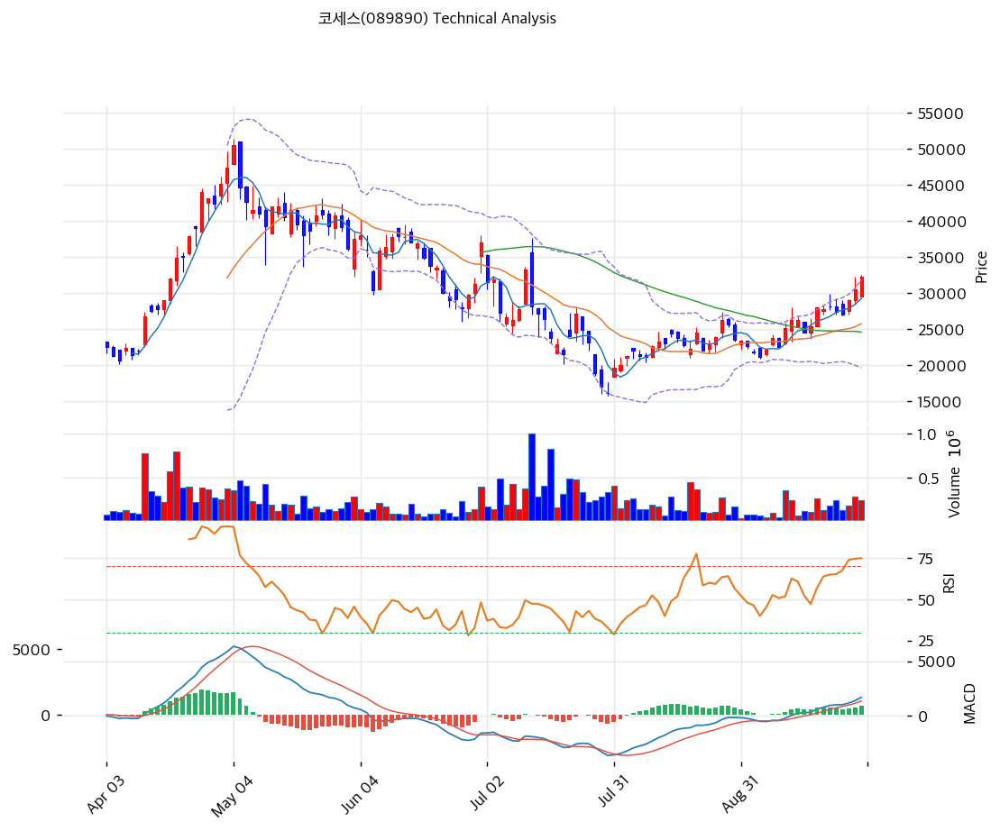

# 코세스(089890) 기술적 분석

2026-09-29 | T2 Technical Analysis

---

## 차트

---

## 가격 현황

| 항목 | 값 |
|------|-----|
| 현재가 | 32,300원 (+5.90%) |
| 52주 고가 | 50,500원 |
| 52주 저가 | 14,300원 |
| 52주 범위 위치 | 49.7% |
| 거래량 | 20일 평균 대비 1.65x |

---

## 차트 패턴 분석

### 캔들스틱 패턴

| 패턴 | 위치 | 신뢰도 | 해석 |
|------|------|--------|------|
| 적삼병 | 9/23\~9/29 | 중 | 29,050→30,500→32,500원 3일 연속 양봉 종가 상승. 단기 매수세 우위 |
| 긴 윗꼬리 양봉 | 9/28 | 중 | 고가 32,300원에서 30,500원으로 밀림. 32,000원대 매물 확인 후 다음 날 재돌파 시도 |
| 장대양봉 (갭 상승 후 돌파) | 9/16 | 중 | 거래량 27만주로 8\~9월 박스 상단(26,500원 부근) 돌파 |

※ 일봉 OHLC는 yfinance(089890.KQ) 기준

### 가격 구조 패턴

- **5\~7월 하락 추세 후 V자 반등** (신뢰도: 중)
  5/4 종가 50,500원 고점에서 7/29 17,050원까지 66% 하락했다. 8\~9월 21,000\~26,500원 박스에서 바닥을 다진 뒤 9월 중순 박스 상단을 돌파했다. 박스 폭(약 5,500원)을 상단에 더한 측정 목표치는 32,000원 안팎으로 현재가 부근에서 이미 도달했다.

- **9/3 저점 21,200원의 쌍바닥 성격** (신뢰도: 약)
  7/21 21,500원과 9/3 21,200원이 비슷한 가격대에서 지지됐다. 같은 가격대가 두 번 지지된 점은 긍정적이지만 7월 말 17,050원 저점이 사이에 있어 전형적 쌍바닥은 아니다.

### 다이버전스

- **RSI 상승 다이버전스** (신뢰도: 중)
  7/21 종가 21,500원일 때 RSI 34.7, 9/3 종가 21,200원일 때 RSI는 40대 중반이었다. 가격은 비슷하거나 낮았는데 RSI 저점은 높아져 하락 탄력 둔화를 보여줬고, 이후 반등으로 이어졌다.

- **MACD 상승 다이버전스** (신뢰도: 중)
  MACD는 8/3 -3,449에서 9/2 -357로 저점을 높였고, 현재는 1,692로 시그널선(1,025) 위에 있다. 7\~8월 저점 대비 가격 저점이 더 낮지 않은 상태에서 모멘텀만 회복돼 추세 전환 쪽 신호다.

### 패턴 종합 판단

캔들과 다이버전스는 8\~9월 바닥 이후 상승 전환을 지지한다. 다만 박스 돌파 측정 목표치(약 32,000원)와 피보나치 0.382 되돌림(32,393원)에 도달해 단기 저항 구간에 들어섰다. 방향은 위쪽이지만 추격 매수 구간은 아니다.

---

## 이동평균선: 비정배열 (단기 강세, 중기 혼조)

| MA | 값 | 현재가 괴리율 | 위치 |
|----|-----|--------------|------|
| MA5 | 29,280원 | +10.3% | 위 |
| MA20 | 25,785원 | +25.3% | 위 |
| MA60 | 24,641원 | +31.1% | 위 |
| MA120 | 30,158원 | +7.1% | 위 |
| MA200 | 27,729원 | +16.5% | 위 |

**해석**: 현재가가 5개 이동평균선을 모두 넘어섰다. 하지만 MA120(30,158원)이 MA20·MA60보다 위에 있어 배열은 아직 정배열이 아니다. 4\~5월 급등 구간이 MA120에 남아 있기 때문이다. MA20 괴리 +25.3%는 과열 수준이며, 첫 지지선은 MA120과 피봇 S1이 겹치는 30,158\~30,383원이다.

---

## 보조 지표

### RSI(14): 68.8 (중립 상단)

과매수 경계(70) 바로 아래다. 8월 초 40대에서 올라왔고 방향은 상승 중이다.

### MACD(12,26,9)

| 항목 | 값 |
|------|-----|
| MACD | 1,692 |
| Signal | 1,025 |
| Histogram | +667 |
| 크로스 상태 | 매수 구간 (확대 중) |

**해석**: 9월 중 시그널선을 상향 돌파한 뒤 히스토그램이 커지고 있어 상승 모멘텀이 유지되고 있다.

### 볼린저밴드(20, 2σ)

| 항목 | 값 |
|------|-----|
| 상단 | 31,879원 |
| 중단 (MA20) | 25,785원 |
| 하단 | 19,691원 |
| 밴드 폭 | 47.3% |
| 현재 위치 | 상단 돌파 (상단 근접) |

**해석**: 종가가 상단 밴드(31,879원)를 넘었다. 밴드 폭 47.3%로 확장 국면이라 밴드워크가 이어질 수 있지만, 상단 이탈 뒤에는 중단(25,785원) 쪽 되돌림이 흔하다.

### 스토캐스틱(14, 3, 3)

| 항목 | 값 |
|------|-----|
| Slow %K | 89.6 |
| Slow %D | 82.1 |
| 크로스 상태 | 골든크로스 |
| 판단 | 과매수 |

---

## 지지/저항: 추세선, 피보나치, PRZ 통합

### 피보나치 되돌림/확장

| 구분 | 비율 | 가격 | 현재가 대비 |
|------|------|------|-----------|
| Swing High | — | 50,500원 | +56.3% |
| 되돌림 | 0.236 | 28,115원 | -13.0% |
| 되돌림 | 0.382 | 32,393원 | +0.3% |
| 되돌림 | 0.5 | 35,850원 | +11.0% |
| 되돌림 | 0.618 | 39,307원 | +21.7% |
| 되돌림 | 0.786 | 44,230원 | +36.9% |
| Swing Low | — | 21,200원 | -34.4% |
| 확장 | 1.272 | 13,230원 | -59.0% |
| 확장 | 1.382 | 10,007원 | -69.0% |
| 확장 | 1.618 | 3,093원 | -90.4% |
| 확장 | 2.0 | 음수 | 해당 없음 |

※ 피보나치 기준: 하락 추세 (Swing High 50,500원 → Swing Low 21,200원)
※ 되돌림 = 하락폭 대비 반등 비율, 확장 = 하락 추세 연장 시 목표가(현재는 반등 국면이라 참고용)

### 추세선

| 추세선 | 방향 | 현재 교차가 | 포인트 수 | 해석 |
|--------|------|-----------|---------|------|
| 지지선 | 상승 | 20,731원 | 6개 | 1년 저점들을 이은 선. 9월 저점(21,200원)이 이 선 부근에서 지지됐다 |
| 저항선 | 상승 | 59,257원 | 6개 | 기울기가 가팔라 현재가와 거리가 멀다. 실효 저항은 피보나치 레벨 |

### PRZ (Potential Reversal Zone)

| 방향 | 가격 범위 | 신뢰도 | 근거 |
|------|---------|--------|------|
| 지지 | 30,158\~30,383원 | 약 | MA120 + 피봇 S1 |
| 지지 | 27,729\~28,467원 | 중 | MA200 + 피보나치 0.236 + 피봇 S2 |
| 저항 | 32,393\~33,383원 | 중 | 피보나치 0.382 + 피봇 R1 + 9/28 윗꼬리 고점 |

※ PRZ = 추세선, 피보나치, 피봇, MA 등 복수 지표가 겹치는 가격 구간. 겹치는 소스가 많을수록 반전 확률 상승.

### 종합 지지/저항 테이블

| 구분 | 가격 | 근거 |
|------|------|------|
| 저항 | 35,850원 | 피보나치 0.5, 피봇 R2(34,467원) 상단 |
| 저항 | 33,383원 | 피봇 R1, 피보나치 0.382(32,393원) |
| **현재가** | **32,300원** | — |
| 지지 | 30,383원 | 피봇 S1, MA120(30,158원) |
| 지지 | 28,467원 | 피봇 S2, MA200, 피보나치 0.236 (PRZ 중) |
| 지지 | 25,785원 | MA20, 볼린저 중단 |

---

## 시그널 종합

| 지표 | 내용 | 시그널 |
|------|------|--------|
| **차트 패턴** | 적삼병, 박스 돌파, RSI·MACD 상승 다이버전스. 단 0.382 되돌림 저항 도달 | 🟢 |
| 이동평균선 | 비정배열, MA20 +25.3% 과열 | 🔴 |
| RSI | 68.8, 중립 상단 | ⚪ |
| MACD | 매수 구간, 히스토그램 확대 | 🟢 |
| 볼린저밴드 | 상단 돌파, 밴드 폭 47.3% | ⚪ |
| 스토캐스틱 | 골든크로스, K 89.6 과매수 | 🔴 |
| 거래량 | 1.65x, 보통 | ⚪ |

**종합 판단**: 🟢 매수 2개 / 🔴 매도 2개 / ⚪ 중립 3개 → **중립 (지표 기준 매도우위, 패턴 반영 시 중립)**

시스템 지표만 보면 매수 1, 매도 2, 중립 4로 매도우위다. 차트 패턴의 상승 전환 신호를 더하면 균형이 맞춰진다. 중기 방향은 바닥 확인 후 반등이지만, 단기로는 MA20 괴리 25%와 스토캐스틱 과매수가 겹쳐 32,000\~33,000원대에서 숨 고르기 가능성이 높다.

---

## 전략 제안

### 보유 중인 경우
- **비중축소 (일부 차익 실현)**
- 익절 라인: 1차 33,383원(피봇 R1), 2차 35,850원(피보나치 0.5). 시스템 산출 최종 익절선은 51,510원(52주 고점 부근)
- 손절 라인: 28,467원 (PRZ 중 하단, 피봇 S2)
- 리스크/리워드: 1차 익절 기준 약 1:0.3, 2차 익절 기준 약 1:0.9

### 진입 대기인 경우
- **관망**
- 1차 진입가: 30,383원 (피봇 S1, MA120 PRZ)
- 2차 진입가: 25,785원 (MA20, 볼린저 중단)
- 진입 조건: 30,000원대 초반 눌림에서 거래량 감소 후 반등 확인, 또는 33,383원을 거래량 동반 종가 돌파
