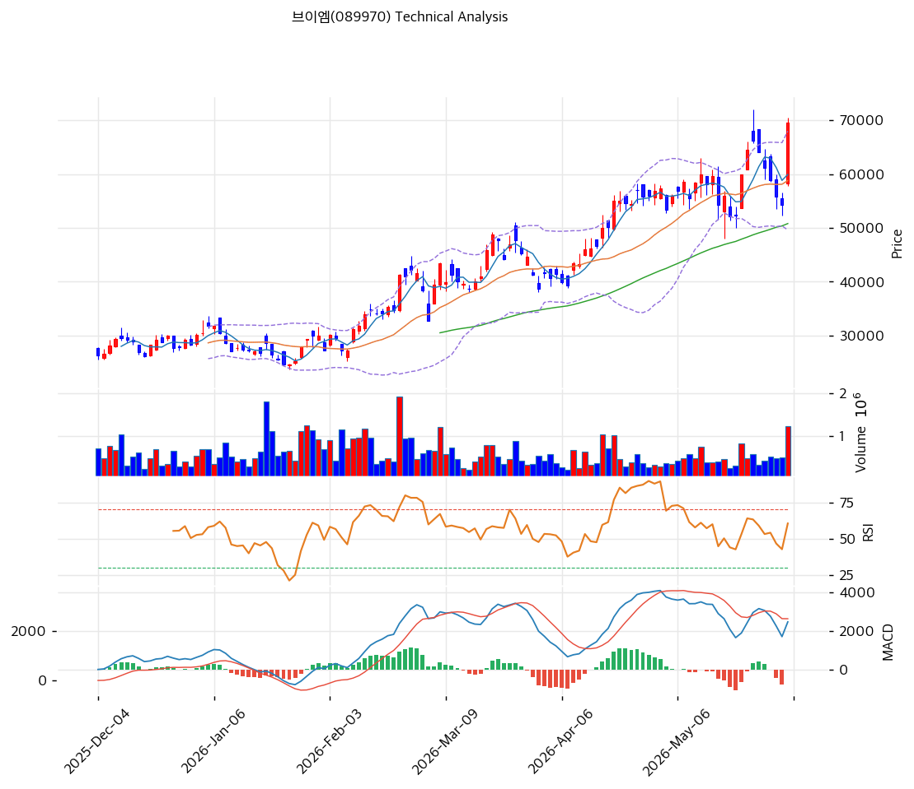

# 브이엠(089970) 기술적 분석 보고서

---

## 가격 위치

현재가 **69,500원** (+28.23%) — **52주 신고가** 갱신, 52주 위치 **100%** (고가 69,500원 / 저가 10,500원). 1년 **+562%** (10,500→69,500). SK하이닉스 메모리 capex 수혜 + 2026Q1 어닝 서프라이즈. 거래량비 **2.64배 폭증**(급등 동반). RSI 63.8 중립. 당일 +28% 급등으로 단기 과열.

## 이동평균선

| 이평선 | 값 | 이격도 | 위치 |
|------|---:|----:|:---:|
| MA5 | 59,920원 | +16.0% | 위 |
| MA20 | 58,785원 | +18.2% | 위 |
| MA60 | 50,801원 | +36.8% | 위 |
| MA120 | 40,656원 | +70.9% | 위 |
| MA200 | 31,906원 | +117.8% | 위 |

**완전 정배열 True**. MA200 대비 +117.8%, MA20 대비 +18.2% 극단 이격. 1년 +562% 급등으로 이격 극단 — 당일 +28% 급등으로 단기 정점.

## 모멘텀 지표

- **RSI 63.8 (중립)** — 70 미만, 과매수 직전. 추가 모멘텀 여유
- **MACD 2,476 / 시그널 2,489 / 히스토 -13** — 매도 전환 직전(당일 급등 전 조정 반영). 급등으로 재상향 가능
- **스토캐스틱 K=49.3 / D=42.7** — 골든크로스, 중립
- **볼린저밴드** — 상단 67,959 / 중심 58,785 / 하단 49,611, 폭 31.2%, **상단 돌파**. 변동성 확대
- **거래량비 2.64x** — 평균 2.6배 폭증, 급등 매수 쇄도

## 피보나치 되돌림 (스윙 10,500 / 69,500)

| 레벨 | 가격 | 성격 |
|------|---:|------|
| 0.236 | 55,600원 | 1차 지지 (MA20·MA60 사이) |
| 0.382 | 46,960원 | 2차 지지 (MA120 근접) |
| 0.5 | 40,000원 | 중기 지지 (MA120) |
| 0.618 | 33,040원 | 깊은 조정 (MA200 근접) |
| 0.786 | 23,140원 | 추가 조정 |

## 지지/저항 (S&R)

- **저항**: 69,500원(52주 고가) / 70,890원(피봇 R1·전략 TP)
- **지지**: 61,400원(피봇 S1) / **58,785원(MA20·PRZ)** / 55,600원(피보 0.236) / 53,300원(전략 SL) / 50,801원(MA60) / 40,656원(MA120·피보 0.5)

## 종합 시그널 & 전략

**시그널: 매수 2 / 매도 1 / 중립 3 → 매수우위** (급등 모멘텀 + 외인 순매수)

- **전략**: HOLD(홀드) — **TP 70,890원 / SL 53,300원**. WAIT(관망) e1 61,400원 / e2 58,785원
- **눌림목 매수**: 1년 +562% + 당일 +28% + 거래량 2.64배로 **신고가 추격 비추**. 조정 시 **MA20 58,785원 ~ 피보 0.236 55,600원 분할 매수**, 깊은 조정 시 MA60 50,801원
- **상방**: 52주 고가 69,500원 돌파 시 70,890원 → 하나증권 목표 84,000원. SK하이닉스 capex·실적 모멘텀이 동력
- **하방**: MA20 58,785원 이탈 시 55,600원 → MA60 50,801원. capex 사이클 의존으로 둔화 시 조정 폭 큼
- **변곡점**: SK하이닉스 M15x·1c나노 투자 지속이 추세 분기점. 당일 +28% 급등 직후로 단기 변동성 극대, 외국인 +156만주 순매수는 긍정
