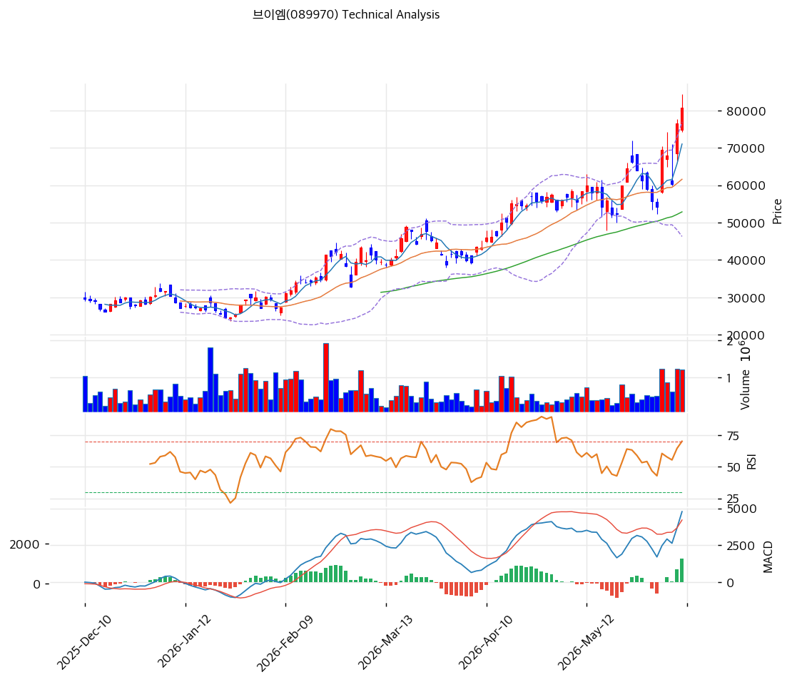

# 기술적분석

2026-06-10 | T2 Technical Analysis

***

## 차트

***

## 1. 가격 현황

| 항목        | 값                       |
| --------- | ----------------------- |
| 현재가       | 80,800원 (+5.48%)        |
| 52주 고가    | 84,300원                 |
| 52주 저가    | 10,300원                 |
| 52주 범위 위치 | 약 95% (신고가권)            |
| 거래량       | 20일 평균 대비 2.13x (강력 동반) |

***

## 2. 차트 패턴 분석

### 2.1 캔들스틱 패턴

| 패턴            | 위치                  | 신뢰도 | 해석                  |
| ------------- | ------------------- | --- | ------------------- |
| 장대양봉 + 거래량 동반 | 최근 (75,000→84,300원) | 강   | 매수 — 신고가 돌파, 추세 가속  |
| 적삼병 계열 연속 양봉  | 5월 중순\~6월           | 중   | 매수 우위 — 단기 조정 후 재상승 |
| 윗꼬리 출현 가능성    | 84,300원 신고가 부근      | 약   | 단기 차익실현 경계 — 과열 구간  |

※ 주요 캔들 패턴: 망치형, 역망치형, 장악형(상승/하락), 도지, 샛별/석별, 적삼병/흑삼병, 하라미, 유성형, 교수형 등

### 2.2 가격 구조 패턴

* **장기 상승 추세 채널 (30,000→84,300원)** (신뢰도: 강) 2025년 말 30,000원대부터 6개월간 거의 일직선으로 상승해 84,300원 신고가. HBM 수주·실적 폭증을 반영한 강력한 우상향 추세 채널. 모든 이동평균선이 우상향하는 완전 정배열로 추세 신뢰도가 높다.
* **고점 부근 변동성 확대** (신뢰도: 중) 신고가권에서 일중 변동폭이 커지는 모습 — 추세는 유효하나 단기 과열로 눌림(조정) 가능성. 5월 중순 단기 조정(70,000원 부근) 후 재상승한 패턴이 반복될 수 있다.

※ 주요 구조 패턴: 이중천정/바닥, 헤드앤숄더(정/역), 삼각수렴, 쐐기형, 깃발형, 페넌트, 컵앤핸들, 박스권 등

### 2.3 다이버전스

* **뚜렷한 다이버전스 없음 — 강한 추세 추종** (신뢰도: 중) 가격 신고가와 함께 MACD(+4,786)도 신고가·히스토그램 확대 — 가격·지표 동행. 하락 다이버전스 신호 없음. RSI(67)는 과매수(70) 근접이나 아직 추세 훼손 신호는 아님.

※ RSI·MACD 기반 | 상승 다이버전스 = 가격↓ 지표↑ (반등 시사), 하락 다이버전스 = 가격↑ 지표↓ (하락 시사), 히든 다이버전스 = 기존 추세 지속 시사

### 2.4 패턴 종합 판단

완전 정배열 + 신고가 돌파 + 거래량 2.13배 + MACD 강세 확대로 **추세 강도가 매우 강하다**. 다만 MA200 대비 +144%·볼린저 상단 밀착·RSI 과매수 근접 등 과열 신호가 동반돼, 신규 진입은 추격보다 눌림목(MA5 71,040원·MA20 61,610원)을 노리는 것이 안전하다. 실적 모멘텀이 살아 있어 조정은 매수 기회 성격이 강하나, 단기 변동성 확대에 대비해야 한다.

***

## 3. 이동평균선 — 완전 정배열 (강세)

| MA    | 값       | 현재가 괴리율 | 위치 |
| ----- | ------- | ------- | -- |
| MA5   | 71,040원 | +13.7%  | 위  |
| MA20  | 61,610원 | +31.1%  | 위  |
| MA60  | 52,882원 | +52.8%  | 위  |
| MA120 | 42,117원 | +91.8%  | 위  |
| MA200 | 33,116원 | +144.0% | 위  |

**해석**: 현재가 > MA5 > MA20 > MA60 > MA120 > MA200의 완전 정배열로 교과서적 강세 추세. 그러나 MA200 대비 +144%, MA20 대비 +31%의 극단적 괴리는 단기 과열을 명확히 시사한다. 조정 시 MA5(71,040원)·MA20(61,610원)이 1차·2차 지지선이다.

***

## 4. 보조 지표

### RSI(14) — 67.0 (중립, 과매수 근접)

상승 모멘텀이 강하게 유지되는 가운데 과매수(70) 직전. 70 돌파 시 추세 가속이나 과열 심화, 미돌파 후 둔화 시 눌림 가능. 다이버전스 해석은 2.3 참조.

### MACD(12,26,9)

| 항목        | 값                |
| --------- | ---------------- |
| MACD      | 4,786.0          |
| Signal    | 3,203.0          |
| Histogram | +1,584.0         |
| 크로스 상태    | 매수 구간 (히스토그램 확대) |

**해석**: MACD가 Signal 위에서 히스토그램을 크게 확대하는 강한 상승 모멘텀. 0선 위 고점권 강세 신호.

### 볼린저밴드(20, 2σ)

| 항목        | 값         |
| --------- | --------- |
| 상단        | 76,927원   |
| 중단 (MA20) | 61,610원   |
| 하단        | 46,293원   |
| 밴드 폭      | 49.7%     |
| 현재 위치     | 상단 돌파(밀착) |

**해석**: 현재가 80,800원이 밴드 상단(76,927원)을 상회 — 강한 상승 압력이나 과열 신호. 밴드 폭(49.7%)이 크게 확대돼 변동성 분출 국면. 상단 밖 주행은 추세 강도를 보여주나 되돌림 시 중단(61,610원)까지 조정 여지.

### 스토캐스틱(14, 3, 3)

| 항목      | 값              |
| ------- | -------------- |
| Slow %K | 77.5           |
| Slow %D | 73.8           |
| 크로스 상태  | 골든크로스          |
| 판단      | 중립(상승, 과매수 근접) |

***

## 5. 지지/저항 — 추세선 · 피보나치 · PRZ 통합

### 5.1 피보나치 되돌림/확장

| 구분         | 비율    | 가격       | 현재가 대비 |
| ---------- | ----- | -------- | ------ |
| Swing High | —     | 84,300원  | +4.3%  |
| 되돌림        | 0.236 | 66,836원  | -17.3% |
| 되돌림        | 0.382 | 56,032원  | -30.7% |
| 되돌림        | 0.5   | 47,300원  | -41.5% |
| 되돌림        | 0.618 | 38,568원  | -52.3% |
| 되돌림        | 0.786 | 26,136원  | -67.7% |
| Swing Low  | —     | 10,300원  | —      |
| 확장         | 1.272 | 104,428원 | +29.2% |
| 확장         | 1.382 | 112,568원 | +39.3% |
| 확장         | 1.618 | 130,032원 | +60.9% |
| 확장         | 2.0   | 158,300원 | +95.9% |

※ 피보나치 기준: 상승 추세 (Swing Low 10,300원 → Swing High 84,300원) ※ 되돌림 = 직전 추세에서 되돌아온 비율, 확장 = 추세 방향 목표가

### 5.2 추세선

| 추세선 | 방향 | 현재 교차가  | 포인트 수 | 해석                           |
| --- | -- | ------- | ----- | ---------------------------- |
| 지지선 | 상승 | 41,981원 | 5개    | 장기 상승 추세선 — 강한 하단(현재가와 거리 큼) |
| 저항선 | 상승 | 51,955원 | 6개    | 상승 채널 — 이미 상회, 의미 제한적        |

### 5.3 PRZ (Potential Reversal Zone)

| 방향 | 가격 범위           | 신뢰도 | 근거          |
| -- | --------------- | --- | ----------- |
| 지지 | 69,800\~71,040원 | 약   | 피봇 S2 + MA5 |

※ PRZ = 추세선 · 피보나치 · 피봇 · MA 등 복수 지표가 겹치는 가격 구간. 겹치는 소스가 많을수록 반전 확률 상승.

### 5.4 종합 지지/저항 테이블

| 구분      | 가격              | 근거                |
| ------- | --------------- | ----------------- |
| 저항      | 104,428원        | 피보나치 1.272 확장     |
| 저항      | 89,800원         | 피봇 R2             |
| 저항      | 85,300원         | 피봇 R1             |
| 저항      | 84,300원         | 52주 고가            |
| **현재가** | **80,800원**     | 볼린저 상단 돌파         |
| 지지      | 75,300원         | 피봇 S1             |
| 지지      | 69,800\~71,040원 | PRZ — 피봇 S2 + MA5 |
| 지지      | 61,610원         | MA20 + 볼린저 중단     |

***

## 6. 시그널 종합

| 지표        | 내용                       | 시그널 |
| --------- | ------------------------ | --- |
| **차트 패턴** | 완전 정배열·신고가 돌파, 단기 과열 동반  | 🟢  |
| 이동평균선     | 완전 정배열, MA20 +31.1% (과열) | ⚪   |
| RSI       | 67.0 — 과매수 근접            | ⚪   |
| MACD      | 매수구간, 히스토그램 확대           | 🟢  |
| 볼린저밴드     | 상단 돌파, 밴드 폭 49.7%        | ⚪   |
| 스토캐스틱     | 골든크로스, K=77.5            | ⚪   |
| 거래량       | 2.13x — 강력 동반            | 🟢  |

**종합 판단**: 🟢 매수 3개 / 🔴 매도 1개 / ⚪ 중립 3개 → **매수우위 (단기 과열 동반)**

완전 정배열·신고가·거래량 폭증으로 추세가 매우 강하다. 다만 MA200 대비 +144%의 극단적 괴리는 과열을 경고한다. 실적 모멘텀이 추세를 뒷받침하나, 신규 진입은 추격보다 눌림목 분할이 합리적이다.

***

## 7. 전략 제안

### 보유 중인 경우

* **홀드 (추세 추종, 분할 익절 병행)**
* 익절 라인: 89,800원(피봇 R2) 1차 / 104,428원(피보 1.272 확장) 2차
* 손절 라인: 69,800원 (피봇 S2·MA5 하단 PRZ 이탈 — 추세 훼손)
* 리스크/리워드: 약 1 : 0.8 (1차 익절 +9,000원 vs 손절 -11,000원) — 과열로 신규 손익비 불리

### 진입 대기인 경우

* **눌림목 대기 (추격 자제)**
* 1차 진입가: 71,040원 (MA5)
* 2차 진입가: 61,610원 (MA20·볼린저 중단)
* 진입 조건: 단기 조정 시 MA5/MA20 지지 확인 후 분할 진입. 실적 모멘텀·수주 공시가 추세를 받치는 한 조정은 매수 기회. 단 MA200 +144% 괴리의 과열을 감안해 비중 관리 필수
