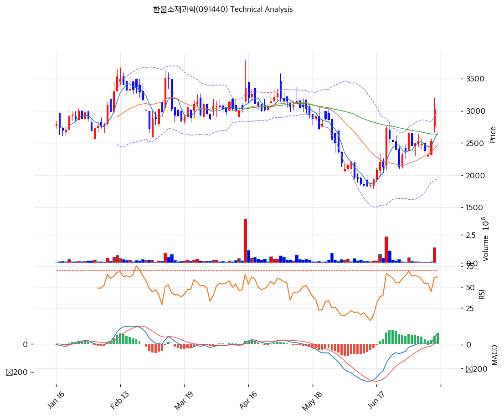

# 한울소재과학(091440) 기술적 분석

2026-07-14 | T2 Technical Analysis

---

## 차트

---

## 1. 가격 현황

| 항목 | 값 |
|------|-----|
| 현재가 | 3,030원 (0.00%) |
| 52주 고가 | 3,535원 |
| 52주 저가 | 1,834원 |
| 52주 범위 위치 | 70.3% |
| 거래량 | 20일 평균 대비 0.00x (장 시작 전 집계 — 전일 거래량은 평균 상회) |

---

## 2. 차트 패턴 분석

### 2.1 캔들스틱 패턴

| 패턴 | 위치 | 신뢰도 | 해석 |
|------|------|--------|------|
| 장대양봉 (갭 상승) | 직전 거래일 | 강 | 2,600원대에서 3,000원선까지 단숨에 돌파하는 대량 거래 동반 장대양봉 — 단기 매수 시그널 |
| 적삼병 유사 연속 양봉 | 최근 2주 | 중 | 6월 저점 이후 양봉 우위 지속 — 반등 추세 유효 |

### 2.2 가격 구조 패턴

- **V자 반등** (신뢰도: 중)
  5월 중순\~6월 중순 급락(2,730원 → 1,834원) 후 한 달 만에 3,030원까지 +65% 되돌림. V자 반등은 되돌림 없이 진행돼 이탈 시 지지선이 얇다는 양면성이 있다.

- **하락 추세선 돌파 시도** (신뢰도: 중)
  2월 고점(3,535원)부터 이어진 하락 추세선(현재 교차가 약 3,227원)에 근접. 3,230원대 돌파 시 중기 추세 전환 확정, 실패 시 2,800원대 재확인 가능성.

- **박스권 상단 돌파** (신뢰도: 중)
  3\~5월 형성된 2,900\~3,100원 매물대에 재진입. 이 구간을 거래량과 함께 소화하면 3,300\~3,500원대가 열린다.

### 2.3 다이버전스

- **RSI 상승 다이버전스 (6월 저점)** (신뢰도: 중)
  6월 초 가격이 저점을 낮추는 동안 RSI는 15 부근에서 저점을 높이며 괴리 발생 — 이후 실제 반등으로 이어졌고 현재는 다이버전스 해소 국면.

- **MACD 다이버전스 없음** (신뢰도: —)
  현재 MACD는 가격과 같은 방향(상승)으로 동행 중. 추세 지속 시사.

### 2.4 패턴 종합 판단

캔들(장대양봉)·구조(V자 반등, 박스권 상단 재진입)·다이버전스(해소된 상승 다이버전스) 모두 단기 상방을 가리킨다. 다만 V자 반등 특성상 아래쪽 지지가 얇고, 하락 추세선(3,227원)과 52주 고가(3,535원)가 머리 위에 있어 돌파 확인 전까지는 '반등'이지 '추세 전환'은 아니다.

---

## 3. 이동평균선 — 비정배열 (단기 과열)

| MA | 값 | 현재가 괴리율 | 위치 |
|----|-----|--------------|------|
| MA5 | 2,658원 | +14.0% | 위 |
| MA20 | 2,469원 | +22.7% | 위 |
| MA60 | 2,634원 | +15.1% | 위 |
| MA120 | 2,832원 | +7.0% | 위 |
| MA200 | 2,798원 | +8.3% | 위 |

**해석**: 5개 이평선을 모두 상회하나 배열 순서(MA20 < MA60 < MA200 < MA120)가 꼬여 있는 비정배열 — 급반등이 이평 정렬을 앞질렀다. MA20 괴리 +22.7%는 과열 영역(20% 초과)으로 단기 눌림 확률이 높다. MA120/MA200(2,798\~2,832원)을 돌파해 안착한 점은 중기적으로 유의미.

---

## 4. 보조 지표

### RSI(14) — 64.6 (중립)

과매수(70) 직전까지 상승한 중립 상단 — 추가 상승 여력은 있으나 소진 구간 진입 임박.

### MACD(12,26,9)

| 항목 | 값 |
|------|-----|
| MACD | 96.0 |
| Signal | 19.0 |
| Histogram | +77.0 |
| 크로스 상태 | 매수 구간 (확대 중) |

**해석**: 6월 말 골든크로스 후 히스토그램이 확대 중인 전형적 상승 모멘텀 구간.

### 볼린저밴드(20, 2σ)

| 항목 | 값 |
|------|-----|
| 상단 | 2,986원 |
| 중단 (MA20) | 2,469원 |
| 하단 | 1,952원 |
| 밴드 폭 | 41.9% |
| 현재 위치 | 상단 돌파 |

**해석**: 현재가(3,030원)가 상단 밴드(2,986원)를 뚫고 나간 상태. 밴드 폭 41.9%로 확장 중 — 강한 추세의 신호이나 상단 이탈은 통상 수일 내 밴드 안 복귀(눌림)를 동반한다.

### 스토캐스틱(14, 3, 3)

| 항목 | 값 |
|------|-----|
| Slow %K | 75.9 |
| Slow %D | 59.5 |
| 크로스 상태 | 골든크로스 |
| 판단 | 중립 (과매수 접근) |

---

## 5. 지지/저항 — 추세선 · 피보나치 · PRZ 통합

### 5.1 피보나치 되돌림/확장

| 구분 | 비율 | 가격 | 현재가 대비 |
|------|------|------|-----------|
| Swing High | — | 2,730원 | -9.9% |
| 되돌림 | 0.236 | 2,519원 | -16.9% |
| 되돌림 | 0.382 | 2,388원 | -21.2% |
| 되돌림 | 0.5 | 2,282원 | -24.7% |
| 되돌림 | 0.618 | 2,176원 | -28.2% |
| 되돌림 | 0.786 | 2,026원 | -33.1% |
| Swing Low | — | 1,834원 | -39.5% |
| 확장 | 1.272 | 2,974원 | -1.8% |
| 확장 | 1.382 | 3,072원 | +1.4% |
| 확장 | 1.618 | 3,284원 | +8.4% |
| 확장 | 2.0 | 3,626원 | +19.7% |

※ 피보나치 기준: 상승 추세 (Swing Low 1,834원 → Swing High 2,730원)
※ 현재가는 1.272\~1.382 확장 구간 내 — 1차 목표가 도달 상태

### 5.2 추세선

| 추세선 | 방향 | 현재 교차가 | 포인트 수 | 해석 |
|--------|------|-----------|---------|------|
| 지지선 | 하락 | 2,115원 | 6개 | 저점 연결 하락 지지선 — 이탈 시 52주 저가 재시험 |
| 저항선 | 하락 | 3,227원 | 6개 | 2월 고점발 하락 추세선 — 돌파 시 추세 전환 확정 |

### 5.3 PRZ (Potential Reversal Zone)

| 방향 | 가격 범위 | 신뢰도 | 근거 |
|------|---------|--------|------|
| 지지 | 2,974\~3,072원 | 강 | 피보나치 1.272/1.382 확장 + 피봇 R1·R2·S1·S2 중첩 |
| 지지 | 2,798\~2,832원 | 약 | MA200 + MA120 |
| 저항 | 3,227\~3,284원 | 약 | 하락 추세선 저항 + 피보나치 1.618 확장 |
| 지지 | 2,634\~2,658원 | 약 | MA60 + MA5 |
| 지지 | 2,469\~2,519원 | 약 | MA20 + 피보나치 0.236 되돌림 |

※ PRZ = 추세선 · 피보나치 · 피봇 · MA 등 복수 지표가 겹치는 가격 구간. 겹치는 소스가 많을수록 반전 확률 상승.

### 5.4 종합 지지/저항 테이블

| 구분 | 가격 | 근거 |
|------|------|------|
| 저항 | 3,535원 | 52주 고가 |
| 저항 | 3,227\~3,284원 | PRZ(약) — 하락 추세선 + 피보나치 1.618 확장 |
| 저항 | 3,072원 | 피보나치 1.382 확장 |
| **현재가** | **3,030원** | — |
| 지지 | 2,974\~3,072원 | PRZ(강) — 피보나치 1.272/1.382 확장 + 피봇 중첩 |
| 지지 | 2,798\~2,832원 | PRZ(약) — MA200 + MA120 |
| 지지 | 2,469\~2,519원 | PRZ(약) — MA20 + 피보나치 0.236 되돌림 |

---

## 6. 시그널 종합

| 지표 | 내용 | 시그널 |
|------|------|--------|
| **차트 패턴** | 장대양봉 + V자 반등 + 추세선 돌파 시도 | 🟢 |
| 이동평균선 | 비정배열, 전 이평 상회하나 MA20 괴리 +22.7% 과열 | 🟢 (추세) / 🔴 (과열) |
| RSI | 64.6 — 중립 (과매수 임박) | ⚪ |
| MACD | 매수 구간, 히스토그램 확대 | 🟢 |
| 볼린저밴드 | 상단 돌파, 밴드 폭 41.9% 확장 | ⚪ |
| 스토캐스틱 | 골든크로스, K=75.9 | ⚪ |
| 거래량 | 0.0x — 장전 집계 (전일 대량 거래) | ⚪ |

**종합 판단**: 🟢 매수 1개 / 🔴 매도 1개 / ⚪ 중립 5개 → **중립 (단기 모멘텀은 상방)**

모멘텀 지표(MACD·스토캐스틱·장대양봉)는 일제히 상방이나, MA20 괴리 +22.7%와 볼린저 상단 이탈이 말해주듯 단기 과열이다. 3,227원 하락 추세선 돌파 여부가 분수령 — 돌파 시 3,535원(52주 고가), 실패 시 2,800원대 눌림이 기본 시나리오다. 펀더멘털(유동성 위기) 뉴스에 급변동할 수 있는 종목임을 감안해야 한다.

---

## 7. 전략 제안

### 보유 중인 경우
- **홀드 (부분 익절 병행)**
- 익절 라인: 3,606원 (피보나치 2.0 확장·52주 고가 하단 접근 구간)
- 손절 라인: 2,790원 (MA200/MA120 지지 PRZ 이탈 = 반등 무효화)
- 리스크/리워드: 약 2.4 (진입가 3,030원 기준 +576 / -240)

### 진입 대기인 경우
- **관망 (추격 매수 금지)**
- 1차 진입가: 2,815원 (MA120/MA200 PRZ 지지 확인 시)
- 2차 진입가: 2,494원 (MA20 + 피보나치 0.236 PRZ)
- 진입 조건: 눌림 후 지지 확인 + 거래량 동반 재상승. 3,284원(추세선+1.618 확장) 거래량 돌파 시에만 돌파 매매 유효
