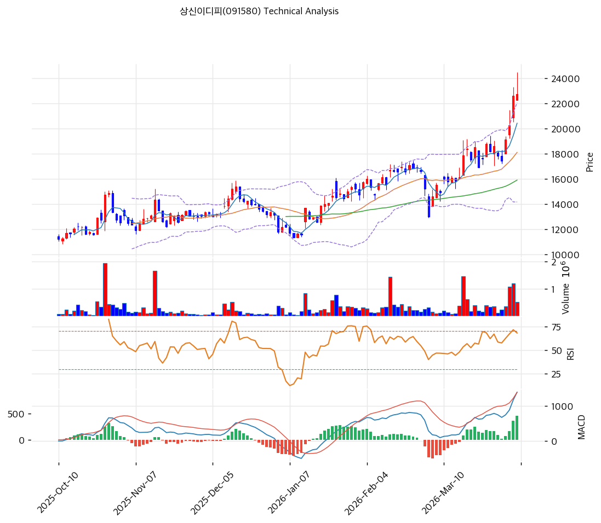

# 상신이디피(091580) 기술적 분석

2026-04-06 | T2 Technical Analysis

---

## 차트

---

## 1. 가격 현황

| 항목 | 값 |
|------|-----|
| 현재가 | 22,750원 (+0.66%) |
| 52주 고가 | 22,750원 |
| 52주 저가 | 6,730원 |
| 52주 범위 위치 | 100.0% |
| 거래량 | 20일 평균 대비 1.29x |

---

## 2. 차트 패턴 분석

### 2.1 캔들스틱 패턴

| 패턴 | 위치 | 신뢰도 | 해석 |
|------|------|--------|------|
| 장대양봉 돌파 | 최근 5거래일 | 강 | 장기간 저항대를 거래량과 함께 돌파한 강한 추세 전환 시그널 |
| 단기 상단 소화 캔들 | 최근 1~2거래일 | 중 | 신고가 구간에서 일부 차익실현이 나오지만 추세는 유지 |

### 2.2 가격 구조 패턴

- **박스권 상단 돌파** (신뢰도: 강)
  장기간 1만 후반~2만원 초반 박스권을 상향 돌파했습니다. 추세 전환 이후 가속 국면으로 해석할 수 있습니다.

- **상승 추세 채널** (신뢰도: 중)
  MA20·MA60이 우상향하며 정배열이 완성됐습니다. 다만 현재가가 MA20 대비 25.7% 높아 단기 과열 부담은 큽니다.

### 2.3 다이버전스

- **RSI 과매수 구간 진입** (신뢰도: 중)
  RSI가 70.6으로 과매수권에 진입했습니다. 추세는 강하지만 추가 상승보다는 단기 조정 가능성을 같이 봐야 합니다.

- **MACD 추세 강화** (신뢰도: 중)
  MACD 매수구간과 히스토그램 확대가 유지되고 있어 추세는 아직 살아 있습니다.

### 2.4 패턴 종합 판단

차트는 전형적인 **신고가 돌파형 강세 패턴**입니다. 다만 RSI와 스토캐스틱이 과열 신호를 보여, 신규 진입은 조정 이후가 더 유리합니다.

---

## 3. 이동평균선 — 정배열 (강세)

| MA | 값 | 현재가 괴리율 | 위치 |
|----|-----|--------------|------|
| MA5 | 20,422원 | +11.4% | 위 |
| MA20 | 18,101원 | +25.7% | 위 |
| MA60 | 15,898원 | +43.1% | 위 |
| MA120 | 14,453원 | +57.4% | 위 |
| MA200 | 12,385원 | +83.7% | 위 |

**해석**: 완전 정배열입니다. 추세는 매우 좋지만 MA20 대비 괴리율이 커 단기 조정이 나와도 이상하지 않은 자리입니다.

---

## 4. 보조 지표

### RSI(14) — 70.6 (🔴과매수)

과매수 구간입니다. 강한 추세 종목에서는 과매수가 지속될 수 있지만, 신규 진입자에겐 부담이 큰 자리입니다.

### MACD(12,26,9)

| 항목 | 값 |
|------|-----|
| MACD | 1,388.0 |
| Signal | 919.0 |
| Histogram | +469.0 |
| 크로스 상태 | 매수 구간 (확대 중) |

**해석**: MACD는 상승 추세를 지지합니다. 단기 조정이 와도 큰 추세는 쉽게 훼손되지 않을 가능성이 높습니다.

### 볼린저밴드(20, 2σ)

| 항목 | 값 |
|------|-----|
| 상단 | 22,052원 |
| 중단 (MA20) | 18,101원 |
| 하단 | 14,150원 |
| 밴드 폭 | 43.7% |
| 현재 위치 | 상단근접 |

**해석**: 상단을 상회한 상태로 추세는 강하지만 과열도 명확합니다.

### 스토캐스틱(14, 3, 3)

| 항목 | 값 |
|------|-----|
| Slow %K | 81.9 |
| Slow %D | 81.0 |
| 크로스 상태 | 골든크로스 |
| 판단 | 과매수 |

---

## 5. 지지/저항

| 구분 | 가격 | 근거 |
|------|------|------|
| 저항 | 22,750원 | 52주 고가 |
| 저항 | 24,050원 | 피봇 R1 |
| **현재가** | **22,750원** | — |
| 지지 | 21,850원 | 피봇 S1 |
| 지지 | 20,950원 | 피봇 S2 |
| 지지 | 18,101원 | MA20 |

---

## 6. 시그널 종합

| 지표 | 내용 | 시그널 |
|------|------|--------|
| **차트 패턴** | 박스권 돌파 + 신고가 경신 | 🟢 |
| 이동평균선 | 정배열, 다만 MA20 +25.7% 과열 | ⚪ |
| RSI | 70.6 — 과매수 | 🔴 |
| MACD | 매수구간 확대 | 🟢 |
| 볼린저밴드 | 상단 밀착, 과열 경계 | ⚪ |
| 스토캐스틱 | 과매수 구간 | 🔴 |
| 거래량 | 1.29x — 약함 | ⚪ |

**종합 판단**: 🟢 매수 2개 / 🔴 매도 2개 / ⚪ 중립 3개 → **중립**

추세 자체는 긍정적이지만, 단기 과열이 상당합니다. 기존 보유자는 추세를 따라갈 수 있으나, 신규 진입은 눌림 확인이 더 적절합니다.

---

## 7. 전략 제안

### 보유 중인 경우
- **비중축소**
- 익절 라인: 23,205원 (신고가 돌파 후 확장 구간)
- 손절 라인: 20,950원 (피봇 S2 이탈 시)
- 리스크/리워드: 보수적 1:1 내외

### 진입 대기인 경우
- **관망**
- 1차 진입가: 21,850원 (피봇 S1)
- 2차 진입가: 18,101원 (MA20)
- 진입 조건: 과열 해소 후 지지 확인 및 반등 출현
