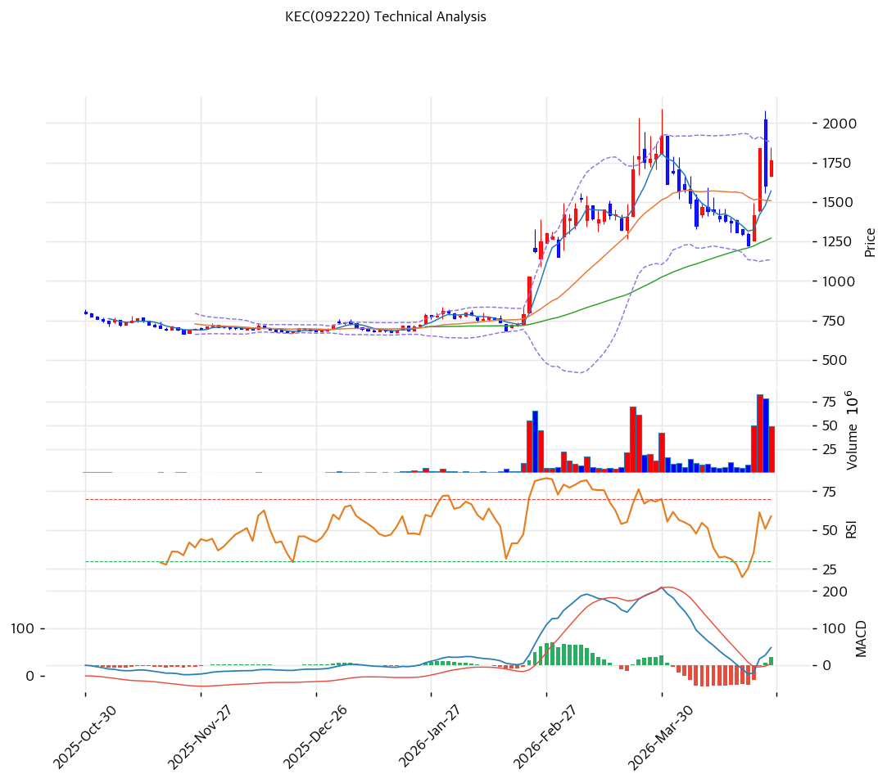

# KEC(092220) 기술적 분석

2026-04-24 | T2 Technical Analysis

---

## 차트

---

## 1. 가격 현황

| 항목 | 값 |
|------|-----|
| 현재가 | 1,761원 (+9.99%) |
| 52주 고가 | 1,917원 |
| 52주 저가 | 668원 |
| 52주 범위 위치 | 87.5% |
| 거래량 | 20일 평균 대비 2.4x |

---

## 2. 차트 패턴 분석

### 2.1 캔들스틱 패턴

| 패턴 | 위치 | 신뢰도 | 해석 |
|------|------|--------|------|
| 장대양봉 | 2026-04-24 당일 | 강 | +9.99% 급등 장대양봉으로 강력한 매수세 유입 — 추세 전환 및 모멘텀 확인 시그널 |
| 상승 갭 | 당일 시가 | 중 | 전일 대비 갭 상승 출발로 매수 우위 심리 반영, 단기 지지선 역할 가능 |

※ 주요 캔들 패턴: 장대양봉이 지배적이며 당일 특이 반전 패턴은 없음

### 2.2 가격 구조 패턴

- **상승 추세 채널** (신뢰도: 중)
  52주 저점 668원(2025년 하반기 추정)에서 현재 1,761원까지 상승 추세선이 형성되어 있다. 추세선 지지가 674원 수준(원거리)에서 형성되고 있으며, 추세선 저항이 1,629원에서 이미 돌파된 상태다. 현재가는 추세선 저항 상단에 위치해 단기 과열 신호이나 강한 추세 모멘텀을 유지 중이다.

- **박스권 돌파** (신뢰도: 중)
  1,570~1,666원 구간에서 박스권 횡보 후 금일 강한 거래량(2.4x)을 동반한 상단 돌파가 이루어졌다. 돌파 이후 박스권 상단(1,666원)이 1차 지지선으로 역할 전환될 가능성이 높다.

### 2.3 다이버전스

- **RSI 히든 상승 다이버전스** (신뢰도: 중)
  RSI 59.8로 과매수 영역 미진입 상태에서 가격이 신고가 수준으로 상승 — 히든 상승 다이버전스로 기존 상승 추세의 지속을 시사한다. RSI가 과매수(70 이상) 진입 전이므로 추가 상승 여력 존재.

- **MACD 상승 다이버전스** (신뢰도: 강)
  MACD 47 / Signal 26 / Histogram +21로 히스토그램 확대 중. MACD가 Signal 위에서 크로스 유지하며 확장 국면 — 강한 상승 모멘텀을 확인하는 시그널이다.

### 2.4 패턴 종합 판단

금일 +9.99% 장대양봉 + 거래량 2.4배 동반 + 박스권 상단 돌파의 세 요소가 동시에 확인되어 단기 강세 모멘텀이 매우 강하다. MACD 확장과 RSI 미과열 상태가 추가 상승 여력을 지지하나, 52주 고가(1,917원)까지의 저항이 근거리에 존재해 속도 조절 가능성도 있다. 상충 시그널 없음 — 전 지표가 매수 방향으로 정렬된 상태다.

---

## 3. 이동평균선 — 정배열 (강세)

| MA | 값 | 현재가 괴리율 | 위치 |
|----|-----|--------------|------|
| MA5 | 1,569원 | +12.2% | 위 |
| MA20 | 1,508원 | +16.8% | 위 |
| MA60 | 1,271원 | +38.5% | 위 |
| MA120 | 991원 | +77.7% | 위 |
| MA200 | 909원 | +93.8% | 위 |

**해석**: 5/20/60/120/200일 전 이동평균선이 완전 정배열 상태로 중장기 강세 구조를 형성하고 있다. MA20 괴리율 +16.8%는 단기 과열 경계선(20%)에 근접하고 있어 단기 조정 가능성을 내포하나, MA60·MA120·MA200과의 괴리가 38%~94%에 달해 저점 대비 급등에 의한 일시적 과열로 해석된다. 주요 지지선은 MA20(1,508원)이며 추세 유지의 핵심 기준선 역할을 한다.

---

## 4. 보조 지표

### RSI(14) — 59.8 (중립)

RSI 59.8은 중립 구간(30~70)에 위치하며 과매수(70 이상)에 미진입 상태로, 현재 강세 흐름에서 추가 상승 여력이 남아있음을 시사한다.

### MACD(12,26,9)

| 항목 | 값 |
|------|-----|
| MACD | 47.0 |
| Signal | 26.0 |
| Histogram | +21.0 |
| 크로스 상태 | 매수 구간 (확대 중) |

**해석**: MACD(47)이 Signal(26)을 상회하며 히스토그램(+21)이 확대 중으로, 강한 매수 모멘텀이 지속되고 있다. 히스토그램 확장 국면은 추세 가속화를 의미한다.

### 볼린저밴드(20, 2σ)

| 항목 | 값 |
|------|-----|
| 상단 | 1,880원 |
| 중단 (MA20) | 1,508원 |
| 하단 | 1,135원 |
| 밴드 폭 | 49.4% |
| 현재 위치 | 중간 |

**해석**: 밴드 폭 49.4%는 최근 변동성이 확대되었음을 나타내며, 현재가가 중단(MA20, 1,508원)과 상단(1,880원) 사이에 위치한다. 상단(1,880원)까지 약 7%의 추가 상승 여지가 있으며, 상단 터치 이후 속도 조절 가능성이 있다.

### 스토캐스틱(14, 3, 3)

| 항목 | 값 |
|------|-----|
| Slow %K | 69.0 |
| Slow %D | 58.0 |
| 크로스 상태 | 골든크로스 |
| 판단 | 중립 |

---

## 5. 지지/저항 — 추세선 · 피보나치 · PRZ 통합

### 5.1 피보나치 되돌림/확장

| 구분 | 비율 | 가격 | 현재가 대비 |
|------|------|------|-----------|
| Swing High | — | 1,917원 | -8.9% |
| 되돌림 | 0.236 | 1,626원 | -7.7% |
| 되돌림 | 0.382 | 1,447원 | -17.8% |
| 되돌림 | 0.5 | 1,302원 | -26.1% |
| 되돌림 | 0.618 | 1,156원 | -34.4% |
| 되돌림 | 0.786 | 949원 | -46.1% |
| Swing Low | — | 686원 | -61.0% |
| 확장 | 1.272 | 2,252원 | +27.9% |
| 확장 | 1.382 | 2,387원 | +35.5% |
| 확장 | 1.618 | 2,678원 | +52.1% |
| 확장 | 2.0 | 3,148원 | +78.8% |

※ 피보나치 기준: 상승 추세 (Swing Low 686원 → Swing High 1,917원)
※ 되돌림 = 직전 추세에서 되돌아온 비율, 확장 = 추세 방향 목표가

### 5.2 추세선

| 추세선 | 방향 | 현재 교차가 | 포인트 수 | 해석 |
|--------|------|-----------|---------|------|
| 지지선 | 상승 | 674원 | 6개 | 장기 상승 추세의 하단 지지 — 현재가 대비 원거리 |
| 저항선 | 상승 | 1,629원 | 6개 | 이미 상향 돌파된 상태 — 1차 지지선으로 역할 전환 |

### 5.3 PRZ (Potential Reversal Zone)

| 방향 | 가격 범위 | 신뢰도 | 근거 |
|------|---------|--------|------|
| 지지 | 1,626~1,629원 | 약 | 피보나치 0.236 되돌림 + 추세선 저항(돌파 후 지지) |
| 지지 | 1,569~1,570원 | 약 | MA5 + 피봇 S2 |
| 지지 | 1,271~1,302원 | 약 | MA60 + 피보나치 0.5 되돌림 |

### 5.4 종합 지지/저항 테이블

| 구분 | 가격 | 근거 |
|------|------|------|
| 저항 | 1,917원 | 52주 고가 |
| 저항 | 1,880원 | 볼린저밴드 상단 |
| 저항 | 1,851원 | 피봇 R1 |
| **현재가** | **1,761원** | — |
| 지지 | 1,666원 | 피봇 S1 |
| 지지 | 1,628원 | PRZ (피보나치 0.236 + 추세선 저항) |
| 지지 | 1,570원 | PRZ (MA5 + 피봇 S2) |
| 지지 | 1,508원 | MA20 |
| 지지 | 1,271원 | MA60 |

---

## 6. 시그널 종합

| 지표 | 내용 | 시그널 |
|------|------|--------|
| **차트 패턴** | 장대양봉 + 박스권 돌파 + MACD 히든 상승 다이버전스 | 🟢 |
| 이동평균선 | 완전 정배열, MA20 +16.8% | 🟢 |
| RSI | 59.8 — 중립 (과매수 미진입) | ⚪ |
| MACD | 매수구간, 히스토그램 확대 | 🟢 |
| 볼린저밴드 | 중간, 밴드 폭 49.4% | ⚪ |
| 스토캐스틱 | 골든크로스, K=69.0, 중립 | ⚪ |
| 거래량 | 2.4x — 강력 동반 | 🟢 |

**종합 판단**: 🟢 매수 4개 / 🔴 매도 0개 / ⚪ 중립 3개 → **매수우위**

금일 +9.99% 급등과 거래량 2.4배 급증은 강한 수급 유입 신호로, 단기 추세 전환이 확인된 구간이다. 정배열 + MACD 확장 + RSI 미과열의 조합은 추가 상승 여력을 지지한다. 다만 52주 고가(1,917원)까지 약 9% 저항이 근접해 있어 단기 속도 조절 가능성을 고려한 분할 대응이 유효하다.

---

## 7. 전략 제안

### 보유 중인 경우
- **홀드**
- 익절 라인: 1,955원 (52주 고가 저항권 + 피봇 R2 근방)
- 손절 라인: 1,570원 (피봇 S2 + MA5 PRZ 이탈 시)
- 리스크/리워드: 약 1:1.0 (현재가 1,761 기준 익절 +11% / 손절 -11%)

### 진입 대기인 경우
- **관망**
- 1차 진입가: 1,666원 (피봇 S1 — 단기 조정 시 매수)
- 2차 진입가: 1,508원 (MA20 — 추세 유지 핵심 지지선)
- 진입 조건: 일봉 종가 기준 지지선 확인 후 거래량 회복 시 매수 진입
