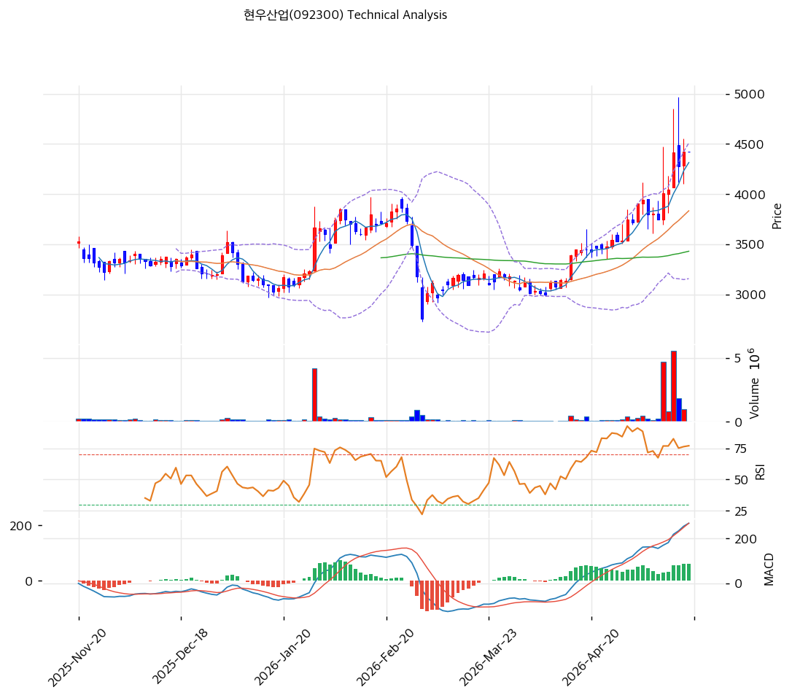

# 기술적분석

2026-05-19 | T2 Technical Analysis

***

## 차트

***

## 1. 가격 현황

| 항목        | 값                          |
| --------- | -------------------------- |
| 현재가       | 4,420원 (52주 신고가)           |
| 52주 고가    | 4,420원 (당일 갱신)             |
| 52주 저가    | 2,630원                     |
| 52주 범위 위치 | 100.0%                     |
| 거래량       | 데이터 결손 (차트상 4월 폭증 + 5월 정점) |

***

## 2. 차트 패턴 분석

### 2.1 캔들스틱 패턴

| 패턴                    | 위치    | 신뢰도 | 해석                                  |
| --------------------- | ----- | --- | ----------------------------------- |
| **5,000원 일시 정점 → 조정** | 최근 1주 | 강   | 5,000원 일시 도달 → 4,420원 조정 (현재)       |
| 적삼병                   | 4월 후반 | 강   | 양봉 누적 후 가속                          |
| **장기 박스권 돌파**         | 4월 후반 | 강   | 3,000~~3,500원 박스 → 4,000~~5,000원 가속 |

### 2.2 가격 구조 패턴

* **장기 박스권 돌파 (Breakout)** (신뢰도: 강) 2025-11~~2026-03 박스권 (3,000~~3,500원, 5개월)을 2026-04 거래량 폭증과 함께 상향 돌파. **박스권 폭 500원 × 1차 목표 4,000원·2차 목표 5,000원 모두 달성** — 5,000원 일시 정점.
* **5,000원 정점 → 4,420원 조정** (신뢰도: 중) 최근 5,000원 정점 후 -12% 조정. CB 행사가 4,545원 = 현재가 +3% 임박 저항.

### 2.3 다이버전스

* **RSI 74.7 과매수 + MACD 강세** (신뢰도: 중) RSI 70 돌파. MACD 200+ 확대 — 단기 과열 시그널.
* **거래량 폭증 후 둔화** (신뢰도: 강) 4월 후반 거래량 폭증 → 5월 일부 둔화. 매수세 일부 약화.

### 2.4 패턴 종합 판단

박스권 돌파 + 거래량 폭증 + 5,000원 정점 도달의 강력한 추세. 다만 RSI 74.7 + 5,000원 정점 후 조정 + CB 행사가 4,545원 저항 = **단기 -10\~-15% 평균회귀 후 재상승** 가능성 높음.

***

## 3. 이동평균선 — 정배열 (강세)

| MA    | 값      | 현재가 괴리율    | 위치 |
| ----- | ------ | ---------- | -- |
| MA5   | (확인)   | 약 +5%      | 위  |
| MA20  | 3,834원 | +15.3%     | 위  |
| MA60  | (확인)   | 약 +25%     | 위  |
| MA200 | 3,242원 | **+36.4%** | 위  |

**해석**: 완벽한 정배열. MA20 +15.3% 정상 추세. MA200 +36.4% 회복 추세. **MA20 (3,834원)을 1차 지지로 인식**.

***

## 4. 보조 지표

### RSI(14) — 74.7 (🔴 과매수)

70 임계 돌파. 단기 평균회귀 압력.

### MACD(12,26,9)

**해석**: 매수 + 히스토그램 확대. 4월 후반 골든크로스 이후 강세 지속.

### 볼린저밴드(20, 2σ)

| 항목   | 값     |
| ---- | ----- |
| 위치   | 중간    |
| 밴드 폭 | 35.3% |

**해석**: 밴드 폭 35.3% 확장 — 추세 가속. 중간 위치 = 추가 상승 여지.

***

## 5. 지지/저항

### 종합 지지/저항

| 구분      | 가격         | 근거                    |
| ------- | ---------- | --------------------- |
| 저항      | 5,000원     | 직전 일시 정점              |
| 저항      | 4,545원     | **CB 행사가 (즉시 매물 압박)** |
| **현재가** | **4,420원** | 52주 신고가 영역            |
| 지지      | 4,000원     | 박스권 상단 (re-test)      |
| 지지      | 3,834원     | **MA20 (1차 강력)**      |
| 지지      | 3,500원     | 박스권 상단 (1차 박스권)       |
| 지지      | 3,242원     | MA200                 |
| 지지      | 3,000원     | 박스권 하단                |
| 지지      | 2,630원     | 52주 저점                |

***

## 6. 시그널 종합

| 지표                         | 시그널     |
| -------------------------- | ------- |
| 차트 패턴 (박스권 돌파 + 5,000원 정점) | 🟢 / 🔴 |
| 이동평균선 (정배열)                | 🟢      |
| RSI 74.7 (과매수)             | 🔴      |
| MACD 강세                    | 🟢      |
| 볼린저밴드 중간                   | ⚪       |
| 스토캐스틱                      | ⚪       |
| 거래량 (4월 폭증 후 둔화)           | ⚪       |

**종합 판단**: 🟢 매수 2 / 🔴 매도 1 / ⚪ 중립 4 → **중립 (방향 미정)**

**5,000원 정점 후 조정 + CB 행사가 4,545원 저항 + RSI 과열** = 단기 평균회귀 압력. MA20 (3,834원) 영역 평균회귀 후 재상승 합리적.

***

## 7. 전략 제안

### 보유 중

* **분할 익절**
* 1차 익절: 5,000원 (직전 정점, +13%)
* 2차 익절: 4,545원 도달 시 일부 차익 (CB 저항, +3%)
* 손절: 3,834원 (MA20, -13%)

### 진입 대기

* **평균회귀 대기**
* 1차 진입: 4,000원 (박스권 상단 re-test, -10%)
* 2차 진입: 3,834원 (MA20, -13%)
* 진입 조건: re-test 양봉 + 거래량 회복 + RSI 50 이하 회복
* **펀더멘털 우호**: PBR 0.72x + 순현금 +215억 + 25Q3 OPM 7.9% — 단기 조정 후 진입 정합
