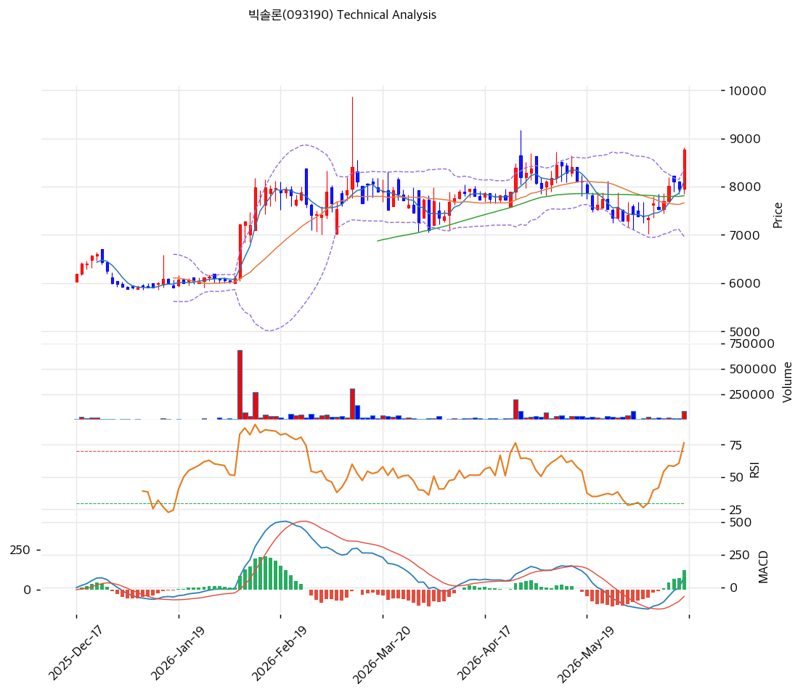

# 빅솔론(093190) 기술적 분석

2026-06-17 | T2 Technical Analysis

---

## 차트

---

## 1. 가격 현황

| 항목 | 값 |
|------|-----|
| 현재가 | 8,770원 (+10.18%) |
| 52주 고가 | 8,770원 (신고가) |
| 52주 저가 | 5,530원 |
| 52주 범위 위치 | 100.0% (신고가) |
| 거래량 | 20일 평균 대비 **3.07x** (폭증) |

> 52주 저점(5,530원) 대비 약 1.6배 상승. 당일 +10.18%·거래량 3.07배 폭증으로 신고가 분출. 오랜 박스(6,700\~8,000원)를 거래량 동반 상향 돌파. MA200 대비 +30%로 과열은 제한적.

---

## 2. 차트 패턴 분석

### 2.1 캔들스틱 패턴

| 패턴 | 위치 | 신뢰도 | 해석 |
|------|------|--------|------|
| 장대양봉 + 거래량 폭증 | 당일 (+10.18%, 3.07x) | 강 | 매수 — 박스 상향 돌파 |
| 신고가 갱신 | 당일 | 중 | 매수 — 모든 MA 상회 |
| 스토캐스틱 88.5 과매수 | — | 중 | 단기 과열 경계 |

※ 주요 캔들 패턴: 망치형, 역망치형, 장악형, 도지, 샛별/석별, 적삼병/흑삼병, 하라미, 유성형, 교수형 등

### 2.2 가격 구조 패턴

- **박스 상향 돌파 + 거래량 3.07배** (신뢰도: 강)
  6,700\~8,000원 박스를 실적 회복(2026Q1 OP +390%)·환율·저평가 모멘텀으로 거래량 3.07배 동반 돌파. 신고가 경신. 피보 1.272 확장(11,116원)이 다음 상단.

- **장기 상승 추세** (신뢰도: 중)
  MA200(6,746원) 대비 +30%로 강세이나 다른 종목 대비 과열 완만. 저평가·박스 돌파로 추세 여력.

※ 주요 구조 패턴: 이중천정/바닥, 헤드앤숄더, 삼각수렴, 쐐기형, 깃발형, 페넌트, 컵앤핸들, 박스권 등

### 2.3 다이버전스

- **추세 추종 — 단기 과매수** (신뢰도: 중)
  가격 신고가·RSI 68.1·MACD 매수 확대 동행. 거래량 폭증. 스토캐스틱 88.5 과매수로 단기 과열·조정 신호 혼재.

※ RSI·MACD 기반 | 상승 다이버전스 = 가격↓ 지표↑, 하락 다이버전스 = 가격↑ 지표↓

### 2.4 패턴 종합 판단

오랜 박스를 거래량 3.07배 동반 상향 돌파한 **신고가 분출** 국면이다. RSI 68.1·MACD 매수 확대로 모멘텀이 강하나 스토캐스틱 88.5의 단기 과매수가 동반된다. MA200 +30%로 과열은 제한적. 실적 회복·저평가·환율이 펀더멘털을 받친다. 추격보다 눌림목(MA20 7,664원·피보 0.382 8,120원) 확인이 안전하다.

---

## 3. 이동평균선 — 단기 강세(비정배열→정렬 시도)

| MA | 값 | 현재가 괴리율 | 위치 |
|----|-----|--------------|------|
| MA5 | 8,108원 | +8.2% | 위 |
| MA20 | 7,664원 | +14.4% | 위 |
| MA60 | 7,813원 | +12.3% | 위 |
| MA120 | 7,343원 | +19.4% | 위 |
| MA200 | 6,746원 | +30.0% | 위 |

**해석**: 현재가가 모든 MA 위로 강세이나 MA20(7,664원)·MA60(7,813원)이 근접해 완전 정배열은 아님(aligned False, 박스 흔적). 당일 급등으로 단기 강세 복귀. MA200 +30%로 과열 제한적. 조정 시 MA20(7,664원)·MA120(7,343원)·MA60(7,813원)이 밀집 지지대.

---

## 4. 보조 지표

### RSI(14) — 68.1 (중립, 과매수 근접)

당일 급등으로 과매수(70) 직전. 강한 모멘텀이나 단기 과열 신호.

### MACD(12,26,9)

| 항목 | 값 |
|------|-----|
| MACD | 80 |
| Signal | -43 |
| Histogram | +123 |
| 크로스 상태 | 매수 전환 (히스토그램 확대) |

**해석**: MACD가 Signal을 상향 돌파한 매수 전환, 히스토그램 확대로 상승 모멘텀 발생. 0선 부근에서 상승.

### 볼린저밴드(20, 2σ)

| 항목 | 값 |
|------|-----|
| 상단 | 8,363원 |
| 중단 (MA20) | 7,664원 |
| 하단 | 6,966원 |
| 밴드 폭 | 18.2% |
| 현재 위치 | 상단 돌파 |

**해석**: 현재가 8,770원이 밴드 상단(8,363원)을 상회 — 강한 상승. 밴드 폭 18%(박스 후 확장 시작). 되돌림 시 중단(MA20 7,664원) 여지.

### 스토캐스틱(14, 3, 3)

| 항목 | 값 |
|------|-----|
| Slow %K | 88.5 |
| Slow %D | 83.7 |
| 크로스 상태 | 골든크로스 |
| 판단 | 과매수권 |

---

## 5. 지지/저항 — 추세선 · 피보나치 · PRZ 통합

### 5.1 피보나치 되돌림/확장

| 구분 | 비율 | 가격 | 현재가 대비 |
|------|------|------|-----------|
| 확장 | 1.272 | 11,116원 | +26.8% |
| 저항 | 0.236 | 8,789원 | +0.2% |
| **현재가** | — | 8,770원 | — |
| 지지 | 0.382 | 8,120원 | -7.4% |
| 지지 | 0.5 | 7,580원 | -13.6% |
| 지지 | 0.618 | 7,040원 | -19.7% |

### 5.2 종합 지지/저항 테이블

| 구분 | 가격 | 근거 |
|------|------|------|
| 저항 | 11,116원 | 피보 1.272 확장 |
| 저항 | 9,859원 | 추세선 저항 |
| 저항 | 9,110원 | 피봇 R1 |
| 저항 | 8,789원 | 피보 0.236 |
| **현재가** | **8,770원** | 신고가·볼린저 상단 |
| 지지 | 8,140원 | 피봇 S1 |
| 지지 | 8,123원 | MA5·피보 0.382 (PRZ 중) |
| 지지 | 7,664원 | MA20 |
| 지지 | 7,546원 | MA120·추세선·피봇 S2 (PRZ 강) |

---

## 6. 시그널 종합

| 지표 | 내용 | 시그널 |
|------|------|--------|
| 차트 패턴 | 박스 돌파 + 거래량 3.07x | 🟢 |
| 이동평균선 | 모든 MA 상회(밀집) | ⚪ |
| RSI | 68.1 — 과매수 근접 | ⚪ |
| MACD | 매수 전환, 히스토그램 확대 | 🟢 |
| 볼린저밴드 | 상단 돌파 | ⚪ |
| 스토캐스틱 | 과매수(88.5), 골든크로스 | 🔴 |
| 거래량 | 3.07x — 폭증 | 🟢 |

**종합 판단**: 🟢 매수 2개 / 🔴 매도 1개 / ⚪ 중립 3개 → **매수우위 (박스 돌파 분출 + 단기 과열)**

오랜 박스를 거래량 3.07배 동반 상향 돌파한 신고가 분출이다. RSI 68.1·MACD 매수 전환으로 모멘텀이 강하나 스토캐스틱 88.5의 단기 과매수가 동반된다. MA200 +30%로 과열은 제한적. 실적 회복·저평가·환율이 펀더멘털을 받친다. 추격보다 눌림목(MA20 7,664원·MA 밀집 7,546\~8,123원) 대응이 정석.

---

## 7. 전략 제안

### 보유 중인 경우
- **홀드 (분할 익절 병행)**
- 익절 라인: 9,110원(피봇 R1)·9,859원(추세선 저항)
- 손절 라인: 7,546원 (MA 밀집·PRZ 강 이탈)
- 리스크/리워드: +10% 급등·신고가로 단기 손익비 다소 불리하나 PBR 0.64x 저평가로 하방 안정

### 진입 대기인 경우
- **눌림목 분할 (저평가)**
- 1차 진입가: 8,123원 (MA5·피보 0.382 PRZ) / 7,664원 (MA20)
- 2차 진입가: 7,546원 (MA120·추세선·피봇 S2 PRZ 강)
- 진입 조건: 거래량 3.07배 급등 추격은 위험. 조정 시 MA 밀집대(7,546\~8,123원) 지지 확인 후 분할. 단 PER 9.2x·PBR 0.64x·배당 5%·실적 회복(2026Q1 OP +390%)으로 하방 안정. 자사주 25%·주주환원도 방어.
