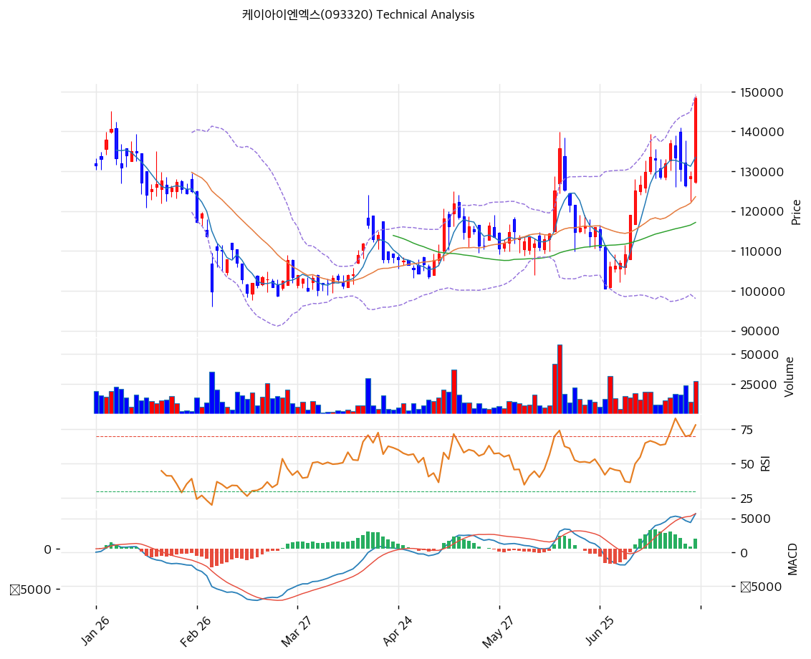

# 케이아이엔엑스(093320) 기술적 분석

2026-07-24 | T2 Technical Analysis

---

## 차트

---

## 1. 가격 현황

| 항목 | 값 |
|------|-----|
| 현재가 | 148,400원 (+15.31%) |
| 52주 고가 | 148,400원 (**금일 신고가**) |
| 52주 저가 | 80,200원 |
| 52주 범위 위치 | 100.0% |
| 거래량 | 20일 평균 대비 1.95x |

---

## 2. 차트 패턴 분석

### 2.1 캔들스틱 패턴

| 패턴 | 위치 | 신뢰도 | 해석 |
|------|------|--------|------|
| 장대양봉 (신고가 돌파) | 금일 | 강 | +15.3% 대량 거래 동반 52주 신고가 경신 — 매물대 소화 완료 신호 |
| 상승 연속 양봉 | 최근 2주 | 중 | 6월 말 조정(105,000원대) 이후 저점·고점 동반 상승 |

### 2.2 가격 구조 패턴

- **컵앤핸들 유사 돌파** (신뢰도: 강)
  1월 고점(135,800원) → 2\~3월 조정(100,600원) → 4\~7월 완만한 우측 회복 → 금일 전고점 일괄 돌파. 6개월 컵 패턴의 완성으로, 교과서적 목표가는 컵 깊이(35,200원)를 더한 171,000원 부근.

- **정배열 완성 + 전 이평 상승 전환** (신뢰도: 강)
  MA5>MA20>MA60>MA120>MA200의 완전 정배열 — 1월 이후 처음. 중기 추세의 방향이 위로 정렬됐다.

- **볼린저 상단 돌파** (신뢰도: 중)
  상단(149,169원)에 밀착 — 강한 추세의 신호이나 단기 과열 병행.

### 2.3 다이버전스

- **다이버전스 없음 — 동행 상승** (신뢰도: —)
  RSI(68.9)·MACD(확대) 모두 가격과 같은 방향 — 추세 지속형 구도. 과매수 진입 직전 구간이라 신규 돌파 추격은 리스크.

### 2.4 패턴 종합 판단

6개월 컵 패턴 돌파 + 정배열 + 거래량 동반 신고가 — 기술적으로 가장 강한 조합이 완성됐다. 남은 질문은 과열(MA20 괴리 +20.0%)의 소화 방식이다: 강한 추세는 기간 조정(횡보)으로, 약한 추세는 가격 조정(되돌림)으로 과열을 푼다. 133,000원대(직전 고점대·피봇 S1)를 지키는 한 돌파는 유효하다.

---

## 3. 이동평균선 — 정배열 (강세, 단기 과열)

| MA | 값 | 현재가 괴리율 | 위치 |
|----|-----|--------------|------|
| MA5 | 133,520원 | +11.1% | 위 |
| MA20 | 123,620원 | +20.0% | 위 |
| MA60 | 117,168원 | +26.7% | 위 |
| MA120 | 115,533원 | +28.4% | 위 |
| MA200 | 110,902원 | +33.8% | 위 |

**해석**: 완전 정배열의 초기 국면 — 장기 이평(MA120·200)이 이제 막 우상향으로 꺾여 중기 추세는 견조하다. 다만 MA20 괴리 +20.0%는 과열 기준선(20%)에 정확히 걸린 수준 — 단기 눌림(1차 133,000원대) 확률이 높은 자리다.

---

## 4. 보조 지표

### RSI(14) — 68.9 (중립 상단, 과매수 직전)

70선 직전 — 추가 상승 여력이 소진돼 가는 구간. 신고가 돌파 직후라 70 돌파 자체는 자연스러우나 눌림 대비 필요.

### MACD(12,26,9)

| 항목 | 값 |
|------|-----|
| MACD | 5,698 |
| Signal | 4,402 |
| Histogram | +1,295 |
| 크로스 상태 | 매수 구간 (확대 중) |

**해석**: 7월 초 골든크로스 후 히스토그램 확대 지속 — 상승 모멘텀 정점 구간.

### 볼린저밴드(20, 2σ)

| 항목 | 값 |
|------|-----|
| 상단 | 149,169원 |
| 중단 (MA20) | 123,620원 |
| 하단 | 98,071원 |
| 밴드 폭 | 41.3% |
| 현재 위치 | 상단 밀착 |

**해석**: 상단 밀착 + 밴드 확장 — 추세 강도는 확인되나 상단 밖 유지는 통상 수일을 넘기기 어렵다. 밴드 워킹(상단을 타고 가는 강세) 여부가 추세 강도의 시금석.

### 스토캐스틱(14, 3, 3)

| 항목 | 값 |
|------|-----|
| Slow %K | 76.2 |
| Slow %D | 72.5 |
| 크로스 상태 | 골든크로스 |
| 판단 | 중립 (과매수 접근) |

---

## 5. 지지/저항 — 추세선 · 피보나치 · PRZ 통합

### 5.1 피보나치 되돌림/확장

| 구분 | 비율 | 가격 | 현재가 대비 |
|------|------|------|-----------|
| Swing High | — | 135,800원 | -8.5% |
| 되돌림 | 0.236 | 108,907원 | -26.6% |
| 되돌림 | 0.382 | 114,046원 | -23.1% |
| 되돌림 | 0.5 | 118,200원 | -20.3% |
| 되돌림 | 0.618 | 122,354원 | -17.6% |
| 되돌림 | 0.786 | 128,267원 | -13.6% |
| Swing Low | — | 100,600원 | -32.2% |

※ 피보나치 기준: 직전 하락 스윙(135,800→100,600원) — 신고가 돌파로 전 레벨이 하방 지지로 전환된 상태

### 5.2 추세선

| 추세선 | 방향 | 현재 교차가 | 포인트 수 | 해석 |
|--------|------|-----------|---------|------|
| 지지선 | 상승 | 106,820원 | 6개 | 3월 저점발 상승 추세선 — 중기 추세의 마지노선 |
| 저항선 | 상승 | 141,794원 | 6개 | 상승 채널 상단 — 금일 종가가 채널 상단 위 (과열 신호) |

### 5.3 PRZ (Potential Reversal Zone)

| 방향 | 가격 범위 | 신뢰도 | 근거 |
|------|---------|--------|------|
| 지지 | 133,520\~133,967원 | 약 | MA5 + 피봇 S1 — 1차 눌림 목표 |
| 지지 | 114,046\~123,620원 | **강** | MA20·MA60·MA120 + 피보나치 0.382/0.5/0.618 + 피봇 S2 — 7개 소스 중첩 |
| 지지 | 106,820\~110,902원 | 중 | 상승 추세선 + MA200 + 피보나치 0.236 |

※ PRZ = 추세선 · 피보나치 · 피봇 · MA 등 복수 지표가 겹치는 가격 구간. 겹치는 소스가 많을수록 반전 확률 상승.

### 5.4 종합 지지/저항 테이블

| 구분 | 가격 | 근거 |
|------|------|------|
| 저항 | 163,333원 | 피봇 R2 |
| 저항 | 155,867원 | 피봇 R1 |
| **현재가** | **148,400원** | 52주 신고가 — 상방 매물대 부재 |
| 지지 | 133,520\~133,967원 | PRZ(약) — MA5 + 피봇 S1 + 직전 고점대 |
| 지지 | 128,267원 | 피보나치 0.786 |
| 지지 | 114,046\~123,620원 | PRZ(강) — 이평·피보나치 7개 소스 |
| 지지 | 106,820\~110,902원 | PRZ(중) — 추세선 + MA200 |

---

## 6. 시그널 종합

| 지표 | 내용 | 시그널 |
|------|------|--------|
| **차트 패턴** | 컵앤핸들 돌파 + 신고가 장대양봉 | 🟢 |
| 이동평균선 | 정배열, MA20 +20.0% | 🟢 (추세) / ⚠️ (과열) |
| RSI | 68.9 — 중립 상단 | ⚪ |
| MACD | 매수 구간, 히스토그램 확대 | 🟢 |
| 볼린저밴드 | 상단 밀착, 폭 41.3% | ⚪ |
| 스토캐스틱 | 골든크로스, K=76.2 | ⚪ |
| 거래량 | 1.95x — 돌파 동반 | ⚪ |

**종합 판단**: 🟢 매수 2개 / 🔴 매도 0개 / ⚪ 중립 4개 → **매수우위 (신고가 돌파 — 단기 과열 병행)**

추세·패턴·수급(외인·기관 동반 매수)이 모두 상방 정렬된 강세 구도다. 유일한 흠은 하루 +15.3%가 만든 단기 과열(MA20 +20%) — 신규 진입은 돌파 추격보다 133,000원대 눌림을 기다리는 것이 유리하고, 눌림 없이 밴드 워킹으로 직행하면 155,000\~163,000원(피봇 R1~R2)이 다음 시험대다. 펀더멘털 트리거(2026Q1 OP +79.5%)가 뒷받침하는 돌파라 일회성 테마 급등과는 결이 다르다.

---

## 7. 전략 제안

### 보유 중인 경우
- **홀드 (추세 추종)**
- 익절 라인: 163,000원 (피봇 R2·컵앤핸들 목표 171,000원 접근 구간 — 분할 익절)
- 손절 라인: 128,000원 (피보나치 0.786·돌파 무효화 라인)
- 리스크/리워드: 약 0.7 (신고가 직후라 손익비 불리 — 보유자 관점은 트레일링 스탑 우선)

### 진입 대기인 경우
- **눌림 대기 (추격 금지)**
- 1차 진입가: 133,000\~134,000원 (PRZ 약 — MA5·피봇 S1·직전 고점 지지 전환 확인)
- 2차 진입가: 118,000\~124,000원 (PRZ 강 — 7개 소스 중첩, 과열 완전 해소 구간)
- 진입 조건: 눌림에서 거래량 감소(매물 소화) 확인 후 재상승 전환 시. 8월 반기 실적(OP 85억+ 지속 여부)이 눌림 매수의 펀더멘털 체크포인트
