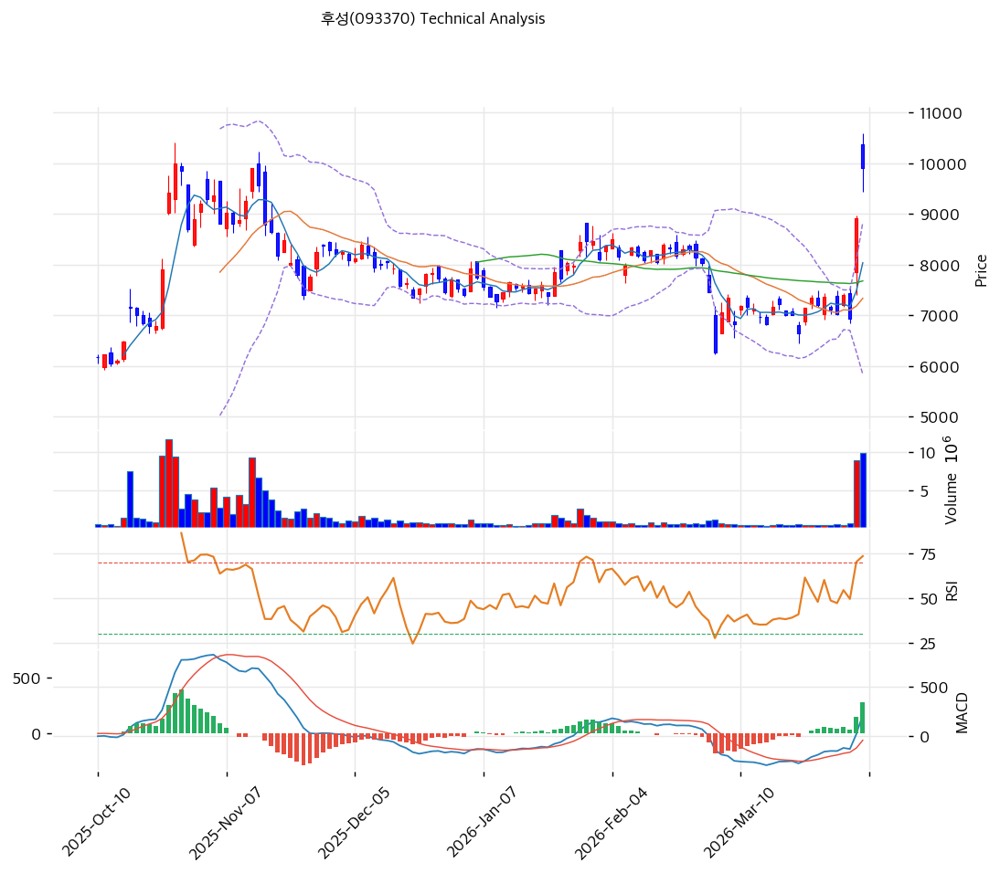

# 후성(093370) 기술적 분석

2026-04-06 | T2 Technical Analysis

---

## 차트

---

## 1. 가격 현황

| 항목 | 값 |
|------|-----|
| 현재가 | 9,900원 (+10.99%) |
| 52주 고가 | 10,590원 (신규 갱신 가능) |
| 52주 저가 | 3,830원 |
| 52주 범위 위치 | 98.5% |
| 거래량 | 20일 평균 대비 11.75x |

---

## 2. 차트 패턴 분석

### 2.1 캔들스틱 패턴

| 패턴 | 위치 | 신뢰도 | 해석 |
|------|------|--------|------|
| 대형 장대양봉 (마루보주) | 당일 (2026-04-06) | 강 | 매수 시그널 — 시가~종가 전 구간을 양봉이 장악, 세력의 강력한 매수세 유입을 나타냄 |
| 갭업 출현 | 당일 (2026-04-06) | 강 | 매수 시그널 — 전일 종가 대비 갭을 띄우고 시작, 수급 불균형과 강한 상승 압력을 시사 |

※ 주요 캔들 패턴: 망치형, 역망치형, 장악형(상승/하락), 도지, 샛별/석별, 적삼병/흑삼병, 하라미, 유성형, 교수형 등

### 2.2 가격 구조 패턴

- **V자 반등 / 장기 바닥 이후 급등** (신뢰도: 강)
  52주 저점 3,830원(저점)에서 현재 9,900원까지 약 2~3주 사이 급등하는 V자형 반등 구조가 형성됐다. 오버슈팅 성격이 강하며, 통상 V자 급등 후에는 단기 눌림목(피봇 S1~S2 구간, 9,363~8,827원)을 거친 뒤 재차 상승을 시도하거나 갭을 되메우는 흐름이 전형적이다. 현재가는 52주 신고가(9,990원)를 갱신하려는 시도 단계로, 돌파 성공 여부가 다음 방향성을 결정한다.

- **52주 신고가 돌파 시도** (신뢰도: 중)
  현재가 9,900원은 종전 52주 고가(9,990원) 직하에 위치하며, 오늘 고가가 10,590원으로 이미 신고가를 경신한 상태다. 종가가 52주 고가를 상회한 채 마감된다면 저항 돌파가 확인되고 다음 저항은 피봇 R1(10,513원)이 된다. 단, 신고가 돌파 후 종가가 다시 9,990원 하회 시 '거짓 돌파(Fakeout)' 리스크가 존재한다.

※ 주요 구조 패턴: 이중천정/바닥, 헤드앤숄더(정/역), 삼각수렴(대칭/상승/하락), 쐐기형(상승/하락), 깃발형, 페넌트, 컵앤핸들, 박스권 등

### 2.3 다이버전스

- **다이버전스 없음** (해당사항 없음)
  현재 가격과 RSI·MACD 모두 동반 상승하고 있어 하락 다이버전스가 발생하지 않았다. 지표와 가격이 같은 방향으로 움직이는 것은 현재 상승 모멘텀이 진성임을 시사한다. 단, RSI가 이미 71.0(과매수 영역)에 진입한 상태여서 향후 가격 고점 갱신 시 RSI 고점이 오히려 낮아지는 하락 다이버전스가 형성될 경우 단기 고점 신호로 해석해야 한다.

※ RSI·MACD 기반 | 상승 다이버전스 = 가격↓ 지표↑ (반등 시사), 하락 다이버전스 = 가격↑ 지표↓ (하락 시사), 히든 다이버전스 = 기존 추세 지속 시사

### 2.4 패턴 종합 판단

오늘 발생한 대형 장대양봉(마루보주)과 갭업은 강한 매수세를 확인해주는 시그널이며, V자 반등 구조 위에서 52주 신고가를 실질적으로 갱신했다는 점에서 추세 전환이 아닌 추세 가속의 성격이 강하다. 그러나 단 하루 만에 BB 상단(8,834원)을 9,900원까지 크게 이탈하는 극단적 과열이 수반되었고, 이러한 단기 수직 급등 이후에는 대체로 단기 조정(눌림목 또는 갭 메우기)이 필요하다. 상충하는 점은 모멘텀 지표(MACD·거래량)는 강세이나 과열 지표(RSI·BB 이탈)는 경고를 발하고 있다는 것으로, 추격 매수보다 눌림목 진입이 유효한 국면이다.

---

## 3. 이동평균선 — 비정배열 (강세)

| MA | 값 | 현재가 괴리율 | 위치 |
|----|-----|--------------|------|
| MA5 | 8,036원 | +23.2% | 위 |
| MA20 | 7,334원 | +35.0% | 위 |
| MA60 | 7,679원 | +28.9% | 위 |
| MA120 | 7,863원 | +25.9% | 위 |
| MA200 | 6,864원 | +44.2% | 위 |

**해석**: 현재가가 모든 이동평균선 위에 위치하여 추세 방향은 명확히 상향이다. 단, MA5(8,036원) > MA60(7,679원) > MA120(7,863원) > MA20(7,334원) 순의 비정배열로 중기 MA들이 아직 교차 정렬 중이어서 완전한 정배열은 미완성이다. MA20 대비 +35.0%, MA200 대비 +44.2%의 과도한 괴리는 단기 과열 신호로, 평균회귀 관점에서 MA5~MA20 수렴 구간(7,334~8,036원)이 자연스러운 조정 목표대다.

---

## 4. 보조 지표

### RSI(14) — 71.0 (과매수 🔴)

RSI 71.0은 통상적 과매수 기준선(70)을 이미 상회한 상태로, 단기 모멘텀이 과도하게 집중되었음을 나타내며 수급 부담이 증가하는 구간이다.

### MACD(12,26,9)

| 항목 | 값 |
|------|-----|
| MACD | 218 |
| Signal | -60 |
| Histogram | +278 |
| 크로스 상태 | 매수 구간 (확대 중) |

**해석**: MACD(218)이 Signal(-60)을 크게 상회하며 히스토그램이 +278로 급격히 확대되는 것은 단기 상승 모멘텀이 매우 강력함을 보여주며, 현 상승 추세의 진성을 뒷받침한다.

### 볼린저밴드(20, 2σ)

| 항목 | 값 |
|------|-----|
| 상단 | 8,834원 |
| 중단 (MA20) | 7,334원 |
| 하단 | 5,835원 |
| 밴드 폭 | 40.9% |
| 현재 위치 | 상단 대폭 이탈 |

**해석**: 현재가 9,900원은 BB 상단(8,834원)을 약 1,066원(12.1%) 상회하는 극단적 이탈 상태로, 밴드 폭이 40.9%로 이미 확장되어 있음에도 가격이 밴드 밖에 위치한다. 이는 통계적 정규분포 기준 매우 이례적인 과열 구간으로, 밴드 내 회귀 압력이 강해지는 국면이다.

### 스토캐스틱(14, 3, 3)

| 항목 | 값 |
|------|-----|
| Slow %K | 74.9 |
| Slow %D | 71.6 |
| 크로스 상태 | 골든크로스 |
| 판단 | 중립 |

---

## 5. 지지/저항

| 구분 | 가격 | 근거 |
|------|------|------|
| 저항 | 10,513원 | 피봇 R1 |
| 저항 | 9,990원 | 52주 고가 (당일 고가 10,590원으로 갱신) |
| **현재가** | **9,900원** | — |
| 지지 | 9,363원 | 피봇 S1 |
| 지지 | 8,827원 | 피봇 S2 |
| 지지 | 7,679원 | MA60 |
| 지지 | 7,334원 | MA20 / BB 중단 |

---

## 6. 시그널 종합

| 지표 | 내용 | 시그널 |
|------|------|--------|
| **차트 패턴** | 대형 장대양봉 + 갭업 + V자 반등 + 52주 신고가 갱신 | 🟢 |
| 이동평균선 | 비정배열이나 전 MA 상회, MA20 대비 +35.0% 괴리 과열 | 🔴 |
| RSI | 71.0 — 과매수 영역 진입 | 🔴 |
| MACD | 매수 구간, 히스토그램 +278 강력 확대 중 | 🟢 |
| 볼린저밴드 | BB 상단 대폭 이탈 (9,900 vs 8,834), 밴드폭 40.9% | 🔴 |
| 스토캐스틱 | 골든크로스, K=74.9 / D=71.6, 과매수 경계 | ⚪ |
| 거래량 | 11.75x — 폭발적 세력 유입 시그널 | 🟢 |

**종합 판단**: 🟢 매수 3개 / 🔴 매도 3개 / ⚪ 중립 1개 → **중립 (과열 경고)**

차트 패턴과 MACD·거래량은 강한 단기 모멘텀을 확인해주지만, RSI 과매수·BB 상단 대폭 이탈·MA 과도 괴리라는 세 가지 과열 지표가 동시에 경고를 발하는 상충 구조다. 이는 진입 타이밍상 현 수준에서의 추격 매수보다 단기 조정을 기다리는 눌림목 전략이 적합한 국면임을 시사한다. 단기 조정 시 피봇 S1(9,363원) ~ 피봇 S2(8,827원) 구간에서 지지 확인 후 재상승 여부를 판단하는 것이 리스크 대비 수익률(R/R) 측면에서 유효하다.

---

## 7. 전략 제안

### 보유 중인 경우
- **홀드 (단계적 익절 고려)**
- 익절 라인: 10,513원 (피봇 R1 — 1차 목표) / 11,000원 이상 (심리적 저항 + 추가 상승 시)
- 손절 라인: 8,827원 (피봇 S2 — 지지 붕괴 시 추세 약화 신호)
- 리스크/리워드: 현재가 9,900원 기준 익절 10,513원(+6.2%) / 손절 8,827원(-10.8%) → R/R 약 1:1.7 (불리)

### 진입 대기인 경우
- **관망 후 눌림목 진입**
- 1차 진입가: 9,363원 (피봇 S1 — 단기 조정 1차 지지)
- 2차 진입가: 8,827원 (피봇 S2 — 더 깊은 조정 시)
- 진입 조건: 눌림목 이후 거래량 감소와 함께 지지 확인 + 재차 양봉 출현 시 진입. BB 상단(8,834원) 재돌파 및 유지 여부도 추가 확인 권장. 현 수준(9,900원)에서의 추격 매수는 BB 대폭 이탈 과열 상태로 비권장.
