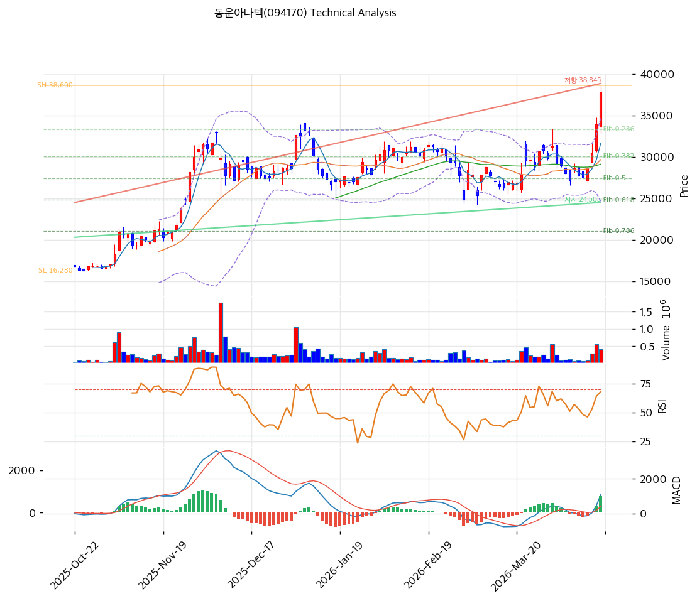

# 동운아나텍(094170) 기술적 분석

2026-04-17 | T2 Technical Analysis

---

## 차트

---

## 1. 가격 현황

| 항목 | 값 |
|------|-----|
| 현재가 | 37,800원 (+11.34%) |
| 52주 고가 | 37,800원 |
| 52주 저가 | 16,280원 |
| 52주 범위 위치 | 100.0% |
| 거래량 | 20일 평균 대비 1.94x |

---

## 2. 차트 패턴 분석

### 2.1 캔들스틱 패턴

| 패턴 | 위치 | 신뢰도 | 해석 |
|------|------|--------|------|
| 장대양봉 | 2026-04-17 (당일) | 강 | +11.34% 단일 세션 급등 — 강한 매수세 유입, 단기 돌파 시그널 |
| 갭 상승 | 52주 고가 돌파 구간 | 강 | 신고가 갱신 동반 급등 — 모멘텀 강세 확인 |

※ 주요 캔들 패턴: 당일 +11.34% 장대양봉이 52주 신고가(37,800원)와 동시 기록 — 강한 매수 에너지 확인

### 2.2 가격 구조 패턴

- **52주 저점 대비 V자 반등** (신뢰도: 강)
  16,280원(52주 저점)에서 37,800원까지 약 +132% 상승. 저가 대비 2.3배 반등으로 강세 추세 확립. 52주 신고가 돌파로 기술적 저항선 부재 — 추가 상승 시 피보나치 확장값(44,671원, 47,126원)이 차기 목표가로 기능.

- **상승 채널 형성** (신뢰도: 중)
  지지선(기울기 35.22/일, 현재 교차가 24,505원) 및 저항선(기울기 120.56/일, 현재 교차가 38,845원) 6개 포인트가 상승 채널을 형성. 현재가가 채널 상단(38,845원)에 근접하여 단기 저항 구간 진입.

### 2.3 다이버전스

- **RSI 과매수 경계 (신뢰도: 중)**
  RSI(14) = 72.9로 70선 상단 돌파. 단기적으로 가격 상승이 지표 과열을 수반 — 급등 이후 단기 되돌림(pull-back) 가능성을 시사하나, 강세 추세 중 RSI 과매수는 추세 지속의 신호일 수도 있음.

- **MACD 상승 다이버전스 없음 — 히스토그램 확대** (신뢰도: 강)
  MACD(1,081) > Signal(301), 히스토그램 +780으로 확대 중. 가격 모멘텀과 MACD 방향 일치 — 다이버전스 없음, 추세 지속 시사.

### 2.4 패턴 종합 판단

52주 신고가 돌파 + 장대양봉 + MACD 매수구간 히스토그램 확대의 조합은 강한 상승 모멘텀을 확인해준다. 그러나 RSI 72.9(과매수), 볼린저밴드 상단 밀착(34,738원 → 현재가 37,800원 이미 상단 돌파), 추세선 저항 38,845원 근접의 과열 시그널이 상충한다. 단기적으로 38,845원(추세선 저항) 돌파 여부가 추세 지속의 분기점이 될 것이며, 돌파 실패 시 34,200원(피봇 S1) 내외로의 되돌림 가능성을 열어둬야 한다.

---

## 3. 이동평균선 — 정배열 (강세)

| MA | 값 | 현재가 괴리율 | 위치 |
|----|----:|------------:|------|
| MA5 | 31,640원 | +19.5% | 위 |
| MA20 | 29,675원 | +27.4% | 위 |
| MA60 | 29,124원 | +29.8% | 위 |
| MA120 | 27,085원 | +39.6% | 위 |
| MA200 | 23,417원 | +61.4% | 위 |

**해석**: 단기(MA5)~장기(MA200)까지 완전 정배열. 현재가가 MA5 대비 +19.5%, MA200 대비 +61.4% 괴리로 단기 과열 수준이다. MA5·MA20이 중기 지지선으로 기능하며, 추세 조정 시 MA20(29,675원)~MA60(29,124원) 구간이 1차 지지대로 작동할 것이다.

---

## 4. 보조 지표

### RSI(14) — 72.9 (과매수 🔴)

RSI 72.9로 70선을 상회하는 과매수 구간에 진입. 당일 +11.34% 급등으로 단기간 과매수 상태에 도달했으며, 이후 단기 조정 또는 횡보를 통한 지표 식힘 가능성이 높다.

### MACD(12,26,9)

| 항목 | 값 |
|------|-----|
| MACD | 1,081 |
| Signal | 301 |
| Histogram | +780 |
| 크로스 상태 | 매수 구간 (확대 중) |

**해석**: MACD가 Signal을 크게 상회하고 히스토그램이 +780으로 확대 중 — 강한 상승 모멘텀을 지지. 다이버전스 없음.

### 볼린저밴드(20, 2σ)

| 항목 | 값 |
|------|-----|
| 상단 | 34,738원 |
| 중단 (MA20) | 29,675원 |
| 하단 | 24,612원 |
| 밴드 폭 | 34.1% |
| 현재 위치 | 상단 돌파 |

**해석**: 현재가 37,800원이 볼린저밴드 상단(34,738원)을 이미 돌파한 상태. 밴드 폭 34.1%로 확장 국면이며, 상단 이탈 지속은 강한 추세 모멘텀을 의미하지만 동시에 과매수 경계 신호이기도 하다.

### 스토캐스틱(14, 3, 3)

| 항목 | 값 |
|------|-----|
| Slow %K | 79.8 |
| Slow %D | 57.0 |
| 크로스 상태 | 골든크로스 |
| 판단 | 중립 (80선 미만) |

---

## 5. 지지/저항 — 추세선 · 피보나치 · PRZ 통합

### 5.1 피보나치 되돌림/확장

| 구분 | 비율 | 가격 | 현재가 대비 |
|------|------|----:|----------:|
| Swing High | — | 38,600원 | -2.1% |
| 되돌림 | 0.236 | 33,332원 | -11.8% |
| 되돌림 | 0.382 | 30,074원 | -20.4% |
| 되돌림 | 0.500 | 27,440원 | -27.4% |
| 되돌림 | 0.618 | 24,806원 | -34.4% |
| 되돌림 | 0.786 | 21,056원 | -44.3% |
| Swing Low | — | 16,280원 | -56.9% |
| 확장 | 1.272 | 44,671원 | +18.2% |
| 확장 | 1.382 | 47,126원 | +24.7% |
| 확장 | 1.618 | 52,394원 | +38.6% |
| 확장 | 2.000 | 60,920원 | +61.2% |

※ 피보나치 기준: 상승 추세 (Swing Low 16,280원 → Swing High 38,600원)
※ 되돌림 = 직전 추세에서 되돌아온 비율, 확장 = 추세 방향 목표가

### 5.2 추세선

| 추세선 | 방향 | 현재 교차가 | 포인트 수 | 해석 |
|--------|------|----------:|--------:|------|
| 지지선 | 상승 | 24,505원 | 6개 | 장기 상승 추세의 바닥선 — 현재가 대비 -35.2%, 강한 하방 지지 |
| 저항선 | 상승 | 38,845원 | 6개 | 현재가(37,800원) 상단 +2.8% — 단기 돌파 저항 구간 |

### 5.3 PRZ (Potential Reversal Zone)

| 방향 | 가격 범위 | 신뢰도 | 근거 |
|------|--------:|--------|------|
| 지지 | 29,124~30,600원 | 강 | MA60 + MA20 + 피보나치 0.382 되돌림 + 피봇 S2 (4중 지지) |
| 지지 | 27,085~27,440원 | 약 | MA120 + 피보나치 0.500 되돌림 (2중 지지) |

※ PRZ = 추세선·피보나치·피봇·MA 등 복수 지표가 겹치는 가격 구간. 겹치는 소스가 많을수록 반전 확률 상승.

### 5.4 종합 지지/저항 테이블

| 구분 | 가격 | 근거 |
|------|----:|------|
| 저항 | 47,126원 | 피보나치 1.382 확장 |
| 저항 | 44,671원 | 피보나치 1.272 확장 |
| 저항 | 38,845원 | 추세선 저항 (상승) |
| **현재가** | **37,800원** | — |
| 지지 | 34,200원 | 피봇 S1 |
| 지지 | 33,332원 | 피보나치 0.236 되돌림 |
| 지지 | 29,868원 | PRZ (강) — MA60·MA20·피보나치 0.382·피봇 S2 |
| 지지 | 27,262원 | PRZ (약) — MA120·피보나치 0.500 |
| 지지 | 24,505원 | 추세선 지지 (상승) |

---

## 6. 시그널 종합

| 지표 | 내용 | 시그널 |
|------|------|--------|
| **차트 패턴** | 52주 신고가 돌파 장대양봉 + 상승 채널 | 🟢 |
| 이동평균선 | 정배열 완성, MA5~MA200 모두 하방 | 🟢 |
| RSI | 72.9 — 과매수 | 🔴 |
| MACD | 매수구간, 히스토그램 +780 확대 | 🟢 |
| 볼린저밴드 | 상단 돌파, 밴드폭 34.1% 확장 | ⚪ |
| 스토캐스틱 | 골든크로스, K=79.8 중립권 | ⚪ |
| 거래량 | 1.94x — 보통 | ⚪ |

**종합 판단**: 🟢 매수 3개 / 🔴 매도 1개 / ⚪ 중립 3개 → **매수 우위 (단기 과열 경계)**

52주 신고가 돌파와 완전 정배열, MACD 확대라는 강세 시그널이 지배적이나, RSI 72.9 과매수와 볼린저밴드 상단 돌파라는 단기 과열 신호가 병존한다. 중기 추세는 명백한 상승이며, 단기적으로는 38,845원(추세선 저항) 돌파 확인 후 추격 매수가 유효하다. 돌파 실패 시 34,200원 피봇 S1이 1차 지지, 29,868원 강한 PRZ가 2차 지지로 기능한다.

---

## 7. 전략 제안

### 보유 중인 경우
- **홀드**
- 익절 라인: 44,671원 (피보나치 1.272 확장 목표가)
- 손절 라인: 34,200원 (피봇 S1 이탈 시)
- 리스크/리워드: 약 1:1.8 (현재가 기준)

### 진입 대기인 경우
- **관망 → 조건부 진입**
- 1차 진입가: 34,200원 (피봇 S1, 단기 조정 후 재매수 구간)
- 2차 진입가: 29,868원 (PRZ 강 — MA60·MA20·피보나치 0.382·피봇 S2 중첩)
- 진입 조건: 38,845원(추세선 저항) 거래량 동반 돌파 확인 시 추격 매수 가능 / 조정 시 1·2차 진입가에서 반등 캔들 확인 후 분할 매수
