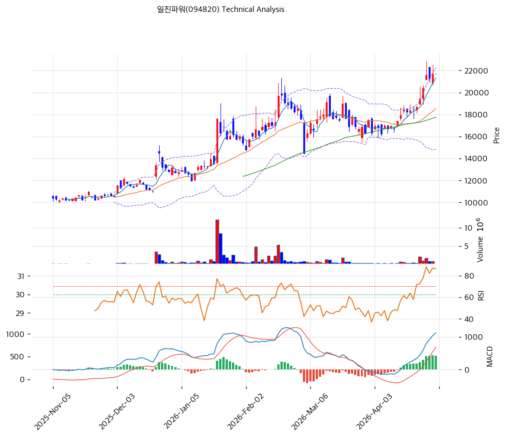

# 일진파워(094820) 기술적 분석

2026-04-30 | T2 Technical Analysis

---

## 차트

---

## 1. 가격 현황

| 항목 | 값 |
|------|-----|
| 현재가 | 21,700원 (+0.00%) |
| 52주 고가 | 21,700원 |
| 52주 저가 | 8,790원 |
| 52주 범위 위치 | 100.0% |
| 거래량 | 20일 평균 대비 0.00x |

---

## 2. 차트 패턴 분석

### 2.1 캔들스틱 패턴

| 패턴 | 위치 | 신뢰도 | 해석 |
|------|------|--------|------|
| 고가권 소형 캔들 | 최근 2~3거래일, 21,500~22,000원대 | 중 | 급등 이후 52주 신고가 부근에서 몸통이 작아지며 단기 숨고르기 가능성을 시사한다. |
| 특이 패턴 없음 | 최근 캔들 | 약 | 명확한 장악형·도지·샛별/석별 패턴은 확인되지 않아 캔들 단독 신호는 중립에 가깝다. |

※ 주요 캔들 패턴: 망치형, 역망치형, 장악형(상승/하락), 도지, 샛별/석별, 적삼병/흑삼병, 하라미, 유성형, 교수형 등

### 2.2 가격 구조 패턴

- **상승 채널/추세 지속** (신뢰도: 중)
  2025년 11월 저점권 이후 저점과 고점이 함께 높아지는 상승 구조가 유지되고 있다. JSON 기준 추세선 지지는 15,124원, 추세선 저항은 23,410원이며 현재가는 채널 상단부에 근접해 추가 상승 여지는 있으나 단기 과열 부담도 커진 위치다.

- **박스권 상단 돌파 후 신고가 테스트** (신뢰도: 중)
  2026년 3월~4월 초 16,000~18,000원대에서 횡보한 뒤 18,000~19,500원 저항대를 상향 돌파했다. 현재가는 52주 고가 21,700원과 피봇 가격이 겹친 구간으로, 거래량을 동반한 22,000원대 안착 여부가 돌파 지속의 핵심 조건이다.

### 2.3 다이버전스

- **RSI 다이버전스 없음** (신뢰도: 중)
  가격이 52주 신고가에 도달하는 동안 RSI도 71.0까지 상승해 가격과 지표가 같은 방향으로 움직였다. 명확한 하락 다이버전스는 아직 아니지만, RSI 과매수권 진입으로 신규 추격 매수의 기대수익은 낮아진 상태다.

- **MACD 모멘텀 둔화 가능성** (신뢰도: 약)
  MACD는 1,128로 Signal 708을 상회하는 매수 구간이며 Histogram도 +420으로 양수다. 다만 JSON상 Histogram 확대가 False로 표시되어 상승 모멘텀은 유지되지만 가속도는 둔화될 수 있다.

※ RSI·MACD 기반 | 상승 다이버전스 = 가격↓ 지표↑ (반등 시사), 하락 다이버전스 = 가격↑ 지표↓ (하락 시사), 히든 다이버전스 = 기존 추세 지속 시사

### 2.4 패턴 종합 판단

차트 구조는 상승 추세와 박스권 상단 돌파가 확인되는 강세형이지만, 현재가가 52주 고가·피봇·단기 PRZ가 겹치는 21,700원 부근에 있어 단기 저항/지지 전환 확인이 필요하다. RSI 과매수와 스토캐스틱 데드크로스는 속도 조절 신호이며, MACD 매수 구간과 이동평균 정배열은 중기 추세가 아직 훼손되지 않았음을 시사한다.

---

## 3. 이동평균선 — 정배열 (강세)

| MA | 값 | 현재가 괴리율 | 위치 |
|----|-----|--------------|------|
| MA5 | 21,330원 | +1.7% | 위 |
| MA20 | 18,550원 | +17.0% | 위 |
| MA60 | 17,758원 | +22.2% | 위 |
| MA120 | 15,066원 | +44.0% | 위 |
| MA200 | 13,371원 | +62.3% | 위 |

**해석**: MA5 > MA20 > MA60 > MA120 > MA200의 정배열이며 현재가가 모든 주요 이동평균선 위에 있다. 추세 자체는 강세이나 MA20 대비 +17.0%, MA200 대비 +62.3%까지 벌어져 단기 과열과 이격 조정 가능성을 함께 고려해야 한다.

---

## 4. 보조 지표

### RSI(14) — 71.0 (🔴과매수)

RSI가 70선을 넘어 과매수권에 진입해 상승 추세는 강하지만 단기 추격 매수 부담이 커진 구간이다. 다이버전스 해석은 2.3 참조.

### MACD(12,26,9)

| 항목 | 값 |
|------|-----|
| MACD | 1,128.0 |
| Signal | 708.0 |
| Histogram | +420.0 |
| 크로스 상태 | 매수 구간 (수축 중) |

**해석**: MACD는 매수 구간을 유지하고 있으나 Histogram 확대가 멈춘 상태로, 상승 모멘텀은 유효하지만 단기 탄력은 둔화될 수 있다. 다이버전스 해석은 2.3 참조.

### 볼린저밴드(20, 2σ)

| 항목 | 값 |
|------|-----|
| 상단 | 22,253원 |
| 중단 (MA20) | 18,550원 |
| 하단 | 14,847원 |
| 밴드 폭 | 39.9% |
| 현재 위치 | 중간 |

**해석**: 밴드 폭이 39.9%로 넓은 편이어서 변동성 확장 국면이다. 현재가는 상단 22,253원에 근접해 있어 상단 돌파 시 추세 연장, 실패 시 MA5~MA20 방향의 되돌림 가능성이 커진다.

### 스토캐스틱(14, 3, 3)

| 항목 | 값 |
|------|-----|
| Slow %K | 79.4 |
| Slow %D | 80.6 |
| 크로스 상태 | 데드크로스 |
| 판단 | 중립 |

---

## 5. 지지/저항 — 추세선 · 피보나치 · PRZ 통합

### 5.1 피보나치 되돌림/확장

| 구분 | 비율 | 가격 | 현재가 대비 |
|------|------|------|-----------|
| Swing High | — | 22,900원 | +5.5% |
| 되돌림 | 0.236 | 19,520원 | -10.0% |
| 되돌림 | 0.382 | 17,430원 | -19.7% |
| 되돌림 | 0.5 | 15,740원 | -27.5% |
| 되돌림 | 0.618 | 14,050원 | -35.3% |
| 되돌림 | 0.786 | 11,644원 | -46.3% |
| Swing Low | — | 8,580원 | -60.5% |
| 확장 | 1.272 | 26,795원 | +23.5% |
| 확장 | 1.382 | 28,370원 | +30.7% |
| 확장 | 1.618 | 31,750원 | +46.3% |
| 확장 | 2.0 | 37,220원 | +71.5% |

※ 피보나치 기준: 상승 추세 (Swing Low 8,580원 → Swing High 22,900원)  
※ 되돌림 = 직전 추세에서 되돌아온 비율, 확장 = 추세 방향 목표가

### 5.2 추세선

| 추세선 | 방향 | 현재 교차가 | 포인트 수 | 해석 |
|--------|------|-----------|---------|------|
| 지지선 | 상승 | 15,124원 | 6개 | 중기 상승 추세의 하단 지지선으로, MA120 부근과도 가까워 추세 훼손 판단의 후행 기준이다. |
| 저항선 | 상승 | 23,410원 | 6개 | 상승 채널 상단 후보이며, 현재가 대비 +7.9% 위치라 단기 목표/저항대로 볼 수 있다. |

### 5.3 PRZ (Potential Reversal Zone)

| 방향 | 가격 범위 | 신뢰도 | 근거 |
|------|---------|--------|------|
| 지지 | 21,330~21,700원 | 강 | MA5 + 피봇 R1/R2 + 피봇 S1/S2가 겹치는 단기 핵심 지지/저항 전환 구간 |
| 지지 | 17,430~17,758원 | 약 | 피보나치 0.382 되돌림 + MA60이 겹치는 중기 되돌림 지지 후보 |

※ PRZ = 추세선 · 피보나치 · 피봇 · MA 등 복수 지표가 겹치는 가격 구간. 겹치는 소스가 많을수록 반전 확률 상승.

### 5.4 종합 지지/저항 테이블

| 구분 | 가격 | 근거 |
|------|------|------|
| 저항 | 23,410원 | 상승 추세선 저항 |
| 저항 | 22,253원 | 볼린저밴드 상단 |
| 저항 | 21,700원 | 52주 고가 / 피봇 R1 |
| **현재가** | **21,700원** | — |
| 지지 | 21,626원 | PRZ(강) — MA5, 피봇 R1/R2/S1/S2 |
| 지지 | 19,520원 | 피보나치 0.236 되돌림 |
| 지지 | 18,550원 | MA20 |
| 지지 | 17,758원 | MA60 |
| 지지 | 17,594원 | PRZ(약) — 피보나치 0.382 되돌림, MA60 |

---

## 6. 시그널 종합

| 지표 | 내용 | 시그널 |
|------|------|--------|
| **차트 패턴** | 상승 채널과 박스권 돌파는 긍정적이나 신고가 부근 소형 캔들과 과매수 신호가 혼재 | ⚪ |
| 이동평균선 | 정배열, MA20 +17.0% | 🟢 |
| RSI | 71.0 — 과매수 🔴 | 🔴 |
| MACD | 매수구간 | ⚪ |
| 볼린저밴드 | 중간, 밴드 폭 39.9% | ⚪ |
| 스토캐스틱 | 데드크로스, K=79.4 | ⚪ |
| 거래량 | 0.0x — 약함 | ⚪ |

**종합 판단**: 🟢 매수 1개 / 🔴 매도 1개 / ⚪ 중립 5개 → **중립**

가격 구조와 이동평균 배열은 강세지만 RSI 과매수, 스토캐스틱 데드크로스, 거래량 약세가 단기 추격 매수의 신뢰도를 낮춘다. 21,330~21,700원 단기 PRZ를 지지로 확인하면 추세 지속 가능성이 열리지만, 해당 구간 이탈 시 19,520원 및 18,550원까지 되돌림을 염두에 둬야 한다.

---

## 7. 전략 제안

### 보유 중인 경우
- **홀드**
- 익절 라인: 22,134원 (전략 데이터상 TP, 볼린저밴드 상단 22,253원 근접 구간)
- 손절 라인: 21,700원 (전략 데이터상 SL, 현재가와 동일하므로 종가 기준 이탈 확인 필요)
- 리스크/리워드: 산출 곤란 (현재가와 손절선이 동일해 공식 손익비 계산 불가; 실전 기준으로는 21,330원 MA5/PRZ 하단 이탈 여부를 보조 확인)

### 진입 대기인 경우
- **관망**
- 1차 진입가: 21,700원 (전략 데이터상 1차 진입가이나 현재가와 동일, 신고가 안착 확인 필요)
- 2차 진입가: 18,550원 (MA20 및 중기 되돌림 대기 구간)
- 진입 조건: 22,000원대 안착과 볼린저밴드 상단 돌파 시 거래량 회복이 동반되거나, 21,330~21,700원 PRZ를 지지로 확인한 뒤 재상승할 때 분할 접근이 유리하다.
