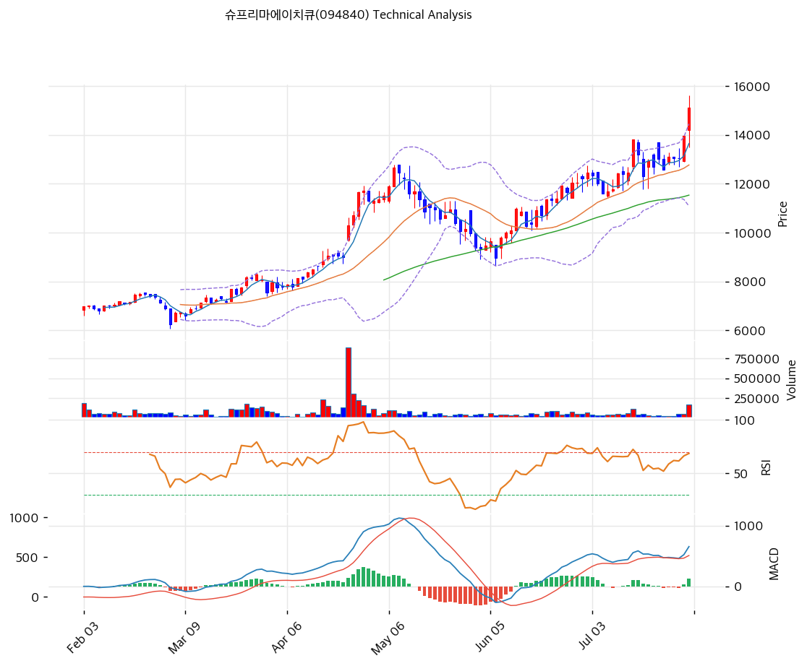

# 슈프리마에이치큐(094840) 기술적 분석

2026-08-02 | T2 Technical Analysis

---

## 차트

---

## 1. 가격 현황

| 항목 | 값 |
|------|-----|
| 현재가 | 15,100원 (+8.17%) |
| 52주 고가 | 15,100원 (2026-07-31, 종가 기준 = 당일 신고가) |
| 52주 저가 | 5,930원 (2025-11-07) |
| 52주 범위 위치 | **100.0%** |
| 장중 52주 고가 | 15,600원 (2026-07-31, 당일) |
| 장중 52주 저가 | 5,810원 (2025-11-07) |
| 거래량 | 169,462주 — 20일 평균 대비 **3.94x** |
| 거래대금 (당일) | 약 25.6억원 |
| **9개월 상승률** | **+156.8%** (2025-11-07 5,879원 → 15,100원) |
| 2거래일 상승률 | **+15.9%** (7/29 종가 13,030원 → 15,100원) |
| 외국인 20일 순매수 | 179,790주 (약 23.5억원, 발행주식의 1.83%) |

> ⚠️ **KIS 52주 필드 오류**: KIS가 반환한 52주 고 15,600 / 저 13,500은 각각 당일 장중 고가와 최근 며칠 범위에 불과하다. 위 표는 yfinance 일봉 원본에서 직접 산출했다.

**당일 종가·장중가 모두 52주 신고가다.** 9개월 만에 +156.8%, 최근 2거래일에만 +15.9%가 나왔다. 이 종목의 기술적 분석은 **"신고가 돌파 국면의 과열을 어떻게 다룰 것인가"** 하나로 압축된다.

---

## 2. 차트 패턴 분석

### 2.1 캔들스틱 패턴

| 패턴 | 위치 | 신뢰도 | 해석 |
|------|------|--------|------|
| 장대양봉 + 갭 상승 | **2026-07-31** | **강** | 시가 14,200(전일 종가 13,960 대비 +1.7% 갭업) → 고가 15,600 → 종가 15,100. 실체 900원(+6.3%), 위꼬리 500원·아래꼬리 700원. **거래량 3.94x(25.6억원)를 동반한 신고가 돌파봉** |
| 상승 마루보즈(하단) | 2026-07-30 | 강 | 시가 12,920 = 저가 12,900, 아래꼬리 없이 13,960원 마감(+7.1%). 장중 한 번도 시가 아래로 내려가지 않았다 |
| 적이병 (2연속 장대양봉) | 2026-07-30\~31 | **강** | 이틀 연속 7%대 상승으로 **+15.9%**. 2주간의 12,300\~13,190원 횡보를 단숨에 돌파했다 |
| 도지형 | 2026-07-29 | 중 | 시가 13,050 / 종가 13,030, 실체 20원. 2주 조정의 마지막 균형점이었고 다음 날 방향이 정해졌다 |

**7월 31일 봉의 성격**: 갭업 시작 → 장중 고가 15,600 → 종가 15,100(고가 대비 -3.2%)로 마감했다. 위꼬리 500원은 15,500원대에서 차익 실현 매물이 나왔다는 뜻이지만, **종가가 실체 상단 부근을 지켰고 거래량이 평소의 4배였다**는 점에서 매수 우위가 유지된 봉이다.

### 2.2 가격 구조 패턴

- **9개월 대세 상승 추세 — 3단 상승의 3파** (신뢰도: 강)
  2025년 11월 7일 저점 5,879원에서 시작된 상승은 세 단계로 나뉜다. ① 2025년 11월\~2026년 3월: 5,879 → 9,000원대(밸류업 예고·자사주 소각), ② 2026년 4\~6월: 9,000 → 12,000원대(기업가치 제고 계획 공시·자사주 신탁 80억), ③ 2026년 7월: 12,000 → 15,100원(분기배당 결정·임시주총 소집). **각 상승 구간이 공시 이벤트와 정확히 대응한다.** MA200(8,484원)이 아래에서 꾸준히 따라 올라오며 추세를 지지하고 있다.

- **2주 박스권 상단 돌파 완료** (신뢰도: 강)
  7월 16일\~7월 29일 **12,300\~13,190원** 박스에서 10거래일간 횡보했다. 7월 15일 13,810원(장중 13,820)까지 급등했다가 되밀린 뒤의 매물 소화 과정이었다. 7월 30\~31일 거래량을 동반해 상단을 명확히 돌파했으며, **박스 폭 890원을 더한 1차 목표가는 14,080원으로 이미 통과**했다. 다음 기준점은 심리적 저항인 16,000원이다.

- **신고가 국면 — 위쪽에 매물대가 없다** (신뢰도: 강)
  종가·장중가 모두 52주 최고치이므로 **위쪽에 이전 매수자의 손실 물량(매물대)이 존재하지 않는다.** 기술적 저항으로 남은 것은 피봇 R1(15,967원)·R2(16,833원)와 심리적 라운드 넘버뿐이다. 이는 상승 시 저항이 약하다는 뜻인 동시에, **하락 시 지지도 없다**는 뜻이다.

### 2.3 다이버전스

- **RSI 약한 하락 다이버전스** (신뢰도: 약)
  가격은 7월 15일 종가 13,810원 → 7월 31일 15,100원으로 **+9.3% 상승**했으나, RSI는 74.4 → 71.7로 **2.7포인트 낮아졌다.** 형식상 하락 다이버전스이나 격차가 미미하고 두 값 모두 70을 넘는 과매수 구간이라, **추세 전환 신호로 읽기에는 근거가 약하다.**

- **MACD 다이버전스 없음 — 오히려 동행 강화** (신뢰도: 강)
  같은 기간 MACD는 576 → **666으로 +15.6% 상승**해 가격과 나란히 움직였다. 히스토그램은 7월 29일 -25 → 7월 30일 +28 → 7월 31일 **+128**로 3거래일 만에 부호가 바뀌고 급확대됐다. **모멘텀이 가격을 뒷받침하고 있으며, 이는 앞의 RSI 다이버전스를 무력화하는 신호다.**

### 2.4 패턴 종합 판단

**추세는 명백히 상방이고, 문제는 오직 과열이다.** 캔들(2연속 장대양봉 + 거래량 3.94x), 구조(2주 박스 돌파 + 신고가), 모멘텀(MACD 히스토그램 3일 만에 +128 전환) 세 가지가 모두 같은 방향을 가리킨다. RSI 다이버전스는 격차가 2.7포인트로 미미해 반대 근거가 되지 못한다.

**그러나 이 상승에는 명확한 캘린더 배경이 있다.** 2026년 8월 11일 임시주주총회에서 **자본준비금 100억원 감액 및 이익잉여금 전입** 안건이 표결되고, 전자투표 기간은 **8월 1일\~8월 10일**이다. 7월 31일은 전자투표 개시 하루 전이며, 거래량 3.94x와 외국인 순매수 54,016주가 이 일정을 앞두고 나왔다.

**즉 현재 국면은 "이벤트 직전 선취매"의 성격이 강하다.** 임시주총이 통과되면 재료가 확정되지만, **확정과 동시에 재료가 소진되는(sell the news) 구조**이기도 하다. 최대주주 등 지분이 52.22%라 안건 통과는 사실상 확정적이므로, **8월 11일 이후의 가격 흐름이 이번 상승의 성격을 판정한다.**

---

## 3. 이동평균선 — 정배열 (강세, 단 극단적 과열)

| MA | 값 | 현재가 괴리율 | 위치 |
|----|-----|--------------|------|
| MA5 | 13,642원 | **+10.7%** | 위 |
| MA20 | 12,764원 | **+18.3%** | 위 |
| MA60 | 11,531원 | **+31.0%** | 위 |
| MA120 | 9,796원 | **+54.1%** | 위 |
| MA200 | 8,484원 | **+78.0%** | 위 |

**해석**: MA5 > MA20 > MA60 > MA120 > MA200의 완전 정배열이며 모든 이평선이 우상향한다. 추세의 건강성만 보면 이보다 좋을 수 없다.

**문제는 괴리율의 절대 크기다.**

- **MA20 대비 +18.3%** — 통상 +15%를 넘으면 단기 과열로 본다. 이 종목의 20일 평균 변동성을 감안해도 되돌림 압력이 쌓인 수준이다
- **MA200 대비 +78.0%** — 9개월간의 상승분이 장기 이평에 아직 절반도 반영되지 않았다는 뜻이다. 추세 초입이라는 긍정적 해석과, **깊은 조정 시 낙폭이 클 수 있다**는 부정적 해석이 동시에 성립한다
- **MA5 대비 +10.7%** — 이틀 만에 벌어진 괴리다. 단기 이격 조정만으로도 13,600원대까지 되돌릴 수 있다

**MA20(12,764원)이 실질적 추세 방어선**이다. 이 선을 종가로 이탈하면 2주 박스 하단(12,300원)까지 열리며, 그 경우 이번 돌파는 실패로 판정된다.

---

## 4. 보조 지표

### RSI(14) — 71.6 🔴 과매수

**과매수 구간에 진입했다.** 다만 RSI 70 돌파가 곧 하락을 뜻하지는 않는다 — 강한 추세장에서는 RSI가 70\~85 구간에서 수 주간 머물며 가격이 계속 오르는 경우가 흔하다. 실제로 이 종목은 7월 15일에도 RSI 74.4를 기록했고, 이후 2주 조정을 거쳐 다시 신고가를 냈다.

**경계 기준은 RSI 80이다.** 현재 71.6에서 80까지는 약 16,500\~17,000원 구간에 대응한다. 그 위에서는 되돌림 확률이 급격히 높아진다.

### MACD(12,26,9)

| 항목 | 값 |
|------|-----|
| MACD | 666 |
| Signal | 538 |
| Histogram | **+128** |
| 크로스 상태 | **매수 구간 (급확대 중)** |

**해석**: 히스토그램이 7월 24\~29일 -18~-27의 음수권에 머물다가 7월 30일 +28, 7월 31일 **+128**로 급전환했다. 이틀 만에 155포인트가 움직인 것으로, **모멘텀 전환의 강도가 매우 크다.**

MACD 본선 666은 7월 15일 고점(576)을 **15.6% 상회**해 가격 신고가와 동행한다. **다이버전스가 없는 신고가는 추세 지속 확률이 높다.** 다만 히스토그램이 +128까지 급확대된 상태는 단기 과열이므로, 축소 전환 시점을 지켜봐야 한다.

### 볼린저밴드(20, 2σ)

| 항목 | 값 |
|------|-----|
| 상단 | 14,446원 |
| 중단 (MA20) | 12,764원 |
| 하단 | 11,083원 |
| 밴드 폭 | **26.3%** |
| 현재 위치 | **상단 이탈 (+4.5%)** |

**해석**: 종가 15,100원이 상단 밴드 14,446원을 **654원(4.5%)이나 상회**했다. 볼린저 상단을 4% 넘게 이탈하는 것은 통계적으로 드문 사건(2σ 초과)이며, 두 가지 중 하나다 — **밴드 워킹(강한 추세 확장)** 또는 **단기 과열의 정점**.

**밴드 폭 26.3%는 매우 넓다.** KOSPI/KOSDAQ 평균(8\~12%)의 2배 이상으로, 이미 변동성이 크게 확장된 상태다. 스퀴즈 후 확장이 아니라 **확장의 후반부**에 있을 가능성이 높으며, 이는 상단 이탈의 지속성을 낮추는 요인이다.

향후 2\~3거래일 종가가 14,446원 위에 머물면 밴드 워킹, 하루 만에 밴드 안으로 되돌아오면 과열 신호로 판정한다.

### 스토캐스틱(14, 3, 3)

| 항목 | 값 |
|------|-----|
| Slow %K | **83.4** |
| Slow %D | 75.5 |
| 크로스 상태 | 골든크로스 |
| 판단 | 🔴 **과매수** |

%K 83.4로 과매수 기준선(80)을 넘었다. 골든크로스 상태이므로 방향은 위지만, **80 이상에서의 골든크로스는 상승 여력보다 반전 위험을 먼저 봐야 하는 구간**이다. %K가 80 아래로 데드크로스를 내면 단기 조정 신호다.

---

## 5. 지지/저항 — 추세선 · 피보나치 · PRZ 통합

### 5.1 피보나치 — ⚠️ 산출값 무효

| 구분 | 비율 | 가격 | 현재가 대비 |
|------|------|------|-----------|
| Swing High | — | 12,660원 | **-16.2%** |
| Swing Low | — | 8,960원 | -40.7% |
| 되돌림 0.618 | 0.618 | 11,247원 | -25.5% |
| 확장 1.272 | 1.272 | **7,954원** | **-47.3%** |
| 확장 2.0 | 2.0 | **5,260원** | **-65.2%** |

> 🚨 **파이프라인 피보나치 산출값을 사용하지 않는다.**
> 알고리즘이 이 종목의 스윙을 **하락 추세(High 12,660 → Low 8,960)**로 인식했다. 그 결과 확장 레벨이 7,954원·5,260원 등 **현재가(15,100원)보다 47\~65% 낮은 값**으로 산출됐다. 현재가는 알고리즘이 잡은 Swing High를 이미 **19.3% 상회**한 상태이므로 되돌림·확장 레벨 전체가 의미를 잃었다.
> **대안**: 실제 상승 스윙(2025-11-07 저점 5,879원 → 2026-07-31 고점 15,100원, 상승폭 9,221원)을 기준으로 되돌림을 재산출하면 다음과 같다.

| 되돌림 비율 | 가격 | 현재가 대비 | 겹치는 지표 |
|------|------|-----------|------|
| 0.236 | 12,924원 | -14.4% | **MA20(12,764) 근접** |
| 0.382 | 11,578원 | -23.3% | **MA60(11,531) 근접** |
| 0.5 | 10,490원 | -30.5% | — |
| 0.618 | 9,402원 | -37.7% | **MA120(9,796) 근접** |

**재산출 결과가 이동평균선과 정확히 겹친다는 점이 중요하다.** 0.236 되돌림 ≈ MA20, 0.382 ≈ MA60, 0.618 ≈ MA120이다. 조정이 오면 이 세 구간이 순차적 방어선이 된다.

### 5.2 추세선

| 추세선 | 방향 | 현재 교차가 | 포인트 수 | 해석 |
|--------|------|-----------|---------|------|
| 지지선 | 상승 (일 +3.92원) | 7,546원 | 6개 | 현재가 대비 **-50.0%**. 9개월 급등으로 추세선과의 거리가 극단적으로 벌어져 **실용적 지지선이 아니다** |
| 저항선 | 상승 (일 +22.96원) | 12,679원 | 6개 | 현재가 대비 **-16.0%**. **이미 돌파했으므로 저항이 아니라 지지로 역할이 전환**됐다. MA20(12,764원)과 85원 차이로 겹친다 |

**저항선이 지지로 전환(Role Reversal)됐다는 점이 이번 국면의 기술적 핵심**이다. 12,679\~12,764원 구간에 상승 추세선·MA20·피봇 S2(12,633원)가 밀집해 강한 방어대를 형성한다.

### 5.3 PRZ (Potential Reversal Zone)

| 방향 | 가격 범위 | 신뢰도 | 근거 |
|------|---------|--------|------|
| 지지 | 13,642\~13,867원 | 약 | MA5(13,642) + 피봇 S1(13,867) — 1차 이격 조정 목표 |
| **지지** | **12,633\~12,764원** | **중** | 피봇 S2(12,633) + **상승 추세선(12,679)** + MA20(12,764) — **3개 소스 중첩. 실질 방어선** |
| 지지 | 11,247\~11,531원 | 약 | 피보나치 0.618 되돌림(구 산출) + MA60(11,531) |
| **저항** | **—** | — | **신고가 국면이라 PRZ 저항 구간이 존재하지 않는다** |

※ 저항 PRZ가 하나도 산출되지 않은 것은 오류가 아니라 **종가·장중가 모두 52주 신고가**이기 때문이다. 위쪽에 복수 지표가 겹치는 구간이 없다.

### 5.4 종합 지지/저항 테이블

| 구분 | 가격 | 근거 |
|------|------|------|
| 참고 목표 | **24,079원** | **주당 NAV (T3 참조) — 기술적 저항이 아닌 펀더멘털 기준선** |
| 저항 | 17,000원 | 심리적 라운드 넘버 |
| 저항 | 16,833원 | 피봇 R2 |
| 저항 | 16,000원 | 심리적 라운드 넘버 |
| 저항 | **15,967원** | **피봇 R1 — 가장 임박한 저항 (+5.7%)** |
| 저항 | 15,600원 | 당일 장중 고가 (+3.3%) |
| **현재가** | **15,100원** | **종가·장중 52주 신고가** |
| 지지 | 14,733원 | 피봇 Pivot |
| 지지 | 14,446원 | 볼린저 상단 (돌파 후 지지 전환 여부 확인 필요) |
| 지지 | **13,754원** | **PRZ(약)** — MA5 + 피봇 S1 |
| 지지 | 13,190원 | 직전 박스 상단 (2026-07-16) |
| 지지 | **12,692원** | **PRZ(중)** — 피봇 S2 + 상승 추세선 + MA20 |
| 지지 | 12,300원 | 직전 박스 하단 (2026-07-20) |
| 지지 | 11,531원 | MA60 |
| 지지 | 9,796원 | MA120 |
| 지지 | 8,484원 | MA200 |

**가격대 밀집도**: 아래쪽 12,633\~12,764원의 131원 구간에 **3개 지표(피봇 S2·상승 추세선·MA20)**가 몰려 있고, 직전 박스 상단(13,190원)·하단(12,300원)이 그 위아래를 감싼다. **12,300\~13,190원 구간이 이번 상승의 되돌림 최대 예상 범위**이며, 이 구간을 종가로 이탈하면 추세 훼손으로 판정한다.

위쪽은 15,967원(피봇 R1) 외에 기술적 저항이 없다. **신고가 종목의 상단은 기술적 지표가 아니라 펀더멘털(NAV 24,079원)과 이벤트 일정으로 판단해야 한다.**

---

## 6. 시그널 종합

| 지표 | 내용 | 시그널 |
|------|------|--------|
| **차트 패턴** | 2연속 장대양봉, 2주 박스 상단 돌파, 신고가 | 🟢 |
| 이동평균선 | 완전 정배열, 단 **MA20 +18.3% / MA200 +78.0%** 극단 괴리 | 🟢 |
| RSI | **71.6 — 🔴 과매수** | 🔴 |
| MACD | 매수 구간, 히스토그램 -25 → +128 급확대, 다이버전스 없음 | 🟢 |
| 볼린저밴드 | 상단 **4.5% 이탈**, 밴드 폭 26.3%(확장 후반) | ⚪ |
| 스토캐스틱 | 골든크로스, **%K 83.4 — 🔴 과매수** | 🔴 |
| 거래량 | **3.94x — 강력 동반** (외국인 54,016주 순매수) | 🟢 |

**종합 판단**: 🟢 매수 4개 / 🔴 매도 2개 / ⚪ 중립 1개 → **매수우위 (⚠️ 과열 경고)**

**종합 해석**: 추세 지표(이평선·MACD·거래량·패턴)는 전부 매수를 가리키고, 매도 신호 2개는 모두 **과열 지표(RSI 71.6, 스토캐스틱 83.4)**다. 즉 "방향은 맞는데 속도가 빠르다"는 것이 시장이 보내는 신호다.

**핵심 변수는 2026년 8월 11일 임시주주총회다.** 자본준비금 100억원 감액 안건이 표결되며 전자투표는 **8월 1일\~10일**이다. 최대주주 등 지분 52.22%로 통과는 사실상 확정적이므로, 문제는 통과 여부가 아니라 **통과 이후의 수급**이다.

두 가지 시나리오가 가능하다. ① **재료 확정 후 추가 상승** — 비과세 배당 재원이 확보되면 배당 정책의 신뢰도가 높아지고, NAV 대비 37.3% 할인이 좁혀지는 재평가가 이어진다. ② **Sell the news** — 3주간 선취매한 물량이 안건 통과 직후 차익 실현으로 나온다. **RSI 71.6·볼린저 상단 4.5% 이탈·MA200 대비 +78%라는 현 위치는 ②의 위험을 무시할 수 없게 만든다.**

---

## 7. 전략 제안

### 보유 중인 경우

- **홀드 (일부 익절 병행)**
- 익절 라인 1차: **15,600원** (당일 장중 고가, +3.3%) → 돌파 실패 시 보유분 20\~30% 정리
- 익절 라인 2차: **15,967원** (피봇 R1, +5.7%) → 추가 20\~30% 정리 권장
- 익절 라인 3차: **16,833원** (피봇 R2, +11.5%) / **17,000원**(심리선)
- 손절 라인: **12,692원** (PRZ 중 — 피봇 S2 + 상승 추세선 + MA20, **-15.9%**). 이 구간 종가 이탈 시 2주 박스 돌파가 실패한 것으로 본다
- 리스크/리워드: 2차 익절 기준 **0.36 : 1** (익절 폭 867원 / 손절 폭 2,408원) — **불리하다.** 현재가에서의 신규 매수는 손익비 측면에서 권하지 않으며, **기보유자의 단계적 익절이 합리적**이다
- 중간 방어선: **13,754원**(PRZ 약, MA5 + 피봇 S1)을 종가로 이탈하면 이격 조정 국면 진입으로 보고 비중을 3분의 1 줄일 것
- **이벤트 대응**: 8월 11일 임시주총 결과 확인 후 대응. 안건 통과 + 거래량 유지 시 홀드, 통과 후 거래량 급감 시 비중 축소

### 진입 대기인 경우

- **관망 (조정 대기)**
- 1차 진입가: **13,754원** (PRZ 약 — MA5 + 피봇 S1, **-8.9%**)
- 2차 진입가: **13,190원** (직전 박스 상단, -12.6%)
- 3차 진입가: **12,692원** (PRZ 중 — MA20 + 상승 추세선 + 피봇 S2, **-15.9%**) — **가장 매력적인 분할 진입 구간**
- 최후 매수 구간: **11,531원** (MA60, -23.6%)
- 진입 조건:
  - ① 조정 시 **거래량이 20일 평균 이하로 줄면서** 위 구간에 닿을 것. 거래량을 동반한 급락은 추세 훼손 신호이므로 진입 금지
  - ② 또는 **15,967원(피봇 R1)을 거래량 3x 이상 동반해 종가로 돌파**할 경우 추격 매수. 이 경우 손절은 14,446원(볼린저 상단) 종가 이탈
  - ③ **8월 11일 임시주총 결과 확인 후** 진입하는 것이 이벤트 리스크를 피하는 가장 안전한 순서다
- **비중**: 20일 평균 거래대금이 약 5\~6억원(당일 25.6억원은 예외적)으로 중소형주 치고도 얇은 편이다. 지정가 분할 주문을 원칙으로 하고, 단일 종목 비중을 평소보다 낮게 가져갈 것

### 과열 관리 체크리스트

- ⚠️ **RSI 80 도달 시**(약 16,500\~17,000원 대응) 보유분 절반 이상 정리 검토
- ⚠️ **볼린저 상단(14,446원) 아래로 종가 복귀** 시 밴드 워킹 실패 — 단기 조정 신호
- ⚠️ **MACD 히스토그램 축소 전환** (+128에서 감소 시작) — 모멘텀 둔화 1차 경보
- ⚠️ **8월 11일 임시주총 이후 거래량 급감** — 재료 소진 신호. 3주간 선취매 물량의 출회 가능성
- ⚠️ **외국인 순매수 전환** — 20일 순매수 179,790주(23.5억)가 순매도로 돌아서면 상승 동력의 핵심이 빠진다
