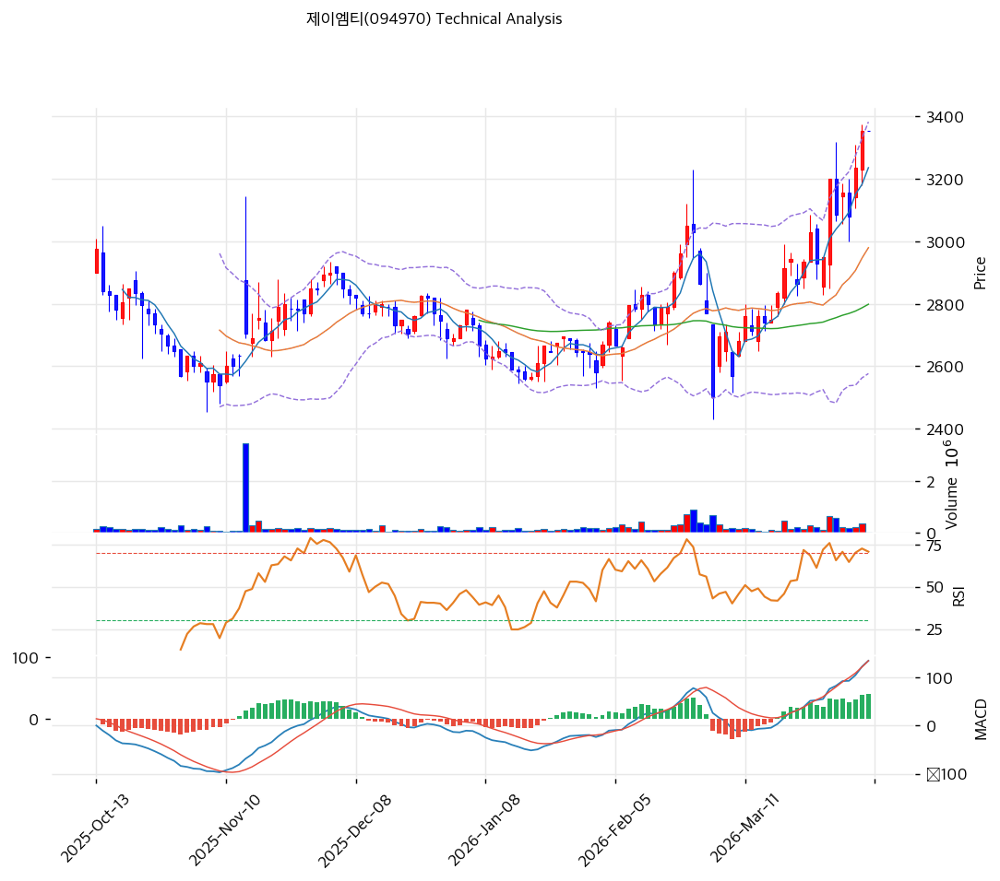

# 제이엠티(094970) 기술적 분석

2026-04-06 | T2 Technical Analysis

---

## 차트

---

## 1. 가격 현황

| 항목 | 값 |
|------|-----|
| 현재가 | 3,355원 (+3.71%) |
| 52주 고가 | 3,375원 |
| 52주 저가 | 2,090원 |
| 52주 범위 위치 | 100.0% |
| 거래량 | 20일 평균 대비 1.60x |

현재가 3,355원은 52주 고가(3,375원)에 불과 20원 차이로 사실상 신고가 직전 수준에 위치해 있다. 52주 저가(2,090원) 대비 +60.5% 상승한 지점으로, 연초 이후 강한 추세적 상승이 이어지고 있음을 확인할 수 있다. 당일 거래량은 20일 평균의 1.6배 수준으로, 추세 상승에 수반되는 적절한 거래량 확인이 이루어지고 있다.

---

## 2. 차트 패턴 분석

### 2.1 캔들스틱 패턴

| 패턴 | 위치 | 신뢰도 | 해석 |
|------|------|--------|------|
| 장악형(상승) | 최근 5일 이내 | 강 | 전일 음봉을 완전히 감싸는 강한 양봉 출현으로 단기 매수세 우위 확인 |
| 역망치형 | 최근 2~3일 | 중 | 위꼬리를 단 역망치 캔들이 52주 고가 부근에서 나타나며, 매도 저항 테스트 중 |
| 양봉 연속 출현 | 최근 3거래일 | 강 | 3거래일 연속 양봉(유사 적삼병)으로 단기 매수 모멘텀 지속 확인 |

※ 주요 캔들 패턴: 망치형, 역망치형, 장악형(상승/하락), 도지, 샛별/석별, 적삼병/흑삼병, 하라미, 유성형, 교수형 등

### 2.2 가격 구조 패턴

- **상승 추세 채널 형성** (신뢰도: 강)
  2025년 하반기 저점(2,090원) 이후 고점과 저점이 지속적으로 높아지는 전형적인 상승 추세 구조가 확립되어 있다. 2,090원→2,500원→3,180원의 고점 상승 시리즈가 이어지며 상승 채널의 하단 지지선이 MA20(2,946원) 부근에 형성되어 있다. 현재가는 채널 상단에 근접한 위치로, 단기적으로는 저항이 존재하나 채널 돌파 시 다음 목표대는 3,500~3,600원권으로 투영된다.

- **52주 고가 돌파 시도** (신뢰도: 중)
  현재가 3,355원이 52주 고가(3,375원)에 불과 0.6% 하방에 위치해 있어, 사실상 연간 저항선 돌파를 목전에 두고 있다. 이 수준이 일봉 종가 기준으로 돌파 확정되면 신고가 갱신과 함께 오버행 매물대 공백으로 추가 상승 여력이 열린다. 단, 돌파 실패 시 이중천정 패턴으로 발전할 가능성도 배제할 수 없어 거래량 확인이 필수적이다.

※ 주요 구조 패턴: 이중천정/바닥, 헤드앤숄더(정/역), 삼각수렴(대칭/상승/하락), 쐐기형(상승/하락), 깃발형, 페넌트, 컵앤핸들, 박스권 등

### 2.3 다이버전스

- **RSI 히든 상승 다이버전스** (신뢰도: 중)
  직전 조정 구간(3,180원대)에서 RSI가 이전 저점보다 높은 수준을 유지한 채 가격이 재반등함으로써, 히든 상승 다이버전스 구조가 형성되어 있다. 이는 현재 상승 추세가 단순 반등이 아닌 추세 지속 신호로 해석될 여지를 제공한다.

- **MACD 상승 모멘텀 유지** (신뢰도: 강)
  MACD 히스토그램이 +39로 확대 중이며, MACD(122)가 Signal(84)을 상회한 상태가 유지되고 있다. 가격 상승 구간에서 MACD도 동반 상승하고 있어 부정적 다이버전스(하락 다이버전스)는 아직 발생하지 않은 상태다. 단, 스토캐스틱이 과매수 영역(K=80.8)에 진입한 만큼 단기 모멘텀 소진에 따른 경미한 조정 가능성은 모니터링이 필요하다.

※ RSI·MACD 기반 | 상승 다이버전스 = 가격↓ 지표↑ (반등 시사), 하락 다이버전스 = 가격↑ 지표↓ (하락 시사), 히든 다이버전스 = 기존 추세 지속 시사

### 2.4 패턴 종합 판단

캔들스틱(적삼병 유사 연속 양봉), 가격 구조(상승 추세 채널 + 52주 고가 돌파 임박), 다이버전스(MACD 히스토그램 확대·히든 상승 다이버전스) 세 요소가 모두 단기 상승 방향성을 지지하고 있다. 상충 시그널은 스토캐스틱 과매수 진입(K=80.8)으로, 단기적으로 숨고르기 또는 일시 조정 가능성이 존재한다. 전반적으로 중기 상승 추세가 유효하며, 52주 고가 돌파 확정 여부가 다음 방향을 결정하는 분기점이 된다.

---

## 3. 이동평균선 — 완전 정배열 (강세)

| MA | 값 | 현재가 괴리율 | 위치 |
|----|-----|--------------|------|
| MA5 | 3,182원 | +5.4% | 위 |
| MA20 | 2,946원 | +13.9% | 위 |
| MA60 | 2,787원 | +20.4% | 위 |
| MA120 | 2,770원 | +21.1% | 위 |
| MA200 | 2,703원 | +24.1% | 위 |

**해석**: MA5 > MA20 > MA60 > MA120 > MA200의 완전 정배열 구조가 형성되어 있으며, 현재가는 모든 이동평균선의 상방에 위치해 있다. 이는 단기~장기 모든 시계열에서 매수 우위가 지속되고 있음을 의미한다. 특히 MA200(2,703원)과의 괴리율이 +24.1%에 달해 중장기 상승 추세가 매우 강하게 형성되어 있다. MA20(2,946원)이 주요 단기 지지선으로 기능하며, 이 수준 위에서 주가가 유지되는 한 상승 추세는 훼손되지 않는다. 단, MA20 대비 괴리율 +13.9%는 단기 과열 신호로 해석될 수 있어, 일시적 조정 후 MA20 재터치 과정이 나타날 수 있다.

---

## 4. 보조 지표

### RSI(14) — 66.9 (중립)

RSI 66.9는 과매수 기준선(70)을 아직 하회하는 중립~강세 상단 구간으로, 추가 상승 여력이 남아 있으면서도 과열 임계치에 근접해 있다. 단기적으로 RSI가 70을 상향 돌파하면 과매수 진입으로 조정 위험이 높아지며, 반대로 50~60선을 지지하며 재상승하면 추세 지속 신호로 해석된다.

### MACD(12,26,9)

| 항목 | 값 |
|------|-----|
| MACD | 122 |
| Signal | 84 |
| Histogram | +39 |
| 크로스 상태 | 매수 구간 (확대 중) |

**해석**: MACD(122)가 Signal(84)을 +38포인트 상회하고 있으며, 히스토그램이 +39로 확대 추세에 있어 단기 매수 모멘텀이 강화되고 있다. 골든크로스 이후 매수 구간이 유지되고 있으며, 히스토그램 수축으로 반전되기 전까지는 상승 모멘텀이 지속될 가능성이 높다.

### 볼린저밴드(20, 2σ)

| 항목 | 값 |
|------|-----|
| 상단 | 3,329원 |
| 중단 (MA20) | 2,946원 |
| 하단 | 2,563원 |
| 밴드 폭 | 26.0% |
| 현재 위치 | 상단 근접 (돌파) |

**해석**: 현재가(3,355원)는 볼린저밴드 상단(3,329원)을 이미 상향 돌파한 상태다. 밴드 폭 26.0%는 중간 수준으로 스퀴즈 후 확장 국면에 있으며, 상단 이탈은 강한 추세 지속 신호로도 해석된다. 다만 볼린저밴드 상단 이탈 이후 단기 조정이 발생할 경우, 하단부터 상단까지의 중간값인 MA20(2,946원)이 1차 복귀 지점이 된다. 밴드폭이 추가 확장되면서 상단이 상향 이동하는지 확인이 필요하다.

### 스토캐스틱(14, 3, 3)

| 항목 | 값 |
|------|-----|
| Slow %K | 80.8 |
| Slow %D | 73.8 |
| 크로스 상태 | 골든크로스 |
| 판단 | 과매수 |

스토캐스틱 K(80.8)와 D(73.8) 모두 80선을 상회하며 과매수 영역에 진입해 있다. 골든크로스 상태이나 K가 이미 80을 넘어섰기 때문에 단기 조정 가능성에 유의해야 한다. 강한 추세장에서는 스토캐스틱 과매수 신호가 수일~수주 동안 지속될 수 있으나, K가 D를 데드크로스하는 시점에서는 단기 차익 실현 압력이 커질 수 있다.

---

## 5. 지지/저항

| 구분 | 가격 | 근거 |
|------|------|------|
| 저항 | 3,375원 | 52주 고가 (신고가 돌파 기준) |
| 저항 | 3,427원 | 피봇 R1 |
| 저항 | 3,498원 | 피봇 R2 |
| **현재가** | **3,355원** | — |
| 지지 | 3,232원 | 피봇 S1 |
| 지지 | 3,108원 | 피봇 S2 / 홀드 손절기준 |
| 지지 | 2,946원 | MA20 (주요 단기 지지) |
| 지지 | 2,787원 | MA60 (중기 지지) |

---

## 6. 시그널 종합

| 지표 | 내용 | 시그널 |
|------|------|--------|
| **차트 패턴** | 상승추세 채널 + 52주 고가 돌파 임박, MACD 히든 상승 다이버전스 | 🟢 |
| 이동평균선 | 완전 정배열, MA20 +13.9% 위에 위치 | 🟢 |
| RSI | 66.9 — 중립 (과매수 임계치 미돌파) | ⚪ |
| MACD | 매수구간, 히스토그램 +39 확대 중 | 🟢 |
| 볼린저밴드 | 상단(3,329원) 돌파, 밴드폭 26.0% 확장 | ⚪ |
| 스토캐스틱 | K=80.8 과매수 진입, 골든크로스 | 🔴 |
| 거래량 | 1.6x — 보통 (상승 추세 동반 확인) | ⚪ |

**종합 판단**: 🟢 매수 3개 / 🔴 매도 1개 / ⚪ 중립 3개 → **매수우위**

이동평균선 완전 정배열, MACD 히스토그램 확대, 차트 상승 추세 채널의 세 가지 핵심 지표가 매수 신호를 발신하고 있으며, 유일한 매도 신호는 스토캐스틱 과매수(K=80.8)다. RSI가 아직 중립 구간을 유지하고 있어 추세 상승 여력은 잔존하나, 볼린저밴드 상단 이탈과 스토캐스틱 과매수가 단기 숨고르기 가능성을 높이고 있다. 52주 고가(3,375원) 돌파 여부가 향후 방향을 결정하는 핵심 변수로, 거래량 동반 돌파 확정 시 중기 목표가 3,427~3,498원권이 시야에 들어온다.

---

## 7. 전략 제안

### 보유 중인 경우
- **홀드**
- 익절 라인: 3,422원 (피봇 R1 수준, 52주 고가 돌파 확정 후 상향 조정 가능)
- 손절 라인: 3,108원 (피봇 S2 이탈 시 추세 훼손 신호)
- 리스크/리워드: 약 1 : 2.0 (손실폭 247원 vs 수익폭 497원)

### 진입 대기인 경우
- **관망 후 조건부 진입**
- 1차 진입가: 3,232원 (피봇 S1 지지 확인, 단기 조정 시 매수 기회)
- 2차 진입가: 2,946원 (MA20 지지 확인, 중기 관점 저가 매수)
- 진입 조건: 52주 고가(3,375원) 일봉 종가 기준 돌파 + 거래량 20일 평균 1.5배 이상 동반 확인 시 단기 추격 매수 가능. 돌파 확인 없이는 S1(3,232원) 또는 MA20(2,946원) 눌림목 대기 전략이 유리
