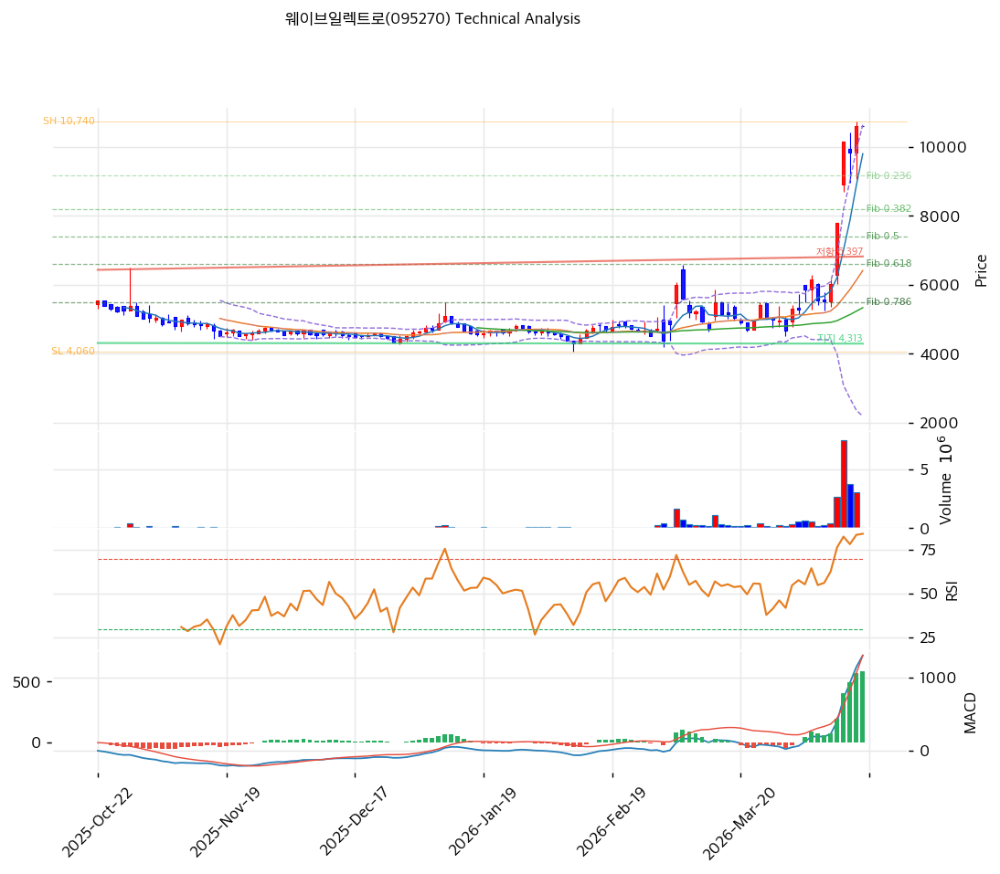

# 웨이브일렉트로(095270) 기술적 분석

2026-04-16 | T2 Technical Analysis

---

## 차트

---

## 1. 가격 현황

| 항목 | 값 |
|------|-----|
| 현재가 | 10,600원 (0.0%) |
| 52주 고가 | 10,600원 |
| 52주 저가 | 4,235원 |
| 52주 범위 위치 | 100.0% |
| 거래량 | 20일 평균 대비 0.0x (데이터 미집계) |

---

## 2. 차트 패턴 분석

### 2.1 캔들스틱 패턴

| 패턴 | 위치 | 신뢰도 | 해석 |
|------|------|--------|------|
| 52주 신고가 도달 | 최근 | 강 | 강한 상승 추세 지속 시그널이나, 저항 부재 구간에서 과열 가능성 동시 시사 |
| 상승 추세 연속 | 중기 | 중 | 4,235원 저점 이후 꾸준한 상승봉 연속으로 매수 우위 기조 유지 |

※ 주가가 52주 고가에 위치해 직전 캔들 패턴의 신호 해석 제한적

### 2.2 가격 구조 패턴

- **강한 상승 추세 (신뢰도: 강)**
  52주 저가 4,235원에서 현재 10,600원까지 +150% 상승한 강한 상승 추세 구간이다. Swing Low 4,060원~Swing High 10,740원 기준으로 6개월 내외의 급등 구간이 형성되어 있으며, 단기 모멘텀은 강하나 과열 구간 진입 여부가 핵심 관찰 포인트다.

- **박스권 상단 돌파 시도 (신뢰도: 중)**
  52주 고가가 곧 현재가인 구조로, 이전 저항선 부재가 기술적으로 상단이 열린 상태를 의미한다. 단 볼린저밴드 상단(10,639원)을 돌파한 상태로 단기 되돌림 압력이 존재한다.

### 2.3 다이버전스

- **RSI 과매수 구간 진입 (신뢰도: 중)**
  RSI(14) 80.2로 과매수 구간에 위치하며, 스토캐스틱도 K=95.3으로 데드크로스 발생. 가격 신고가와 RSI 과매수가 동반된 상황은 추세 지속 가능성과 단기 조정 가능성을 동시에 내포한다.

- **MACD 상승 다이버전스 없음 (참고)**
  MACD(1,298)과 Signal(715) 모두 양수로 매수 구간, 히스토그램 확대(+583). 가격 상승을 기술적 지표가 지지하는 형태이나 고점 인근에서의 확대는 신중한 해석 필요.

### 2.4 패턴 종합 판단

52주 고가 도달, MACD 매수 구간, 히스토그램 확대라는 강세 시그널이 존재하나, RSI 80.2(과매수), 스토캐스틱 데드크로스(K=95.3), 볼린저밴드 상단 밀착이 동시에 확인되는 복합 과열 구간이다. 추세 자체는 강하나 단기 조정 또는 숨고르기 국면 진입 가능성이 높으며, 신규 진입보다는 눌림목 대기가 적합한 구간이다.

---

## 3. 이동평균선 — 비정배열 (강세/과열)

| MA | 값 | 현재가 괴리율 | 위치 |
|----|-----|--------------|------|
| MA5 | 9,800원 | +8.2% | 위 |
| MA20 | 6,414원 | +65.3% | 위 |
| MA60 | 5,335원 | +98.7% | 위 |
| MA120 | 5,045원 | +110.1% | 위 |
| MA200 | 5,058원 | +109.6% | 위 |

**해석**: 현재가가 모든 이동평균선 위에 위치하여 추세 방향은 강한 상승이다. 그러나 MA20 대비 +65.3%, MA60 대비 +98.7%라는 극단적 괴리는 과열 구간을 시사한다. MA5(9,800원) 하회 시 단기 추세 약화 신호이며, MA20(6,414원)은 중기 핵심 지지선으로 작용할 것이다.

---

## 4. 보조 지표

### RSI(14) — 80.2 (🔴 과매수)

RSI 80.2는 통상적 과매수 기준(70)을 크게 상회하는 수준으로, 단기 조정 압력이 내재되어 있으나 강한 추세 국면에서는 80대 이상에서도 추세가 지속되는 경우가 있어 추세 전환 확인 후 대응이 적합하다.

### MACD(12,26,9)

| 항목 | 값 |
|------|-----|
| MACD | 1,298 |
| Signal | 715 |
| Histogram | +583 |
| 크로스 상태 | 매수 구간 (확대 중) |

**해석**: MACD가 Signal을 상회하는 매수 구간이며 히스토그램이 확대되어 상승 모멘텀이 살아있다. 다만 절대값이 높아 향후 히스토그램 축소 시 추세 둔화 경고 신호로 해석해야 한다.

### 볼린저밴드(20, 2σ)

| 항목 | 값 |
|------|-----|
| 상단 | 10,639원 |
| 중단 (MA20) | 6,414원 |
| 하단 | 2,189원 |
| 밴드 폭 | 131.7% |
| 현재 위치 | 상단 근접 |

**해석**: 밴드 폭 131.7%는 극단적인 변동성 확대 상태다. 현재가(10,600원)가 상단(10,639원)에 거의 밀착되어 있어 단기적으로 밴드 중단(MA20 6,414원) 방향으로의 수렴 압력이 존재한다.

### 스토캐스틱(14, 3, 3)

| 항목 | 값 |
|------|-----|
| Slow %K | 95.3 |
| Slow %D | 96.0 |
| 크로스 상태 | 데드크로스 |
| 판단 | 과매수 |

---

## 5. 지지/저항 — 추세선 · 피보나치 · PRZ 통합

### 5.1 피보나치 되돌림/확장

| 구분 | 비율 | 가격 | 현재가 대비 |
|------|------|------|-----------|
| Swing High | — | 10,740원 | — |
| 되돌림 | 0.236 | 9,164원 | -13.5% |
| 되돌림 | 0.382 | 8,188원 | -22.8% |
| 되돌림 | 0.500 | 7,400원 | -30.2% |
| 되돌림 | 0.618 | 6,612원 | -37.6% |
| 되돌림 | 0.786 | 5,490원 | -48.2% |
| Swing Low | — | 4,060원 | — |
| 확장 | 1.272 | 12,557원 | +18.5% |
| 확장 | 1.382 | 13,292원 | +25.4% |
| 확장 | 1.618 | 14,868원 | +40.3% |
| 확장 | 2.0 | 17,420원 | +64.3% |

※ 피보나치 기준: 상승 추세 (Swing Low 4,060원 → Swing High 10,740원)
※ 되돌림 = 직전 상승 추세에서 되돌아온 비율, 확장 = 상승 방향 목표가

### 5.2 추세선

| 추세선 | 방향 | 현재 교차가 | 포인트 수 | 해석 |
|--------|------|-----------|---------|------|
| 지지선 | 하락 | 4,313원 | 6개 | 장기 하락 추세선으로 현재가 위, 이미 상향 돌파한 상태 |
| 저항선 | 상승 | 6,397원 | 6개 | 단기 상승 추세선 — 현재가 훨씬 위, 재이탈 시 지지로 전환 가능 |

### 5.3 PRZ (Potential Reversal Zone)

| 방향 | 가격 범위 | 신뢰도 | 근거 |
|------|---------|--------|------|
| 지지 | 10,600원 | 강 | 피봇 R1, 피봇 R2, 피봇 S1, 피봇 S2 중첩 |

※ PRZ = 복수 지표가 겹치는 가격 구간. 현재가 자체가 PRZ에 해당하여 지지·저항 이중 역할

### 5.4 종합 지지/저항 테이블

| 구분 | 가격 | 근거 |
|------|------|------|
| 저항 | 12,557원 | 피보나치 1.272 확장 — 1차 목표가 |
| 저항 | 13,292원 | 피보나치 1.382 확장 — 2차 목표가 |
| **현재가** | **10,600원** | 52주 고가 / PRZ(강) / 피봇 집중 |
| 지지 | 9,164원 | 피보나치 0.236 되돌림 |
| 지지 | 8,188원 | 피보나치 0.382 되돌림 |
| 지지 | 7,400원 | 피보나치 0.5 되돌림 |
| 지지 | 6,612원 | 피보나치 0.618 되돌림 / MA20 인근 |
| 지지 | 6,397원 | 상승 추세선 교차가 |
| 지지 | 6,414원 | MA20 |
| 지지 | 5,335원 | MA60 |

---

## 6. 시그널 종합

| 지표 | 내용 | 시그널 |
|------|------|--------|
| **차트 패턴** | 52주 고가, 상승 추세 유효, 볼린저 상단 밀착 | ⚪ |
| 이동평균선 | 비정배열 강세, MA20 대비 +65.3% 극단 과열 | 🔴 |
| RSI | 80.2 — 과매수 | 🔴 |
| MACD | 매수 구간, 히스토그램 확대 | 🟢 |
| 볼린저밴드 | 상단 밀착, 밴드폭 131.7% 극단 확장 | ⚪ |
| 스토캐스틱 | 데드크로스, K=95.3 과매수 | 🔴 |
| 거래량 | 0.0x — 데이터 미집계 | ⚪ |

**종합 판단**: 🟢 매수 1개 / 🔴 매도 3개 / ⚪ 중립 3개 → **매도우위**

추세 방향 자체는 상승이나 RSI 과매수(80.2), 스토캐스틱 데드크로스(K=95.3), MA20 대비 65% 괴리, 볼린저밴드 상단 밀착이 동시에 확인되어 단기 과열 상태다. MACD 매수 구간이 유일한 강세 신호이나 절대값 고점에서의 확대는 모멘텀 둔화 선행 지표일 수 있다. 단기적으로는 피보나치 0.236(9,164원) 또는 0.382(8,188원) 구간까지 되돌림 후 재진입 기회를 모색하는 전략이 적합하다.

---

## 7. 전략 제안

### 보유 중인 경우
- **비중축소**
- 익절 라인: 12,557원 (피보나치 1.272 확장 — 1차 목표가)
- 손절 라인: 9,164원 (피보나치 0.236 되돌림 이탈 시)
- 리스크/리워드: 약 1:2 (현재가 10,600원 기준)

### 진입 대기인 경우
- **관망**
- 1차 진입가: 9,164원 (피보나치 0.236 되돌림 + 단기 지지 확인)
- 2차 진입가: 8,188원 (피보나치 0.382 되돌림 + MA20 인근 수렴)
- 진입 조건: RSI 60 이하 복귀 및 거래량 감소 후 반등 확인, MA20 지지 재확인
