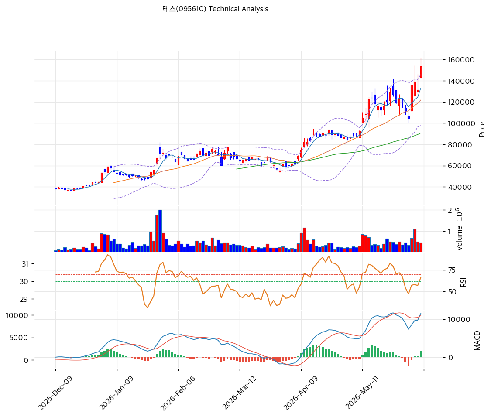

# 기술적분석

***

## 가격 위치

현재가 **154,100원** (**당일 +17.19%**) — 52주 고가 161,600원 근접, 52주 위치 100%권. 1년 **+590%** (22,350→154,100). 메모리 capex 슈퍼사이클 + BSD 신장비 모멘텀으로 급등. 기관 20일 +138만주 대량 순매수. RSI 69.7 과매수 직전. 당일 +17% 급등으로 단기 과열.

## 이동평균선

| 이평선   |        값 |     이격도 |  위치 |
| ----- | -------: | ------: | :-: |
| MA5   | 132,980원 |  +15.6% |  위  |
| MA20  | 121,785원 |  +26.2% |  위  |
| MA60  |  90,760원 |  +69.3% |  위  |
| MA120 |  73,788원 | +108.3% |  위  |
| MA200 |  59,994원 | +156.2% |  위  |

**완전 정배열 True**. MA200 대비 **+156.2%**, MA20 대비 +26.2% 극단 이격. 1년 +590% 급등으로 이격 극단 — 단기 급등 정점. 당일 +17%로 MA5와의 괴리도 +15.6%.

## 모멘텀 지표

* **RSI 69.7 (중립)** — 70 직전, 과매수 근접
* **MACD 11,461 / 시그널 9,859 / 히스토 +1,602** — 매수 + 확장 진행(급등 모멘텀)
* **스토캐스틱 K=72.1 / D=67.5** — 골든크로스, 과매수 경계
* **볼린저밴드** — 상단 145,771 / 중심 121,785 / 하단 97,799, 폭 39.4%, **상단 돌파**. 변동성 확대
* **거래량비 0.91x** — 평이(급등 대비 거래 보통)

## 피보나치 되돌림 (스윙 22,050 / 161,600)

| 레벨       |       가격 | 성격              |
| -------- | -------: | --------------- |
| 0.236    | 128,666원 | 1차 지지 (MA5 근접)  |
| 0.382    | 108,292원 | 2차 지지           |
| 0.5      |  91,825원 | 중기 지지 (MA60 근접) |
| 0.618    |  75,358원 | 깊은 조정           |
| 1.272 확장 | 199,558원 | 상승 시 목표         |

## 지지/저항 (S\&R)

* **저항**: 161,600원(52주 고가) / 199,558원(피보 1.272 확장) |
* **지지**: 145,771원(BB 상단) / **132,980원(MA5·피보 0.236 근접)** / 128,666원(피보 0.236) / **121,785원(MA20·BB 중심)** / 90,760원(MA60)

## 종합 시그널 & 전략

**시그널: 매수 2 / 매도 1 / 중립 4 → 매수우위** (급등 모멘텀, 단 이격 극단)

* **전략**: HOLD(홀드) — 신고가권 추격 신중, 미보유 시 눌림목 대기. 손절 MA20 121,785원 이탈
* **눌림목 매수**: 1년 +590% + 당일 +17% + MA200 +156%로 **신고가 추격 비추**. 조정 시 **MA5 132,980원 \~ 피보 0.236 128,666원 분할 매수**, 깊은 조정 시 MA20 121,785원
* **상방**: 52주 고가 161,600원 돌파 시 피보 1.272 확장 199,558원. 메모리 capex·BSD 신장비 수주가 동력
* **하방**: MA5 132,980원·피보 0.236 128,666원 이탈 시 MA20 121,785원 → MA60 90,760원. 당일 +17% 급등 되돌림 위험
* **변곡점**: 메모리 capex 지속 + BSD 신장비 DRAM 진입이 추세 핵심. 당일 +17% 급등·과매수 직전으로 단기 변동성 확대, 증권사 목표가 돌파 상태로 추격 주의
