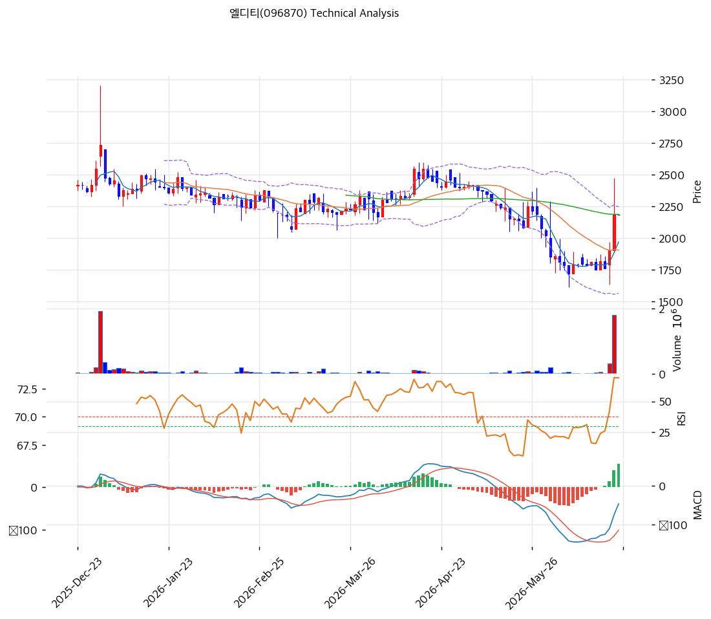

# 기술적분석

2026-06-23 | T2 Technical Analysis

***

## 차트

***

## 1. 가격 현황

| 항목        | 값              |
| --------- | -------------- |
| 현재가       | 2,185원 (0.00%) |
| 52주 고가    | 3,275원         |
| 52주 저가    | 1,721원         |
| 52주 범위 위치 | 29.9% (중하단)    |
| 거래량비      | 0.0x (한산)      |
| RSI       | 61.6 (중립)      |

> 52주 고가(3,275원) 대비 -33% 하락 후 저점(1,721원)에서 반등해 중하단(2,185원)에 위치. 단기선(MA5 1,970·MA20 1,906) 위로 반등했으나 **MA60(2,188)·MA120(2,264)·MA200(2,497)** 부근·아래로 중장기 추세 미회복. RSI 61.6 중립. 거래 한산(초소형 저유동). MA60(2,188) 돌파가 단기 분수령.

***

## 2. 차트 패턴 분석

### 2.1 구조·캔들

| 패턴           | 위치                 | 신뢰도 | 해석        |
| ------------ | ------------------ | --- | --------- |
| 저점 반등·중기선 시험 | 2,185 ≈ MA60 2,188 | 중   | 추세 전환 관문  |
| 단기선 회복       | MA5·MA20 위         | 중   | 단기 반등     |
| MACD 매수 전환   | hist +55           | 중   | 모멘텀 회복 시도 |

* **저점 반등·중기 저항 시험** (신뢰도: 중): 1,721 저점 후 반등, MA60(2,188) 돌파 시 추세 전환. 실패 시 MA20(1,906) 되돌림.
* **단기 강세·중장기 미회복** (신뢰도: 중): MA5·MA20 위, MA60/120/200 부근·아래 혼재.

### 2.2 다이버전스

* **반등 모멘텀 회복** (신뢰도: 중): MACD 매수 전환(히스토그램 +)·스토캐 골든크로스. RSI 61.6 중립으로 여력. 단 거래 한산으로 추세 신뢰 약화.

***

## 3. 이동평균선 — 단기 회복·중장기 저항

| MA    | 값     | 괴리율    | 위치 |
| ----- | ----- | ------ | -- |
| MA5   | 1,970 | +10.9% | 위  |
| MA20  | 1,906 | +14.6% | 위  |
| MA60  | 2,188 | -0.1%  | 부근 |
| MA120 | 2,264 | -3.5%  | 아래 |
| MA200 | 2,497 | -12.5% | 아래 |

**해석**: 단기선(MA5·MA20) 위로 단기 반등했으나 MA60(2,188) 부근·MA120/MA200 아래로 중장기 추세 미회복(정배열 아님). **MA60 돌파·안착이 추세 전환 1차 관문**이며, MA120(2,264)·MA200(2,497)이 다음 저항. 실패 시 MA20(1,906) 지지 시험.

***

## 4. 보조 지표

### RSI(14) — 61.6 (중립)

중립 상단. 추가 상승 여력 있으나 과매수 전.

### MACD(12,26,9)

| MACD | Signal | Hist | 크로스       |
| ---- | ------ | ---- | --------- |
| -46  | -101   | +55  | 매수 전환(확산) |

영선 아래에서 매수 전환·히스토그램 확대 → 하락 모멘텀 약화·반등 시도. 추세 전환 초기.

### 볼린저밴드(20,2σ)

| 상단    | 중단    | 하단    | 밴드폭   |
| ----- | ----- | ----- | ----- |
| 2,247 | 1,906 | 1,565 | 35.8% |

현재가 2,185는 상단(2,247) 근접. 상단 돌파 시 추가 상승, 중단(1,906) 지지 시 반등 유지.

### 스토캐스틱

| %K   | %D   | 판단        |
| ---- | ---- | --------- |
| 58.5 | 44.5 | 골든크로스(중립) |

중립권 골든크로스, 상승 모멘텀.

***

## 5. 지지/저항

| 구분      | 가격        | 근거             |
| ------- | --------- | -------------- |
| 저항      | 3,275     | 52주 고가         |
| 저항      | 2,983     | 피보 0.786       |
| 저항      | 2,690     | 피보 0.618·추세선   |
| 저항      | 2,497     | MA200·피보 0.5   |
| 저항      | 2,272     | MA120·피보 0.382 |
| 저항      | 2,247     | 볼린저 상단         |
| 저항      | 2,188     | MA60 (1차 관문)   |
| **현재가** | **2,185** | 중기선 시험         |
| 지지      | 2,026     | 피보 0.236       |
| 지지      | 1,906     | MA20·볼린저 중단    |
| 지지      | 1,811     | 추세선 지지         |
| 지지      | 1,721     | 52주 저점         |

***

## 6. 시그널 종합

| 지표    | 내용           | 시그널 |
| ----- | ------------ | --- |
| 차트 패턴 | 저점 반등·중기선 시험 | ⚪   |
| 이동평균선 | 단기 회복·중장기 저항 | ⚪   |
| RSI   | 61.6 — 중립    | ⚪   |
| MACD  | 매수 전환(확산)    | 🟢  |
| 볼린저밴드 | 상단 근접        | ⚪   |
| 스토캐스틱 | 골든크로스        | ⚪   |
| 거래량   | 한산           | ⚪   |

**종합 판단**: 🟢 매수 1개 / 🔴 매도 0개 / ⚪ 중립 5개 → **매수 우위 (저점 반등·중기선 시험)**

저점(1,721) 반등 후 MA60(2,188)을 시험하는 국면. MACD 매수 전환·스토캐 골든크로스로 모멘텀이 회복됐으나 중장기선(MA120·MA200) 아래로 추세는 미전환이다. **MA60 돌파·안착이 단기 분수령**이며, 돌파 시 MA120(2,264)·MA200(2,497) 방향, 실패 시 MA20(1,906) 되돌림. 초소형 저유동·실적 변동성으로 분기 실적(흑자 정착) 확인이 추세 전환의 전제.

***

## 7. 전략 제안

### 보유 중인 경우

* **홀드 (MA60 돌파 주시)**
* 익절: 2,272(MA120)·2,497(MA200)·2,690(피보 0.618) 단계
* 손절: 1,906(MA20)·1,811(추세선) 이탈
* 초소형 저유동, 분할 대응

### 진입 대기인 경우

* **눌림목 분할 (실적 확인)**
* 1차 진입가: 1,906\~2,026 (MA20·피보 0.236)
* 2차 진입가: 1,721\~1,811 (52주 저점·추세선)
* 진입 조건: PBR \~1x·무차입으로 가치 영역이나 흑자 미정착. MA60 돌파·분기 흑자 정착·재난안전 사업 가시화 확인 후 분할. 초소형 변동성·유증 희석 유의.
