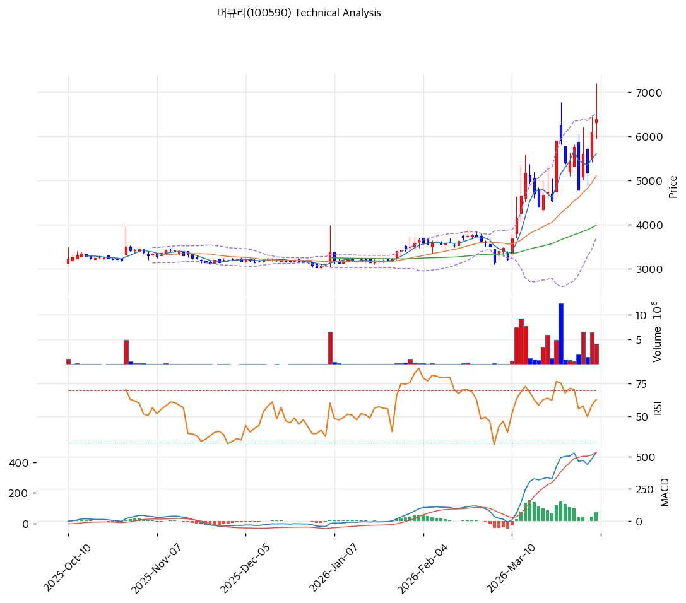

# 머큐리(100590) 기술적 분석

2026-04-06 | T2 Technical Analysis

---

## 차트

---

## 1. 가격 현황

| 항목 | 값 |
|------|-----|
| 현재가 | 6,390원 (+4.75%) |
| 52주 고가 | 6,390원 |
| 52주 저가 | 3,030원 |
| 52주 범위 위치 | 100.0% |
| 거래량 | 20일 평균 대비 1.10x |

---

## 2. 차트 패턴 분석

### 2.1 캔들스틱 패턴

| 패턴 | 위치 | 신뢰도 | 해석 |
|------|------|--------|------|
| 장대양봉 돌파 | 최근 5거래일 | 강 | 박스권 상단을 강하게 돌파하며 추세 전환 신호를 강화 |
| 단기 윗꼬리 | 최근 1~2거래일 | 중 | 신고가 부근 매물 소화 과정이 일부 나타남 |

### 2.2 가격 구조 패턴

- **박스권 돌파** (신뢰도: 강)
  약 5,000~5,800원 박스권 상단을 상향 돌파하며 52주 신고가를 기록했습니다. 추세 전환 신호로 해석할 수 있습니다.

- **상승 추세 채널** (신뢰도: 중)
  MA20과 MA60이 우상향하며 정배열이 형성됐습니다. 다만 MA20 대비 25.1% 이격은 단기 부담입니다.

### 2.3 다이버전스

- **RSI 다이버전스 미형성** (신뢰도: 중)
  RSI 64.6으로 아직 과매수 극단은 아니며, 뚜렷한 하락 다이버전스는 관찰되지 않습니다.

- **MACD 추세 지속 시그널** (신뢰도: 중)
  MACD 매수구간과 히스토그램 확대가 유지되어 상승 추세 지속 가능성을 시사합니다.

### 2.4 패턴 종합 판단

머큐리 차트는 **신고가 돌파형 강세 패턴**입니다. 다만 단기 이격이 큰 만큼, 추격 매수보다 눌림 확인이 더 합리적입니다.

---

## 3. 이동평균선 — 정배열 (강세)

| MA | 값 | 현재가 괴리율 | 위치 |
|----|-----|--------------|------|
| MA5 | 5,611원 | +13.9% | 위 |
| MA20 | 5,108원 | +25.1% | 위 |
| MA60 | 3,982원 | +60.5% | 위 |
| MA120 | 3,614원 | +76.8% | 위 |
| MA200 | 3,478원 | +83.7% | 위 |

**해석**: 완전 정배열입니다. 중기 추세는 좋지만 MA20 대비 25% 이상 이격은 단기 과열 구간으로 봐야 합니다.

---

## 4. 보조 지표

### RSI(14) — 64.6 (중립)

과열 직전 구간입니다. 아직 과매수는 아니지만 추가 상승보다 단기 숨고르기가 먼저 나올 가능성도 있습니다.

### MACD(12,26,9)

| 항목 | 값 |
|------|-----|
| MACD | 533.0 |
| Signal | 464.0 |
| Histogram | +69.0 |
| 크로스 상태 | 매수 구간 (확대 중) |

**해석**: MACD는 강세 지속 신호입니다. 단기 눌림이 오더라도 추세 자체는 유지될 가능성이 높습니다.

### 볼린저밴드(20, 2σ)

| 항목 | 값 |
|------|-----|
| 상단 | 6,509원 |
| 중단 (MA20) | 5,108원 |
| 하단 | 3,708원 |
| 밴드 폭 | 54.8% |
| 현재 위치 | 상단근접 |

**해석**: 상단 부근에서 거래되고 있어 추세는 강하지만, 동시에 단기 과열 신호로도 해석됩니다.

### 스토캐스틱(14, 3, 3)

| 항목 | 값 |
|------|-----|
| Slow %K | 60.4 |
| Slow %D | 50.9 |
| 크로스 상태 | 골든크로스 |
| 판단 | 중립 |

---

## 5. 지지/저항

| 구분 | 가격 | 근거 |
|------|------|------|
| 저항 | 6,390원 | 52주 고가 |
| 저항 | 7,080원 | 피봇 R1 |
| **현재가** | **6,390원** | — |
| 지지 | 5,820원 | 피봇 S1 |
| 지지 | 5,250원 | 피봇 S2 |
| 지지 | 5,108원 | MA20 |

---

## 6. 시그널 종합

| 지표 | 내용 | 시그널 |
|------|------|--------|
| **차트 패턴** | 박스권 돌파 + 신고가 경신 | 🟢 |
| 이동평균선 | 정배열, 다만 MA20 +25.1% 과열 | ⚪ |
| RSI | 64.6 — 중립 | ⚪ |
| MACD | 매수구간 확대 | 🟢 |
| 볼린저밴드 | 상단 밀착, 과열 경계 | ⚪ |
| 스토캐스틱 | 골든크로스, K=60.4 | ⚪ |
| 거래량 | 1.1x — 약함 | ⚪ |

**종합 판단**: 🟢 매수 2개 / 🔴 매도 0개 / ⚪ 중립 5개 → **매수우위**

차트 구조는 긍정적입니다. 다만 이미 신고가 구간에 진입했기 때문에 신규 진입은 조정 확인 후가 더 적절합니다.

---

## 7. 전략 제안

### 보유 중인 경우
- **홀드**
- 익절 라인: 6,518원 (전략상 제시값 / 신고가 돌파 확인 구간)
- 손절 라인: 5,250원 (피봇 S2 이탈 시)
- 리스크/리워드: 보수적 1:1 이상

### 진입 대기인 경우
- **관망**
- 1차 진입가: 5,820원 (피봇 S1)
- 2차 진입가: 5,108원 (MA20)
- 진입 조건: 돌파 안착 또는 눌림 후 반등 확인
