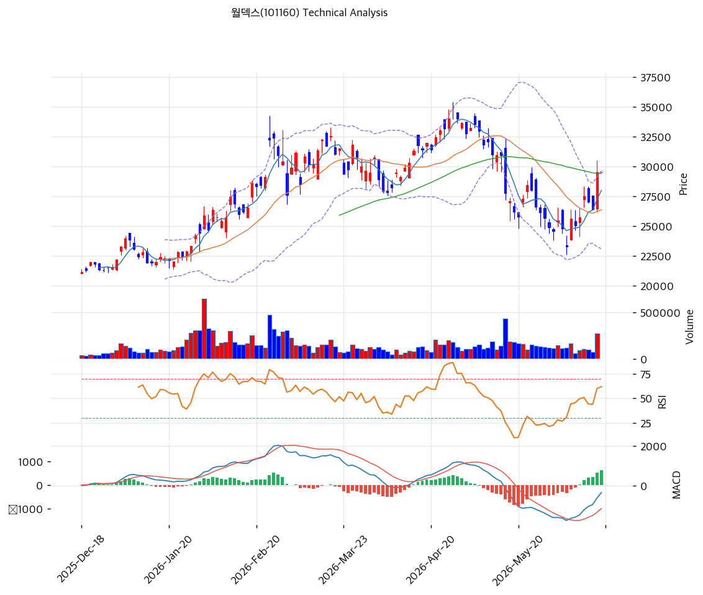

# 기술적분석

2026-06-18 | T2 Technical Analysis

***

## 차트

***

## 1. 가격 현황

| 항목        | 값            |
| --------- | ------------ |
| 현재가       | 29,500원      |
| 52주 고가    | 34,950원      |
| 52주 저가    | 19,760원      |
| 52주 범위 위치 | 64.1% (중상단)  |
| 거래량       | (당일 데이터 미반영) |

> 52주 저점(19,760원) 대비 약 1.5배. 고점(34,950원)에서 조정 후 26,000\~30,000원 박스에서 이평선 밀집·바닥 다지기. 모든 MA가 26,000\~29,400원에 밀집한 수렴 구간.

***

## 2. 차트 패턴 분석

### 2.1 캔들스틱 패턴

| 패턴         | 위치                   | 신뢰도 | 해석       |
| ---------- | -------------------- | --- | -------- |
| 이평선 밀집·수렴  | MA 26,000\~29,400    | 중   | 방향성 모색   |
| MA60 부근 등락 | 29,500 ≈ MA60 29,389 | 중   | 중기선 공방   |
| MACD 매수 전환 | 히스토그램 +638           | 중   | 단기 반등 시도 |

※ 주요 캔들 패턴: 망치형, 역망치형, 장악형, 도지, 샛별/석별, 적삼병/흑삼병, 하라미, 유성형, 교수형 등

### 2.2 가격 구조 패턴

* **이평선 밀집 수렴 후 방향성 모색** (신뢰도: 중) 모든 MA(26,000\~29,400원)가 밀집한 수렴 구간. 현재가가 그 상단에서 MACD 매수 전환. 수렴 후 방향 돌파 임박 가능. 저항 31,375\~33,263원(피보), 지지 26,362원(MA20).
* **고점 대비 조정·중기 박스** (신뢰도: 중) 34,950원 고점 후 조정, 26,000\~30,000원 박스. 실적 회복(2026Q1 NI +47%)으로 바닥 다지기.

※ 주요 구조 패턴: 이중천정/바닥, 삼각수렴, 쐐기형, 깃발형, 페넌트, 컵앤핸들, 박스권 등

### 2.3 다이버전스

* **수렴 후 반등 시도** (신뢰도: 중) MACD 매수 전환(히스토그램 +638)·스토캐스틱 77.9·RSI 57.8로 단기 반등 시도. 이평선 밀집 수렴 돌파 여부가 방향 결정.

※ RSI·MACD 기반 | 상승 다이버전스 = 가격↓ 지표↑, 하락 다이버전스 = 가격↑ 지표↓

### 2.4 패턴 종합 판단

모든 이평선이 26,000\~29,400원에 밀집한 **수렴 구간**으로, 현재가가 그 상단에서 MACD 매수 전환하며 방향성을 모색한다. 고점(34,950원) 대비 조정 후 박스 바닥 다지기. 실적 회복·순현금 저평가가 펀더멘털을 받친다. 수렴 상단 돌파 시 31,375\~33,263원(피보)이 목표, MA20(26,362원) 이탈 시 박스 하단. 변동성 낮은 수렴이라 돌파 방향 확인 후 대응이 정석.

***

## 3. 이동평균선 — 밀집 수렴(중립\~약강세)

| MA    | 값       | 현재가 괴리율 | 위치    |
| ----- | ------- | ------- | ----- |
| MA5   | 27,980원 | +5.4%   | 위     |
| MA20  | 26,362원 | +11.9%  | 위     |
| MA60  | 29,389원 | +0.4%   | 위(근접) |
| MA120 | 27,648원 | +6.7%   | 위     |
| MA200 | 25,991원 | +13.5%  | 위     |

**해석**: 현재가가 모든 MA 위이나 MA들이 25,991\~29,389원에 **밀집 수렴**(aligned False) — 박스·수렴 국면. 현재가가 MA60(29,389원) 부근에서 공방. 단기선(MA20 26,362원)과 +11.9% 괴리. 수렴 돌파 방향이 추세를 결정하며, MA 밀집대(26,000\~29,400원)가 지지/저항 동시 작용.

***

## 4. 보조 지표

### RSI(14) — 57.8 (중립)

수렴 구간 중립. 방향성 모색, 과매수·과매도 아님.

### MACD(12,26,9)

| 항목        | 값             |
| --------- | ------------- |
| MACD      | -360          |
| Signal    | -998          |
| Histogram | +638          |
| 크로스 상태    | 매수 전환 (0선 아래) |

**해석**: MACD가 Signal 상향 돌파한 매수 전환이나 0선 아래(중기 약세 잔존). 히스토그램 +638 확대로 단기 반등 모멘텀.

### 볼린저밴드(20, 2σ)

| 항목        | 값       |
| --------- | ------- |
| 상단        | 29,635원 |
| 중단 (MA20) | 26,362원 |
| 하단        | 23,090원 |
| 밴드 폭      | 24.8%   |
| 현재 위치     | 상단 근접   |

**해석**: 현재가 29,500원이 밴드 상단(29,635원) 근접 — 단기 강세. 밴드 폭 24.8%(수렴). 상단 돌파 시 변동성 확대, 되돌림 시 중단(26,362원) 여지.

### 스토캐스틱(14, 3, 3)

| 항목      | 값      |
| ------- | ------ |
| Slow %K | 77.9   |
| Slow %D | 69.5   |
| 크로스 상태  | 골든크로스  |
| 판단      | 중립(상승) |

***

## 5. 지지/저항 — 추세선 · 피보나치 · PRZ 통합

### 5.1 종합 지지/저항 테이블

| 구분      | 가격          | 근거                          |
| ------- | ----------- | --------------------------- |
| 저항      | 37,152원     | 추세선 저항                      |
| 저항      | 34,950원     | 52주 고가                      |
| 저항      | 33,263원     | 피보 0.236                    |
| 저항      | 31,375원     | 피보 0.5                      |
| 저항      | 29,635원     | 볼린저 상단                      |
| **현재가** | **29,500원** | MA60 부근                     |
| 지지      | 29,453원     | MA60·피보 0.786·피봇 R1 (PRZ 강) |
| 지지      | 27,957원     | MA120·MA5·추세선 (PRZ 중)       |
| 지지      | 26,362원     | MA20                        |
| 지지      | 26,176원     | MA200·MA20 (PRZ)            |

***

## 6. 시그널 종합

| 지표    | 내용               | 시그널 |
| ----- | ---------------- | --- |
| 차트 패턴 | 이평선 밀집 수렴, 방향 모색 | ⚪   |
| 이동평균선 | 밀집(모든 MA 상회)     | 🟢  |
| RSI   | 57.8 — 중립        | ⚪   |
| MACD  | 매수 전환(0선 아래)     | ⚪   |
| 볼린저밴드 | 상단 근접, 밴드폭 25%   | ⚪   |
| 스토캐스틱 | 골든크로스, K=77.9    | ⚪   |
| 거래량   | 데이터 미반영          | ⚪   |

**종합 판단**: 🟢 매수 1개 / 🔴 매도 0개 / ⚪ 중립 5개 → **매수우위 (수렴 후 방향 모색)**

모든 이평선이 밀집한 수렴 구간으로, 현재가가 상단에서 MACD 매수 전환하며 방향성을 모색한다. 실적 회복·순현금 저평가가 펀더멘털을 받친다. 수렴 상단(29,635원) 돌파 시 31,375\~33,263원 목표, MA 밀집대(26,000\~27,957원) 이탈 시 박스 하단. 변동성 낮은 수렴이라 돌파 확인 후 대응.

***

## 7. 전략 제안

### 보유 중인 경우

* **홀드 (수렴 돌파 주시)**
* 익절 라인: 31,375원(피보 0.5)·33,263원(피보 0.236)·34,950원(전고)
* 손절 라인: 26,176원 (MA200·MA20 PRZ 이탈)
* 리스크/리워드: 수렴 구간으로 변동성 낮음, 돌파 방향 대응

### 진입 대기인 경우

* **눌림목 분할 (저평가)**
* 1차 진입가: 27,957원 (MA120·MA5·추세선 PRZ)
* 2차 진입가: 26,176\~26,362원 (MA20·MA200 PRZ)
* 진입 조건: 수렴 구간이라 돌파 방향 확인 또는 MA 밀집대 눌림목 분할. PER 11.9x·순현금(시총 38%)·실적 회복(2026Q1 NI +47%)으로 하방 안정. 식각 소모성 수요·OPM 20%대 회복 확인.
