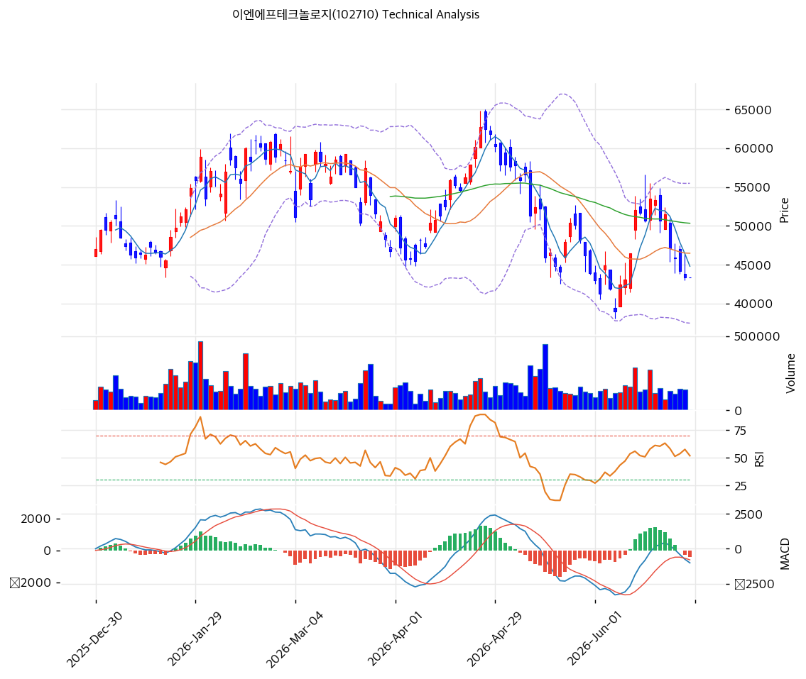

# 기술적분석

2026-06-29 | T2 Technical Analysis

***

## 차트

***

## 1. 가격 현황

| 항목        | 값                       |
| --------- | ----------------------- |
| 현재가       | 43,400원 (보합)            |
| 52주 고가    | 62,700원                 |
| 52주 저가    | 31,650원                 |
| 52주 범위 위치 | 37.8%                   |
| 거래량       | 20일 평균 대비 0.0x (당일 미집계) |

***

## 2. 차트 패턴 분석

### 2.1 캔들스틱 패턴

| 패턴       | 위치                   | 신뢰도 | 해석                                                 |
| -------- | -------------------- | --- | -------------------------------------------------- |
| 하단 반등 양봉 | 최근 5\~7일 (\~40,000원) | 중   | 볼린저 하단·40,000원 지지에서 반발 매수 유입, 단기 저점 형성 시그널         |
| 흑삼병 후 진정 | 6월 초중순               | 중   | 연속 음봉으로 39,000\~40,000까지 하락 후 낙폭 축소 — 매도 클라이맥스 가능성 |

※ 4월 말 62,700원 신고가 캔들 이후 장대음봉 동반 급락 → 5\~6월 조정의 출발점.

### 2.2 가격 구조 패턴

* **하락 추세 채널** (신뢰도: 강) 4월 말 62,700원(52주 신고가) 이후 고점·저점을 동시에 낮추는 뚜렷한 하락 채널. 1월말 \~65,000원 첫 고점 → 3월 \~47,000원 조정 → 4월 62,700원 재고점 → 5\~6월 \~39,000원까지 하락하며 이중천정형 흐름. 채널 상단은 MA60(50,335원) 부근.
* **단기 이중바닥 시도** (신뢰도: 약) 6월 \~39,000\~40,000원에서 두 차례 저점 지지 후 반등. 추세선 지지(43,121원)와 피보 swing low(39,000원)가 하단을 받치는 구조이나, MA 아래 반등이라 추세 전환 확정에는 거래량 동반 돌파(46,475원 MA20)가 선결 조건.

### 2.3 다이버전스

* **RSI 잠재적 상승 다이버전스** (신뢰도: 약) 6월 가격 저점(\~39,000원)에서 RSI가 과매도(\~30) 이후 40.9로 반등 — 가격 추가 하락 대비 지표 저점이 높아지는 초기 상승 다이버전스 가능성. 다만 아직 미완성, MA20 회복으로 확증 필요.
* **MACD 하락 모멘텀 지속** (신뢰도: 중) 가격 반등에도 MACD 히스토그램이 음(-)에서 확대 → 추세 전환보다 기술적 반등 국면 시사.

### 2.4 패턴 종합 판단

차트는 **중기 하락 추세 + 단기 바닥 다지기**의 조합이다. 4월 고점 이후 하락 채널이 유효하고 가격은 모든 이동평균 아래(비정배열)에 있어 추세는 약세. 다만 39,000\~43,000원 구간에서 추세선·피보·피봇이 겹치며 단기 지지가 확인되는 중. **MA20(46,475원)을 거래량 동반 돌파하기 전까지는 반등도 추세 전환이 아닌 기술적 반등으로 해석**한다.

***

## 3. 이동평균선 — 비정배열 (약세)

| MA    | 값       | 현재가 괴리율 | 위치 |
| ----- | ------- | ------- | -- |
| MA5   | 44,790원 | -3.1%   | 아래 |
| MA20  | 46,475원 | -6.6%   | 아래 |
| MA60  | 50,335원 | -13.8%  | 아래 |
| MA120 | 52,057원 | -16.6%  | 아래 |
| MA200 | 50,521원 | -14.1%  | 아래 |

**해석**: 현재가가 단기(MA5)부터 장기(MA200)까지 **모든 이평선 아래**에 위치한 완전 비정배열. 단기선이 장기선 아래로 배열돼 하락 추세가 우위다. MA20(46,475원)·MA60(50,335원)이 1차·2차 저항으로 작용. 다만 MA200 대비 -14% 괴리는 단기 과매도 영역에 근접 — 추가 급락 여력보다 지지 테스트 국면.

***

## 4. 보조 지표

### RSI(14) — 40.9 (중립)

과매도(30) 이탈 후 회복 중인 중립 구간. 6월 저점에서 반등했으나 50을 회복하지 못해 모멘텀은 아직 약세 우위. 다이버전스 해석은 2.3 참조.

### MACD(12,26,9)

| 항목        | 값            |
| --------- | ------------ |
| MACD      | -1,008       |
| Signal    | -593         |
| Histogram | -415         |
| 크로스 상태    | 매도 구간 (확대 중) |

**해석**: MACD가 시그널·0선 아래에 위치하고 히스토그램 음(-)값이 확대돼 하락 모멘텀이 우세. 단기 반등에도 추세 지표는 아직 매도 신호.

### 볼린저밴드(20, 2σ)

| 항목        | 값              |
| --------- | -------------- |
| 상단        | 55,481원        |
| 중단 (MA20) | 46,475원        |
| 하단        | 37,469원        |
| 밴드 폭      | 38.8%          |
| 현재 위치     | 중간 (하단\~중단 사이) |

**해석**: 6월 급락 시 하단(37,469원)을 터치한 뒤 반등하며 밴드 중단(MA20) 아래에서 등락. 밴드 폭 38.8%로 변동성이 여전히 크다. 중단(46,475원) 회복이 단기 추세 분기점.

### 스토캐스틱(14, 3, 3)

| 항목      | 값           |
| ------- | ----------- |
| Slow %K | 23.1        |
| Slow %D | 32.2        |
| 크로스 상태  | 데드크로스       |
| 판단      | 중립 (과매도 근접) |

***

## 5. 지지/저항 — 추세선 · 피보나치 · PRZ 통합

### 5.1 피보나치 되돌림/확장

| 구분         | 비율    | 가격      | 현재가 대비 |
| ---------- | ----- | ------- | ------ |
| Swing High | —     | 62,700원 | +44.5% |
| 되돌림        | 0.236 | 44,593원 | +2.7%  |
| 되돌림        | 0.382 | 48,053원 | +10.7% |
| 되돌림        | 0.5   | 50,850원 | +17.2% |
| 되돌림        | 0.618 | 53,647원 | +23.6% |
| 되돌림        | 0.786 | 57,628원 | +32.8% |
| Swing Low  | —     | 39,000원 | -10.1% |
| 확장         | 1.272 | 32,554원 | -25.0% |
| 확장         | 1.382 | 29,947원 | -31.0% |
| 확장         | 1.618 | 24,353원 | -43.9% |
| 확장         | 2.0   | 15,300원 | -64.7% |

※ 피보나치 기준: 하락 추세 (Swing High 62,700원 → Swing Low 39,000원) ※ 되돌림 = 직전 추세에서 되돌아온 비율, 확장 = 추세 방향 목표가

### 5.2 추세선

| 추세선 | 방향 | 현재 교차가  | 포인트 수 | 해석                                         |
| --- | -- | ------- | ----- | ------------------------------------------ |
| 지지선 | 상승 | 43,121원 | 6개    | 현재가 바로 아래에서 받치는 단기 핵심 지지. 이탈 시 39,000원 테스트 |
| 저항선 | 상승 | 67,418원 | 6개    | 상단 저항선, 추세 회복 시 중기 목표 영역                   |

### 5.3 PRZ (Potential Reversal Zone)

| 방향 | 가격 범위           | 신뢰도 | 근거                          |
| -- | --------------- | --- | --------------------------- |
| 지지 | 43,121\~43,400원 | 강   | 추세선 지지 + 피봇 R1/R2/S1/S2 밀집  |
| 저항 | 44,593\~44,790원 | 약   | 피보나치 0.236 되돌림 + MA5        |
| 저항 | 50,335\~50,850원 | 중   | MA60 + MA200 + 피보나치 0.5 되돌림 |

※ PRZ = 복수 지표가 겹치는 반전 구간. 50,000원대 중반은 MA60·MA200·피보 0.5가 겹친 강력 저항대.

### 5.4 종합 지지/저항 테이블

| 구분      | 가격              | 근거                        |
| ------- | --------------- | ------------------------- |
| 저항      | 62,700원         | 52주 고가                    |
| 저항      | 50,335\~50,850원 | MA60·MA200·피보 0.5 (PRZ 중) |
| 저항      | 46,475원         | MA20 (단기 추세 분기점)          |
| 저항      | 44,593\~44,790원 | 피보 0.236·MA5 (PRZ 약)      |
| **현재가** | **43,400원**     | —                         |
| 지지      | 43,121\~43,400원 | 추세선·피봇 (PRZ 강)            |
| 지지      | 39,000원         | 피보 Swing Low·6월 저점        |
| 지지      | 32,554원         | 피보 1.272 확장               |

***

## 6. 시그널 종합

| 지표        | 내용                                       | 시그널 |
| --------- | ---------------------------------------- | --- |
| **차트 패턴** | 중기 하락 채널 + 단기 바닥 다지기, MA20 돌파 전까지 기술적 반등 | ⚪   |
| 이동평균선     | 완전 비정배열, MA20 -6.6%                      | ⚪   |
| RSI       | 40.9 — 중립 (과매도 이탈)                       | ⚪   |
| MACD      | 매도 구간, 히스토그램 음(-) 확대                     | 🔴  |
| 볼린저밴드     | 중간, 밴드 폭 38.8%                           | ⚪   |
| 스토캐스틱     | 데드크로스, K=23.1 (과매도 근접)                   | ⚪   |
| 거래량       | 0.0x — 약함                                | ⚪   |

**종합 판단**: 🟢 매수 0개 / 🔴 매도 1개 / ⚪ 중립 5개 → **매도우위**

단기적으로는 39,000\~43,000원 지지대에서 바닥을 다지는 국면이나, 모든 이평선 아래의 비정배열과 MACD 매도 신호로 **추세는 여전히 약세 우위**. 반등이 MA20(46,475원)을 거래량과 함께 돌파해야 추세 전환을 논할 수 있으며, 그 전까지는 박스(39,000\~46,500원) 등락 가능성이 높다. 펀더멘털(저PER·이익 성장)과 약세 차트의 괴리 → 중기 매집 관점에서는 지지대 분할 접근 영역.

***

## 7. 전략 제안

### 보유 중인 경우

* **비중축소(추세 회복 전까지)**
* 익절 라인: 63,954원 (52주 고가·추세선 저항 영역)
* 손절 라인: 43,400원 (추세선 지지 PRZ 이탈 시)
* 리스크/리워드: 단기 손절 임박, 39,000원 추가 지지 확인 후 재평가 권장

### 진입 대기인 경우

* **진입가능(분할)**
* 1차 진입가: 43,400원 (추세선·피봇 PRZ 강 지지)
* 2차 진입가: 46,475원 (MA20 회복 확인 시 추격)
* 진입 조건: 39,000\~43,000원 지지 유지 + MA20 거래량 동반 돌파 시 비중 확대
