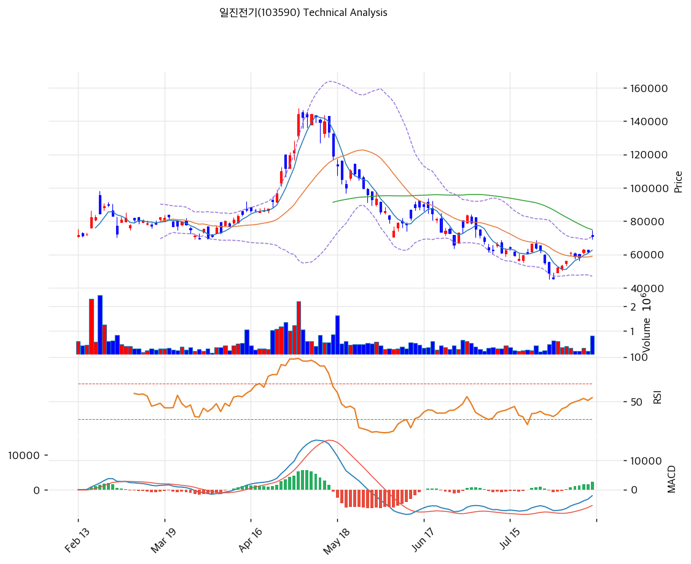

# 일진전기(103590) 기술적 분석

2026-08-12 | T2 Technical Analysis

---

## 차트

---

## 1. 가격 현황

| 항목 | 값 |
|------|-----|
| 현재가 | **71,100원 (+15.05%)** — 2026-08-12 오전 장중 |
| 전일 종가 | 61,800원 (2026-08-11) |
| 52주 고가 | **147,900원** (2026-05-04 장중) / 종가 최고 144,100원 |
| 52주 저가 | **33,900원** (2025-09-26) |
| 52주 범위 위치 | **32.6%** |
| 고점 대비 | **-51.9%** |
| 저점 대비 | **+109.7%** |
| 거래량 | 20일 평균 대비 **2.61x** (802,034주, 오전 10시 기준) |
| 상한가 / 하한가 | 80,300원 / 43,300원 |

> ⚠️ **기준가 주의**: 71,100원은 8/11 반기보고서 공시 다음 날 오전 장중 가격입니다. 당일 종가와 크게 다를 수 있고, 아래 모든 괴리율·손익비는 이 장중가 기준입니다.

> ⚠️ **KIS 52주 고/저 오류**: KIS API가 반환한 74,400 / 69,200원은 **당일 장중 고저**입니다. 위 표는 yfinance 일봉 원본으로 대체했습니다. 이 오류는 **7개 종목 연속** 재현되고 있어 `kis_client.py` 점검이 필요합니다.

---

## 2. 차트 패턴 분석

### 2.1 캔들스틱 패턴

| 패턴 | 위치 | 신뢰도 | 해석 |
|------|------|--------|------|
| **상승장악형(Bullish Engulfing)** | 2026-07-31 | **강** | 7/30 음봉(46,250→45,650)을 7/31 양봉(49,050→52,000)이 완전히 감쌈. 8거래일 +55.7% 반등의 출발점 |
| **쌍바닥 망치형** | 2026-07-29 / 07-30 | **강** | 이틀 연속 장중 저가가 정확히 45,000원. 아래꼬리를 남기고 종가를 끌어올린 전형적 지지 확인 |
| **상승 적삼병** | 2026-08-03\~05 | 중 | 3거래일 연속 양봉(+2.1%, +5.6%, +8.9%). 8/5에는 갭상승까지 동반 |
| **장대음봉 3연속** | 2026-07-28\~30 | 강 | -12.0%, -11.5%, -6.2%. 3일 만에 -27.0%. 투매 국면 |
| **갭상승 장대양봉** | 2026-08-12 (진행 중) | — | 시가부터 갭상승, 장중 +15.05%. 반기 실적 발표 반영. 종가 미확정 |

### 2.2 가격 구조 패턴

- **쌍바닥(Double Bottom) — 45,000원** (신뢰도: **강**)
  7월 29일과 30일, 이틀 연속으로 장중 저가가 45,000원에서 정확히 멈췄습니다. 두 저점 사이의 반등 고점(7/30 장중 49,150원)이 넥라인이며, 7/31에 52,000원으로 이를 돌파하며 패턴이 완성됐습니다. 패턴 높이(49,150 − 45,000 = 4,150원)를 적용한 1차 이론 목표가는 53,300원으로, 이미 8월 3일에 달성했습니다. 짧은 W자 패턴이지만 거래량(7/30 607,422주는 최근 최대)이 동반돼 신뢰도가 높습니다.

- **하락 추세선 상향 돌파** (신뢰도: **중**)
  5월 4일 144,100원 고점 이후 6월 30일 76,300원, 7월 24일 68,600원으로 이어지던 하락 추세선(일당 약 -1,373원)의 8월 12일 예상 교차가는 52,100원 부근입니다. 현재가 71,100원은 이를 **+36.5% 상회**하며, 3개월간 이어진 하락 채널을 명확히 벗어났습니다. 다만 돌파 이후 눌림목 없이 직진 중이라 되돌림 가능성이 남아 있습니다.

- **V자 반등 — 되돌림 구간 진입** (신뢰도: **중**)
  5/4 144,100원 → 7/30 45,650원(**-68.3%**) → 8/12 71,100원. 낙폭의 25.9%를 8거래일 만에 되돌렸습니다. 되돌림 속도가 하락 속도보다 빠른 전형적 V자 반등이며, 이런 패턴은 일반적으로 피보나치 0.382(83,258원) 부근에서 첫 저항을 만납니다.

- **매물대 부담 — 89,500\~122,500원** (신뢰도: 강)
  2026년 2월 종가 89,500원, 4월 종가 122,500원 구간은 대량 거래가 있었던 매물대입니다. 이 구간까지 올라가려면 현재가에서 +25.9%~+72.3%가 필요하고, 그 과정에서 손실 회복 매물이 계단식으로 나옵니다.

### 2.3 다이버전스

- **RSI 상승 다이버전스 (7월 하순, 완성)** (신뢰도: 중)
  7월 29일 종가 48,650원, 7월 30일 종가 45,650원으로 가격은 저점을 낮췄지만 RSI는 저점을 높인 것으로 추정됩니다(7/30 거래량이 7/29보다 많은데도 낙폭은 절반). 이 다이버전스가 7/31 상승장악형과 겹치며 반등의 기술적 근거가 됐습니다.

- **MACD 골든크로스 — 다이버전스 아님** (신뢰도: 중)
  MACD -2,071 / Signal -4,409 / Histogram **+2,338**. 히스토그램이 플러스로 전환되고 확대 중입니다. 다만 **MACD 본선이 여전히 0선 아래**라는 점이 중요합니다. 이는 "중기 하락 추세 안에서의 반등"이지 "추세 전환 확정"이 아닙니다. 0선 상향 돌파까지는 아직 2,071포인트가 남았습니다.

- **현재 하락 다이버전스는 없음**
  가격이 8거래일 +55.7% 올랐는데 RSI는 58.2에 머물러 있습니다. 언뜻 약해 보이지만, 직전 하락폭이 워낙 커서 14일 평균 하락폭이 크게 잡힌 결과입니다. 과열 신호가 아직 없다는 점은 반등 여력이 남아 있다는 뜻으로도 읽힙니다.

### 2.4 패턴 종합 판단

**세 카테고리 모두 단기 상승 쪽을 가리킵니다.** 캔들(상승장악형 + 쌍바닥 + 적삼병), 구조(하락추세선 돌파 + 쌍바닥 완성), 다이버전스(RSI 상승 다이버전스 + MACD 골든크로스)가 서로 어긋나지 않습니다.

**그러나 상충하는 신호가 하나 있습니다 — 이동평균선입니다.** 현재가는 MA200(73,055), MA60(75,695), MA120(83,095) 모두 아래에 있고, 이 세 선은 완전한 역배열 상태입니다. 단기 반등 패턴과 중기 하락 구조가 정면으로 충돌하고 있으며, **73,055\~75,695원 구간(MA200 + MA60)에서 이 충돌이 판가름 납니다.** 현재가에서 불과 +2.7%~+6.5% 위입니다.

---

## 3. 이동평균선 — 역배열 (약세)

| MA | 값 | 현재가 괴리율 | 위치 |
|----|-----|--------------|------|
| MA5 | 60,540원 | **+17.4%** | 위 |
| MA20 | 58,465원 | **+21.6%** | 위 |
| MA60 | 75,695원 | **-6.1%** | 아래 |
| MA120 | 83,095원 | **-14.4%** | 아래 |
| MA200 | 73,055원 | **-2.7%** | 아래 |

**정렬 상태**: MA120(83,095) > MA60(75,695) > MA200(73,055) > MA5(60,540) > MA20(58,465)

**해석**: 장기선이 위에, 단기선이 아래에 놓인 **역배열**입니다. 5월 이후 3개월간의 급락이 만든 구조이며, 정배열 복원에는 최소 수개월이 걸립니다.

다만 세부를 보면 방향이 바뀌고 있습니다.

1. **MA5(60,540)가 MA20(58,465) 위로 올라섰습니다** — 단기 골든크로스. 8월 초 반등이 만든 첫 번째 정렬 회복입니다.
2. **현재가가 MA5를 +17.4%, MA20을 +21.6% 이격**했습니다. 단기 이격도로는 명백한 과열 구간이며, 되돌림 시 MA5(60,540)가 1차 지지가 됩니다.
3. **MA200이 73,055원으로 현재가 바로 위(+2.7%)에 있습니다.** 이 종목의 다음 관문입니다. MA200을 회복하면 중기 추세 전환의 첫 조건이 충족되고, 실패하면 8월 반등은 되돌림으로 규정됩니다.
4. **MA60(75,695)과 MA200(73,055)이 2,640원(3.6%) 간격으로 밀집**해 있습니다. 좁은 구간에 저항이 두 겹으로 쌓여 있어 한 번에 뚫기 어렵고, 뚫으면 다음 저항인 MA120(83,095)까지 공백이 큽니다.

---

## 4. 보조 지표

### RSI(14) — 58.2 (중립)

8거래일 동안 +55.7% 상승했는데도 RSI가 58.2에 머물러 있습니다. 6\~7월 하락폭이 워낙 커서 14일 평균 하락폭이 높게 잡혀 있기 때문입니다. **과매수(70) 진입까지 여유가 있어 기술적으로 추가 상승 여력이 남아 있다는 해석이 가능**하지만, 동시에 반등이 아직 추세를 되돌릴 만큼 강하지 않다는 뜻이기도 합니다. 50선을 회복한 것 자체는 긍정적입니다.

### MACD(12,26,9)

| 항목 | 값 |
|------|-----|
| MACD | -2,071 |
| Signal | -4,409 |
| Histogram | **+2,338** |
| 크로스 상태 | **매수 구간 (확대 중)** |

**해석**: 히스토그램이 +2,338로 플러스 전환 후 확대 중이며, MACD 본선이 Signal을 상향 돌파한 골든크로스 상태입니다. 단기 모멘텀은 명백히 매수 쪽입니다. **다만 MACD 본선(-2,071)이 여전히 0선 아래**입니다. 0선 위로 올라와야 중기 추세 전환이 확정되며, 그 전까지는 하락 추세 내 기술적 반등으로 봐야 합니다.

### 볼린저밴드(20, 2σ)

| 항목 | 값 |
|------|-----|
| 상단 | 70,888원 |
| 중단 (MA20) | 58,465원 |
| 하단 | 46,892원 |
| 밴드 폭 | **40.7%** |
| 현재 위치 | **상단 돌파 (+0.3%)** |

**해석**: 현재가 71,100원이 상단(70,888원)을 막 넘어섰습니다. 밴드 상단 돌파는 강한 모멘텀 신호이지만, **밴드 폭 40.7%는 극단적으로 넓은 수준**입니다. 정상적인 변동성 구간의 두 배 이상이며, 7월 급락과 8월 급등이 함께 만든 결과입니다.

밴드가 이렇게 넓을 때의 상단 돌파는 두 가지로 해석됩니다 — 추세 지속(밴드를 타고 오름)이거나 단기 과열(즉시 중단으로 회귀)입니다. **밴드 폭이 축소되기 시작하는 시점이 방향 확인의 신호**가 되며, 그 전까지는 어느 쪽으로도 급하게 움직일 수 있습니다. 중단(58,465원)까지의 거리가 **-17.8%**라는 점이 이 변동성의 크기를 보여줍니다.

### 스토캐스틱(14, 3, 3)

| 항목 | 값 |
|------|-----|
| Slow %K | **78.1** |
| Slow %D | 69.6 |
| 크로스 상태 | **골든크로스** |
| 판단 | 중립 (과매수 80 근접) |

%K가 78.1로 과매수 기준선(80) 바로 아래이며 %D(69.6)를 상향 돌파한 상태입니다. RSI(58.2)보다 훨씬 빠르게 반응하는 지표라 **단기 과열은 스토캐스틱이 먼저 경고**하고 있습니다. 80 진입 후 %K가 %D를 하향 돌파하면 단기 조정 신호입니다.

---

## 5. 지지/저항 — 추세선 · 피보나치 · PRZ 통합

### 5.1 피보나치 되돌림/확장

**[A] 직전 하락 스윙 기준 되돌림** — 현재 국면에 직접 적용되는 기준

| 구분 | 비율 | 가격 | 현재가 대비 |
|------|------|------|-----------|
| Swing High | — | **144,100원** (2026-05-04) | +102.7% |
| 되돌림 | 0.786 | 123,032원 | +73.0% |
| 되돌림 | 0.618 | 106,492원 | +49.8% |
| 되돌림 | 0.5 | 94,875원 | +33.4% |
| 되돌림 | **0.382** | **83,258원** | **+17.1%** |
| 되돌림 | **0.236** | **68,884원** | **-3.1% (돌파 완료)** |
| Swing Low | — | **45,650원** (2026-07-30) | -35.8% |

※ 피보나치 기준: **하락 추세** (Swing High 144,100원 → Swing Low 45,650원, 낙폭 98,450원)
※ 현재가 71,100원은 0.236 되돌림(68,884원)을 이미 돌파했습니다. 다음 관문은 **0.382 = 83,258원**이며, 이는 MA120(83,095원)과 거의 정확히 겹칩니다.

**[B] 이전 상승 스윙 기준 확장** — 상승 추세 복귀 시 목표

| 구분 | 비율 | 가격 | 현재가 대비 |
|------|------|------|-----------|
| Swing Low | — | 33,900원 (2025-09-26) | -52.3% |
| Swing High | — | 144,100원 (2026-05-04) | +102.7% |
| 확장 | 1.272 | 174,074원 | +144.8% |
| 확장 | 1.382 | 186,196원 | +161.9% |
| 확장 | 1.618 | 212,204원 | +198.5% |
| 확장 | 2.0 | 254,300원 | +257.6% |

※ [B]의 확장가는 144,100원 고점을 새로 돌파해야 유효해지는 장기 시나리오입니다. 현재 국면에서는 참고용이며, 실질적인 판단은 [A]의 되돌림 레벨로 해야 합니다.

### 5.2 추세선

| 추세선 | 방향 | 현재 교차가 | 포인트 수 | 해석 |
|--------|------|-----------|---------|------|
| 하락 저항선 | 하락 | **약 52,100원** | 3개 (5/4, 6/30, 7/24) | **이미 상향 돌파** — 현재가가 +36.5% 상회. 3개월 하락 채널 이탈 확인 |
| 단기 상승 지지선 | 상승 | **약 61,800원** | 3개 (7/30, 8/6, 8/7 저가) | 일당 약 +1,867원. 이 선을 깨면 8월 반등 구조가 무너짐 |

### 5.3 PRZ (Potential Reversal Zone)

| 방향 | 가격 범위 | 신뢰도 | 근거 |
|------|---------|--------|------|
| **저항** | **73,055 ~ 75,695원** | **강** | MA200(73,055) + MA60(75,695) 밀집. 현재가 대비 +2.7%~+6.5% |
| **저항** | **83,095 ~ 83,258원** | **강** | MA120(83,095) + 피보나치 0.382(83,258). 두 지표가 163원 차이로 정확히 겹침 |
| 저항 | 89,500 ~ 94,875원 | 중 | 2026-02 매물대(89,500) + 피보나치 0.5(94,875) |
| 지지 | 68,884 ~ 70,888원 | 중 | 피보나치 0.236(68,884) + 볼린저 상단(70,888) — 돌파 후 지지 전환 여부 |
| **지지** | **58,465 ~ 61,800원** | **강** | MA20/볼린저 중단(58,465) + 8/11 종가(61,800) + 상승 추세선(61,800) |
| 지지 | 45,000 ~ 46,892원 | 강 | 쌍바닥 저점(45,000) + 볼린저 하단(46,892) |

※ PRZ = 추세선 · 피보나치 · 피봇 · MA 등 복수 지표가 겹치는 가격 구간. 겹치는 소스가 많을수록 반전 확률 상승.

**가장 주목할 구간은 83,095\~83,258원**입니다. MA120과 피보나치 0.382가 163원 차이로 겹치는 것은 우연이며, 그만큼 강한 저항대라는 뜻입니다. 현재가에서 **+17.1%** 위입니다.

### 5.4 종합 지지/저항 테이블

| 구분 | 가격 | 근거 |
|------|------|------|
| 저항 | 147,900원 / 144,100원 | 52주 고가(장중) / 종가 최고 (2026-05-04) |
| 저항 | 123,032원 | 피보나치 0.786 되돌림 |
| 저항 | 122,500원 | 2026-04 월말 종가 매물대 |
| 저항 | 106,492원 | 피보나치 0.618 되돌림 |
| 저항 | 94,875원 | 피보나치 0.5 되돌림 |
| 저항 | 89,500원 | 2026-02 월말 종가 매물대 |
| **저항** | **83,258 / 83,095원** | **피보나치 0.382 + MA120 ★PRZ(강)** |
| **저항** | **75,695원** | **MA60** |
| **저항** | **73,055원** | **MA200 ★1차 관문** |
| 저항 | 70,888원 | 볼린저 상단 (돌파 진행 중) |
| **현재가** | **71,100원** | 2026-08-12 장중 (+15.05%) |
| 지지 | 68,884원 | 피보나치 0.236 되돌림 |
| 지지 | 62,600원 | 2026-08-10 종가 |
| **지지** | **61,800원** | **8/11 종가 + 단기 상승 추세선 ★PRZ(강)** |
| 지지 | 60,540원 | MA5 |
| **지지** | **58,465원** | **MA20 = 볼린저 중단 ★PRZ(강)** |
| 지지 | 52,000원 | 2026-07-31 종가 (상승장악형 캔들) |
| 지지 | 46,892원 | 볼린저 하단 |
| 지지 | 45,650 / 45,000원 | 7/30 종가 / 쌍바닥 저점 |

> **일간 피봇 참고**: 8/11(고 62,900 / 저 60,900 / 종 61,800) 기준 P=61,867, R1=62,834, R2=63,867, S1=60,834, S2=59,867. 현재가 71,100원이 R2를 **+11.3%** 초과해 당일 피봇은 의미를 잃었습니다. `data.json`의 피봇값(71,533/73,867/76,733/68,667/66,333)은 당일 장중 고저(74,400/69,200)로 산출된 것이라 위 수치와 다릅니다.

---

## 6. 시그널 종합

| 지표 | 내용 | 시그널 |
|------|------|--------|
| **차트 패턴** | 상승장악형 + 쌍바닥(45,000) + 하락추세선 돌파 + RSI 상승 다이버전스 | 🟢 |
| 이동평균선 | **역배열**, MA200·MA60·MA120 모두 위. 단 MA5>MA20 골든크로스 | 🔴 |
| RSI | 58.2 — 중립, 과매수까지 여유 | ⚪ |
| MACD | 골든크로스, 히스토그램 +2,338 확대. 단 본선 0선 아래 | 🟢 |
| 볼린저밴드 | 상단 돌파(+0.3%), 밴드 폭 40.7% (극단적 확장) | ⚪ |
| 스토캐스틱 | 골든크로스, %K 78.1 — 과매수 80 근접 | ⚪ |
| 거래량 | **2.61x** — 강력 동반 | 🟢 |

**종합 판단**: 🟢 매수 3개 / 🔴 매도 1개 / ⚪ 중립 3개 → **매수우위**

**단기(1\~2주)로는 상승 쪽이 우세합니다.** 쌍바닥이 거래량과 함께 완성됐고, 하락 추세선을 뚫었으며, MACD 골든크로스와 볼린저 상단 돌파가 겹칩니다. 8/11 반기 실적(영업이익 +91.4%, 분기 최대 매출)이라는 펀더멘털 촉매도 뒷받침합니다.

**중기(1\~3개월)로는 아직 확정된 것이 없습니다.** MA200(73,055)과 MA60(75,695)이 현재가 바로 위에 밀집해 있고, MACD 본선은 0선 아래이며, 이동평균은 완전 역배열입니다. 이 구간을 거래량과 함께 돌파해야 8월 반등이 "추세 전환"으로 승격되고, 실패하면 5월 이후 하락의 되돌림으로 끝납니다.

**리스크는 속도입니다.** 8거래일 +55.7%, MA20 대비 +21.6% 이격, 볼린저 밴드 폭 40.7%. 방향이 맞더라도 한 번의 조정 없이 83,000원대까지 직행할 가능성은 낮습니다.

---

## 7. 전략 제안

### 보유 중인 경우

- **홀드 — 단, 73,055\~75,695원 구간에서 1차 분할 익절**
- **익절 라인 1차**: 73,055\~75,695원 (MA200 + MA60 PRZ) — 현재가 대비 +2.7%~+6.5%. 이 구간을 거래량 없이 접근하면 비중 축소
- **익절 라인 2차**: 83,095\~83,258원 (MA120 + 피보나치 0.382 PRZ) — **+17.1%**. 1차를 거래량 동반 돌파했을 때만 유효
- **익절 라인 3차**: 89,500\~94,875원 (2월 매물대 + 피보 0.5) — +25.9%~+33.4%
- **손절 라인**: **61,800원** (8/11 종가 + 단기 상승 추세선) — **-13.1%**. 이 선을 종가로 이탈하면 8월 반등 구조가 무효
- **리스크/리워드**: 2차 익절(83,258원, +17.1%) 대비 손절(61,800원, -13.1%) → **1:1.3**

> ⚠️ **손익비가 매력적이지 않습니다.** 이미 8거래일 +55.7%가 진행된 뒤라 상방 여유(+17.1%)보다 하방 노출(-13.1%)이 상대적으로 큽니다. 1차 저항까지가 +2.7%뿐이라는 점도 감안해야 합니다.

### 진입 대기인 경우

- **관망 — 추격 매수 비권장**
- **1차 진입가**: **61,800\~62,600원** (8/10\~11 종가대 + 상승 추세선) — 현재가 대비 -12.0%~-13.1%. 8월 반등의 눌림목 구간
- **2차 진입가**: **58,465원** (MA20 = 볼린저 중단) — -17.8%. 되돌림이 깊어질 경우의 핵심 지지
- **3차 진입가**: 52,000원 (7/31 상승장악형 캔들 종가) — -26.9%
- **진입 조건**:
  1. 71,100원을 넘는 종가가 **거래량 감소 없이** 유지되는지 먼저 확인 (오늘 장중가는 종가가 아님)
  2. MA200(73,055원)을 거래량 2배 이상 동반해 종가로 돌파하면 → 소액 추격 가능
  3. 돌파 실패 후 61,800원까지 눌리는 경우 → 1차 진입
  4. 볼린저 밴드 폭이 40.7%에서 축소되기 시작할 때까지는 **분할 진입만** 권장

**핵심**: 오늘 71,100원은 **종가가 아닌 장중가**입니다. 반기 실적 발표 다음 날 오전의 급등은 되돌림이 잦습니다. 종가를 확인한 뒤 판단하는 것이 원칙이며, 그 하루를 기다려서 잃는 기회비용보다 장중 고점에 물릴 위험이 큽니다.
