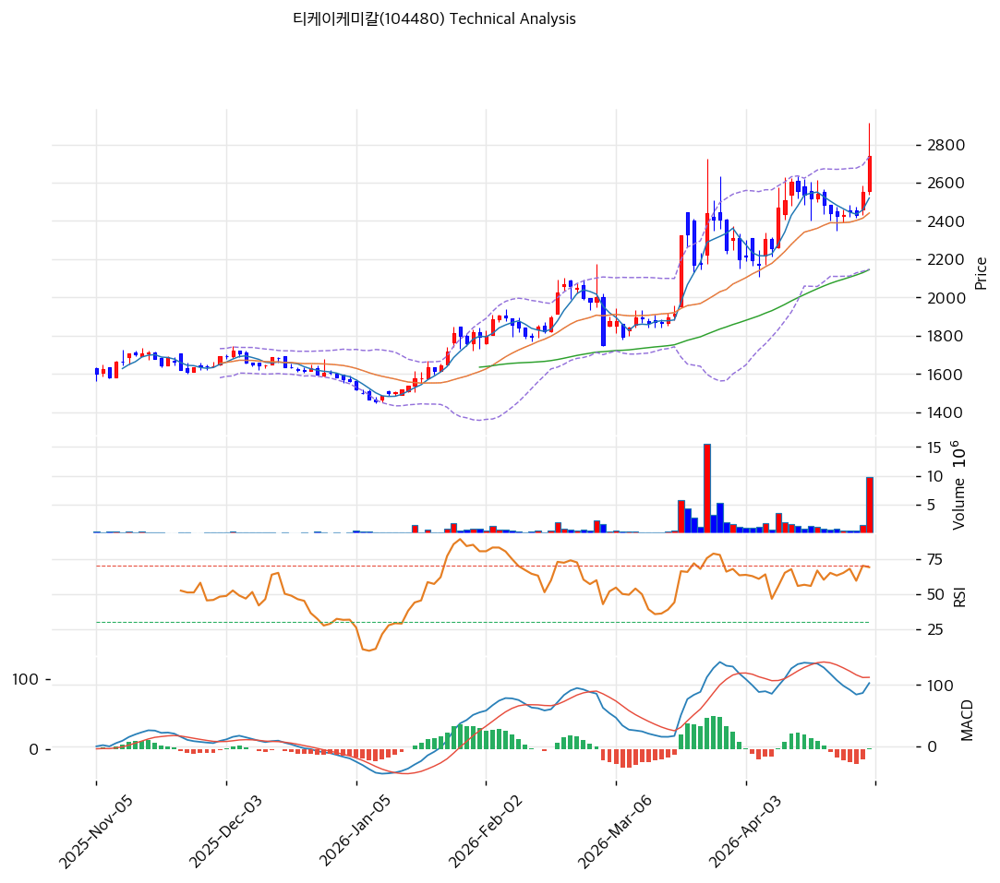

# 티케이케미칼(104480) 기술적 분석

2026-04-30 | T2 Technical Analysis

---

## 차트

---

## 1. 가격 현황

| 항목 | 값 |
|------|-----|
| 현재가 | 2,740원 (+7.45%) |
| 52주 고가 | 2,740원 |
| 52주 저가 | 1,454원 |
| 52주 범위 위치 | 100.0% |
| 거래량 | 20일 평균 대비 7.87x |

---

## 2. 차트 패턴 분석

### 2.1 캔들스틱 패턴

| 패턴 | 위치 | 신뢰도 | 해석 |
|------|------|--------|------|
| 장대양봉 (Marubozu형) | 최근 1일 (2026-04-30) | 강 | 매수 시그널 — 거래량 7.87배 동반한 종가 부근 마감의 큰 양봉으로 신고가 돌파 의지 강력 |
| 적삼병 진행형 | 최근 3~4일 | 중 | 매수 시그널 — 2,500원대 박스 상단을 연속 양봉으로 돌파, 단기 모멘텀 가속 |
| 윗꼬리 캔들 (장중 고점 이탈) | 최근 1일 — 종가 2,740원 vs 장중 고점 2,800원대 | 약 | 중립 — 장중 고점 대비 종가 하락폭 발생, 단기 차익실현 압력 일부 노출 |

※ 주요 캔들 패턴: 망치형, 역망치형, 장악형(상승/하락), 도지, 샛별/석별, 적삼병/흑삼병, 하라미, 유성형, 교수형 등

### 2.2 가격 구조 패턴

- **상승 채널 / 계단식 신고가 갱신** (신뢰도: 강)
  2026년 1월 저점 1,454원에서 4월 현재 2,740원까지 약 88% 상승하는 상승 채널을 형성. 채널 하단(추세선 지지 1,704원)과 상단(추세선 저항 2,505원) 모두 우상향 기울기를 유지하며, 직전 3월 고점(약 2,800원)을 재시도하는 국면. 채널 상단을 거래량 동반 돌파할 경우 피보나치 확장 1.272(3,316원)이 다음 목표가.

- **박스권 상단 돌파 시도 (2,400~2,700원 횡보 이탈)** (신뢰도: 중)
  최근 약 3주간 2,400~2,700원 구간에서 횡보하며 에너지를 응축한 후, 4/30 거래량 폭증과 함께 박스 상단을 돌파. 박스 폭(약 300원)을 가산할 경우 측정 목표치는 2,700 + 300 = 3,000원 수준. 다만 종가가 BB 상단(2,736원)에 정확히 닿은 상태로, 익일 갭상승 또는 양봉 추가 출현 여부가 진성 돌파 확정 조건.

- **이중 천정 가능성 (3월 고점 vs 4월 고점)** (신뢰도: 약)
  3월 중순 고점(약 2,800원대)과 4월 말 현재가(2,740원, 장중 2,800원대 터치)가 유사한 수준에서 형성되어 잠재적 더블탑 우려. 다만 거래량(7.87x)과 정배열 강도가 3월 고점을 압도하므로 단순 더블탑보다는 신고가 돌파 시도로 해석하는 것이 우선.

※ 주요 구조 패턴: 이중천정/바닥, 헤드앤숄더(정/역), 삼각수렴(대칭/상승/하락), 쐐기형(상승/하락), 깃발형, 페넌트, 컵앤핸들, 박스권 등

### 2.3 다이버전스

- **RSI 잠재적 하락 다이버전스** (신뢰도: 약)
  3월 중순 RSI 고점(차트상 약 75~78)과 4월 말 RSI 고점(70.6)을 비교하면, 가격은 신고가를 시도하는 반면 RSI는 직전 고점을 하회. 추세 약화 가능성을 시사하지만 거래량 폭증 단계에서는 RSI가 후행 반응할 수 있어 추가 확인 필요.

- **MACD 히든 매수 다이버전스 (지속 시사)** (신뢰도: 중)
  MACD 103 / Signal 102 / Histogram +1로 매수권 유지 중이나 히스토그램 확장은 멈춘 상태. 다만 가격이 직전 고점을 갱신하고 MACD가 0선 위에서 안정 유지되는 모습은 추세 지속을 시사하는 히든 다이버전스 구조에 가깝다.

※ RSI·MACD 기반 | 상승 다이버전스 = 가격↓ 지표↑ (반등 시사), 하락 다이버전스 = 가격↑ 지표↓ (하락 시사), 히든 다이버전스 = 기존 추세 지속 시사

### 2.4 패턴 종합 판단

장대양봉 + 거래량 7.87배 폭증 + 정배열 강세 조합으로 단기 모멘텀은 명확한 매수우위. 다만 RSI 70.6 과매수권 진입과 BB 상단 정확히 밀착, 3월 고점 부근에서의 잠재적 이중천정 가능성이 단기 차익실현 압력으로 작용할 수 있다. 진성 돌파 확정 시 3,000~3,316원 구간이 다음 타깃이나, 익일 윗꼬리 또는 음봉 출현 시 2,545원(피봇 S1) 또는 PRZ(강) 2,505~2,567원까지의 되돌림 가능성을 열어둘 필요가 있다.

---

## 3. 이동평균선 — 정배열 (강세)

| MA | 값 | 현재가 괴리율 | 위치 |
|----|-----|--------------|------|
| MA5 | 2,520원 | +8.7% | 위 |
| MA20 | 2,441원 | +12.2% | 위 |
| MA60 | 2,145원 | +27.7% | 위 |
| MA120 | 1,890원 | +45.0% | 위 |
| MA200 | 1,825원 | +50.1% | 위 |

**해석**: MA5 > MA20 > MA60 > MA120 > MA200 완벽한 정배열로 중장기 추세 명확한 강세. 다만 MA200 대비 +50.1%의 큰 괴리율은 평균 회귀 압력 누적 단계로, 단기 조정 시 MA20(2,441원) 또는 MA5(2,520원)가 1차 지지선 역할 예상.

---

## 4. 보조 지표

### RSI(14) — 70.6 (🔴과매수)

70선을 상향 돌파한 직후로 과매수권 진입 초입. 일반적으로 강한 추세에서는 RSI가 80~90까지 진행되기도 하므로 즉각적인 매도 신호로 해석하기보다는 단기 과열 경계 신호로 봐야 한다. 다이버전스 해석은 2.3 참조.

### MACD(12,26,9)

| 항목 | 값 |
|------|-----|
| MACD | 103.0 |
| Signal | 102.0 |
| Histogram | +1.0 |
| 크로스 상태 | 매수 구간 (수축 중) |

**해석**: MACD가 Signal 위에 있어 매수 구간이나 히스토그램이 +1로 매우 미약하고 확장 단계가 아님. 골든크로스 후 모멘텀이 약화되는 국면으로, 추가 상승 시 히스토그램 재확장 여부가 추세 강도의 핵심 단서. 다이버전스 해석은 2.3 참조.

### 볼린저밴드(20, 2σ)

| 항목 | 값 |
|------|-----|
| 상단 | 2,736원 |
| 중단 (MA20) | 2,441원 |
| 하단 | 2,147원 |
| 밴드 폭 | 24.1% |
| 현재 위치 | 상단 근접 |

**해석**: 현재가 2,740원이 BB 상단 2,736원을 살짝 상회하며 밴드 워킹 시도 중. 밴드 폭 24.1%로 확장 국면이며, 강한 추세 발생 시 밴드 워킹이 수일~수주간 지속될 수 있다. 다만 밴드 상단 이탈 후 종가가 상단 안으로 회귀할 경우 단기 조정 신호이므로 익일 종가 위치가 핵심.

### 스토캐스틱(14, 3, 3)

| 항목 | 값 |
|------|-----|
| Slow %K | 65.9 |
| Slow %D | 62.1 |
| 크로스 상태 | 골든크로스 |
| 판단 | 중립 |

---

## 5. 지지/저항 — 추세선 · 피보나치 · PRZ 통합

### 5.1 피보나치 되돌림/확장

| 구분 | 비율 | 가격 | 현재가 대비 |
|------|------|------|-----------|
| Swing High | — | 2,915원 | +6.4% |
| 되돌림 | 0.236 | 2,567원 | -6.3% |
| 되돌림 | 0.382 | 2,352원 | -14.2% |
| 되돌림 | 0.5 | 2,178원 | -20.5% |
| 되돌림 | 0.618 | 2,003원 | -26.9% |
| 되돌림 | 0.786 | 1,756원 | -35.9% |
| Swing Low | — | 1,440원 | -47.4% |
| 확장 | 1.272 | 3,316원 | +21.0% |
| 확장 | 1.382 | 3,478원 | +26.9% |
| 확장 | 1.618 | 3,827원 | +39.7% |
| 확장 | 2.0 | 4,390원 | +60.2% |

※ 피보나치 기준: 상승 추세 (Swing Low 1,440원 → Swing High 2,915원)
※ 되돌림 = 직전 추세에서 되돌아온 비율, 확장 = 추세 방향 목표가

### 5.2 추세선

| 추세선 | 방향 | 현재 교차가 | 포인트 수 | 해석 |
|--------|------|-----------|---------|------|
| 지지선 | 상승 | 1,704원 | 6개 | 1월 저점부터 형성된 강한 상승 지지선, 현재가 대비 -37.8%로 멀어 즉각적 의미는 낮음 |
| 저항선 | 상승 | 2,505원 | 6개 | 상승 추세선이 저항 역할에서 지지로 전환되는 구간, 현재가 -8.6% 위치로 1차 되돌림 지지 후보 |

### 5.3 PRZ (Potential Reversal Zone)

| 방향 | 가격 범위 | 신뢰도 | 근거 |
|------|---------|--------|------|
| 지지 | 2,505~2,567원 | 강 | 추세선 저항(상승 전환), MA5, 피봇 S1, 피보나치 0.236 되돌림 |
| 지지 | 2,350~2,352원 | 약 | 피봇 S2, 피보나치 0.382 되돌림 |
| 지지 | 2,145~2,178원 | 약 | MA60, 피보나치 0.5 되돌림 |

※ PRZ = 추세선 · 피보나치 · 피봇 · MA 등 복수 지표가 겹치는 가격 구간. 겹치는 소스가 많을수록 반전 확률 상승.

### 5.4 종합 지지/저항 테이블

| 구분 | 가격 | 근거 |
|------|------|------|
| 저항 | 3,316원 | 피보나치 1.272 확장 (단기 1차 목표) |
| 저항 | 2,925원 | 피봇 R1 |
| 저항 | 2,915원 | Swing High (직전 고점) |
| **현재가** | **2,740원** | — |
| 지지 | 2,567원 | 피보나치 0.236 되돌림 |
| 지지 | 2,545원 | 피봇 S1 |
| 지지 | 2,534원 | PRZ (강) — 추세선·MA5·피봇 S1 복합 |
| 지지 | 2,441원 | MA20 |
| 지지 | 2,350원 | 피봇 S2 / 피보나치 0.382 되돌림 (PRZ 약) |
| 지지 | 2,162원 | MA60 / 피보나치 0.5 되돌림 (PRZ 약) |

---

## 6. 시그널 종합

| 지표 | 내용 | 시그널 |
|------|------|--------|
| **차트 패턴** | 장대양봉+거래량 폭증 신고가 시도 vs 잠재적 이중천정·RSI 약 다이버전스 | 🟢 |
| 이동평균선 | 정배열, MA20 +12.2% | 🟢 |
| RSI | 70.6 — 과매수 🔴 | 🔴 |
| MACD | 매수 구간이나 히스토그램 +1 미약·수축 | ⚪ |
| 볼린저밴드 | 상단 밀착, 밴드 폭 24.1% | ⚪ |
| 스토캐스틱 | 골든크로스, K=65.9 | ⚪ |
| 거래량 | 7.87x — 강력 동반 | 🟢 |

**종합 판단**: 🟢 매수 3개 / 🔴 매도 1개 / ⚪ 중립 3개 → **매수우위**

거래량 7.87배 폭증과 함께 박스권 상단 돌파를 시도하는 단계로 단기 모멘텀은 강력. 다만 RSI 70.6 과매수권 진입과 BB 상단 정확히 닿은 위치, MACD 히스토그램 수축은 단기 과열을 시사한다. 익일 추가 양봉 + BB 상단 안착 시 3,000~3,316원으로 추가 상승 여력이 열리며, 윗꼬리·음봉 출현 시 PRZ(강) 2,505~2,567원 또는 MA20 2,441원까지의 단기 되돌림 시나리오가 우세하다.

---

## 7. 전략 제안

### 보유 중인 경우
- **홀드**
- 익절 라인: 2,795원 (전일 종가 +2% / BB 상단 이탈 직후 단기 차익실현 라인)
- 손절 라인: 2,350원 (피봇 S2 / 피보나치 0.382 되돌림 / PRZ(약) 하단 — 이탈 시 추세 훼손)
- 리스크/리워드: (2,795-2,740) / (2,740-2,350) = 55 / 390 = **0.14 (불리)** → 단기 추격 매수보다는 분할 익절 권장. 추가 강세 확인 시 2차 익절 3,316원(피보나치 1.272 확장)으로 상향 조정 가능.

### 진입 대기인 경우
- **관망**
- 1차 진입가: 2,545원 (피봇 S1 + PRZ(강) 하단, 단기 되돌림 1차 지지)
- 2차 진입가: 2,441원 (MA20 + BB 중단, 추세 유지 시 강한 지지)
- 진입 조건: ① RSI 60 이하로 식어 단기 과열 해소 확인, ② 2,545원 또는 2,441원 터치 시 양봉/망치형 등 반전 캔들 출현, ③ 거래량 평균 수준 회복(현재 7.87배는 단기 변동성 위험 신호) — 3가지 모두 충족 시 분할 진입.
