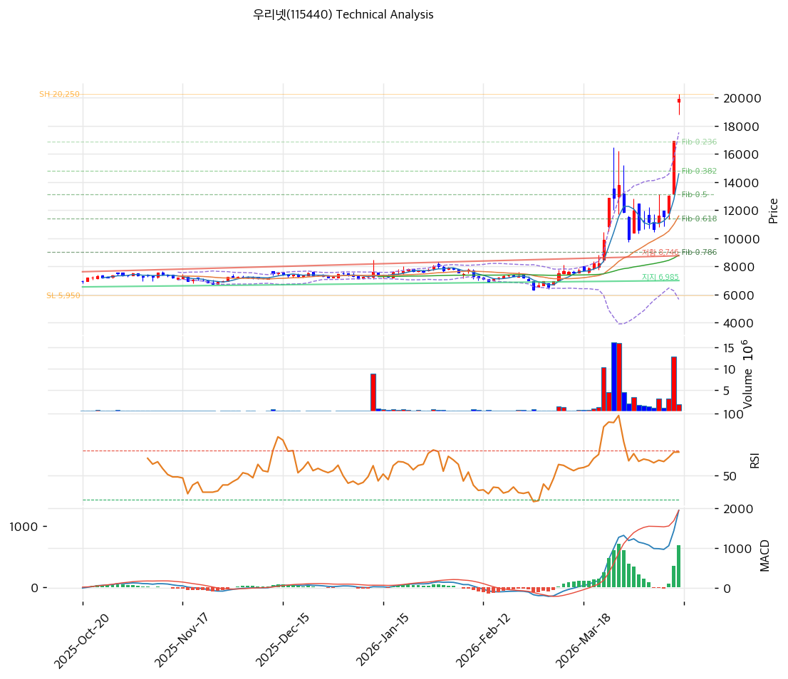

# 우리넷(115440) 기술적 분석

2026-04-14 | T2 Technical Analysis

---

## 차트

---

## 1. 가격 현황

| 항목 | 값 |
|------|-----|
| 현재가 | 20,000원 (+18.34%) |
| 52주 고가 | 20,250원 |
| 52주 저가 | 6,010원 |
| 52주 범위 위치 | 100.0% |
| 거래량 | 20일 평균 대비 0.38x |

---

## 2. 차트 패턴 분석

### 2.1 캔들스틱 패턴

| 패턴 | 위치 | 신뢰도 | 해석 |
|------|------|--------|------|
| 52주 신고가 근접 급등 | 2026-04-14 (당일 +18.34%) | 강 | 단일 세션 급등으로 52주 고가권(20,250원) 돌파 시도. 대형 호재 공시 또는 테마 유입으로 추정되며, 거래량이 평균 대비 0.38x로 동반되지 않아 지속성 신뢰도 제한. |
| 장대 양봉 (갭업 가능성) | 당일 | 중 | +18% 이상 급등은 강한 매수세를 의미하지만, 거래량 미동반 급등은 차익실현 후 되돌림 가능성 내포. 다음 세션 거래량 동반 여부가 추세 지속의 핵심 확인 변수. |

※ 일봉 기준. 당일 거래량(0.38x)이 평균을 하회하여 캔들 패턴의 신뢰도가 제한됨.

### 2.2 가격 구조 패턴

- **강한 상승 추세 채널** (신뢰도: 강)
  52주 저점 6,010원에서 현재가 20,000원까지 약 +233% 상승하는 강력한 상승 추세가 형성되어 있다. MA5(14,602원)·MA20(11,586원)·MA60(8,792원)·MA120(8,026원)·MA200(7,457원)의 완전 정배열이 중장기 강세 구조를 확인해 준다. 현재가가 52주 고가(20,250원) 바로 아래에 위치하여 역사적 저항이 거의 없는 가격 구간에 진입했으며, 돌파 성공 시 상단 저항이 피보나치 확장 레벨까지 부재하다.

- **볼린저밴드 상단 이탈** (신뢰도: 강)
  현재가(20,000원)가 볼린저밴드 상단(17,554원)을 크게 상회(+13.9%)하여 2σ 구간을 이탈한 상태다. 밴드 폭 103.0%로 이미 극단적으로 확장된 상황이며, 통계적으로 중단(MA20, 11,586원)으로의 회귀 압력이 높아질 수 있다. 단기 과열 해소를 위한 횡보 또는 조정 국면 진입 가능성을 시사한다.

- **52주 고가 돌파 시도** (신뢰도: 중)
  현재가 20,000원은 52주 고가 20,250원의 98.8% 수준으로, 사실상 고가권에 위치한다. 이 구간을 거래량 동반으로 돌파하면 역사적 저항선이 없는 신고가 영역으로 진입하며, 피보나치 확장 1.272배(24,140원)가 다음 목표가가 된다. 반면 돌파 실패 시 이중천정 패턴 형성 가능성에 주의가 필요하다.

### 2.3 다이버전스

- **RSI 과매수 구간 진입** (신뢰도: 강)
  RSI(14) = 79.5로 과매수 기준선(70)을 상회 중이다. 현재가가 신고가권을 기록하면서 RSI도 고점을 갱신하고 있어 다이버전스는 미관찰되나, 79.5 수준에서는 추가 상승 여력보다 되돌림 압력이 증가하는 구간이다. 추세 과열 경고 시그널로 해석한다.

- **MACD 히스토그램 확대** (신뢰도: 강)
  MACD(1,948) > Signal(1,257), 히스토그램 +691로 확대 중이다. 매수 모멘텀이 강화되고 있음을 확인할 수 있으며, 단기적으로는 추세 지속을 지지한다. 다이버전스는 미관찰.

### 2.4 패턴 종합 판단

현재 차트는 52주 고가권 직전에서 당일 +18.34% 급등이 발생한 극단적 강세 구조를 보이고 있다. MACD 히스토그램 확대와 완전 정배열이 추세 지속 가능성을 지지하지만, RSI 79.5 과매수·볼린저밴드 상단 이탈·거래량 미동반(0.38x)이라는 세 가지 경고 신호가 동시에 발생하고 있다. 거래량 없는 급등은 지속성이 낮은 경우가 많으며, 단기적으로 20,250원 고가 돌파 여부와 거래량 동반 확인이 향후 방향성을 결정하는 핵심 변수다.

---

## 3. 이동평균선 — 정배열 (강세)

| MA | 값 | 현재가 괴리율 | 위치 |
|----|-----|--------------|------|
| MA5 | 14,602원 | +37.0% | 위 |
| MA20 | 11,586원 | +72.6% | 위 |
| MA60 | 8,792원 | +127.5% | 위 |
| MA120 | 8,026원 | +149.2% | 위 |
| MA200 | 7,457원 | +168.2% | 위 |

**해석**: MA5~MA200 모두 현재가 아래에 위치한 완전 정배열 구조로 중장기 강세 추세가 확립되어 있다. 단, 현재가가 MA20 대비 +72.6%, MA200 대비 +168.2% 이격한 극단적 과열 상태다. 통상적으로 MA20 대비 30% 이상 이격 시 단기 과열로 판단하는 점에서, 현재 +72.6%는 역사적 고점에 해당하는 과열도다. 조정 시 MA5(14,602원)가 1차 지지선, MA20(11,586원)이 2차 핵심 지지선으로 기능할 것이다.

---

## 4. 보조 지표

### RSI(14) — 79.5 (과매수 🔴)

RSI 79.5는 과매수 구간(70 이상)에 위치하며, 단기 고점 형성 또는 모멘텀 둔화를 경고하는 수준이다. 과매수권에서도 강한 추세가 지속될 수 있으나, 현재 수준에서 추가 진입보다는 조정 이후 재진입 전략이 유효하다.

### MACD(12,26,9)

| 항목 | 값 |
|------|-----|
| MACD | 1,948 |
| Signal | 1,257 |
| Histogram | +691 |
| 크로스 상태 | 매수 구간 (확대 중) |

**해석**: MACD가 Signal을 상회하는 매수 구간이며, 히스토그램 +691로 확대 중이다. 모멘텀이 강화되고 있음을 확인하나, 이미 상당한 수준으로 벌어진 MACD 갭은 향후 수축(히스토그램 감소)으로 전환될 경우 추세 약화 신호로 해석해야 한다.

### 볼린저밴드(20, 2σ)

| 항목 | 값 |
|------|-----|
| 상단 | 17,554원 |
| 중단 (MA20) | 11,586원 |
| 하단 | 5,619원 |
| 밴드 폭 | 103.0% |
| 현재 위치 | 상단 근접 (초과) |

**해석**: 현재가(20,000원)가 볼린저밴드 상단(17,554원)을 크게 초과하여 밴드 바깥에 위치한다. 밴드 폭 103.0%는 극단적으로 확장된 상태로, 추가 밴드 확장보다는 중단(MA20 11,586원) 방향으로의 수축 압력이 높아지는 구간이다. 단기 과열 해소 가능성이 높다.

### 스토캐스틱(14, 3, 3)

| 항목 | 값 |
|------|-----|
| Slow %K | 85.1 |
| Slow %D | 66.9 |
| 크로스 상태 | 골든크로스 |
| 판단 | 과매수 |

---

## 5. 지지/저항 — 추세선 · 피보나치 · PRZ 통합

### 5.1 피보나치 되돌림/확장

| 구분 | 비율 | 가격 | 현재가 대비 |
|------|------|------|-----------|
| Swing High | — | 20,250원 | -1.2% |
| 되돌림 | 0.236 | 16,875원 | -15.6% |
| 되돌림 | 0.382 | 14,787원 | -26.1% |
| 되돌림 | 0.5 | 13,100원 | -34.5% |
| 되돌림 | 0.618 | 11,413원 | -42.9% |
| 되돌림 | 0.786 | 9,010원 | -54.9% |
| Swing Low | — | 5,950원 | -70.3% |
| 확장 | 1.272 | 24,140원 | +20.7% |
| 확장 | 1.382 | 25,713원 | +28.6% |
| 확장 | 1.618 | 29,087원 | +45.4% |
| 확장 | 2.0 | 34,550원 | +72.8% |

※ 피보나치 기준: 상승 추세 (Swing Low 5,950원 → Swing High 20,250원)
※ 되돌림 = 직전 추세에서 되돌아온 비율, 확장 = 추세 방향 목표가

### 5.2 추세선

| 추세선 | 방향 | 현재 교차가 | 포인트 수 | 해석 |
|--------|------|-----------|---------|------|
| 지지선 | 상승 | 6,985원 | 6개 | 52주 저점 이후 형성된 장기 상승 지지선. 현재가 대비 -65.1% 위치로 단기 지지선으로는 기능하지 않으나, 장기 추세 이탈의 방어선 역할. |
| 저항선 | 상승 | 8,746원 | 6개 | 단기 저항 구간이었으나 이미 상향 돌파 완료. 하락 시 강한 지지선으로 전환 가능. |

### 5.3 PRZ (Potential Reversal Zone)

| 방향 | 가격 범위 | 신뢰도 | 근거 |
|------|---------|--------|------|
| 지지 | 14,602~14,787원 | 약 | MA5(14,602원) + 피보나치 0.382 되돌림(14,787원) 중첩 |

※ PRZ = 추세선·피보나치·피봇·MA 등 복수 지표가 겹치는 가격 구간. 현재 조정 발생 시 1차 의미 있는 지지 구간은 MA5-피보나치 0.382 중첩 구간(14,600~14,800원)이다. 다만 신뢰도 '약'으로 분류된 만큼, 조정 깊이에 따라 MA20(11,586원)·피보나치 0.618(11,413원) 중첩 구간이 더 강력한 지지로 기능할 수 있다.

### 5.4 종합 지지/저항 테이블

| 구분 | 가격 | 근거 |
|------|------|------|
| 저항 | 24,140원 | 피보나치 1.272 확장 (1차 상방 목표) |
| 저항 | 20,570원 | 피봇 R1 |
| 저항 | 20,250원 | 52주 고가 / Swing High |
| **현재가** | **20,000원** | — |
| 지지 | 19,110원 | 피봇 S1 |
| 지지 | 18,220원 | 피봇 S2 |
| 지지 | 16,875원 | 피보나치 0.236 되돌림 |
| 지지 | 14,694원 | PRZ (약) — MA5 + 피보나치 0.382 |
| 지지 | 13,100원 | 피보나치 0.5 되돌림 |
| 지지 | 11,586원 | MA20 / 피보나치 0.618(11,413원) 근접 강지지 구간 |
| 지지 | 8,792원 | MA60 / 추세선 저항→지지 전환(8,746원) 중첩 |

---

## 6. 시그널 종합

| 지표 | 내용 | 시그널 |
|------|------|--------|
| **차트 패턴** | 52주 고가권 급등, 완전 정배열, 볼린저밴드 상단 이탈 — 추세 강하나 단기 과열 | ⚪ |
| 이동평균선 | 완전 정배열, MA20 대비 +72.6% 과열 이격 | 🟢 (추세) / 🔴 (과열) |
| RSI | 79.5 — 과매수 🔴 | 🔴 |
| MACD | 매수 구간, 히스토그램 +691 확대 중 | 🟢 |
| 볼린저밴드 | 상단 초과(+13.9%), 밴드 폭 103.0% — 과열 | 🔴 |
| 스토캐스틱 | 골든크로스, K=85.1 — 과매수 구간 | 🔴 |
| 거래량 | 0.38x — 약함 (급등 대비 미동반) | ⚪ |

**종합 판단**: 🟢 매수 2개 / 🔴 매도 3개 / ⚪ 중립 2개 → **매도우위**

중장기 추세는 완전 정배열과 MACD 매수 크로스로 강세 구조를 유지하고 있으나, 단기적으로는 RSI 79.5·볼린저밴드 상단 이탈·스토캐스틱 과매수·거래량 미동반이라는 복합 과열 신호가 집중되고 있다. 당일 +18%의 급등이 거래량 없이 발생했다는 점은 지속성에 대한 의구심을 높이며, 52주 고가(20,250원) 돌파를 거래량 동반으로 확인하지 못할 경우 단기 차익실현 매물에 의한 되돌림 가능성이 높다.

---

## 7. 전략 제안

### 보유 중인 경우
- **비중축소 (부분 차익실현)**
- 익절 라인: 20,400원 (52주 고가 20,250원 + 피봇 R1 20,570원 사이 — 신고가 돌파 후 단기 목표)
- 손절 라인: 18,220원 (피봇 S2 — 급등 세션 지지 이탈 시)
- 리스크/리워드: 수익 +2.0% / 손실 -8.9% → R/R 비율 약 0.22 (현재 가격에서 신규 매수 비권장)

### 진입 대기인 경우
- **관망 (단기 조정 후 재진입 검토)**
- 1차 진입가: 19,110원 (피봇 S1 — 단기 조정 후 1차 지지 반등 확인 시)
- 2차 진입가: 14,694원 (PRZ 지지 구간 — MA5 + 피보나치 0.382 중첩)
- 진입 조건: ① 52주 고가(20,250원) 거래량 동반(20일 평균 대비 1.5x 이상) 돌파 확인 후 추격 진입, 또는 ② RSI 70 하회 + 피봇 S1(19,110원) 안착 확인 후 단기 매수. 현재가에서의 신규 진입은 과매수 리스크로 비권장.
