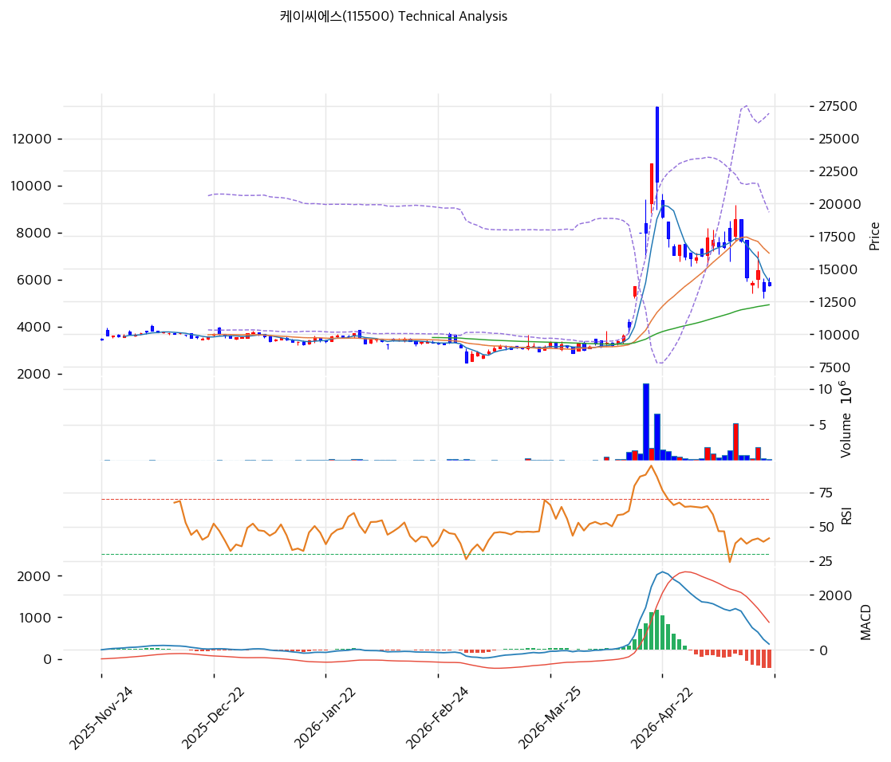

# 기술적분석

## 차트

## 1. 가격 현황

* 현재가 **13,710원** (52주 39%, 정점 23,100원 대비 -41%)
* 52주: 23,100 / 7,780원

## 2. 차트 패턴

* 4,000원 박스 → 2026-04 거래량 폭증 + 23,100원 정점 → 2026-05 -41% 대규모 조정
* 단기 박스권 형성 단계

## 3. 이동평균선

* MA20 -15.4% / MA200 +28.9%
* 단기 MA 아래·장기 MA 위

## 4. 보조 지표

* RSI 45.1 (중립·과매도 임박)
* 시그널: 매수 1 / 매도 1 / 중립 4 → 중립

## 5. 전략

* 진입 대기: MA60 (10,000원 추정) 또는 MA200 (7,780원 영역) 분할
* 정점 후 -41% 조정 = 단기 평균회귀 진행
