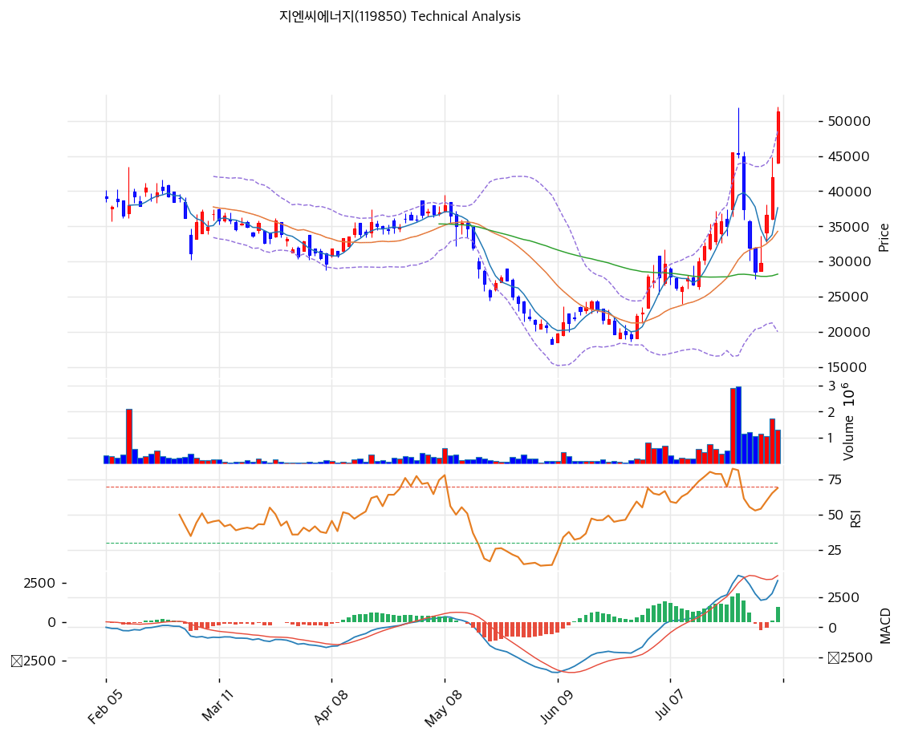

# 지엔씨에너지(119850) 기술적 분석

2026-08-04 | T2 Technical Analysis

---

## 차트

---

## 1. 가격 현황

| 항목 | 값 |
|------|-----|
| 현재가 | **51,200원 (+21.9%)** — 2026-08-04 장중 |
| 직전 거래일 종가 (2026-08-03) | 42,000원 |
| **당일 장중 변동폭** | **43,950 ~ 52,000원 (18.3%)** |
| 52주 고가 | 51,900원 (2026-07-24 장중) / 45,550원 (7/23 종가) |
| **52주 저가** | **18,350원** (2026-06-08) |
| 52주 밴드 배율 | **2.83배** |
| **저점 대비** | **+179.0%** (2개월) |
| 20일 평균 거래량 | 923,928주 |
| **20일 평균 거래대금** | **약 345억원** |
| 당일 거래량 (09:37 기준) | 1,297,289주 |

> ⚠️ **본 T2의 기준가는 2026-08-04 장중가다.** 수집 시각(09:37)이 장중이라 모든 지표가 실시간 시세(51,400원, +22.38%)로 산출됐다. **당일 장중 변동폭이 43,950\~52,000원(18.3%)에 달하므로 종가와 크게 다를 수 있다.**

> 🚨 **KIS 52주 필드 오류 (6종목 연속)**: KIS의 52주 고 52,000 / 저 43,950은 **당일 장중 고·저가**다. 그 결과 피봇 포인트가 이 값들로 계산돼 실제 의미가 제한적이며, 아래에서 대안 레벨을 제시했다.

### 최근 두 달 궤적 — 롤러코스터

| 일자 | 종가 | 등락 | 거래량 | 국면 |
|------|-----:|-----:|------:|------|
| 2026-06-08 | **18,350원** | — | — | **52주 최저** |
| 2026-07-14 | 30,000원 | | 569,293 | 1차 상승 |
| 2026-07-16 | 33,950원 | | 771,513 | |
| 2026-07-22 | 35,050원 | | 517,090 | |
| **2026-07-23** | **45,550원** | **+30.0%** | **2,885,443** | **폭등 (수주 반영)** |
| 2026-07-24 | 45,300원 | -0.5% | 2,970,116 | 장중 **51,900원** |
| 2026-07-27 | 37,400원 | -17.4% | 1,158,305 | 급락 시작 |
| 2026-07-28 | 32,000원 | -14.4% | 1,228,495 | |
| **2026-07-29** | **28,600원** | -10.6% | 1,055,662 | **고점 대비 -37.2%** |
| 2026-07-30 | 29,750원 | +4.0% | 1,156,131 | 반등 |
| 2026-07-31 | 36,600원 | **+23.0%** | 1,055,703 | |
| 2026-08-03 | 42,000원 | **+14.8%** | 1,752,297 | |
| **2026-08-04 (장중)** | **51,200원** | **+21.9%** | 1,297,289 | **신고가 재도전** |

**두 달 사이 +148.2% → -37.2% → +79.0%.** 6월 8일 저점 대비 **+179.0%**다.

---

## 2. 차트 패턴 분석

### 2.1 캔들스틱 패턴

| 패턴 | 위치 | 신뢰도 | 해석 |
|------|------|--------|------|
| **폭등 장대양봉** | **2026-07-23** | **강** | 35,050 → **45,550원(+30.0%)**. 거래량 **2,885,443주(20일 평균의 3.1배)**. 6\~7월 AI 데이터센터 수주가 시장에 반영된 날 |
| **긴 위꼬리 + 반락** | **2026-07-24** | **강** | 장중 **51,900원**까지 올랐다가 45,300원 마감. 위꼬리 6,600원(12.7%). 거래량 297만주로 최대. **1차 고점의 매도 압력** |
| 3일 급락 | 07-27\~29 | 강 | 45,300 → 37,400 → 32,000 → **28,600원**. 3거래일 **-36.9%**. 급등분의 상당 부분 되돌림 |
| **3연속 급등 양봉** | 07-31\~08-04 | 강 | 29,750 → 36,600(+23.0%) → 42,000(+14.8%) → **51,200(+21.9%)**. 3거래일 **+72.1%** |

**7월 23\~24일과 7월 31일\~8월 4일, 두 번의 급등 파동**이 있었다. 첫 파동은 45,550원(장중 51,900원)에서 멈추고 -37.2% 되돌렸으며, 두 번째 파동이 지금 진행 중이다.

### 2.2 가격 구조 패턴

- **V자 반등 후 재상승 — 이중 파동** (신뢰도: 중)
  6월 8일 18,350원 저점에서 7월 24일 장중 51,900원까지 **+182.9%** 급등 → 7월 29일 28,600원까지 **-44.9%** 되돌림 → 8월 4일 51,200원으로 재상승. **두 번째 파동이 첫 번째 고점을 시험하는 국면**이다.

- **7월 24일 장중 고가 51,900원이 결정적 관문** (신뢰도: 강)
  현재가 51,200원은 이 선 **-1.3%** 아래다. **돌파하면 위쪽에 매물대가 없고, 실패하면 이중천정(Double Top)**이 성립한다. 이중천정이 확인될 경우 목표 하락폭은 51,900 - 28,600 = 23,300원으로, 이론적 목표가는 28,600원이다.

- **⚠️ 이동평균선이 비정배열이다** (신뢰도: 강)
  MA5(37,670) > MA20(34,305) > MA200(32,872) > MA120(31,788) > **MA60(28,227)**. 단기는 정렬됐으나 **MA60이 가장 낮은 기형적 배열**이다. 2026년 상반기 급락(1월 32,650원 → 6월 18,350원)의 흔적이며, **중장기 추세가 아직 정리되지 않았음**을 뜻한다.

### 2.3 다이버전스 — 🚨 이번 분석의 핵심 경고

| 시점 | 종가 | RSI | MACD |
|------|-----:|----:|-----:|
| 2026-07-23 | 45,550원 | **80.9** | 3,657 |
| 2026-07-24 | 45,300원 | 80.1 | **4,333** (최고) |
| 2026-07-29 | 28,600원 | 46.3 | 2,809 |
| 2026-08-03 | 42,000원 | 62.7 | 2,822 |
| **2026-08-04 (장중)** | **51,400원** | **70.0** | **3,911** |

- **RSI 하락 다이버전스** (신뢰도: **강**)
  가격은 45,550원(7/23) → **51,400원(+12.8%)**으로 신고가를 갱신했는데, RSI는 **80.9 → 70.0으로 10.9포인트 하락**했다. 명확한 베어리시 다이버전스다.

- **MACD 하락 다이버전스** (신뢰도: **강**)
  MACD도 7월 24일 **4,333**에서 현재 **3,911**로 **-9.7%** 낮다. 가격이 더 높은데 모멘텀은 더 약하다.

- **두 지표가 동시에 하락 다이버전스를 낸다.** 7월 23\~24일의 첫 급등이 더 강했고, **이번 재상승은 모멘텀이 그에 못 미친다.** 통상 두 번째 파동의 모멘텀이 약할 때 이중천정으로 귀결될 확률이 높아진다.

- **MACD 골든크로스는 유지** (신뢰도: 중)
  히스토그램이 7월 30일 **-551**에서 8월 3일 **+84**, 현재 **+938**로 재확대됐다. 방향 자체는 상방이다.

### 2.4 패턴 종합 판단

**단기 방향은 상방이나, 이번 국면은 "첫 고점의 재시험"이지 새로운 추세가 아니다.**

**긍정 요인**: 3거래일 +72.1%의 강한 반등, MACD 히스토그램 재확대(+938), 거래대금 345억의 충분한 유동성, 52주 신고가 근접.

**부정 요인**: ① **RSI·MACD 동시 하락 다이버전스**, ② 이동평균선 비정배열(MA60이 최저), ③ 볼린저 상단 **5.8% 이탈**, ④ MA200 대비 **+56.4%** 괴리, ⑤ 당일 장중 변동폭 **18.3%**의 극단적 변동성.

**T1에서 확인한 펀더멘털을 함께 봐야 한다** — 이 상승은 2026년 6\~7월 AI 데이터센터 수주 **1,370.5억**(2025년 매출의 52.2%)이 촉매다. 실체가 있는 재료다. **그러나 같은 기간 실적은 4개 분기 연속 매출 감소, 2026 Q1 영업이익 -70.6%로 부진하다.** 수주의 납기가 2028\~2029년이라 **매출 인식까지 시차가 있다.**

**따라서 51,900원 돌파 여부가 단기 방향을 가르고, 2026 Q2 실적(8월 중순)이 중기 방향을 가른다.**

---

## 3. 이동평균선 — ⚠️ 비정배열

| MA | 값 | 현재가 괴리율 | 순서 |
|----|-----|--------------|----|
| MA5 | 37,670원 | **+36.4%** | 1위 |
| MA20 | 34,305원 | **+49.8%** | 2위 |
| MA200 | 32,872원 | **+56.4%** | 3위 |
| MA120 | 31,788원 | **+61.7%** | 4위 |
| **MA60** | **28,227원** | **+82.1%** | **5위 (최저)** |

**해석**: MA5 > MA20까지는 정렬됐으나 **MA60이 MA120·MA200보다 낮은 비정배열**이다. 파이프라인도 `is_aligned: false`로 판정했다.

**이 배열이 만들어진 이유**는 2026년 상반기의 급락이다. 1월 5일 32,650원에서 6월 8일 18,350원까지 **-43.8%** 빠지면서 MA60이 크게 눌렸고, 그 뒤 두 달 만에 +179% 급등하면서 단기 이평만 튀어 올랐다.

**괴리율이 전부 비정상이다.** MA20 대비 **+49.8%**, MA60 대비 **+82.1%**, MA200 대비 **+56.4%**. 통상 MA20 대비 +15%면 과열로 보는데 그 3배를 넘었다.

**이는 두 가지를 뜻한다.** ① 추세 전환이 진행 중이며 장기 이평이 아직 따라오지 못했다는 긍정적 해석, ② **되돌림 시 낙폭이 매우 클 수 있다**는 부정적 해석. 7월 24일 이후 4거래일에 -37.2%가 나온 것이 후자의 실증이다.

**MA20(34,305원)이 실질적 추세 방어선**이며, 현재가에서 **-33.0%** 아래다. **중간 지지가 얇다.**

---

## 4. 보조 지표

### RSI(14) — 70.0 (과매수 경계)

과매수 기준선 70에 **정확히 걸쳤다**. 다만 앞서 지적했듯 **7월 23일 RSI 80.9 대비 10.9포인트 낮은 상태에서 가격은 12.8% 높다** — 명확한 하락 다이버전스다.

**7월 23\~24일에는 RSI가 80을 넘었고, 그 직후 4거래일에 -37.2% 급락이 나왔다.** 현재 70.0은 그때보다 여유가 있으나, **RSI 75\~80 재도달 시 매도 압력이 커질 가능성**이 높다.

### MACD(12,26,9)

| 항목 | 값 |
|------|-----|
| MACD | **3,911** |
| Signal | 2,973 |
| Histogram | **+938** |
| 크로스 상태 | **매수 구간 (급확대 중)** |

**해석**: 히스토그램이 7월 30일 **-551** → 8월 3일 **+84** → 현재 **+938**로 3거래일 만에 급반전했다. 방향은 명확한 매수다.

**그러나 MACD 본선 3,911은 7월 24일 고점 4,333의 90.3%**에 그친다. **가격은 신고가인데 MACD는 이전 고점에 못 미친다** — 하락 다이버전스다.

MACD 절대값 3,911은 주가의 **7.6%**로 매우 크다. 이 수준에서는 히스토그램 축소 전환이 빠르게 올 수 있다.

### 볼린저밴드(20, 2σ)

| 항목 | 값 |
|------|-----|
| 상단 | 48,582원 |
| 중단 (MA20) | 34,305원 |
| 하단 | 20,028원 |
| **밴드 폭** | **83.2%** |
| 현재 위치 | **상단 5.8% 이탈** |

**해석**: 종가(장중) 51,400원이 상단 48,582원을 **2,818원(5.8%) 상회**해 밴드 밖으로 크게 나갔다.

**밴드 폭 83.2%는 극단적이다.** KOSDAQ 평균(12\~15%)의 **6\~7배**이며, 상단(48,582)과 하단(20,028)의 격차가 2.43배다. 이는 **최근 두 달의 ±40% 변동이 표준편차를 폭발적으로 확대**시킨 결과다.

**볼린저 상단을 5.8% 이탈한 상태는 통계적으로 오래 유지되지 않는다.** 2σ를 넘는 구간은 확률적으로 5% 미만이며, 밴드 안으로 되돌아오려면 48,582원 아래로 내려와야 한다.

### 스토캐스틱(14, 3, 3)

| 항목 | 값 |
|------|-----|
| Slow %K | **66.8** |
| Slow %D | 43.3 |
| 크로스 상태 | 골든크로스 |
| 판단 | 중립 |

%K 66.8로 과매수(80) 아래다. %D 43.3과의 격차가 23.5포인트로 크게 벌어진 **강한 상승 크로스**다.

**다른 지표들과 달리 스토캐스틱은 아직 여유가 있다.** 7월 29일 급락으로 %K가 크게 눌렸다가 회복 중이기 때문이며, **80 도달까지 대략 55,000\~57,000원 여지**가 있다.

---

## 5. 지지/저항 — 재구성

### 5.1 🚨 피보나치 산출값 무효 — 대안 제시

파이프라인이 산출한 피보나치는 **하락 추세(Swing High 38,000 → Low 19,110)** 기준이라 사용할 수 없다. 현재가 51,400원이 Swing High를 **35.3% 상회**하며, 확장 레벨이 **13,972 / 11,894 / 7,436 / 220원**으로 전부 현재가의 4분의 1 이하다.

**대안: 실제 상승 스윙(2026-06-08 저점 18,350원 → 2026-07-24 장중 고점 51,900원, 상승폭 33,550원) 기준으로 재산출**

| 구분 | 비율 | 가격 | 현재가 대비 | 겹치는 지표 |
|------|------|------|-----------|------|
| **확장 2.0** | 2.0 | 85,450원 | +66.9% | — |
| 확장 1.618 | 1.618 | 72,604원 | +41.8% | — |
| 확장 1.382 | 1.382 | 64,684원 | +26.3% | — |
| **확장 1.272** | 1.272 | **60,995원** | **+19.1%** | 1차 상방 목표 |
| **Swing High** | — | **51,900원** | **+1.4%** | **7/24 장중 최고 — 결정적 관문** |
| **현재가** | — | **51,200원** | — | |
| **되돌림 0.236** | 0.236 | **44,384원** | **-13.3%** | 7/23 종가(45,550) 근접 |
| **되돌림 0.382** | 0.382 | **39,084원** | **-23.7%** | MA5(37,670) 근접 |
| 되돌림 0.5 | 0.5 | 35,125원 | -31.4% | **MA20(34,305) 근접** |
| 되돌림 0.618 | 0.618 | 31,166원 | -39.1% | MA120(31,788) 근접 |
| 되돌림 0.786 | 0.786 | 25,530원 | -50.1% | — |
| **Swing Low** | — | 18,350원 | -64.2% | 52주 최저 |

**재산출 결과가 이동평균선과 정확히 겹친다** — 0.382 되돌림 ≈ MA5, 0.5 ≈ MA20, 0.618 ≈ MA120. 조정 시 순차적 방어선이 된다.

### 5.2 추세선

| 추세선 | 방향 | 현재 교차가 | 해석 |
|--------|------|-----------|------|
| 지지선 | **하락** (일 -65.4원) | 20,059원 | 현재가 대비 **-60.8%**. 2026년 상반기 하락기의 저점을 연결한 선으로 **실용성이 없다** |
| 저항선 | 상승 (일 +11.97원) | 42,086원 | **이미 크게 돌파**했다. 저항이 아니라 지지로 전환됐으며, 8/3 종가(42,000원)와 거의 일치한다 |

### 5.3 종합 지지/저항 테이블

| 구분 | 가격 | 근거 | 현재가 대비 |
|------|------|------|--------:|
| 저항 | 72,604원 | 피보나치 1.618 확장 | +41.8% |
| 저항 | **60,995원** | **피보나치 1.272 확장 — 1차 상방 목표** | **+19.1%** |
| 저항 | 57,167원 | 피봇 R2 | +11.7% |
| 저항 | 54,600원 | **당일 상한가** | +6.6% |
| 저항 | 54,283원 | 피봇 R1 | +6.0% |
| 저항 | **51,900원** | **7/24 장중 52주 최고 — 결정적 관문** | **+1.4%** |
| **현재가** | **51,200원** | 2026-08-04 장중 | — |
| 지지 | 49,117원 | 피봇 Pivot | -4.1% |
| 지지 | **48,582원** | **볼린저 상단 (현재 5.8% 이탈 중)** | -5.1% |
| 지지 | 46,233원 | 피봇 S1 | -9.7% |
| 지지 | **45,550원** | **7/23 종가 — 1차 파동 고점** | -11.0% |
| 지지 | 44,384원 | 피보나치 0.236 되돌림 | -13.3% |
| 지지 | 43,950원 | 당일 장중 저가 | -14.2% |
| 지지 | **42,000원** | **8/3 종가 + 상승 추세선(42,086)** | **-18.0%** |
| 지지 | 41,067원 | 피봇 S2 | -19.8% |
| 지지 | **39,084원** | **피보나치 0.382 되돌림** | -23.7% |
| 지지 | 37,670원 | MA5 | -26.4% |
| 지지 | **35,125원** | **피보나치 0.5 되돌림** | -31.4% |
| 지지 | **34,305원** | **MA20 = 볼린저 중단 — 실질 방어선** | **-33.0%** |
| 지지 | 31,788원 | MA120 + 피보나치 0.618(31,166) | -37.9% |
| 지지 | **28,600원** | **7/29 저점 = 이중천정 이론 목표가** | **-44.1%** |
| 지지 | 28,227원 | MA60 | -44.9% |
| 최후 지지 | 18,350원 | 52주 최저 | -64.2% |

**구조 요약**: 위쪽 **51,900원(7/24 장중 최고)**이 바로 1.4% 위에 있고, 돌파하면 54,283\~54,600원(피봇 R1·상한가), 그 위로 60,995원(피보 1.272)이 열린다.

아래쪽은 **45,550원(7/23 종가)**과 **42,000원(8/3 종가 + 추세선)**이 1\~2차 방어선이며, **34,305원(MA20)**까지 -33.0%로 **중간 지지가 매우 얇다.** 이중천정이 성립하면 이론 목표가는 **28,600원(-44.1%)**이다.

---

## 6. 시그널 종합

| 지표 | 내용 | 시그널 |
|------|------|--------|
| **차트 패턴** | 3거래일 +72.1% 반등, 51,900원 재시험. 단 이중천정 가능성 | 🟢 |
| **이동평균선** | **비정배열** (MA60이 최저), MA20 +49.8% / MA200 +56.4% 극단 괴리 | ⚪ |
| RSI | **70.0 — 과매수 경계**, 7/23 대비 **하락 다이버전스** | ⚪ |
| MACD | 매수 구간, 히스토그램 -551 → +938 급반전. 단 **하락 다이버전스** | 🟢 |
| 볼린저밴드 | 상단 **5.8% 이탈**, 밴드 폭 **83.2%**(KOSDAQ 평균의 6\~7배) | ⚪ |
| 스토캐스틱 | 골든크로스, %K 66.8 — 유일하게 여유 있음 | 🟢 |
| 거래량 | 1.42x, 20일 평균 거래대금 **345억** — 유동성 충분 | 🟢 |

**종합 판단**: 🟢 매수 4개 / 🔴 매도 0개 / ⚪ 중립 3개 → **매수우위 (⚠️ 다이버전스·과열 경고)**

**종합 해석**: 매도 신호가 없다는 점에서 단기 추세는 상방이다. MACD 히스토그램이 3거래일 만에 -551 → +938로 급반전했고, 거래대금 345억으로 유동성도 충분하다. 스토캐스틱은 아직 과매수가 아니다.

**그러나 세 가지가 이번 국면을 "새로운 추세"로 읽지 못하게 한다.**

**첫째, RSI와 MACD가 동시에 하락 다이버전스**를 낸다. 가격은 7월 23일 대비 +12.8%인데 RSI는 -10.9p, MACD는 -9.7%다. **두 번째 파동의 모멘텀이 첫 번째보다 약하다.**

**둘째, 이동평균선이 비정배열**이다. MA60(28,227원)이 MA120·MA200보다 낮은 기형적 배열로, 2026년 상반기 -43.8% 급락의 흔적이 남아 있다.

**셋째, 괴리와 변동성이 극단적이다.** MA20 대비 +49.8%, MA200 대비 +56.4%, 볼린저 상단 5.8% 이탈, 밴드 폭 83.2%, 당일 장중 변동폭 18.3%.

**T1의 펀더멘털이 방향을 정한다** — 2026년 6\~7월 AI 데이터센터 수주 **1,370.5억**은 실체 있는 재료다. 그러나 **실적은 4개 분기 연속 매출 감소, 2026 Q1 영업이익 -70.6%**로 부진하고, 수주의 납기가 2028\~2029년이라 매출 인식까지 시차가 있다.

**따라서 51,900원 돌파 여부가 단기, 2026 Q2 실적(8월 중순 반기보고서)이 중기 방향을 가른다.**

---

## 7. 전략 제안

### 보유 중인 경우

- **홀드 (단계적 익절 병행)**
- 익절 라인 1차: **51,900원** (7/24 장중 52주 최고, +1.4%) → **돌파 실패 시 보유분 30% 정리**. 이중천정 위험 회피
- 익절 라인 2차: **54,283\~54,600원** (피봇 R1 + 상한가, +6.0\~6.6%) → 추가 20\~30% 정리
- 익절 라인 3차: **60,995원** (피보나치 1.272 확장, +19.1%) → **보유분 절반 이상 정리 권장**
- 손절 라인: **42,000원** (8/3 종가 + 상승 추세선 42,086원, **-18.0%**). 이 선을 종가로 이탈하면 두 번째 파동이 실패한 것으로 본다
- 중간 방어선: **45,550원**(7/23 종가, -11.0%)을 종가로 이탈하면 비중을 **절반으로 축소**
- 리스크/리워드: 2차 익절 기준 **0.35 : 1** (익절 폭 3,083원 / 손절 폭 9,200원) — **불리하다.** 현재가 신규 매수는 손익비상 권하지 않으며, **기보유자의 단계적 익절이 합리적**이다
- **이벤트 대응**: **2026년 8월 중순 반기보고서(2026 Q2 실적)**가 최대 변수다. 매출 600억 이상 + OPM 15% 이상이면 홀드 연장, 미달이면 비중 축소

### 진입 대기인 경우

- **관망 — 현재가 추격 권하지 않음**

| 근거 | 내용 |
|------|------|
| **RSI·MACD 동시 하락 다이버전스** | 두 번째 파동의 모멘텀이 첫 번째보다 약하다 |
| **이중천정 위험** | 51,900원 돌파 실패 시 이론 목표가 **28,600원(-44.1%)** |
| **중간 지지 부재** | 42,000원 아래로는 34,305원(MA20)까지 -33.0%. 지지가 얇다 |
| **변동성** | 당일 장중 18.3%, 4거래일 최대 -37.2% 실적 |
| **실적 미확인** | 4개 분기 연속 매출 감소, 2026 Q1 영업이익 -70.6% |

**그럼에도 진입한다면**:
- 1차: **45,550원** (7/23 종가, -11.0%) — 거래량이 줄면서 도달할 때만
- 2차: **42,000원** (8/3 종가 + 추세선, -18.0%)
- 3차: **39,084원** (피보나치 0.382 되돌림, -23.7%)
- 최후 매수: **34,305원** (MA20 = 볼린저 중단, -33.0%)
- **추격 매수 조건**: **51,900원(7/24 장중 최고)을 거래량 200만주 이상 동반해 종가로 돌파**할 때만. 손절은 48,582원(볼린저 상단) 종가 이탈
- **가장 안전한 순서**: **2026년 8월 중순 반기보고서에서 Q2 실적을 확인한 후.** 매출 감소가 5개 분기로 늘어나면 수주 모멘텀만으로 주가를 지탱하기 어렵다

### 🚨 리스크 관리 — 이 종목 특유의 주의사항

- **당일 장중 변동폭이 18.3%(43,950\~52,000원)다.** 시장가 주문 시 체결가가 크게 벌어질 수 있다. **반드시 지정가 분할 주문**
- **볼린저 밴드 폭 83.2%, 52주 밴드 2.83배.** 4거래일에 -37.2%가 실제로 나왔다. **단일 종목 비중을 평소의 3분의 1 이하로 제한**할 것
- **20일 평균 거래대금 345억으로 유동성은 충분하다.** 이 점은 앞서 다룬 소형주들과 다르며, 대규모 진입·청산이 가능하다. **다만 유동성이 크다는 것은 급등락도 크다는 뜻**이다
- **8월 중순 반기보고서를 캘린더에 표시할 것.** 2026 Q2 매출·영업이익률이 이번 상승의 정당성을 판정한다
- **추가 수주 공시를 주시할 것.** 2026년에만 7건 이상의 단일판매·공급계약 공시가 나왔다. 신규 수주가 계속되면 조정이 얕게 끝나고, 멈추면 되돌림이 깊어진다
