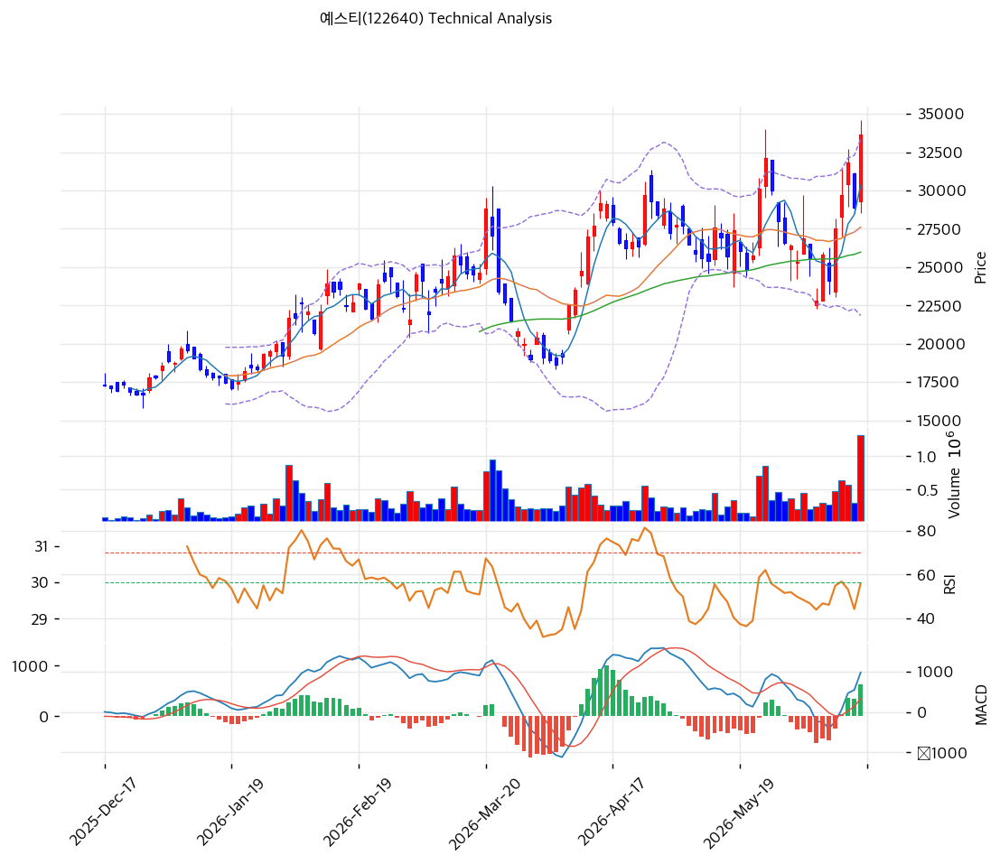

# 기술적분석

2026-06-17 | T2 Technical Analysis

***

## 차트

***

## 1. 가격 현황

| 항목        | 값                        |
| --------- | ------------------------ |
| 현재가       | 33,650원 (+16.44%)        |
| 52주 고가    | 33,650원 (신고가)            |
| 52주 저가    | 14,980원                  |
| 52주 범위 위치 | 100.0% (신고가)             |
| 거래량       | 20일 평균 대비 **3.51x** (폭증) |

> 52주 저점(14,980원) 대비 약 2.2배 상승. 당일 +16.44%·거래량 3.51배 폭증으로 강한 분출, 52주 신고가. 완전 정배열이나 MA200 대비 +57.7%·스토캐스틱 79.1의 단기 과열 공존.

***

## 2. 차트 패턴 분석

### 2.1 캔들스틱 패턴

| 패턴             | 위치                  | 신뢰도 | 해석              |
| -------------- | ------------------- | --- | --------------- |
| 장대양봉 + 거래량 폭증  | 당일 (+16.44%, 3.51x) | 강   | 매수 — 강한 분출, 신고가 |
| 완전 정배열         | 최근                  | 강   | 매수 — 모든 MA 위    |
| 스토캐스틱 79.1 과매수 | —                   | 중   | 단기 과열 경계        |

※ 주요 캔들 패턴: 망치형, 역망치형, 장악형, 도지, 샛별/석별, 적삼병/흑삼병, 하라미, 유성형, 교수형 등

### 2.2 가격 구조 패턴

* **52주 신고가 분출 + 거래량 3.51배** (신뢰도: 강) HPA 125매 납품 확정·HBM·2026E 폭발 전망 모멘텀으로 거래량 3.51배 동반 +16.44% 장대양봉. 피보 1.272 확장(35,767원)·피봇 R1(36,000원)이 다음 상단.
* **장기 상승 추세** (신뢰도: 강) MA200(21,341원) 대비 +57.7%로 1년 2.2배 강세. 추세 강하나 단기 과열.

※ 주요 구조 패턴: 이중천정/바닥, 헤드앤숄더, 삼각수렴, 쐐기형, 깃발형, 페넌트, 컵앤핸들, 박스권 등

### 2.3 다이버전스

* **뚜렷한 다이버전스 없음 — 추세 추종** (신뢰도: 중) 가격 신고가·RSI 61.3·MACD 매수 확대 동행. 거래량 폭증 동반. 스토캐스틱 79.1 과매수권으로 단기 과열 경계.

※ RSI·MACD 기반 | 상승 다이버전스 = 가격↓ 지표↑, 하락 다이버전스 = 가격↑ 지표↓

### 2.4 패턴 종합 판단

거래량 3.51배를 동반한 **강한 신고가 분출** 국면이다. 완전 정배열·MACD 매수 확대로 추세가 강하나 MA200 +57.7%·스토캐스틱 79.1의 단기 과열이 동반된다. HPA·HBM·2026E 폭발 전망이 펀더멘털을 받친다. 추격보다 눌림목(MA20 27,598원·피보 0.236 28,919원) 확인이 안전하다.

***

## 3. 이동평균선 — 완전 정배열 (강세)

| MA    | 값       | 현재가 괴리율 | 위치 |
| ----- | ------- | ------- | -- |
| MA5   | 30,330원 | +10.9%  | 위  |
| MA20  | 27,598원 | +21.9%  | 위  |
| MA60  | 25,980원 | +29.5%  | 위  |
| MA120 | 23,382원 | +43.9%  | 위  |
| MA200 | 21,341원 | +57.7%  | 위  |

**해석**: 현재가 > 모든 MA의 완전 정배열 강세. 단기선(MA20 27,598원)과 +21.9% 괴리로 단기 과열. MA200(21,341원) 대비 +57.7%로 장기 추세 견조하나 평균회귀 압력. 조정 시 MA20(27,598원)·MA60(25,980원)이 지지대.

***

## 4. 보조 지표

### RSI(14) — 61.3 (중립)

당일 급등에도 과매수(70) 미도달. 강한 모멘텀, 추가 상승 여지.

### MACD(12,26,9)

| 항목        | 값                   |
| --------- | ------------------- |
| MACD      | 977                 |
| Signal    | 351                 |
| Histogram | +627                |
| 크로스 상태    | 매수 구간 (히스토그램 크게 확대) |

**해석**: MACD가 Signal 위에서 히스토그램을 크게 확대하는 강한 상승 모멘텀. 0선 위 강세.

### 볼린저밴드(20, 2σ)

| 항목        | 값       |
| --------- | ------- |
| 상단        | 33,357원 |
| 중단 (MA20) | 27,598원 |
| 하단        | 21,838원 |
| 밴드 폭      | 41.7%   |
| 현재 위치     | 상단 돌파   |

**해석**: 현재가 33,650원이 밴드 상단(33,357원)을 상회 — 강한 상승이나 단기 과열. 밴드 폭 41.7% 확대. 되돌림 시 중단(MA20 27,598원) 여지.

### 스토캐스틱(14, 3, 3)

| 항목      | 값     |
| ------- | ----- |
| Slow %K | 79.1  |
| Slow %D | 70.6  |
| 크로스 상태  | 골든크로스 |
| 판단      | 과매수권  |

***

## 5. 지지/저항 — 추세선 · 피보나치 · PRZ 통합

### 5.1 피보나치 되돌림/확장

| 구분                 | 비율    | 가격      | 현재가 대비 |
| ------------------ | ----- | ------- | ------ |
| 확장                 | 1.382 | 37,249원 | +10.7% |
| 확장                 | 1.272 | 35,767원 | +6.3%  |
| **현재가/Swing High** | —     | 33,650원 | —      |
| 되돌림                | 0.236 | 28,919원 | -14.1% |
| 되돌림                | 0.382 | 26,951원 | -19.9% |
| 되돌림                | 0.5   | 25,360원 | -24.6% |
| 되돌림                | 0.618 | 23,769원 | -29.4% |

### 5.2 종합 지지/저항 테이블

| 구분      | 가격          | 근거                        |
| ------- | ----------- | ------------------------- |
| 저항      | 37,249원     | 피보 1.382 확장               |
| 저항      | 36,000원     | 피봇 R1                     |
| 저항      | 35,767원     | 피보 1.272 확장               |
| **현재가** | **33,650원** | 신고가·볼린저 상단                |
| 지지      | 29,900원     | 피봇 S1                     |
| 지지      | 28,919원     | 피보 0.236                  |
| 지지      | 27,598원     | MA20                      |
| 지지      | 25,830원     | MA60·피보 0.5·피봇 S2 (PRZ 중) |

***

## 6. 시그널 종합

| 지표    | 내용                  | 시그널 |
| ----- | ------------------- | --- |
| 차트 패턴 | 신고가 분출 + 거래량 3.51x  | 🟢  |
| 이동평균선 | 완전 정배열, MA20 +21.9% | 🟢  |
| RSI   | 61.3 — 중립(여유)       | ⚪   |
| MACD  | 매수구간, 히스토그램 확대      | 🟢  |
| 볼린저밴드 | 상단 돌파               | ⚪   |
| 스토캐스틱 | 과매수(79.1), 골든크로스    | 🔴  |
| 거래량   | 3.51x — 폭증          | 🟢  |

**종합 판단**: 🟢 매수 3개 / 🔴 매도 1개 / ⚪ 중립 3개 → **매수우위 (강한 분출 + 단기 과열)**

거래량 3.51배를 동반한 강한 신고가 분출이다. 완전 정배열·MACD 매수 확대로 추세가 강하나 MA200 +57.7%·스토캐스틱 과매수의 단기 과열이 공존한다. HPA·HBM·2026E 폭발 전망이 펀더멘털을 받친다. 추격보다 눌림목(MA20 27,598원·피보 0.236 28,919원) 대응이 정석.

***

## 7. 전략 제안

### 보유 중인 경우

* **홀드 (분할 익절 병행)**
* 익절 라인: 36,000원(피봇 R1)·37,249원(피보 1.382)
* 손절 라인: 27,598원 (MA20 이탈)
* 리스크/리워드: +16.44% 급등·신고가로 신규 손익비 불리

### 진입 대기인 경우

* **추격 자제, 눌림목 대기**
* 1차 진입가: 28,919원 (피보 0.236) / 27,598원 (MA20)
* 2차 진입가: 25,830원 (MA60·피보 0.5 PRZ)
* 진입 조건: 거래량 3.51배 급등 추격은 위험. 조정 시 피보 0.236·MA20(27,598\~28,919원) 지지 확인 후 분할. HPA 125매 납품(2026 하반기)·2026E OP +645% 진척이 펀더멘털 하방 지지.
