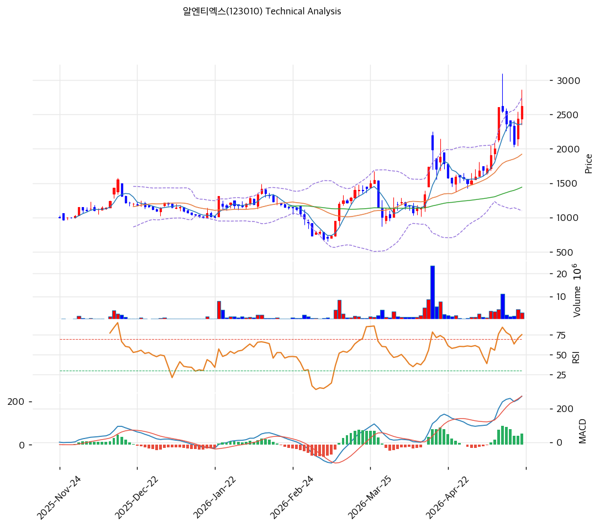

# 알엔티엑스(123010) 기술적 분석

2026-05-21 | T2 Technical Analysis

## 차트

## 1. 가격 현황

- 현재가 **2,620원** (52주 신고가, 6개월 +280%)
- 52주: 2,620 / 689원
- 거래량 폭증 동반

## 2. 차트 패턴

- 689원 저점 → 2026-03 1,400원 → 2026-04 2,300원 → 2026-05 2,800원 정점 → 2,620원
- **3.8배 폭등 + 포물선 가속**

## 3. 이동평균선

| MA | 값 | 괴리율 |
|---|--:|--:|
| MA5 | 2,363원 | +10.9% |
| MA20 | 1,922원 | +36.3% |
| MA60 | 1,442원 | **+81.7%** |
| MA200 | 1,190원 | **+120.2%** |

**해석**: MA200 +120% = 통계적 평균회귀 임박. MA20 (1,922원) 1차 강력 지지.

## 4. 보조 지표

- RSI 67.9 (중립·과매수 임계)
- MACD 매수 (+50 확대)
- BB 폭 85.7% (극단 확장), 중간 위치
- Stoch K 56.2 (중립)
- 시그널: 매수 2 / 매도 1 / 중립 4 → 매수우위

## 5. 지지/저항

| 구분 | 가격 |
|---|--:|
| 저항 | 2,800원 (직전 정점) |
| **현재가** | **2,620원** |
| 지지 | 2,363원 (MA5) |
| 지지 | 1,922원 (MA20·1차 강력) |
| 지지 | 1,442원 (MA60) |
| 지지 | 1,190원 (MA200) |
| 지지 | 995원 (CB 행사가) |

## 6. 전략

### 보유 중
- 분할 익절 (1차 2,800원·2차 3,000원)
- 손절: MA20 1,922원 (-27%)

### 진입 대기
- **평균회귀 대기 권장**
- 1차 진입: MA20 1,922원 (-27%)
- 2차 진입: MA60 1,442원 (-45%)
- 펀더멘털 부담 (PBR 3.21x + CB +163% 인-더-머니) 주의
