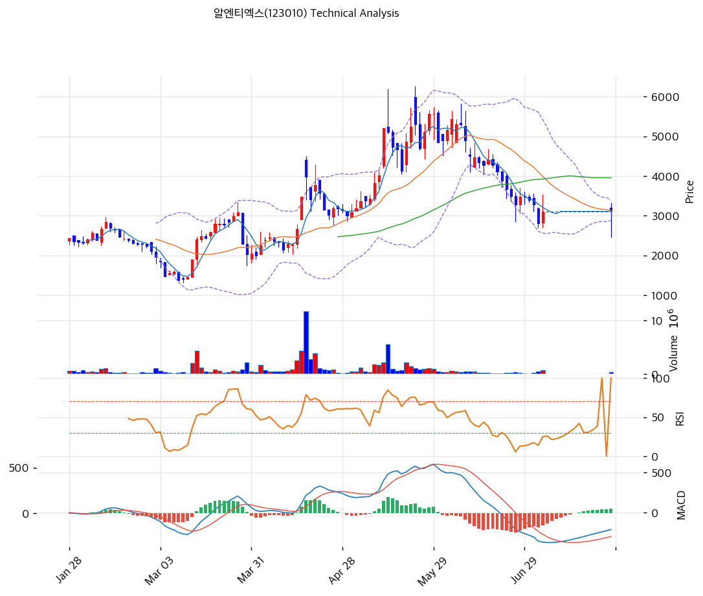

# 알엔티엑스(123010) 기술적 분석

2026-07-27 | T2 Technical Analysis

---

## 차트

---

## 1. 가격 현황

| 항목 | 값 |
|------|-----|
| 현재가 | 3,125원 (**+0.48%**) |
| 52주 고가 | 5,573원 (병합 조정) |
| 52주 저가 | 1,378원 (병합 조정) |
| 52주 범위 위치 | 41.6% |
| 거래량 | 20일 평균 대비 **3.81x** — 재상장 직후 급증 |

⚠️ **차트 해석의 전제**: 2026-07-08자 **2:1 주식병합**(액면 500원 → 1,000원)이 있었고 7/6\~7/24 매매거래가 정지됐다. 차트의 과거 가격은 병합 배수로 소급 조정된 값이며, **7월 24일 변경상장으로 거래가 재개된 지 며칠밖에 지나지 않았다.** 거래량 3.81배는 재상장 직후의 자연스러운 반응이며, 이 시점의 지표는 방향성보다 재개장 반응으로 해석하는 것이 정확하다.

---

## 2. 차트 패턴 분석

### 2.1 캔들스틱 패턴

| 패턴 | 위치 | 신뢰도 | 해석 |
|------|------|--------|------|
| 소폭 양봉 (거래량 3.81배) | 금일 | 중 | +0.48%로 가격 변동은 작으나 거래량이 크게 붙음 — 재상장 물량 소화 |
| 병합 후 기준가 부근 횡보 | 7/24~ | 중 | 병합 전 종가 환산 수준(약 3,100원대)에서 큰 이탈 없이 유지 |

### 2.2 가격 구조 패턴

- **재상장 후 기준가 방어** (신뢰도: 중)
  병합 전 가중평균주가가 1,590원대였고 2배 환산 시 3,180원 수준인데, 재상장 후 현재가 3,125원으로 거의 그대로 유지되고 있다. **병합에 따른 매물 출회나 급락이 나타나지 않았다**는 점은 긍정적으로 읽을 수 있는 신호다.

- **MA200 상회, MA20·60·120 하회** (신뢰도: 중)
  MA200(2,848원) 위 +9.7%에 있으면서 MA20(3,137원)·MA60(3,958원)·MA120(3,214원)은 아래다. 장기 저점 대비로는 회복했지만 중기 구간에서는 여전히 눌려 있는 위치다. 특히 **MA60(3,958원)과의 괴리 -21.0%**가 중기 하락의 잔재를 보여준다.

- **볼린저 밴드 폭 16.5%** (신뢰도: 중)
  정상 범위(5\~15%)를 소폭 웃도는 수준으로, 병합·재상장 이벤트를 감안하면 오히려 안정적인 편이다. 현재가는 밴드 중간(3,137원) 바로 아래에 있다.

### 2.3 다이버전스

- **MACD 매수 전환 + 히스토그램 확대** (신뢰도: 중)
  MACD -210 vs 시그널 -257로 매수 구간에 진입했고 히스토그램(+48)이 **확대 중**이다. 음수 영역에서의 전환이라 '하락 모멘텀 소진'을 뜻하며, 이 종목에서 유일하게 명확한 방향성 신호다.

- **RSI 37.0 — 중립 하단** (신뢰도: 약)
  과매도(30)에는 못 미치지만 중립선(50)을 크게 밑돈다. 상승 여력은 있으나 매수세가 강하지 않은 상태를 나타낸다.

### 2.4 패턴 종합 판단

**핵심은 병합·재상장 이벤트를 무사히 통과했다는 사실 자체다.** 주식병합 후 재상장 시 매물 출회로 급락하는 사례가 적지 않은데, 이 종목은 환산 기준가 수준(3,100원대)을 지키면서 거래량만 3.81배로 늘었다. MACD가 매수로 전환하며 히스토그램이 확대되는 것도 이를 뒷받침한다.

다만 방향을 확신하기에는 이르다. MA60(3,958원)까지 -21%의 거리가 있고, RSI 37.0은 매수세가 본격화되지 않았음을 보여준다. **8월 10일 유증 신주 2,816,900주 상장(발행주식의 16.2%)이 예정돼 있어**, 그 전후의 수급 변화가 이 반등의 지속 여부를 가를 것이다.

---

## 3. 이동평균선 — MA200만 상회 (비정배열)

| MA | 값 | 현재가 괴리율 | 위치 |
|----|-----|--------------|------|
| MA5 | 3,113원 | +0.4% | 위 |
| MA20 | 3,137원 | -0.4% | 아래 |
| MA60 | 3,958원 | **-21.0%** | 아래 |
| MA120 | 3,214원 | -2.8% | 아래 |
| MA200 | 2,848원 | +9.7% | 위 |

**해석**: 현재가가 MA5·MA20·MA120과 거의 붙어 있고(±3% 이내) MA200만 확실히 위, MA60만 크게 아래인 구조다. MA60이 3,958원으로 다른 이평보다 유독 높은 것은 **약 3개월 전 주가가 급등했던 구간이 있었다**는 뜻이며, 그 구간의 매물이 4,000원 부근에 남아 있을 가능성을 시사한다. 1차 저항은 3,466\~3,483원(피보나치 0.236 + 피봇 R1), 그 위가 3,842\~3,869원(피봇 R2 + 피보나치 0.382)이다.

---

## 4. 보조 지표

### RSI(14) — 37.0 (중립 하단)

과매도 영역(30)에는 진입하지 않았으나 중립선을 크게 밑돈다. 매도 압력이 소진되는 국면으로 볼 수 있으나 매수세 유입은 아직 확인되지 않는다.

### MACD(12,26,9)

| 항목 | 값 |
|------|-----|
| MACD | -210.0 |
| Signal | -257.0 |
| Histogram | **+48.0 (확대 중)** |
| 크로스 상태 | 매수 구간 |

**해석**: 히스토그램이 확대되는 매수 구간은 하락 모멘텀이 꺾이고 상승 모멘텀이 쌓이는 전형적 패턴이다. 다만 MACD 절대값이 -210으로 0선까지 거리가 멀어, 추세 전환의 확증까지는 시간이 필요하다.

### 볼린저밴드(20, 2σ)

| 항목 | 값 |
|------|-----|
| 상단 | 3,397원 |
| 중단 (MA20) | 3,137원 |
| 하단 | 2,878원 |
| 밴드 폭 | 16.5% |
| 현재 위치 | 중간 (중단선 바로 아래) |

**해석**: 현재가가 중단선(3,137원) 바로 아래에 있어 방향성이 중립이다. 상단 3,397원 돌파 시 1차 저항대(3,466\~3,483원)와 이어지고, 하단 2,878원 이탈 시 피봇 S1(2,608원)까지 열린다.

### 스토캐스틱(14, 3, 3)

| 항목 | 값 |
|------|-----|
| Slow %K | 산출 불가 |
| Slow %D | 산출 불가 |
| 크로스 상태 | 데드크로스 (참고치) |
| 판단 | 거래정지 구간으로 데이터 결측 — 신뢰도 없음 |

---

## 5. 지지/저항 — 추세선 · 피보나치 · PRZ 통합

### 5.1 피보나치 되돌림

| 구분 | 비율 | 가격 | 현재가 대비 |
|------|------|------|-----------|
| Swing High | — | 5,573원 | +78.3% |
| 되돌림 | 0.786 | 4,983원 | +59.5% |
| 되돌림 | 0.618 | 4,519원 | +44.6% |
| 되돌림 | 0.5 | 4,194원 | +34.2% |
| 되돌림 | 0.382 | 3,869원 | +23.8% |
| 되돌림 | 0.236 | 3,466원 | **+10.9%** |
| Swing Low | — | 2,815원 | -9.9% |

※ 하락 추세(5,573 → 2,815원)의 되돌림. **0.236(3,466원)이 현실적인 1차 목표**이며, 그 위 0.382(3,869원)는 MA60(3,958원) 매물대와 겹친다

### 5.2 추세선

| 추세선 | 방향 | 현재 교차가 | 포인트 수 | 해석 |
|--------|------|-----------|---------|------|
| 지지선 | **상승** | 2,172원 | 6개 | 저점을 높여온 상승 추세선 — 하방 여유 확보 |
| 저항선 | **상승** | 5,830원 | 6개 | 상승 채널 상단 (원거리) |

※ 추세선이 상승 방향으로 잡힌다는 점은 장기 저점(1,378원) 대비 저점이 높아지고 있음을 뜻한다

### 5.3 PRZ (Potential Reversal Zone)

| 방향 | 가격 범위 | 신뢰도 | 근거 |
|------|---------|--------|------|
| 지지 | 3,113\~3,137원 | 약 | MA5 + MA20 (현재가 밀착) |
| 저항 | 3,466\~3,483원 | 약 | 피보나치 0.236 + 피봇 R1 — **1차 관문** |
| 저항 | 3,842\~3,869원 | 약 | 피봇 R2 + 피보나치 0.382 (MA60 3,958원과 연결) |

※ PRZ = 추세선 · 피보나치 · 피봇 · MA 등 복수 지표가 겹치는 가격 구간

### 5.4 종합 지지/저항 테이블

| 구분 | 가격 | 근거 |
|------|------|------|
| 저항 | 5,573원 | 52주 고가 (원거리) |
| 저항 | 3,958원 | MA60 — 매물대 |
| 저항 | 3,842\~3,869원 | PRZ(약) — 피봇 R2 + 피보나치 0.382 |
| 저항 | 3,466\~3,483원 | PRZ(약) — 피보나치 0.236 + 피봇 R1 (1차 관문) |
| 저항 | 3,397원 | 볼린저 상단 |
| **현재가** | **3,125원** | MA5·MA20 밀착 구간 |
| 지지 | 3,113\~3,137원 | PRZ(약) — MA5 + MA20 |
| 지지 | 2,967원 | 피봇 |
| 지지 | 2,878원 | 볼린저 하단 |
| 지지 | 2,848원 | MA200 |
| 지지 | 2,608원 | 피봇 S1 |
| 지지 | 2,172원 | 상승 추세선 |

---

## 6. 시그널 종합

| 지표 | 내용 | 시그널 |
|------|------|--------|
| 차트 패턴 | 재상장 후 기준가 방어 | ⚪ |
| 이동평균선 | 비정배열, MA20 -0.4% / MA200 +9.7% | ⚪ |
| RSI | 37.0 — 중립 하단 | ⚪ |
| **MACD** | **매수 구간, 히스토그램 확대** | 🟢 |
| 볼린저밴드 | 중간, 밴드 폭 16.5% | ⚪ |
| 스토캐스틱 | 데이터 결측 (거래정지) | ⚪ |
| **거래량** | **3.81x — 강력 동반** | 🟢 |

**종합 판단**: 🟢 매수 2개 / 🔴 매도 0개 / ⚪ 중립 4개 → **매수우위 (재상장 직후 관망 구간)**

MACD 매수 전환과 거래량 3.81배가 긍정 신호이지만, 둘 다 **재상장 직후라는 특수 상황의 산물**일 수 있다는 점을 감안해야 한다. 병합 후 가격이 환산 기준가를 지켰다는 사실은 의미 있으나, 며칠치 데이터로 추세를 말하기는 이르다. 1차 관문은 3,466\~3,483원(피보나치 0.236 + 피봇 R1)이며, 하방은 MA200(2,848원)과 볼린저 하단(2,878원)이 겹치는 구간이 1차 방어선이다.

---

## 7. 전략 제안

### 보유 중인 경우
- **홀드 (8/10 유증 상장까지 관망)**
- 익절 라인: 3,466\~3,483원 1차 (피보나치 0.236 + 피봇 R1 — 분할 익절), 돌파 시 3,842\~3,869원
- 손절 라인: 2,878원 (볼린저 하단·MA200 동반 이탈 = 재상장 후 지지 구조 붕괴)
- 리스크/리워드: 약 1.4 (+341 / -247) — 1차 목표 기준

### 진입 대기인 경우
- **8월 10일 유증 신주 상장 이후로 판단 유보**
- 1차 진입가: 2,878\~2,967원 (볼린저 하단 + 피봇 — 눌림 확인 시)
- 2차 진입가: 2,608원 (피봇 S1)
- 진입 조건: 재상장 직후라 기술적 데이터가 짧고, **8월 10일 발행주식의 16.2%에 해당하는 유증 신주(2,816,900주)가 상장**된다. 1년 보호예수가 걸려 있어 즉시 매물화되지는 않지만 유통 규모 인식이 바뀌는 이벤트다. 여기에 CB 8회차(전환가 3,360원, 리픽싱 하한 2,352원)가 현재가 바로 위에 있어 **주가가 3,360원을 넘으면 전환 물량이 나올 수 있는 구조**다. 8월 반기 실적으로 2개 분기 연속 영업흑자가 확인되면 그때 추종하는 편이 안전하다
