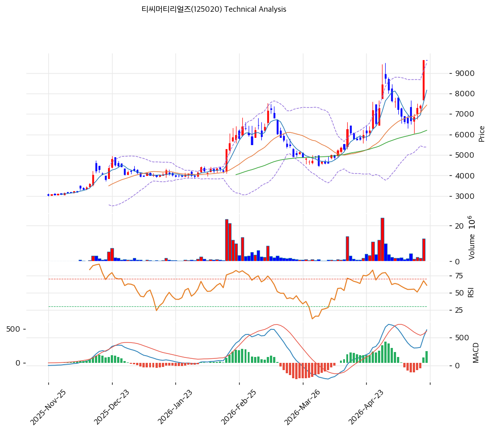

# 티씨머티리얼즈(125020) 기술적 분석

## 차트

## 가격 현황

| 항목 | 값 |
|---|---|
| 현재가 | **9,630원** (0.00%, 52주 신고가) |
| 52주 고/저 | 9,630원 / 3,050원 (**3.16배** 폭등) |
| 52주 위치 | **100% 상단** 🔴 |
| RSI | **73.2 🔴 과매수** |
| MACD | 641/469/173 매수 (확장 진행) |
| Stoch | K=79.8, D=57.1 골든크로스 (중립 영역) |
| 볼린저 | 폭 55.0%, 상단 근접(9,483원) |
| 거래량 | 평균 0.0배 |

## 이동평균선

| MA | 가격(원) | 갭(%) | 위치 |
|---|--:|--:|---|
| MA5 | 8,162 | +18.0 | 위 |
| MA20 | 7,436 | +29.5 | 위 (과열) |
| MA60 | 6,204 | +55.2 | 위 (강한 과열) |
| MA120 | 5,123 | +88.0 | 위 (극단) |
| MA200 | 4,855 | **+98.4** | 위 (극단 과열) |

→ **정배열 완성** (MA5>MA20>MA60>MA120>MA200). 추세 매우 강력하나 MA200 +98% = 2배 가까이 이격, 평균회귀 압력 극대.

## 시그널 종합

| 구분 | 카운트 |
|---|--:|
| 매수 | 2 (MACD, Stoch 골든크로스) |
| 매도 | 2 (RSI 과매수, BB 상단 근접) |
| 중립 | 3 |
| **결론** | **중립 → 홀드·익절 일부** |

## 지지·저항 (PRZ 영역)

| 구분 | 가격대(원) | 근거 |
|---|--:|---|
| 강 저항 | **9,909** | 피보 1.272 확장 |
| 저항 | 10,377 | 피보 1.382 확장 |
| 강 저항 | 11,383 | 피보 1.618 확장 |
| **현재가** | **9,630** | 52주 고가 = 피봇 R1 |
| 약 지지 | 8,639 | 추세선 저항(상승) → 지지 전환 |
| 지지 | 8,162 | MA5 |
| 지지 | 7,745 | 피보 0.236 되돌림 |
| 강 지지 | 7,436 | MA20 (-22.7%) |
| 강 지지 | 7,123 | 피보 0.382 |
| 지지 | 6,620 | 피보 0.5 |
| 강 지지 | 6,204 | MA60 (-35.6%) |
| 지지 | 6,117 | 피보 0.618 |
| 지지 | 5,402 | 피보 0.786 |
| 강 지지 | 5,123 | MA120 |
| 지지 | 4,855 | MA200 |
| 강 지지 | 4,335 | 추세선 지지 |

## 전략

| 시나리오 | 액션 |
|---|---|
| 보유자 | **30% 익절** + 잔량 홀드 (TP 9,909→11,383) |
| 신규 진입 1차 | **7,436원** (MA20, -22.7%) 30% 매수 |
| 신규 진입 2차 | **6,620원** (피보 0.5, -31.3%) 30% 매수 |
| 신규 진입 3차 | **6,204원** (MA60, -35.6%) 30% 매수 |
| 매도 트리거 | 분기 OPM < 3.0% 재악화 시 / 5,400원 이탈 (MA120 하방) |
| 추세 가속 | **9,909원 (피보 1.272)** 돌파 + 거래량 +50% → 11,383원 도전 |

## 수급 분석

| 주체 | 20일 누적 | 해석 |
|---|--:|---|
| 외국인 | **+1,650,137** | 매우 강력한 매집 (시총 대비 4.7%) |
| 기관 | **+115,982** | 동방향 매집 |

**외인·기관 동시 매집** 매우 강력한 신호. HVDC·전력인프라 슈퍼사이클 + 26Q1 OPM 6.3% 가속이 글로벌·국내 자금 동시 베팅 유도.

## 핵심 판단

52주 신고가 + RSI 73.2 과매수 + MA200 +98.4% 극단 이격 = **단기 과열 명확**. 그러나 26Q1 OPM 6.3% 마진 폭발적 회복 + CB/BW 0건 깨끗한 펀더멘털 + 외인 +165만주 매집 = **펀더멘털 강력 뒷받침**. **상단 9,909~11,383원 추가 가속 가능하나 평균회귀 압력 동시 작용**. 보유자는 30% 익절, 신규 진입자는 **MA20 7,436원 / MA60 6,204원 영역 분할 매수** 권장. SL 5,400원 (MA120 하방, BPS 1,664의 +3.2배 마진).
