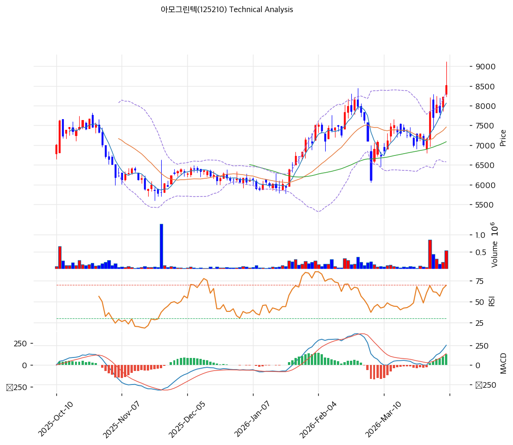

# 아모그린텍(125210) 기술적 분석

2026-04-06 | T2 Technical Analysis

---

## 차트

---

## 1. 가격 현황

| 항목 | 값 |
|------|-----|
| 현재가 | 8,520원 (+3.52%) |
| 52주 고가 | 9,120원 |
| 52주 저가 | 4,805원 |
| 52주 범위 위치 | 100.0% |
| 거래량 | 20일 평균 대비 3.56x |

현재가 8,520원은 52주 신고가(9,120원) 직전 구간이자 당일 기준 52주 범위 위치가 100.0%로 나타난다. 이는 장중 52주 고가를 경신하는 수준임을 의미한다. 거래량이 20일 평균의 3.56배에 달해 이 구간 돌파에 강한 매수 에너지가 동반되었음을 확인할 수 있다.

---

## 2. 차트 패턴 분석

### 2.1 캔들스틱 패턴

| 패턴 | 위치 | 신뢰도 | 해석 |
|------|------|--------|------|
| 강한 양봉 (장대양봉 유사) | 2026-04-06 (당일) | 강 | 거래량 3.56x를 동반한 +3.52% 강한 상승 마감. 매수 에너지 집중을 의미하며 단기 강세 지속 시그널 |
| 상승 추세 내 지지 확인 | 최근 5거래일 | 중 | MA5(8,064원) 위에서의 연속 지지 흐름. 하락 캔들에도 종가가 MA5 상단에서 마감하는 패턴 지속 |

※ 주요 캔들 패턴: 망치형, 역망치형, 장악형(상승/하락), 도지, 샛별/석별, 적삼병/흑삼병, 하라미, 유성형, 교수형 등

### 2.2 가격 구조 패턴

- **상승 추세 채널 (신뢰도: 강)**
  2025년 하반기 저점(52주 저가 4,805원)에서 2026년 4월까지 약 6개월에 걸쳐 약 77% 상승하는 강한 우상향 추세 채널이 형성되어 있다. 현재 주가는 채널 상단에 근접한 구간에 위치하며, 단기적으로는 채널 상단 저항 또는 피봇 저항(9,017원)이 1차 목표가 겸 저항선 역할을 할 것으로 판단된다. 추세 채널 하단은 MA60(7,087원) 부근으로 추정되며, 이 선을 하향 이탈하기 전까지는 상승 추세가 유효하다.

- **52주 신고가 돌파 시도 (신뢰도: 중)**
  현재가 8,520원은 수집 기준 52주 고가(9,120원)에 근접한 수준으로, 9,000~9,120원 구간을 강하게 돌파할 경우 심리적 저항이 해소되며 추가 상승 가능성이 열린다. 반면 9,120원 부근에서 거래량 감소 속 반등 실패 시 단기 고점 형성 및 되돌림 가능성도 존재한다. 돌파 시 피봇 R1(9,017원)~R2(9,513원) 구간이 순차 목표가로 제시된다.

※ 주요 구조 패턴: 이중천정/바닥, 헤드앤숄더(정/역), 삼각수렴(대칭/상승/하락), 쐐기형(상승/하락), 깃발형, 페넌트, 컵앤핸들, 박스권 등

### 2.3 다이버전스

- **RSI 히든 상승 다이버전스** (신뢰도: 중)
  최근 상승 파동에서 가격이 고점을 갱신하는 동시에 RSI(14)가 66으로 과매수(70) 아래를 유지하며 중립권에 머물고 있다. 이는 고전적 과열 신호가 아직 발현되지 않았음을 의미하며, 추세 지속 가능성을 시사하는 히든 강세 구조로 해석된다. 다만 RSI가 70을 상향 돌파 후 다시 하회하는 시점이 단기 주의 시그널이 될 수 있다.

- **MACD 상승 모멘텀 확대** (신뢰도: 강)
  MACD(254)가 Signal(132)을 크게 상회하며 히스토그램(+122)이 지속 확대 중이다. 이는 매수 모멘텀이 가속되고 있음을 나타내며, MACD와 가격 간의 방향성이 일치하여 다이버전스 없이 추세가 강화되고 있음을 의미한다. 히스토그램 확대가 멈추거나 수축으로 전환될 경우 모멘텀 둔화의 선행 신호로 주목해야 한다.

※ RSI·MACD 기반 | 상승 다이버전스 = 가격↓ 지표↑ (반등 시사), 하락 다이버전스 = 가격↑ 지표↓ (하락 시사), 히든 다이버전스 = 기존 추세 지속 시사

### 2.4 패턴 종합 판단

캔들스틱(강한 양봉, 거래량 동반), 가격 구조(상승 추세 채널 내 신고가 돌파 시도), 다이버전스(RSI 중립권 유지 + MACD 히스토그램 확대) 세 카테고리 모두 현재 상승 추세가 진행 중임을 일관되게 지시하고 있다. 상충하는 시그널로는 볼린저밴드 상단 밀착(8,339원 대비 현재가 8,520원으로 상단 초과)이 단기 과열 가능성을 경고하고 있다는 점을 명시한다. 종합적으로 단기 강세 기조는 유효하나 9,000~9,120원 구간에서의 저항 돌파 확인이 추세 지속의 관건이다.

---

## 3. 이동평균선 — 정배열 (강세)

| MA | 값 | 현재가 괴리율 | 위치 |
|----|-----|--------------|------|
| MA5 | 8,064원 | +5.7% | 위 |
| MA20 | 7,459원 | +14.2% | 위 |
| MA60 | 7,087원 | +20.2% | 위 |
| MA120 | 6,796원 | +25.4% | 위 |
| MA200 | 6,771원 | +25.8% | 위 |

**해석**: 5일·20일·60일·120일·200일 이동평균선이 단기에서 장기 순으로 모두 정배열을 유지하고 있으며, 현재가가 전 이동평균선 위에 위치한 이상적인 강세 구도이다. 현재가 기준 MA20 괴리율이 +14.2%로 단기 과열 영역에 진입하고 있어 MA20으로의 되돌림 시 매수 기회를 노리는 접근이 유효하다. MA60(7,087원)과 MA200(6,771원)은 중장기 핵심 지지선으로, 현재 가격 수준은 이들 지지선으로부터 충분히 격리되어 있다. 이동평균 배열 관점에서 추세는 강하게 상승 중이며 단기 조정이 와도 MA20(7,459원)~MA5(8,064원) 사이에서 지지를 받을 가능성이 높다.

---

## 4. 보조 지표

### RSI(14) — 66.0 (중립)

RSI 66.0은 과매수 기준선(70) 아래에 위치하여 아직 과열 신호를 발신하지 않은 중립 상단 구간이다. 현재 상승 추세가 RSI 과매수 영역을 건드리지 않은 채 진행 중이라는 점은 추가 상승 여력이 남아 있음을 시사한다. 70 이상 돌파 후 재하락하는 시점이 단기 고점의 신호로 작용할 수 있어 주의가 필요하다.

### MACD(12,26,9)

| 항목 | 값 |
|------|-----|
| MACD | 254.0 |
| Signal | 132.0 |
| Histogram | +122.0 |
| 크로스 상태 | 매수 구간 (확대 중) |

**해석**: MACD(254)가 Signal(132)을 122포인트 상회하며 히스토그램이 지속 확대 중인 강한 매수 구간이다. 골든크로스 이후 히스토그램 확대 흐름이 이어지고 있어 현재 상승 모멘텀이 가속화 단계에 있음을 나타낸다. 히스토그램 수축 전환 시 모멘텀 둔화의 선행 신호로 해석해야 한다.

### 볼린저밴드(20, 2σ)

| 항목 | 값 |
|------|-----|
| 상단 | 8,339원 |
| 중단 (MA20) | 7,459원 |
| 하단 | 6,579원 |
| 밴드 폭 | 23.6% |
| 현재 위치 | 상단 근접 (초과) |

**해석**: 현재가(8,520원)가 볼린저밴드 상단(8,339원)을 181원 초과한 상태로, 기술적으로 밴드 외부 이탈 구간에 진입해 있다. 밴드 폭이 23.6%로 상당히 넓은 상태이며, 이는 강한 추세성 움직임에서 자주 나타나는 형태이다. 상단 이탈 이후 되돌림(밴드 중간선 방향)이 발생하거나 상단을 지지선 삼아 강세가 지속되는 두 가지 시나리오가 병존한다. 밴드 폭이 추가로 확대되는 동안은 추세 강도가 유지됨을 의미하며, 수축 전환 시 변동성 둔화 신호로 해석한다.

### 스토캐스틱(14, 3, 3)

| 항목 | 값 |
|------|-----|
| Slow %K | 79.6 |
| Slow %D | 77.3 |
| 크로스 상태 | 골든크로스 |
| 판단 | 중립 (과매수 경계) |

Slow %K(79.6)가 %D(77.3)를 상회하는 골든크로스 상태이나 80 경계선에 근접해 있다. 과매수 기준선(80)을 소폭 하회하는 중립 상단 구간으로, 단기적으로 80 이상 진입 후 하향 이탈하는 시점이 단기 매도 시그널이 될 수 있다. 현 구간에서는 추가 상승 여지가 아직 남아 있으나 과매수 진입 시 속도 조절 가능성을 염두에 두어야 한다.

---

## 5. 지지/저항

| 구분 | 가격 | 근거 |
|------|------|------|
| 저항 | 9,513원 | 피봇 R2 |
| 저항 | 9,120원 | 52주 고가 (2026년 최고점) |
| 저항 | 9,017원 | 피봇 R1 |
| **현재가** | **8,520원** | — |
| 지지 | 8,127원 | 피봇 S1 |
| 지지 | 7,733원 | 피봇 S2 |
| 지지 | 7,459원 | MA20 |
| 지지 | 7,087원 | MA60 |

현재가(8,520원)는 직전 52주 고가(9,120원)를 향해 돌파를 시도하는 위치에 있다. 상단으로는 9,017원(피봇 R1) → 9,120원(52주 고가) → 9,513원(피봇 R2)의 3단계 저항이 존재하며, 하단으로는 피봇 S1(8,127원)이 가장 중요한 단기 지지선이다. 8,127원을 하향 이탈하지 않는 한 단기 상승 추세는 유효하다. MA20(7,459원)은 중기 핵심 지지선으로, 이 구간에서의 지지 확인 시 추가 매수 기회가 발생할 수 있다.

---

## 6. 시그널 종합

| 지표 | 내용 | 시그널 |
|------|------|--------|
| **차트 패턴** | 강한 양봉·거래량 동반, 상승 채널 내 신고가 돌파 시도, MACD 다이버전스 없음 | 🟢 |
| 이동평균선 | 완전 정배열, MA20 +14.2% — 강세 추세 | 🟢 |
| RSI | 66.0 — 중립 (과매수 미진입, 추가 상승 여력 유지) | ⚪ |
| MACD | 매수 구간, 히스토그램 +122 확대 중 | 🟢 |
| 볼린저밴드 | 상단 이탈(8,520 > 8,339), 밴드폭 23.6% — 단기 과열 경고 | ⚪ |
| 스토캐스틱 | 골든크로스, K=79.6 — 과매수 경계 | ⚪ |
| 거래량 | 3.56x — 강력 동반 | 🟢 |

**종합 판단**: 🟢 매수 4개 / 🔴 매도 0개 / ⚪ 중립 3개 → **매수우위**

기술적 지표 전반이 현재 강한 상승 추세를 지지하고 있다. 이동평균선 완전 정배열, MACD 히스토그램 확대, 3.56배의 강력한 거래량 동반은 단기 강세의 핵심 근거이며, RSI가 과매수 영역에 진입하지 않은 상태라는 점에서 추가 상승 여력이 남아 있다. 다만 볼린저밴드 상단 이탈과 스토캐스틱 과매수 경계 진입은 단기 속도 조절 가능성을 경고한다. 9,017원~9,120원 구간에서의 돌파 여부가 추세 지속 또는 단기 조정의 분기점이 될 것으로 판단된다.

---

## 7. 전략 제안

### 보유 중인 경우
- **홀드**
- 익절 라인: 9,017원 (피봇 R1 / 신고가 직전 저항) → 2차 익절 9,513원 (피봇 R2)
- 손절 라인: 7,733원 (피봇 S2 하향 이탈 시 — 추세 훼손 기준)
- 리스크/리워드: 익절(9,017원 기준) 약 +5.8% / 손절(7,733원 기준) 약 -9.2% → R/R 약 0.63 (단기 익절 관점)

### 진입 대기인 경우
- **관망 후 눌림목 진입 권장**
- 1차 진입가: 8,127원 (피봇 S1 지지 확인 시 — 거래량 감소 동반 눌림목 조건 충족 후 진입)
- 2차 진입가: 7,459원 (MA20 지지 확인 시 — 중기 추세 유효성 재확인 후 진입)
- 진입 조건: 현재가(8,520원) 수준의 추격 매수보다 볼린저밴드 상단 이탈 후 밴드 내 회귀 또는 피봇 S1(8,127원) 근접 시 거래량 감소 확인 후 반등 캔들에서 진입하는 것이 리스크/리워드 측면에서 유리. 9,120원 돌파 후 눌림목(8,500~8,600원대 지지 확인) 시 단기 추격 진입도 가능
