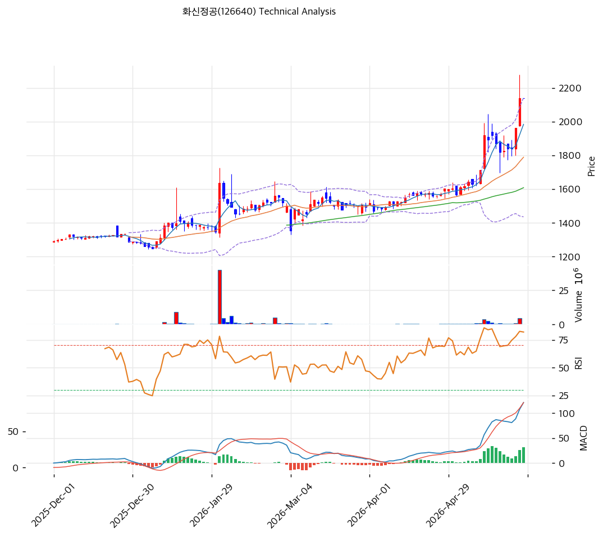

# 기술적분석

***

## 가격 위치

현재가 **2,140원** (0.00%) — **52주 신고가 + 사상 최고가** 갱신, 52주 위치 **100%**. 1년 **+73%** (1,237→2,140). **외국인 20일 +756,050주 폭매수** (시총의 2.2%) + 기관 +12,670주 동반 매수. 2026Q1 OP 122억(+557.7%) 폭발적 실적이 랠리 동력. 소형주 모멘텀 종목.

## 이동평균선 / 모멘텀

MA5 1,984 / MA20 1,789 / MA60 1,608 / MA120 1,497 / MA200 1,417 — **MA5 < MA20 < MA60 < MA120 < MA200 완전 정배열 True**. MA200 대비 **+51.0%**, MA20 대비 +19.6% 강한 우상향. 모든 이평선 우상향 가속, 턴어라운드 실적이 추세 견인.

**RSI 81.5 (과매수 🔴)** — 80 초과 극단 과매수. MACD 121 / 시그널 90 / 히스토 32 = **매수 시그널 + 확장** = 강한 모멘텀. 스토캐 K=80.2 / D=72.8 골든크로스 **과매수 영역**. BB 상단 근접 (폭 39.5%). **단기 과열 + 추세 강세 동시**.

## 시그널 종합 / S\&R

매수 2 / 매도 2 / 중립 2 → **중립**. 추세는 강하나 과매수로 신호 혼조.

* 저항: **2,140원(52주 고가 = PRZ 강)** / 다음 저항 추정 2,566원(피보 1.272) / 2,681원(피보 1.382)
* 지지: **2,032원(피보 0.236)** / 1,879원(피보 0.382) / **1,789원(MA20)** / 1,755원(피보 0.5) / 1,621원(PRZ 중: MA60)
* 깊은 조정 지지: 1,497원(MA120) / 1,417원(MA200)

전략: **HOLD(홀드) — TP 2,183원 / SL 2,140원**. WAIT(관망) e1=2,140원 / e2=1,789원. 추격 매수 비추, **MA20 1,789원 \~ MA60 1,621원 분할 매수 영역**. 52주 신고가 2,140원 명확 돌파 시 2,566원 추가 모멘텀, 단기 -15\~25% 조정 시 재진입 권고. 2026Q2 실적(8월) OP 지속성이 핵심 변곡점.
