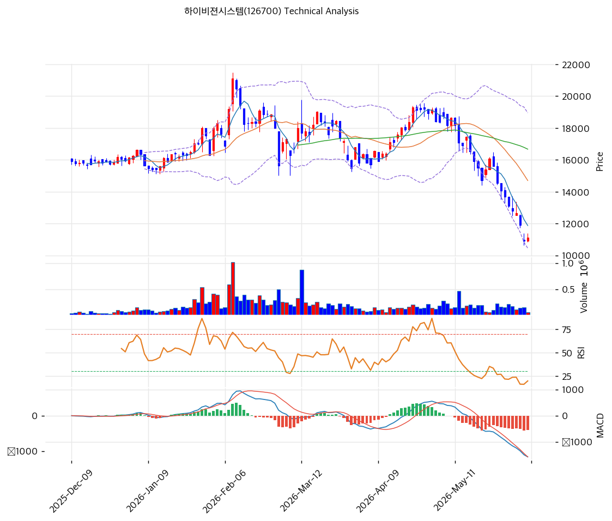

# 하이비젼시스템(126700) 기술적 분석 보고서

---

## 가격 위치

현재가 **11,130원** (+2.02%) — 1년 위치 **2.2%**(고점 21,100원 대비 -47%, 저점 10,910원 근접). 애플 카메라 capex 둔화·적자로 하락, 52주 저가권에서 당일 +2.02% 반등 시도. **RSI 23.6·스토캐 5.1 극단 과매도**. PBR 0.57x 딥밸류. 2026 턴어라운드 기대가 저점 매수 논거. 거래량비 0.34x(거래 위축).

## 이동평균선

| 이평선 | 값 | 이격도 | 위치 |
|------|---:|----:|:---:|
| MA5 | 11,880원 | -6.3% | 아래 |
| MA20 | 14,705원 | -24.3% | 아래 |
| MA60 | 16,673원 | -33.2% | 아래 |
| MA120 | 16,799원 | -33.7% | 아래 |
| MA200 | 16,295원 | -31.7% | 아래 |

**완전 역배열(하락추세)** — 현재가가 모든 이평선 아래. MA20·MA60(14,700\~16,700원)이 위에서 강한 저항. 반등 시 1차 저항 MA5 11,880원.

## 모멘텀 지표

- **RSI 23.6 (과매도 🟢)** — 30 미만 과매도. 단기 반등 압력 누적
- **MACD -1,571 / 시그널 -1,166 / 히스토 -404** — 매도 + 하락. 하락 모멘텀 잔존
- **스토캐스틱 K=5.1 / D=4.2** — 골든크로스 **극단 과매도(5.1)**. 기술적 반등 임박 구간
- **볼린저밴드** — 상단 18,948 / 중심 14,705 / 하단 10,462, 폭 57.7%, **하단 근접**. 과매도 극단
- **거래량비 0.34x** — 거래 위축(투매 후 소강)

## 반등 시 저항 (52주 스윙 10,910 / 21,100 되돌림)

| 레벨 | 가격 | 성격 |
|------|---:|------|
| 0.236 | 13,315원 | 1차 반등 저항 |
| 0.382 | 14,803원 | 2차 저항 (MA20 근접) |
| 0.5 | 16,005원 | 중기 저항 (MA60 근접) |

## 지지/저항 (S&R)

- **저항**: 11,880원(MA5) / 13,315원(반등 0.236) / 14,705원(MA20·BB 중심) / 16,673원(MA60)
- **지지**: **10,910원(52주 저가)** / 10,462원(BB 하단)

## 종합 시그널 & 전략

**시그널: 매수 2 / 매도 1 / 중립 3 → 매수우위** (극단 과매도 반등 + 딥밸류)

- **전략**: 분할 매수 관점. 역배열 하락추세이나 **PBR 0.57x 딥밸류 + 스토캐 5.1 극단 과매도 + 2026 턴어라운드 카탈리스트**로 저점 분할 매수 구간
- **저점 분할 매수**: 52주 저가(10,910원) 부근·BB 하단(10,462원)에서 **10,500\~11,100원 분할 매수**, 손절 10,400원(52주 저가 하향 이탈)
- **상방**: 반등 시 MA5 11,880원 → 반등 0.236 13,315원 → MA20 14,705원. 인도 가동·아이폰 스펙업·AI글래스 카탈리스트가 추세 반전 동력
- **하방**: 52주 저가 10,910원·BB 하단 10,462원 이탈 시 추가 하락. 단 PBR 0.57x로 하방 가치 일부 방어
- **변곡점**: 2026 흑전(인도 EMS·스펙업)·실적 회복이 추세 반전 핵심. 극단 과매도 + 딥밸류로 risk/reward 매력, 단 적자·회복 미실현 시 비중 관리
