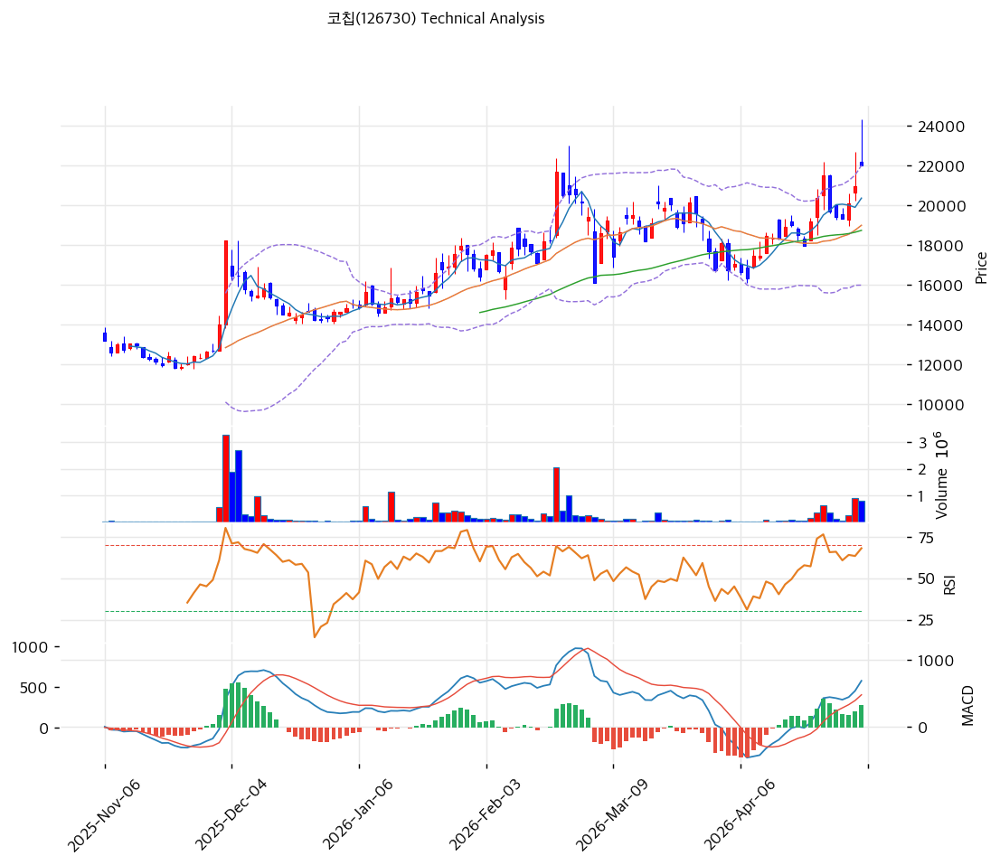

# 코칩(126730) 기술적 분석

2026-05-05 | T2 Technical Analysis

---

## 차트

---

## 1. 가격 현황

| 항목 | 값 |
|------|-----|
| 현재가 | 22,000원 (+5.01%) |
| 52주 고가 | 22,000원 |
| 52주 저가 | 10,840원 |
| 52주 범위 위치 | 100.0% |
| 거래량 | 20일 평균 대비 4.32x |

---

## 2. 차트 패턴 분석

### 2.1 캔들스틱 패턴

| 패턴 | 위치 | 신뢰도 | 해석 |
|------|------|--------|------|
| 적삼병 (장대양봉 연속) | 최근 3~4일 (4월 말) | 강 | 매수 시그널 — 박스 상단 돌파 구간에서 양봉 연속 출현, 매수세 우위 확인 |
| 유성형 (위꼬리 캔들) | 최근 1일 (5/5 신고가 캔들) | 중 | 단기 매도 시그널 가능성 — 신고가 부근에서 위꼬리 발생, 24,300원 고점 부근 매물 출회 가능 |
| 갭 상승 출현 | 4월 말~5월 초 | 중 | 매수 시그널 — 박스 상단(20,000원선) 돌파 시 갭 동반, 추세 가속 의미 |

### 2.2 가격 구조 패턴

- **박스권 상단 돌파 (Resistance Breakout)** (신뢰도: 강)
  2026-02 ~ 2026-04 약 10주간 18,000~20,000원 박스권을 형성한 후, 4월 말 거래량 4.32x 동반하며 박스 상단을 강하게 돌파. 측정 기준 다음 목표가는 박스 폭(약 2,000원)을 상단에 더한 22,000~24,000원 구간이며 현재 그 구간 상단 진입.

- **상승 추세 채널** (신뢰도: 강)
  2025-11 저점(10,840원) → 2026-02 고점(약 21,000원) → 2026-04 신저점(18,000원선) → 현재 신고가까지 일관된 상승 채널 형성. 추세선 지지(상승, slope 26.23) 및 추세선 저항(상승, slope 38.4) 모두 우상향, 채널 상단 23,390원 부근 1차 저항.

- **컵앤핸들 유사 형태** (신뢰도: 중)
  2026-02 1차 고점(약 21,000원) → 2026-03~04 손잡이 구간 조정(저점 18,000원선) → 5월 초 컵 우측 림 돌파. 측정치 기준 목표가 약 24,000원(컵 깊이 3,000원 가산), 피보나치 swing high(24,300원)와 일치.

### 2.3 다이버전스

- **RSI 다이버전스 없음** (신뢰도: —)
  3월 RSI 저점(약 40)에서 우상향하여 현재 64까지 회복, 가격(저점 18,000원 → 22,000원)과 동행. 가격 신고가와 RSI 상승이 같은 방향이므로 의미 있는 하락 다이버전스 미관측.

- **MACD 다이버전스 없음** (신뢰도: —)
  3월 말 히스토그램 음전환 → 4월 초 양전환 골든크로스 → 현재 히스토그램 확대(283). MACD 본선 686, Signal 403으로 0선 상방에서 매수구간 형성, 가격 추세와 동행하여 다이버전스 부재.

### 2.4 패턴 종합 판단

캔들스틱(적삼병+갭상승)·가격구조(박스 돌파+상승채널+컵앤핸들 림 돌파)·다이버전스(부재) 3개 카테고리 모두 추세 지속·강세를 가리킨다. 다만 5월 초 신고가 캔들에서 유성형 위꼬리가 형성되었고 BB 상단(22,001원)에 정확히 닿은 상태이므로, 단기 차익실현 매물 출회로 22,440~24,300원 구간에서 1~2차 조정 가능성. 중기 추세는 채널 상단(23,390원) 또는 피보나치 1.272 확장(28,016원)을 향한 모멘텀 우위.

---

## 3. 이동평균선 — 정배열 (강세)

| MA | 값 | 현재가 괴리율 | 위치 |
|----|-----|--------------|------|
| MA5 | 20,358원 | +8.1% | 위 |
| MA20 | 18,993원 | +15.8% | 위 |
| MA60 | 18,736원 | +17.4% | 위 |
| MA120 | 16,672원 | +32.0% | 위 |
| MA200 | 15,399원 | +42.9% | 위 |

**해석**: MA5 < MA20 < MA60 < MA120 < MA200 완벽한 정배열, 모든 MA가 현재가 아래에 위치. 단기/중기/장기 추세 모두 상승 방향 일치. 다만 MA200 대비 +42.9% 괴리율은 통계적 과열 영역(±30% 초과)이므로 단기 평균 회귀 압력 존재. MA5(20,358원)와 MA20(18,993원)이 1차/2차 핵심 지지선.

---

## 4. 보조 지표

### RSI(14) — 64.0 (중립)

50선 상방 60대 중반에 위치, 강세 구간이지만 70 과매수 영역까지 여유가 있어 추세 지속 가능. 다이버전스 해석은 2.3 참조.

### MACD(12,26,9)

| 항목 | 값 |
|------|-----|
| MACD | 686.0 |
| Signal | 403.0 |
| Histogram | +283 |
| 크로스 상태 | 매수 구간 (확대 중) |

**해석**: MACD 본선이 Signal 위에 위치한 골든크로스 매수 구간이며 히스토그램이 확대되어 모멘텀 가속. 0선 상방에서의 골든크로스이므로 강세 신호로 해석. 다이버전스 해석은 2.3 참조.

### 볼린저밴드(20, 2σ)

| 항목 | 값 |
|------|-----|
| 상단 | 22,001원 |
| 중단 (MA20) | 18,993원 |
| 하단 | 15,985원 |
| 밴드 폭 | 31.7% |
| 현재 위치 | 상단 근접 |

**해석**: 현재가(22,000원)가 BB 상단(22,001원)에 정확히 밀착. 밴드 폭 31.7%로 4월 초 스퀴즈(약 15%) 대비 2배 이상 확장 = 변동성 확대 국면. 상단 워킹 밴드(walking the band) 진입 시 추세 가속 가능하나, 일시적 단기 조정으로 중단(18,993원) 회귀 가능성도 상존.

### 스토캐스틱(14, 3, 3)

| 항목 | 값 |
|------|-----|
| Slow %K | 60.4 |
| Slow %D | 53.9 |
| 크로스 상태 | 골든크로스 |
| 판단 | 중립 |

---

## 5. 지지/저항 — 추세선 · 피보나치 · PRZ 통합

### 5.1 피보나치 되돌림/확장

| 구분 | 비율 | 가격 | 현재가 대비 |
|------|------|------|-----------|
| Swing High | — | 24,300원 | +10.5% |
| 되돌림 | 0.236 | 21,076원 | -4.2% |
| 되돌림 | 0.382 | 19,082원 | -13.3% |
| 되돌림 | 0.5 | 17,470원 | -20.6% |
| 되돌림 | 0.618 | 15,858원 | -27.9% |
| 되돌림 | 0.786 | 13,563원 | -38.4% |
| Swing Low | — | 10,640원 | -51.6% |
| 확장 | 1.272 | 28,016원 | +27.3% |
| 확장 | 1.382 | 29,518원 | +34.2% |
| 확장 | 1.618 | 32,742원 | +48.8% |
| 확장 | 2.0 | 37,960원 | +72.5% |

※ 피보나치 기준: 상승 추세 (Swing Low 10,640원 → Swing High 24,300원)
※ 되돌림 = 직전 추세에서 되돌아온 비율, 확장 = 추세 방향 목표가

### 5.2 추세선

| 추세선 | 방향 | 현재 교차가 | 포인트 수 | 해석 |
|--------|------|-----------|---------|------|
| 지지선 | 상승 | 16,274원 | 6개 | 6개월간 6개 저점 연결 우상향 추세선 — 중기 핵심 지지, 이탈 시 추세 훼손 |
| 저항선 | 상승 | 23,390원 | 6개 | 6개월간 6개 고점 연결 우상향 채널 상단 — 1차 매도 압력 구간 |

### 5.3 PRZ (Potential Reversal Zone)

| 방향 | 가격 범위 | 신뢰도 | 근거 |
|------|---------|--------|------|
| 저항 | 23,390~23,533원 | 약 | 추세선 저항 + 피봇 R1 |
| 지지 | 21,076~21,233원 | 약 | 피보나치 0.236 되돌림 + 피봇 S1 |
| 지지 | 20,358~20,467원 | 약 | MA5 + 피봇 S2 |
| 지지 | 18,736~19,082원 | 중 | MA60 + MA20 + 피보나치 0.382 되돌림 |
| 지지 | 15,858~16,672원 | 중 | 피보나치 0.618 되돌림 + 추세선 지지 + MA120 |

※ PRZ = 추세선 · 피보나치 · 피봇 · MA 등 복수 지표가 겹치는 가격 구간. 겹치는 소스가 많을수록 반전 확률 상승.

### 5.4 종합 지지/저항 테이블

| 구분 | 가격 | 근거 |
|------|------|------|
| 저항 | 28,016원 | 피보나치 1.272 확장 (중기 목표) |
| 저항 | 24,300원 | 피보나치 Swing High |
| 저항 | 23,462원 | PRZ (약) — 추세선 저항 + 피봇 R1 |
| 저항 | 22,001원 | BB 상단 (현재 밀착) |
| **현재가** | **22,000원** | 52주 고가 동시 도달 |
| 지지 | 21,154원 | PRZ (약) — 피보나치 0.236 되돌림 + 피봇 S1 |
| 지지 | 20,412원 | PRZ (약) — MA5 + 피봇 S2 |
| 지지 | 18,937원 | PRZ (중) — MA20 + MA60 + 피보나치 0.382 |
| 지지 | 16,268원 | PRZ (중) — 피보나치 0.618 + 추세선 지지 + MA120 |

---

## 6. 시그널 종합

| 지표 | 내용 | 시그널 |
|------|------|--------|
| **차트 패턴** | 박스권 상단 돌파 + 상승 채널 + 컵앤핸들 림 돌파 + 적삼병, 다이버전스 부재 | 🟢 |
| 이동평균선 | 완벽 정배열, MA20 +15.8%, MA200 +42.9% | 🟢 |
| RSI | 64.0 — 중립 (강세 구간, 과매수 여유) | ⚪ |
| MACD | 매수구간 0선 상방, 히스토그램 확대 | 🟢 |
| 볼린저밴드 | 상단 밀착, 밴드 폭 31.7% (확장) | ⚪ |
| 스토캐스틱 | 골든크로스, K=60.4 (중립) | ⚪ |
| 거래량 | 4.32x — 강력 동반 | 🟢 |

**종합 판단**: 🟢 매수 4개 / 🔴 매도 0개 / ⚪ 중립 3개 → **매수우위**

차트 패턴(박스 상단 돌파+컵앤핸들), 이동평균선 정배열, MACD 모멘텀 확대, 거래량 4.32배 동반이 모두 추세 가속을 가리키며 외국인 20일 +21.9만주 강매수가 수급을 뒷받침. 다만 BB 상단 밀착·MA200 괴리율 +42.9%·52주 신고가 100% 위치 등 단기 과열 신호도 동시 존재하므로, 단기(1~2주)는 22,440~24,300원 사이 일시 조정 후 재돌파 시 28,016원(피보나치 1.272 확장) 도전 시나리오가 우세. 중기 추세는 16,268원(PRZ 중 신뢰도) 지지 유지 시 강세 지속 판단.

---

## 7. 전략 제안

### 보유 중인 경우
- **홀드 (분할 익절 권장)**
- 익절 라인: 22,440원 (1차, 피봇 부근 + BB 상단 돌파 확인) / 23,390원 (2차, 추세선 저항+PRZ) / 28,016원 (중기, 피보나치 1.272 확장)
- 손절 라인: 20,467원 (피봇 S2 이탈) / 18,993원 (MA20 이탈, 추세 훼손 1차 신호)
- 리스크/리워드: (22,440-22,000)/(22,000-20,467) = 440/1,533 → **0.29 (단기 익절 대비 손실 폭이 커 부분익절 후 트레일링 스탑 권장)**

### 진입 대기인 경우
- **관망 (현재가 신고가, 추격 진입 비효율)**
- 1차 진입가: 21,233원 (피봇 S1 + PRZ 약)
- 2차 진입가: 18,993원 (MA20 + PRZ 중 — 박스 재진입 시 안전 매수권)
- 진입 조건: 23,390원 채널 상단 거래량 동반 돌파 시 추격 매수 / 또는 21,000~19,000원 구간 조정 시 분할 매수, MA20 이탈 시 전량 보류
