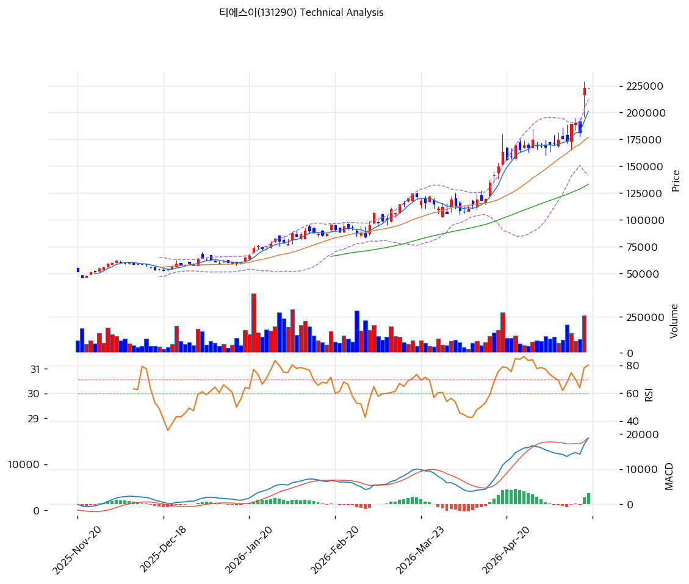

# 티에스이(131290) 기술적 분석

2026-05-19 | T2 Technical Analysis

---

## 차트

---

## 1. 가격 현황

| 항목 | 값 |
|------|-----|
| 현재가 | 223,000원 (52주 신고가) |
| 52주 고가 | 223,000원 (당일 갱신) |
| 52주 저가 | 36,400원 |
| 52주 범위 위치 | 100.0% |
| 거래량 | 데이터 결손 (차트상 5월 후반 폭증) |

---

## 2. 차트 패턴 분석

### 2.1 캔들스틱 패턴

| 패턴 | 위치 | 신뢰도 | 해석 |
|------|------|--------|------|
| **장대양봉 (신고가 돌파)** | 당일 | 강 | 200,000→223,000 +11% 단일봉, 거래량 동반 |
| **계단식 상승** | 최근 3개월 | 강 | 100,000→150,000→200,000원 단계적 돌파 |
| 적삼병 | 최근 3~5일 | 중 | 양봉 연속 + 모멘텀 누적 |

### 2.2 가격 구조 패턴

- **장기 상승 추세 채널** (신뢰도: 강)
  2025-11 50,000원대 → 2026-05 223,000원 (+340%, 6개월). 박스권 없이 일관된 상승 채널 유지.

- **신고가 돌파 + BB 상단 이탈** (신뢰도: 강)
  BB 상단 212,486원 대비 +5% 이탈. 밴드 폭 40.1%는 평균 영역. 추세 가속 단계.

### 2.3 다이버전스

- **RSI 동행 (다이버전스 미관찰)** (신뢰도: 강)
  RSI 79.8 + 신고가 동행. 80 임계 임박 — 단기 과열 누적.

- **MACD 히스토그램 확대** (신뢰도: 중)
  MACD 18,955 > Signal 15,750, 히스토그램 +3,205 확대 중. 매수 모멘텀 유지.

### 2.4 패턴 종합 판단

장대양봉 + 계단식 상승 + 신고가 돌파의 3중 강세. RSI 79.8·MA200 +186%는 과열이나 BB 폭 40.1%는 평균 영역 — **포물선 아닌 건전 추세 가속**. 단기 -10~-15% 조정 후 재상승 가능성.

---

## 3. 이동평균선 — 정배열 (강세)

| MA | 값 | 현재가 괴리율 | 위치 |
|----|-----|--------------|------|
| MA5 | 201,420원 | +10.7% | 위 |
| MA20 | 176,965원 | +26.0% | 위 |
| MA60 | 133,063원 | +67.6% | 위 |
| MA120 | (확인) | 약 +120% | 위 |
| MA200 | 77,931원 | **+186.1%** | 위 |

**해석**: 완벽한 정배열. MA200 +186% 극단 이격이나 MA20 +26%는 추세 추종 정상 영역. MA20 (176,965원)을 1차 지지로 인식.

---

## 4. 보조 지표

### RSI(14) — 79.8 (🔴 과매수)

70 임계 강하게 돌파. 80 임박. 단기 평균회귀 압력 누적.

### MACD(12,26,9)

| 항목 | 값 |
|------|-----|
| MACD | 18,955 |
| Signal | 15,750 |
| Histogram | +3,205 |
| 크로스 상태 | 매수 구간 (확대 중) |

**해석**: 골든크로스 이후 히스토그램 양 방향 확대. 매수 모멘텀 유지.

### 볼린저밴드(20, 2σ)

| 항목 | 값 |
|------|-----|
| 상단 | 212,486원 |
| 중단 (MA20) | 176,965원 |
| 하단 | 141,444원 |
| 밴드 폭 | 40.1% |
| 현재 위치 | 상단 +5% 이탈 |

**해석**: 밴드 폭 40.1%는 평균 영역. 상단 이탈 후 1~3봉 내 상단 안쪽 회귀 통계적 가능.

### 스토캐스틱(14, 3, 3)

| 항목 | 값 |
|------|-----|
| Slow %K | 80.7 |
| Slow %D | 80.7 |
| 크로스 상태 | 골든크로스 |
| 판단 | 🔴 과매수 |

---

## 5. 지지/저항

### 피보나치 (Swing Low 36,400 → Swing High 223,000)

| 구분 | 비율 | 가격 | 현재가 대비 |
|------|------|------|-----------|
| Swing High | — | 223,000원 | 0% |
| 되돌림 0.236 | — | 178,940원 | -19.8% |
| 되돌림 0.382 | — | 151,750원 | -32.0% |
| 되돌림 0.5 | — | 129,700원 | -41.8% |
| 되돌림 0.618 | — | 107,650원 | -51.7% |
| 확장 1.272 | — | 273,720원 | +22.7% |
| 확장 1.382 | — | 293,640원 | +31.7% |

### 종합 지지/저항

| 구분 | 가격 | 근거 |
|------|------|------|
| 저항 | 273,720원 | 피보 1.272 확장 |
| 저항 | 230,000~235,000원 | 심리적 라운드넘버 |
| **현재가** | **223,000원** | 52주 신고가 |
| 지지 | 201,420원 | MA5 |
| 지지 | 178,940원 | 피보 0.236 |
| 지지 | **176,965원** | **MA20 + BB 중단 (1차 강력)** |
| 지지 | 151,750원 | 피보 0.382 |
| 지지 | 133,063원 | MA60 |

---

## 6. 시그널 종합

| 지표 | 시그널 |
|------|--------|
| 차트 패턴 (계단식 + 신고가) | 🟢 |
| 이동평균선 (정배열 +186%) | 🟢 / 🔴 |
| RSI 79.8 | 🔴 |
| MACD 히스토그램 확대 | 🟢 |
| 볼린저밴드 상단 +5% | 🔴 |
| 스토캐스틱 80.7 | 🔴 |
| 거래량 (데이터 결손) | ⚪ |

**종합 판단**: 🟢 매수 3개 / 🔴 매도 3개 / ⚪ 중립 1개 → **중립 (과열 경고)**

추세는 강세이나 단기 RSI/Stoch 80+ 과열 누적. -10~-15% 조정 후 재상승이 합리적.

---

## 7. 전략 제안

### 보유 중
- **분할 익절 + 잔량 홀드**
- 1차 익절: 230,000원 (+3%)
- 2차 익절: 273,720원 (피보 1.272, +23%)
- 손절: 176,965원 (MA20 이탈, -21%)

### 진입 대기
- **평균회귀 대기 권장**
- 1차 진입: 176,965원 (MA20, -21%)
- 2차 진입: 151,750원 (피보 0.382, -32%)
- 진입 조건: MA20 도달 + RSI 50 이하 + 양봉 확인
