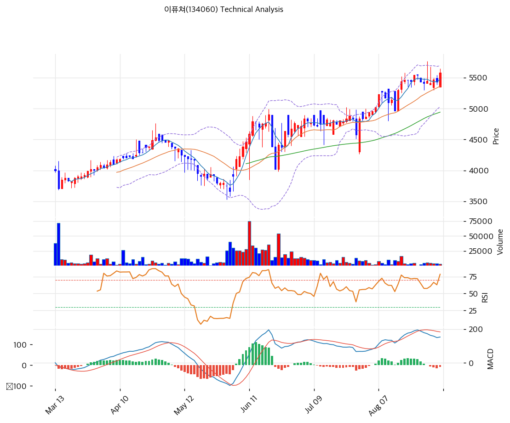

# 이퓨쳐(134060) 기술적 분석 보고서

---

---

## 가격 현황

| 항목 | 값 |
|------|-----|
| 현재가 | 5,580원 (+2.76%) |
| 52주 고가 / 저가 | 5,770원 / 3,530원 |
| 52주 범위 내 위치 | 91.5% |
| 시가총액 | 266억원 |
| 당일 거래량 | 2,983주 (20일 평균 대비 0.56x) |
| 당일 거래대금 | 약 1,600만원 |
| 20일 평균 거래량 | 5,336주 |

6월 1일 종가 3,750원에서 9월 4일 5,580원까지 48.8% 올랐다. 같은 기간 20일 평균 거래량은 6월 약 28,000주에서 8월 약 6,000주로 줄었다. 가격은 오르는데 거래는 말라붙는 형태다. 회사가 6월 2일부터 자기주식 신탁 매입을 시작한 시점과 상승 구간이 겹친다.

---

## 차트 패턴

### 캔들 패턴

**6월 24일 장대 양봉과 거래량 폭증**

시가 4,020원, 저가 3,985원, 종가 4,410원으로 9.70% 올랐다. 거래량은 53,769주로 20일 평균의 10배였다. 이날은 회사가 10억원 신탁계약 소진에 따른 중도 해지를 공시하고 곧바로 20억원 신탁계약을 재체결한 날이다. 직전 이틀간 이어진 급락의 저점을 그대로 반등시킨 캔들이다.

**6월 22\~23일 연속 장대 음봉**

6월 22일 시가 4,900원에서 종가 4,385원으로 10.60% 빠졌고, 다음 거래일에도 4,020원까지 8.32% 밀렸다. 이틀 낙폭이 18.0%다. 그런데 거래량은 9,444주와 14,934주로 평소 수준이었다. 얇은 호가에서 소량 매도가 가격을 무너뜨리는 구조를 보여준 구간이며, 이 종목의 하방 위험이 어떤 형태로 오는지를 알려준다.

**7월 30일 아랫꼬리 긴 망치형**

시가 4,300원, 저가 4,265원까지 밀렸다가 고가 4,875원, 종가 4,835원으로 마감했다. 몸통 상승폭이 12.44%이고 아래꼬리를 포함한 일중 진폭은 14.3%다. 전일 5.27% 하락을 하루 만에 되돌린 반전 캔들이다.

**8월 31일과 9월 1일 연속 윗꼬리**

8월 31일 시가 5,410원에서 장중 5,770원까지 올라 52주 신고가를 찍었으나 종가는 5,450원이었다. 윗꼬리가 320원, 고점 대비 5.5%를 반납했다. 다음 거래일에도 장중 5,680원까지 올랐다가 5,410원으로 마감해 윗꼬리 270원을 남겼다. 이틀 연속 5,700원 부근에서 매물이 확인됐다는 뜻이다.

**9월 4일 종가 마감 양봉**

시가 5,350원, 고가 5,650원, 종가 5,580원으로 고가 근처에서 마감했다. 거래량 2,983주로 얇지만 방향은 위였다. 8월 31일 이후 낮아지던 일중 고점(5,770 → 5,680 → 5,650)의 흐름 속에서 종가만 회복한 형태다.

### 구조

6월 저점 3,530원에서 8월 고점 5,770원까지 63.5% 상승했다. 상승 과정이 세 구간으로 나뉜다.

| 구간 | 기간 | 가격 변화 | 평균 거래량 | 성격 |
|------|------|-----------|------------:|------|
| 1차 급등 | 6/4 ~ 6/12 | 3,660 → 4,790 (+30.9%) | 약 32,000주 | 신탁 매입 개시 직후 |
| 조정과 재반등 | 6/22 ~ 6/30 | 4,905 → 4,670 (-4.8%) | 약 23,000주 | 이틀 18% 급락 후 공시 반등 |
| 저유동성 계단 상승 | 7/1 ~ 9/4 | 4,760 → 5,580 (+17.2%) | 약 7,000주 | 거래량 감소 속 완만한 우상향 |

7월 이후 구간이 특징적이다. 거래량이 1차 급등기의 5분의 1로 줄었는데도 가격은 계속 올랐다. 8월 26일에는 하루 거래량이 516주에 그쳤다. 매도 물량 자체가 없는 상태에서 소량 매수가 호가를 밀어올리는 구조다.

### 다이버전스

8월 31일 5,770원, 9월 1일 5,680원, 9월 4일 5,650원으로 일중 고점이 낮아지고 있다. 동시에 MACD 히스토그램은 -9로 음전했고 시그널선이 MACD선 위에 있다. 가격 고점과 모멘텀 지표가 같은 방향으로 약해지는 초기 신호다.

다만 종가 기준으로는 9월 4일 5,580원이 8월 31일 5,450원보다 높다. 명확한 하락 다이버전스로 확정하기에는 관찰 기간이 짧고 거래량이 너무 얇아 지표 신뢰도가 낮다. 경계 신호 수준으로 읽는 것이 적절하다.

---

## 이동평균선: 완전 정배열 (강세)

| 이평선 | 값 | 현재가 대비 괴리 | 위치 |
|--------|-----:|--------:|------|
| MA5 | 5,468원 | +2.0% | 상회 |
| MA20 | 5,362원 | +4.1% | 상회 |
| MA60 | 4,942원 | +12.9% | 상회 |
| MA120 | 4,525원 | +23.3% | 상회 |
| MA200 | 4,375원 | +27.5% | 상회 |

MA5 > MA20 > MA60 > MA120 > MA200 순서가 완벽하게 지켜진 정배열이다. 현재가는 모든 이평선 위에 있다.

MA20 괴리 +4.1%는 과열 구간이 아니다. 반면 MA200 괴리 +27.5%는 장기 추세 대비 상당히 앞서 나갔다는 뜻이며, 조정이 오면 되돌릴 폭이 그만큼 크다. MA60 4,942원이 1차 추세 방어선이고 여기가 깨지면 정배열 구조가 흔들린다.

---

## 보조 지표

### RSI(14): 65.9 (중립)

과매수 기준선 70에 4.1포인트 못 미친다. 6월 급등기에는 70을 넘었을 것으로 보이나 현재는 상단 부근에서 진정된 상태다. 추가 상승 여력이 지표상으로는 남아 있다.

### MACD: 매도 구간 진입

| 항목 | 값 |
|------|-----:|
| MACD선 | 153 |
| 시그널선 | 162 |
| 히스토그램 | -9 |
| 크로스 | 매도 (데드크로스) |
| 히스토그램 확대 여부 | 확대되지 않음 |

MACD선이 시그널선 아래로 내려갔다. 두 선 모두 0선 위에 있으므로 상승 추세 자체는 유지되지만 모멘텀이 꺾였다. 히스토그램이 -9로 얕고 아직 확대되지 않아 되돌림 여지는 있다. 히스토그램이 -30 아래로 벌어지면 조정 국면으로 봐야 한다.

### 볼린저 밴드: 상단 근접

| 밴드 | 값 |
|------|-----:|
| 상단 | 5,693원 |
| 중심선(MA20) | 5,362원 |
| 하단 | 5,030원 |
| 밴드 폭 | 12.4% |
| %B | 82.9% |

현재가 5,580원은 상단 5,693원까지 2.0% 남겨두고 있다. 상단을 이탈한 상태는 아니다. 밴드 폭 12.4%는 확장 국면으로, 6월 급등기에 벌어진 폭이 아직 좁혀지지 않았다. 하단 5,030원은 MA60 4,942원과 함께 중기 지지대를 형성한다.

### 스토캐스틱: 골든크로스 (중립)

| 항목 | 값 |
|------|-----:|
| %K | 65.8 |
| %D | 63.8 |
| 크로스 | 골든크로스 |
| 구간 | 중립 |

%K가 %D를 상향 돌파했고 과매수 기준 80 아래에 있다. 단기적으로는 매수 우위 신호다. MACD의 데드크로스와 방향이 엇갈리는데, 스토캐스틱이 더 짧은 주기를 보기 때문이며 9월 4일 반등이 반영된 결과로 읽힌다.

### 거래량: 0.56x (약함)

당일 거래량 2,983주는 20일 평균 5,336주의 56%다. 거래대금으로는 1,600만원이다. 상승일에 거래량이 평균 이하라는 것은 매수세가 강해서가 아니라 매도 물량이 없어서 오른다는 뜻이다.

8월 이후 일별 거래량은 516주에서 16,200주 사이를 오간다. 이 정도 유동성에서는 기술적 지표 자체의 신뢰도가 떨어진다. 한 주체의 수백 주 주문이 종가를 바꿀 수 있기 때문이다.

---

## 지지/저항: 추세선 · 피보나치 · PRZ 통합

### 피봇 포인트

| 구분 | 가격 | 현재가 대비 |
|------|-----:|--------:|
| R2 | 5,827원 | +4.4% |
| R1 | 5,703원 | +2.2% |
| 피봇 | 5,527원 | -0.9% |
| S1 | 5,403원 | -3.2% |
| S2 | 5,227원 | -6.3% |

### 피보나치

상승 스윙 저점 3,530원에서 고점 5,770원 기준이다.

| 되돌림 | 가격 | 의미 |
|--------|-----:|------|
| 0.236 | 5,241원 | 얕은 조정 |
| 0.382 | 4,914원 | MA60 4,942원과 겹침 |
| 0.5 | 4,650원 | 중간 되돌림 |
| 0.618 | 4,386원 | MA200 4,375원과 겹침 |
| 0.786 | 4,009원 | 깊은 조정, 6월 저점대 |

| 확장 | 가격 | 현재가 대비 |
|------|-----:|--------:|
| 1.272 | 6,379원 | +14.3% |
| 1.382 | 6,626원 | +18.7% |
| 1.618 | 7,154원 | +28.2% |
| 2.0 | 8,010원 | +43.5% |

### 추세선

| 구분 | 현재 수준 | 기울기 | 접점 | 방향 |
|------|-----:|-----:|-----:|------|
| 지지 추세선 | 3,940원 | +0.33 | 6개 | 상승 |
| 저항 추세선 | 4,787원 | +0.14 | 6개 | 상승 |

현재가 5,580원은 저항 추세선 4,787원을 이미 크게 위로 벗어났다. 6개 접점으로 그어진 저항선을 돌파한 뒤 되돌아오지 않은 상태이며, 이 선은 이제 지지 역할로 바뀐다. 다만 현재가와의 거리가 16.5%로 멀어 당장의 방어선 기능은 하지 못한다.

### PRZ (Potential Reversal Zone)

| 구간 | 가격대 | 신뢰도 | 근거 |
|------|-------|--------|------|
| 1차 지지 | 5,362\~5,468원 | 중 | MA20, 피봇 S1, MA5 |
| 2차 지지 | 5,227\~5,241원 | 약 | 피봇 S2, 피보나치 0.236 |
| 3차 지지 | 4,914\~4,942원 | 약 | 피보나치 0.382, MA60 |
| 4차 지지 | 4,375\~4,386원 | 약 | MA200, 피보나치 0.618 |
| 5차 지지 | 3,940\~4,009원 | 약 | 추세선 지지, 피보나치 0.786 |

1차 지지대 5,362\~5,468원이 가장 두껍다. MA5, MA20, 피봇 S1이 100원 구간에 몰려 있다. 이 구간이 무너지면 다음 방어선까지 2.5% 공백이 생긴다.

상방은 피봇 R1 5,703원과 볼린저 상단 5,693원이 겹치는 5,690\~5,700원대가 1차 저항이고, 그 위가 52주 고가 5,770원이다. 8월 31일과 9월 1일 두 차례 이 구간에서 밀렸다.

---

## 시그널 종합

| 지표 | 판단 | 신호 |
|------|------|------|
| 이동평균선 | 완전 정배열, MA20 +4.1% | 🟢 |
| RSI | 65.9, 중립 (과매수 진입 직전) | ⚪ |
| MACD | 데드크로스, 히스토그램 -9 | 🔴 |
| 볼린저밴드 | 상단 근접, 밴드 폭 12.4% | ⚪ |
| 스토캐스틱 | 골든크로스, K=65.8 | ⚪ |
| 거래량 | 0.56x, 절대량 2,983주로 극히 얇음 | ⚪ |

**매수 1 / 매도 1 / 중립 4 → 종합 중립**

방향을 가리키는 지표가 서로 상쇄한다. 이평선은 완전 정배열로 강세를 말하고 MACD는 데드크로스로 모멘텀 둔화를 말한다. 나머지는 판단을 유보하는 구간에 있다.

기술적 판단 자체보다 중요한 것은 거래량이다. 일평균 5,336주, 거래대금 1,600만원 수준에서는 어떤 지표도 신뢰 구간이 넓다. 6월 22\~23일 이틀간 18% 급락이 평소와 다르지 않은 거래량에서 발생했다는 사실이 이를 보여준다.

---

## 전략 제안

### 보유자

**홀드**. 정배열이 유지되고 있고 1차 지지대 5,362\~5,468원이 현재가에서 2\~4% 아래에 있다.

- 익절 목표: **5,692원** (볼린저 상단, 피봇 R1과 겹침)
- 2차 목표: **5,770원** (52주 고가, 두 차례 저항 확인된 구간)
- 손절 기준: **5,227원** (피봇 S2)
- MA20 5,362원 이탈 시 비중 축소를 검토한다. 이 종목은 지지선이 깨지면 되돌리는 데 시간이 걸리지 않고 한 번에 빠진다

### 미보유자

**관망**. 현재가는 52주 범위의 91.5% 지점이며 8월 말 이후 두 차례 상단에서 밀렸다.

- 1차 진입: **5,403원** (피봇 S1)
- 2차 진입: **5,362원** (MA20)
- 분할 매수 구간: 5,362\~5,468원 PRZ 내에서 나눠 접근
- 5,700원 위 추격은 권하지 않는다. 8월 31일과 9월 1일 윗꼬리가 그 구간의 매물을 보여줬다

### 유동성 관련 주의

일평균 거래대금이 1,600만원이다. 1,000만원어치를 매수하면 그날 거래대금의 60%를 차지하며, 매도할 때는 호가가 밀린다. 시장가 주문은 피하고 지정가로 여러 날에 나눠 체결하는 방식이 필요하다.

회사의 자기주식 신탁계약은 2026년 12월 23일까지다. 계약이 끝나거나 20억원이 조기 소진되면 현재 가격을 떠받치는 매수 주체가 사라진다. 기술적 지지선보다 이 일정이 더 실질적인 변수다.
