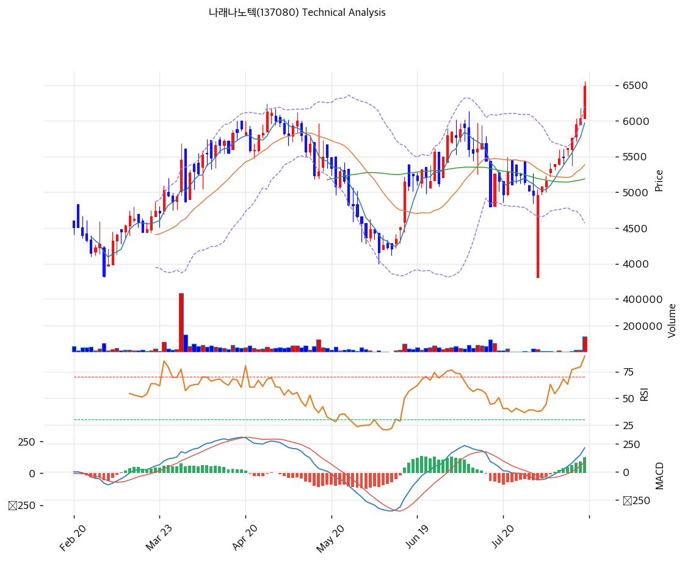

# 나래나노텍(137080) 기술적 분석

2026-08-17 | T2 Technical Analysis

---

## 차트

---

## 1. 가격 현황

| 항목 | 값 |
|------|-----|
| 현재가 | 6,490원 (+7.45%) |
| 52주 고가 | 6,560원 (2026-08-14 장중) |
| 52주 저가 | 2,860원 (2025-11-25) |
| 52주 범위 위치 | 98.1% |
| 거래량 | 20일 평균 대비 9.23x |

※ 2026-08-14 종가 기준(전일 6,040원). 이날은 반기보고서 접수일과 같은 날이다.

---

## 2. 차트 패턴 분석

### 2.1 캔들스틱 패턴

| 패턴 | 위치 | 신뢰도 | 해석 |
|------|------|--------|------|
| 갭 없는 장대양봉 | 8/14 (시 6,040 / 고 6,560 / 저 6,040 / 종 6,490) | 강 | 매수 시그널. 시가가 곧 저가이고 종가가 고가 근처인 전형적 강세봉. 거래량 11.7만주로 평소의 9배 |
| 적삼병 확장형 | 8/11\~8/14 (5,760 → 5,950 → 6,040 → 6,490) | 중 | 매수 시그널. 4거래일 연속 양봉이며 마지막 봉에서 거래량이 폭증해 돌파 성격을 띤다 |
| 갭 상승 후 안착 | 7/30 (시 3,810 → 종 4,960) | 강 | 이미 완성된 신호. 하루 +30% 수준의 점프 이후 되돌림 없이 12거래일간 계단식 상승 지속 |

※ 주요 캔들 패턴: 망치형, 역망치형, 장악형(상승/하락), 도지, 샛별/석별, 적삼병/흑삼병, 하라미, 유성형, 교수형 등

### 2.2 가격 구조 패턴

- **저점 대비 2.3배 상승 추세** (신뢰도: 강)
  2025-11-25 저점 2,860원에서 2026-08-14 6,490원까지 +127%다. 특히 7/30 이후 12거래일 구간에서 3,810원에서 6,490원으로 +70% 오르며 기울기가 급격히 가팔라졌다. 상승 각도가 단기간에 두 번 꺾여 올라간 형태라 되돌림이 나오면 폭이 클 수 있다.

- **볼린저 상단 돌파** (신뢰도: 중)
  현재가 6,490원이 볼린저 상단 6,205원을 4.6% 상회한다. 밴드 폭은 30.4%로 확장 국면이며, 상단 돌파는 추세 강화 신호이면서 동시에 단기 과열 신호다. 통상 상단 이탈 후에는 중단(MA20 5,386원) 방향으로 되돌림이 나온다.

- **거래량 돌파** (신뢰도: 강)
  8/14 거래량 117,269주는 20일 평균 12,705주의 9.23배다. 이 종목의 평소 거래량이 하루 1만주 남짓인 점을 감안하면 신규 자금 유입이 확실하다. 다만 유통주식 1,035만주 대비로는 여전히 1.1% 수준이라 얇은 유동성이 만든 가격 변동일 가능성도 함께 봐야 한다.

※ 주요 구조 패턴: 이중천정/바닥, 헤드앤숄더(정/역), 삼각수렴(대칭/상승/하락), 쐐기형(상승/하락), 깃발형, 페넌트, 컵앤핸들, 박스권 등

### 2.3 다이버전스

- **스토캐스틱 데드크로스** (신뢰도: 중)
  Slow %K 95.8이 %D 97.0 아래로 내려왔다. 95를 넘는 극단 과매수 구간에서의 데드크로스는 단기 조정 선행 신호로 읽힌다. 다만 강한 추세장에서는 과매수가 오래 유지되므로 단독 매도 근거로는 약하다.

- **RSI 과매수 진입, 다이버전스는 미형성** (신뢰도: 약)
  RSI 74.7로 70선을 넘었으나 가격과 RSI가 같은 방향으로 움직이고 있어 하락 다이버전스는 아직 나타나지 않았다. 신고가 갱신 시 RSI가 따라 오르지 못하면 그때가 경고 시점이다.

※ RSI·MACD 기반 | 상승 다이버전스 = 가격↓ 지표↑ (반등 시사), 하락 다이버전스 = 가격↑ 지표↓ (하락 시사), 히든 다이버전스 = 기존 추세 지속 시사

### 2.4 패턴 종합 판단

세 카테고리가 **추세 강도는 확실하되 단기 과열이 겹친 상태**를 가리킨다. 완전 정배열에 MACD 히스토그램 확대, 거래량 9.23배 동반 상승은 추세 신뢰도를 높이는 조합이다. 반대편에는 RSI 74.7, 스토캐스틱 95.8 데드크로스, 볼린저 상단 4.6% 돌파, 52주 범위 위치 98.1%가 놓여 있다.

상충 신호를 정리하면 방향은 위쪽이고 타이밍은 늦었다. 이 종목은 하루 거래량이 1만주 수준인 저유동성 종목이라 **추세 지표보다 유동성 리스크가 먼저 작동할 수 있다**는 점을 감안해야 한다.

---

## 3. 이동평균선: 정배열 (강세)

| MA | 값 | 현재가 괴리율 | 위치 |
|----|-----|--------------|------|
| MA5 | 5,972원 | +8.7% | 위 |
| MA20 | 5,386원 | +20.5% | 위 |
| MA60 | 5,188원 | +25.1% | 위 |
| MA120 | 5,181원 | +25.3% | 위 |
| MA200 | 4,601원 | +41.0% | 위 |

**해석**: MA5부터 MA200까지 완전 정배열이고 전 이동평균 위에 있다. 추세 등급으로는 최상이다. 문제는 이격이다. MA20 괴리 +20.5%는 과열 판정선(통상 +20%)을 막 넘었고 MA200 괴리는 +41.0%다. MA60과 MA120이 5,188원과 5,181원으로 거의 겹쳐 있어 이 구간이 강한 지지대를 형성한다. 되돌림이 나오면 1차로 MA20 5,386원, 2차로 MA60·MA120 밀집 구간 5,180원선이 방어선이 된다.

---

## 4. 보조 지표

### RSI(14): 74.7 (🔴과매수)

70선을 넘어선 과매수 구간이다. 다만 저점 대비 2.3배 오른 강세 추세에서는 RSI가 80까지 밀려 올라가는 경우가 흔하다. 70선을 다시 내주는 시점이 실질적인 경고 신호다.

### MACD(12,26,9)

| 항목 | 값 |
|------|-----|
| MACD | 214 |
| Signal | 89 |
| Histogram | +126 |
| 크로스 상태 | 매수 구간 (확대 중) |

**해석**: 매수 구간에서 히스토그램이 확대되고 있어 상승 모멘텀이 살아 있다. 6개 지표 중 가장 명확한 강세 신호다. 다만 MACD는 후행 지표이므로 히스토그램 축소 전환이 나오기 전까지는 추세 추종 신호로만 쓰는 것이 맞다.

### 볼린저밴드(20, 2σ)

| 항목 | 값 |
|------|-----|
| 상단 | 6,205원 |
| 중단 (MA20) | 5,386원 |
| 하단 | 4,566원 |
| 밴드 폭 | 30.4% |
| 현재 위치 | 상단 돌파 (+4.6%) |

**해석**: 밴드 폭 30.4%는 확장 국면이다. 현재가가 상단을 4.6% 넘어선 상태로, 밴드 밖에 머무는 구간은 통상 오래 지속되지 않는다. 상단선 6,205원이 되돌림 시 1차 지지로 전환될 가능성이 있다.

### 스토캐스틱(14, 3, 3)

| 항목 | 값 |
|------|-----|
| Slow %K | 95.8 |
| Slow %D | 97.0 |
| 크로스 상태 | 데드크로스 |
| 판단 | 과매수 |

---

## 5. 지지/저항: 추세선 · 피보나치 · PRZ 통합

### 5.1 피보나치 되돌림/확장

| 구분 | 비율 | 가격 | 현재가 대비 |
|------|------|------|-----------|
| Swing High | — | 5,910원 | -8.9% |
| 되돌림 | 0.236 | 5,062원 | -22.0% |
| 되돌림 | 0.382 | 5,224원 | -19.5% |
| 되돌림 | 0.5 | 5,355원 | -17.5% |
| 되돌림 | 0.618 | 5,486원 | -15.5% |
| 되돌림 | 0.786 | 5,672원 | -12.6% |
| Swing Low | — | 4,800원 | -26.0% |
| 확장 | 1.272 | 4,498원 | -30.7% |
| 확장 | 1.382 | 4,376원 | -32.6% |
| 확장 | 1.618 | 4,114원 | -36.6% |
| 확장 | 2.0 | 3,690원 | -43.1% |

※ 피보나치 기준: 직전 하락 추세 (Swing High 5,910원 → Swing Low 4,800원)
※ **현재가 6,490원이 스윙 고점 5,910원을 이미 상회했다.** 이 스윙은 8월 급등 이전 구간에서 산출된 것이라 되돌림 레벨의 실효성이 떨어진다. 확장 구간(하락 목표가)은 현재 국면과 방향이 반대여서 참고 대상이 아니다

### 5.2 추세선

| 추세선 | 방향 | 현재 교차가 | 포인트 수 | 해석 |
|--------|------|-----------|---------|------|
| 지지선 | 상승 | 4,170원 | 6개 | 기울기 4.79. 장기 저점을 잇는 선으로 현재가 대비 -35.7% 위치. 단기 방어선으로는 무의미 |
| 저항선 | 상승 | 6,328원 | 6개 | 기울기 7.53. 현재가가 이 선을 2.6% 상향 돌파했다. 저항이 지지로 전환되는 구간 |

### 5.3 PRZ (Potential Reversal Zone)

| 방향 | 가격 범위 | 신뢰도 | 근거 |
|------|---------|--------|------|
| 지지 | 5,843\~5,972원 | 약 | 피봇 S2 + MA5 |
| 지지 | 5,355\~5,486원 | 중 | 피보나치 0.5 되돌림 + MA20 + 피보나치 0.618 되돌림 |
| 지지 | 5,062\~5,224원 | **강** | 피보나치 0.236 되돌림 + MA120 + MA60 + 피보나치 0.382 되돌림 |

※ PRZ = 추세선 · 피보나치 · 피봇 · MA 등 복수 지표가 겹치는 가격 구간. 겹치는 소스가 많을수록 반전 확률 상승.

### 5.4 종합 지지/저항 테이블

| 구분 | 가격 | 근거 |
|------|------|------|
| 저항 | 6,883원 | 피봇 R2 |
| 저항 | 6,687원 | 피봇 R1 |
| 저항 | 6,560원 | 52주 고가 (8/14 장중) |
| **현재가** | **6,490원** | — |
| 지지 | 6,328원 | 추세선 저항의 지지 전환 |
| 지지 | 6,205원 | 볼린저 상단 |
| 지지 | 5,908원 | PRZ (약) + 피봇 S2 5,843원 |
| 지지 | 5,409원 | PRZ (중) + MA20 5,386원 |
| 강 지지 | 5,164원 | **PRZ (강)** + MA60 5,188원 + MA120 5,181원 밀집 |

---

## 6. 시그널 종합

| 지표 | 내용 | 시그널 |
|------|------|--------|
| **차트 패턴** | 장대양봉 + 적삼병, 볼린저 상단 돌파, 거래량 9.23배 | 🟢 |
| 이동평균선 | 완전 정배열, MA20 괴리 +20.5% (추세 강세 / 이격 과열) | ⚪ |
| RSI | 74.7 과매수 | 🔴 |
| MACD | 매수 구간, 히스토그램 +126 확대 | 🟢 |
| 볼린저밴드 | 상단 4.6% 돌파, 밴드 폭 30.4% | ⚪ |
| 스토캐스틱 | K 95.8 극단 과매수, 데드크로스 | 🔴 |
| 거래량 | 9.23x 강력 동반 | 🟢 |

**종합 판단**: 🟢 매수 3개 / 🔴 매도 2개 / ⚪ 중립 2개 → **매수우위** (과열 경고)

추세와 수급은 모두 위쪽을 가리키는데 단기 과열 지표 두 개가 걸린다. 주목할 것은 급등 시점이다. 8/14는 **반기보고서 접수일**이고, 그 보고서에 5년 만의 반기 영업흑자(36.6억)와 무차입 전환(차입금 0원), 순현금 546억이 담겨 있었다. 즉 이번 상승은 재료 없는 수급 장세가 아니라 **공시된 펀더멘털 변화에 대한 반응**이다.

다만 유통주식 1,035만주에 평소 거래량이 1만주 수준인 저유동성 종목이라는 점이 양방향으로 작동한다. 적은 자금으로 크게 오르지만 빠질 때도 마찬가지다.

---

## 7. 전략 제안

### 보유 중인 경우
- **홀드 (일부 익절)**
- 익절 라인: 6,687원 (피봇 R1). 52주 고가 6,560원 돌파 후 안착하면 6,883원(피봇 R2)까지 연장
- 손절 라인: 5,843원 (피봇 S2 이탈). 보수적으로는 MA20 5,386원
- 리스크/리워드: 익절 +3.0% / 손절 -10.0%로 약 0.3 : 1. 현 가격대는 손익비가 불리하므로 분할 익절이 합리적

### 진입 대기인 경우
- **관망**
- 1차 진입가: 6,167원 (피봇 S1). 볼린저 상단 6,205원 지지 확인 시
- 2차 진입가: 5,164\~5,409원 (PRZ 강·중 구간). MA20·MA60·MA120이 겹치는 5,180\~5,390원 밀집대
- 진입 조건: RSI 70선 아래 안착 후 거래량 동반 재반등. 반대로 6,560원을 거래량과 함께 돌파해 신고가를 확정하면 추세 추종 전환도 가능하다. 다만 이 종목은 하루 거래량이 1만주 수준이라 **호가 슬리피지를 반드시 감안해 분할 진입**해야 한다
