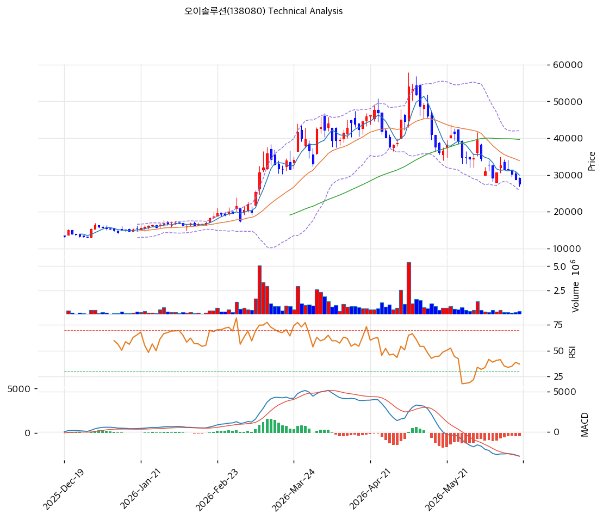

# 오이솔루션(138080) 기술적 분석

2026-06-21 | T2 Technical Analysis

---

## 차트

---

## 1. 가격 현황

| 항목 | 값 |
|------|-----|
| 현재가 | 27,600원 (-4.00%) |
| 52주 고가 | 54,000원 |
| 52주 저가 | 9,080원 |
| 52주 범위 위치 | 41.2% (고점서 -49%) |
| 거래량비 | 0.76x (감소) |
| RSI | 35.9 (중립, 과매도 근접) |

> 저점(9,080원)에서 5.9배 급등(54,000원) 후 **-49% 깊은 조정**(27,600원). 단기·중기선(MA5 29,920·MA20 33,868·MA60 39,647) 아래로 조정 추세이나 MA200(22,402) 위. RSI 35.9·스토캐 K=10 과매도권으로 단기 반등 여지. 거래량 감소(0.76x)로 매도 강도 약화.

---

## 2. 차트 패턴 분석

### 2.1 구조·캔들

| 패턴 | 위치 | 신뢰도 | 해석 |
|------|------|--------|------|
| 고점 후 깊은 조정 | 54,000→27,600 | 중상 | -49% 되돌림 |
| MA200 지지 시험 | 27,600 vs 22,402 | 중 | 장기 추세 방어선 |
| 과매도 반등 여지 | stoch 10 | 중 | 단기 기술 반등 |

- **급등 후 조정** (신뢰도: 중상): 5.9배 급등의 절반 되돌림. 피보 0.618(27,525)·MA120(29,373) 부근 지지 시험.
- **과매도·매도강도 약화** (신뢰도: 중): RSI 35.9·스토캐 10 과매도, 거래량 감소.

### 2.2 다이버전스

- **과매도 단기 반등 여지** (신뢰도: 중): 스토캐 과매도(K=10)이나 MACD 매도 지속. 펀더(흑전 초기)·CB 희석이 추세 반등을 제약.

---

## 3. 이동평균선 — 조정 추세·장기선 지지

| MA | 값 | 괴리율 | 위치 |
|----|-----|--------|------|
| MA5 | 29,920 | -7.8% | 아래 |
| MA20 | 33,868 | -18.5% | 아래 |
| MA60 | 39,647 | -30.4% | 아래 |
| MA120 | 29,373 | -6.0% | 아래 |
| MA200 | 22,402 | +23.2% | 위 |

**해석**: 단기·중기선(MA5/20/60) 아래로 **조정 추세**(정배열 깨짐). 단 MA200(22,402) 위로 장기 상승 추세는 잔존. MA120(29,373)·피보 0.618(27,525)이 현 지지대, 이탈 시 MA200(22,402)·피보 0.786(20,328)까지 열림. MA60(39,647)이 강한 저항.

---

## 4. 보조 지표

### RSI(14) — 35.9 (중립, 과매도 근접)
30 근접. 추가 하락 시 과매도 진입, 단기 반등 여지.

### MACD(12,26,9)
| MACD | Signal | Hist | 크로스 |
|---|---|---|---|
| -3,056 | -2,643 | -413 | 매도(확산) |

매도 전환·히스토그램 음(-) 확대 → 하락 모멘텀 지속.

### 볼린저밴드(20,2σ)
| 상단 | 중단 | 하단 | 밴드폭 |
|---|---|---|---|
| 41,999 | 33,868 | 25,736 | 48.0% |

현재가 27,600은 하단(25,736) 근접. 밴드폭 48% 초고변동. 하단 지지 시 반등, 이탈 시 추가 하락.

### 스토캐스틱
| %K | %D | 판단 |
|---|---|---|
| 10.0 | 16.4 | 과매도 |

심한 과매도권. 단기 기술 반등 여지이나 데드크로스.

---

## 5. 지지/저항

| 구분 | 가격 | 근거 |
|------|------|------|
| 저항 | 54,000 | 52주 고가 |
| 저항 | 39,647 | MA60 |
| 저항 | 37,635 | 피보 0.382 |
| 저항 | 33,868 | MA20 |
| 저항 | 32,580 | 피보 0.5 |
| 저항 | 29,698 | PRZ(강)·MA120·MA5 |
| 저항 | 29,033 | 피봇 R1 |
| **현재가** | **27,600** | 조정·지지 시험 |
| 지지 | 27,525 | 피보 0.618 |
| 지지 | 26,483 | 피봇 S1 |
| 지지 | 25,736 | 볼린저 하단 |
| 지지 | 25,367 | 피봇 S2·전략 SL |
| 지지 | 22,402 | MA200 |
| 지지 | 20,328 | 피보 0.786 |

---

## 6. 시그널 종합

| 지표 | 내용 | 시그널 |
|------|------|--------|
| 차트 패턴 | 고점 후 조정·지지 시험 | ⚪ |
| 이동평균선 | 조정 추세, MA200 위 | ⚪ |
| RSI | 35.9 — 중립(과매도 근접) | ⚪ |
| MACD | 매도(확산) | 🔴 |
| 볼린저밴드 | 하단 근접 | ⚪ |
| 스토캐스틱 | 과매도(K=10) | 🟢 |
| 거래량 | 0.76x 감소 | ⚪ |

**종합 판단**: 🟢 매수 1개 / 🔴 매도 1개 / ⚪ 중립 4개 → **중립 (조정 후 지지 시험)**

5.9배 급등의 -49% 깊은 조정 국면. MACD 매도(약세) vs 스토캐 과매도(반등 여지)가 상충. MA120(29,373)·피보 0.618(27,525) 지지대 시험 중이며, 이탈 시 MA200(22,402)까지 열린다. 펀더(흑전 초기)·CB 희석이 추세 반등을 제약해, **MA200(22,402) 지지 + 데이터센터 실적 가시화**가 추세 전환의 전제. 거래량 감소로 투매는 진정 국면.

---

## 7. 전략 제안

### 보유 중인 경우
- **홀드 (지지 주시)**
- 익절: 29,698(PRZ)·33,868(MA20)·39,647(MA60) 단계
- 손절: 25,367(피봇 S2)·MA200(22,402) 이탈
- 초고변동(밴드폭 48%), 분할 대응

### 진입 대기인 경우
- **분할 (과매도 반등·지지 확인)**
- 1차: 25,367\~27,525 (피봇 S2·피보 0.618)
- 2차: 22,402 (MA200 지지 확인)
- 진입 조건: 과매도(스토캐 10)로 단기 반등 여지이나 펀더·CB 희석 부담. MA200 지지 + 3Q26 ELSFP 샘플·데이터센터 수주 가시화 확인이 추세 전환의 전제. 추격보다 분할.
