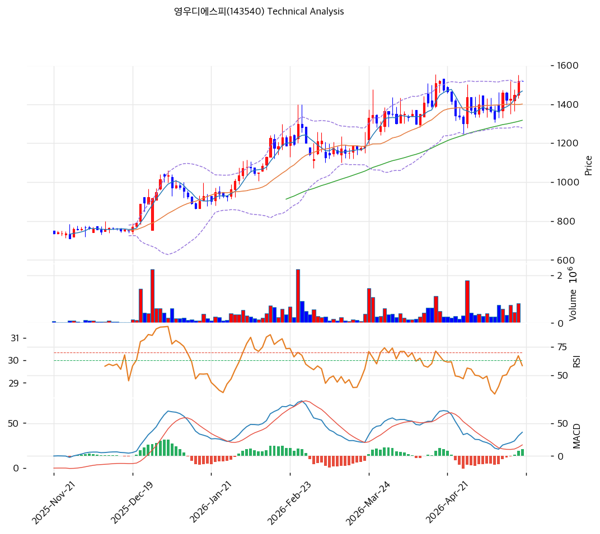

# 영우디에스피(143540) 기술적 분석

2026-05-20 | T2 Technical Analysis

---

## 차트

---

## 1. 가격 현황

| 항목 | 값 |
|------|-----|
| 현재가 | 1,520원 (52주 신고가) |
| 52주 고가 | 1,520원 (당일) |
| 52주 저가 | 576원 |
| 52주 범위 위치 | 100.0% |
| 거래량 | 데이터 결손 (차트상 안정 거래) |

---

## 2. 차트 패턴 분석

### 2.1 캔들스틱 패턴

| 패턴 | 위치 | 신뢰도 | 해석 |
|------|------|--------|------|
| **장대양봉 (당일 신고가)** | 당일 | 강 | 거래량 동반 신고가 |
| **단계적 상승** | 6개월 누적 | 강 | 800→1,000→1,200→1,520원 단계적 상승 |
| 적삼병 | 최근 3~5일 | 중 | 양봉 누적 |

### 2.2 가격 구조 패턴

- **단계적 상승 채널** (신뢰도: 강)
  2025-11 800원 → 2026-01 1,200원 → 2026-02~03 박스 → 2026-04~05 1,500원 재돌파. **6개월 +164% 단계적 상승** — 저변동성 우량 패턴.

- **52주 신고가 갱신** (신뢰도: 중)
  1,520원 = BB 상단 1,523원 일치 — 단기 일부 조정 가능.

### 2.3 다이버전스

- **RSI 62.5 중립** (신뢰도: 강)
  RSI 70 미돌파. 추가 상승 여지.

- **MACD 매수 + 히스토그램 확대** (신뢰도: 중)
  MACD 36 > Signal 26, 히스토그램 +11. 매수 추세 유지.

### 2.4 패턴 종합 판단

단계적 상승 + RSI 62 미과열 + MACD 매수 + 외인·기관 동시 매집 = **건전한 추세 가속**. 펀더멘털 (V자 흑전·25Q4 OPM 15.1%) 정합. 단기 -3~-5% 조정 가능하나 추세 강세 유지.

---

## 3. 이동평균선 — 정배열 (안정·강세)

| MA | 값 | 현재가 괴리율 | 위치 |
|----|-----|--------------|------|
| MA5 | 1,467원 | +3.6% | 위 |
| MA20 | 1,401원 | +8.5% | 위 |
| MA60 | 1,317원 | +15.4% | 위 |
| MA120 | (확인) | 약 +30% | 위 |
| MA200 | 950원 | **+60.0%** | 위 |

**해석**: 완벽한 정배열. MA20 +8.5% 정상 추세. MA200 +60% 회복 추세. **MA20 (1,401원)을 1차 강력 지지로 인식**.

---

## 4. 보조 지표

### RSI(14) — 62.5 (중립)

70 임계 미돌파. 추가 상승 여지.

### MACD(12,26,9)

| 항목 | 값 |
|------|-----|
| MACD | 36 |
| Signal | 26 |
| Histogram | +11 |
| 크로스 상태 | 매수 (확대 중) |

### 볼린저밴드(20, 2σ)

| 항목 | 값 |
|------|-----|
| 상단 | 1,523원 |
| 중단 (MA20) | 1,401원 |
| 하단 | 1,278원 |
| 밴드 폭 | 17.5% |
| 현재 위치 | 상단 -0.2% 근접 |

**해석**: 밴드 폭 17.5% 평균. 상단 근접 — 단기 일부 조정 가능.

### 스토캐스틱(14, 3, 3)

| 항목 | 값 |
|------|-----|
| Slow %K | 83.0 |
| Slow %D | 76.0 |
| 크로스 상태 | 골든크로스 |
| 판단 | 🔴 과매수 |

---

## 5. 지지/저항

### 종합 지지/저항

| 구분 | 가격 | 근거 |
|------|------|------|
| 저항 | 1,800원 | 심리적 라운드넘버 |
| 저항 | 1,600원 | 1차 상단 |
| 저항 | 1,523원 | BB 상단 |
| **현재가** | **1,520원** | 52주 신고가 |
| 지지 | 1,467원 | MA5 |
| 지지 | 1,401원 | **MA20 + BB 중단 (1차 강력)** |
| 지지 | 1,317원 | MA60 |
| 지지 | 1,278원 | BB 하단 |
| 지지 | 950원 | MA200 |
| 지지 | 576원 | 52주 저점 |

---

## 6. 시그널 종합

| 지표 | 시그널 |
|------|--------|
| 차트 패턴 (단계적 상승) | 🟢 |
| 이동평균선 (정배열) | 🟢 |
| RSI 62.5 (중립) | ⚪ |
| MACD 매수 + 확대 | 🟢 |
| 볼린저밴드 상단 근접 | ⚪ |
| 스토캐스틱 83.0 🔴 | 🔴 |
| 거래량 (꾸준) | ⚪ |

**종합 판단**: 🟢 매수 3 / 🔴 매도 1 / ⚪ 중립 3 → **매수우위**

단계적 상승 + RSI 미과열 + 외인·기관 매집 = 건전한 추세. 스토캐스틱 80+만 단기 조정 시그널.

---

## 7. 전략 제안

### 보유 중
- **홀드 + 분할 익절**
- 1차 익절: 1,600원 (1차 상단, +5%)
- 2차 익절: 1,800원 (심리적, +18%)
- 손절: 1,401원 (MA20, -8%)

### 진입 대기
- **진입 가능 (분할)**
- 1차 진입: 1,520원 (현재가, 직접 진입)
- 2차 진입: 1,401원 (MA20, -8%)
- 3차 진입: 1,278원 (BB 하단, -16%)
- 진입 조건: MA20 도달 + 양봉 + 거래량 회복
- **펀더멘털 우호**: V자 흑전 + 25Q4 OPM 15.1% + 외인·기관 매집 — 단기 조정도 -8% 이내 제한 추정
