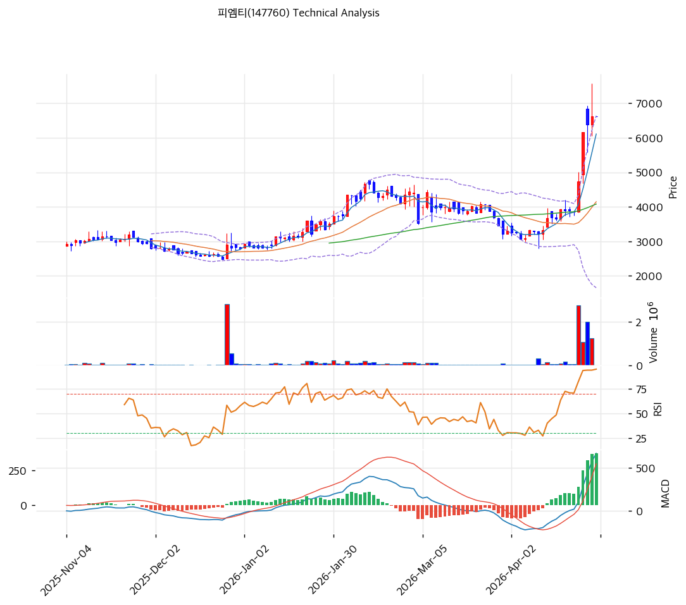

# 피엠티(147760) 기술적 분석

2026-04-29 | T2 Technical Analysis

---

## 차트

---

## 1. 가격 현황

| 항목 | 값 |
|------|-----|
| 현재가 | 6,630원 (0.0%) |
| 52주 고가 | 6,940원 |
| 52주 저가 | 2,105원 |
| 52주 범위 위치 | 100.0% (52주 고가 근접) |
| 거래량 | 20일 평균 대비 0.0x (당일 거래 없음) |

---

## 2. 차트 패턴 분석

### 2.1 캔들스틱 패턴

| 패턴 | 위치 | 신뢰도 | 해석 |
|------|------|--------|------|
| 장기 상승 추세 이후 고점 형성 | 현재가 = 52주 고가 | 강 | 52주 고가 돌파 후 고점에서 정체 중. 추가 상승 모멘텀 확인 필요 |
| 거래량 소멸 | 당일 | 강 | 거래량 0으로 추가 매수세 부재. 상승 동력 약화 시그널 |

※ 당일 거래량 데이터 미집계(0.0x)로 특정 캔들 패턴 확인 불가

### 2.2 가격 구조 패턴

- **급등 후 고점 정체** (신뢰도: 강)
  52주 저가 2,105원에서 현재가 6,630원으로 약 215% 급등한 이후 52주 고가(6,940원) 부근에서 정체 중이다. 볼린저밴드 상단(6,642원)과 현재가가 거의 일치하며 단기 저항선이 형성된 상태다. 기술적으로 과매수 구간에서의 추가 돌파는 거래량 확인이 선행되어야 신뢰도가 높다.

- **상승 추세 채널 내 위치** (신뢰도: 중)
  상승 추세선(지지: 현재 3,208원, 저항: 4,596원)이 장기간 유효하게 작동 중. 현재가는 추세선 채널 상단을 크게 이탈한 상태로 단기 과열 구간에 위치한다. 추세선 상단 저항선(4,596원) 대비 현재가가 +44% 이상 상회 중이며, 이는 추세 내 정상 위치를 크게 벗어난 것이다.

- **박스권 돌파 이후 재확인 국면** (신뢰도: 중)
  피보나치 0.236 되돌림(6,280원) 부근을 지지로 삼아 고점 돌파를 시도 중. 해당 수준 이탈 시 0.382(5,482원) → 0.5(4,838원) 순으로 되돌림 가능성 존재.

### 2.3 다이버전스

- **RSI 하락 다이버전스** (신뢰도: 강)
  현재 RSI 85.0으로 극단적 과매수 영역. 스토캐스틱은 K=82.5, D=87.7로 데드크로스 진입 중이며 K < D 전환이 발생. 가격이 고점을 유지하는 동안 스토캐스틱이 데드크로스를 형성하는 것은 단기 하락 압력을 시사한다.

- **MACD 히스토그램 확대** (신뢰도: 중)
  MACD(668) > Signal(297), 히스토그램 +372로 매수 구간에서 확대 중. 중기 추세는 여전히 강세이나, RSI 및 스토캐스틱과의 괴리가 과열 해소 가능성을 암시한다.

### 2.4 패턴 종합 판단

현재 차트는 장기 상승 추세 속 단기 과매수 과열 구간에 위치한다. MACD는 매수 구간에서 히스토그램 확대 중이어서 중기 추세는 강세를 유지하나, RSI 85 및 스토캐스틱 데드크로스가 단기 조정 압력을 시사한다. 52주 고가 근접 및 볼린저밴드 상단 밀착 상태에서 거래량이 0으로 소멸한 점은 단기 고점 형성 가능성을 높인다. 매수세 재유입(거래량 확인)이 선행되지 않으면 단기 조정 가능성이 우위다.

---

## 3. 이동평균선 — 정배열 (강세)

| MA | 값 | 현재가 괴리율 | 위치 |
|----|-----|--------------|------|
| MA5 | 6,111원 | +8.5% | 위 |
| MA20 | 4,149원 | +59.8% | 위 |
| MA60 | 4,081원 | +62.5% | 위 |
| MA120 | 3,516원 | +88.6% | 위 |
| MA200 | 3,138원 | +111.3% | 위 |

**해석**: 5선부터 200선까지 완전 정배열로 중장기 상승 추세가 강하게 형성돼 있다. 다만 MA20 대비 +59.8%, MA200 대비 +111.3% 괴리율은 단기 극단적 과열을 의미한다. 과거 유사한 급등 이후에는 MA20(4,149원) 또는 MA60(4,081원)으로의 조정이 나타나는 경우가 많다.

---

## 4. 보조 지표

### RSI(14) — 85.0 (🔴과매수)

RSI 85.0은 통상적인 과매수 기준(70)을 크게 상회하는 극단적 과열 구간이다. 이 수준에서는 추가 상승보다 조정 또는 횡보 가능성이 높다.

### MACD(12,26,9)

| 항목 | 값 |
|------|-----|
| MACD | 668 |
| Signal | 297 |
| Histogram | +372 |
| 크로스 상태 | 매수 구간 (확대 중) |

**해석**: MACD가 Signal을 상회하는 매수 구간으로 중기 모멘텀은 긍정적이다. 히스토그램이 확대 중이나 RSI 과매수와 함께 고려하면 상승 탄력이 정점에 근접했을 가능성이 있다.

### 볼린저밴드(20, 2σ)

| 항목 | 값 |
|------|-----|
| 상단 | 6,642원 |
| 중단 (MA20) | 4,149원 |
| 하단 | 1,656원 |
| 밴드 폭 | 120.2% |
| 현재 위치 | 상단 근접 |

**해석**: 밴드 폭 120.2%로 극단적으로 확장된 상태. 현재가(6,630원)가 상단(6,642원)에 거의 밀착해 있다. 밴드 확장 후 수축 과정에서 중단(MA20, 4,149원)으로의 회귀 압력이 존재한다.

### 스토캐스틱(14, 3, 3)

| 항목 | 값 |
|------|-----|
| Slow %K | 82.5 |
| Slow %D | 87.7 |
| 크로스 상태 | 데드크로스 |
| 판단 | 과매수 |

---

## 5. 지지/저항 — 추세선 · 피보나치 · PRZ 통합

### 5.1 피보나치 되돌림/확장

| 구분 | 비율 | 가격 | 현재가 대비 |
|------|------|------|-----------|
| Swing High | — | 7,570원 | +14.2% |
| 되돌림 | 0.236 | 6,280원 | -5.3% |
| 되돌림 | 0.382 | 5,482원 | -17.3% |
| 되돌림 | 0.5 | 4,838원 | -27.0% |
| 되돌림 | 0.618 | 4,193원 | -36.8% |
| 되돌림 | 0.786 | 3,275원 | -50.6% |
| Swing Low | — | 2,105원 | -68.2% |
| 확장 | 1.272 | 9,056원 | +36.6% |
| 확장 | 1.382 | 9,658원 | +45.7% |
| 확장 | 1.618 | 10,947원 | +65.1% |
| 확장 | 2.0 | 13,035원 | +96.6% |

※ 피보나치 기준: 상승 추세 (Swing Low 2,105원 → Swing High 7,570원)
※ 되돌림 = 직전 추세에서 되돌아온 비율, 확장 = 추세 방향 목표가

### 5.2 추세선

| 추세선 | 방향 | 현재 교차가 | 포인트 수 | 해석 |
|--------|------|-----------|---------|------|
| 지지선 | 상승 | 3,208원 | 6개 | 장기 상승 지지선. 현재가 대비 -51.6%로 장기 지지선 |
| 저항선 | 상승 | 4,596원 | 6개 | 상승 채널 상단. 현재가가 이를 크게 이탈한 상태 |

### 5.3 PRZ (Potential Reversal Zone)

| 방향 | 가격 범위 | 신뢰도 | 근거 |
|------|---------|--------|------|
| 지지 | 6,280~6,630원 | 강 | 피봇 R1/R2/S1/S2, 피보나치 0.236 되돌림, 52주 고가 |
| 지지 | 4,081~4,193원 | 중 | MA20(4,149), MA60(4,081), 피보나치 0.618(4,193) 집중 |
| 지지 | 5,482원 | 중 | 피보나치 0.382 되돌림 |

### 5.4 종합 지지/저항 테이블

| 구분 | 가격 | 근거 |
|------|------|------|
| 저항 | 7,570원 | Swing High(피보나치 기준점) |
| 저항 | 6,940원 | 52주 고가 |
| **현재가** | **6,630원** | — |
| 지지 | 6,280원 | 피보나치 0.236 되돌림 |
| 지지 | 5,482원 | 피보나치 0.382 되돌림 |
| 지지 | 4,838원 | 피보나치 0.5 되돌림 |
| 지지 | 4,149원 | MA20, PRZ(MA20+MA60+피보나치 0.618 집중) |
| 지지 | 3,208원 | 추세선 지지(상승), 장기 지지선 |

---

## 6. 시그널 종합

| 지표 | 내용 | 시그널 |
|------|------|--------|
| **차트 패턴** | 장기 상승 추세 + 단기 고점 정체, 스토캐스틱 데드크로스 | 🔴 |
| 이동평균선 | 완전 정배열, MA20 +59.8% 극단적 과열 | 🟢 (추세) / 🔴 (과열) |
| RSI | 85.0 — 극단적 과매수 | 🔴 |
| MACD | 매수구간, 히스토그램 확대 중 | 🟢 |
| 볼린저밴드 | 상단 밀착, 밴드 폭 120.2% 극단적 확장 | ⚪ |
| 스토캐스틱 | 데드크로스, K=82.5 과매수 | 🔴 |
| 거래량 | 0.0x — 데이터 미집계 | ⚪ |

**종합 판단**: 🟢 매수 2개 / 🔴 매도 3개 / ⚪ 중립 2개 → **매도우위**

중기 추세는 정배열로 강세를 유지하나, 단기적으로는 RSI 85, 스토캐스틱 데드크로스, 볼린저밴드 상단 밀착, 거래량 소멸 등 과열 지표가 동시에 경고를 발신 중이다. 현재가가 52주 고가이자 볼린저밴드 상단인 6,630~6,940원 구간에서 저항을 받는 상황으로, 단기 조정 후 피보나치 0.236(6,280원) 또는 MA20(4,149원) 구간 재확인 가능성이 있다.

---

## 7. 전략 제안

### 보유 중인 경우
- **비중축소**
- 익절 라인: 6,940원 (52주 고가·피보나치 Swing High 근접 저항)
- 손절 라인: 6,280원 이탈 시 (피보나치 0.236 지지 이탈 → 추가 하락 신호)
- 리스크/리워드: 익절 +4.7% / 손절 -5.3% = 약 0.9:1 (불리)

### 진입 대기인 경우
- **관망**
- 1차 진입가: 5,482원 (피보나치 0.382 되돌림, RSI 중립권 복귀 확인 후)
- 2차 진입가: 4,149원 (MA20+MA60+피보나치 0.618 PRZ 구간)
- 진입 조건: RSI 60 이하 복귀 + 거래량 동반 반등 확인 + 2D 수율 안정화 뉴스 확인
