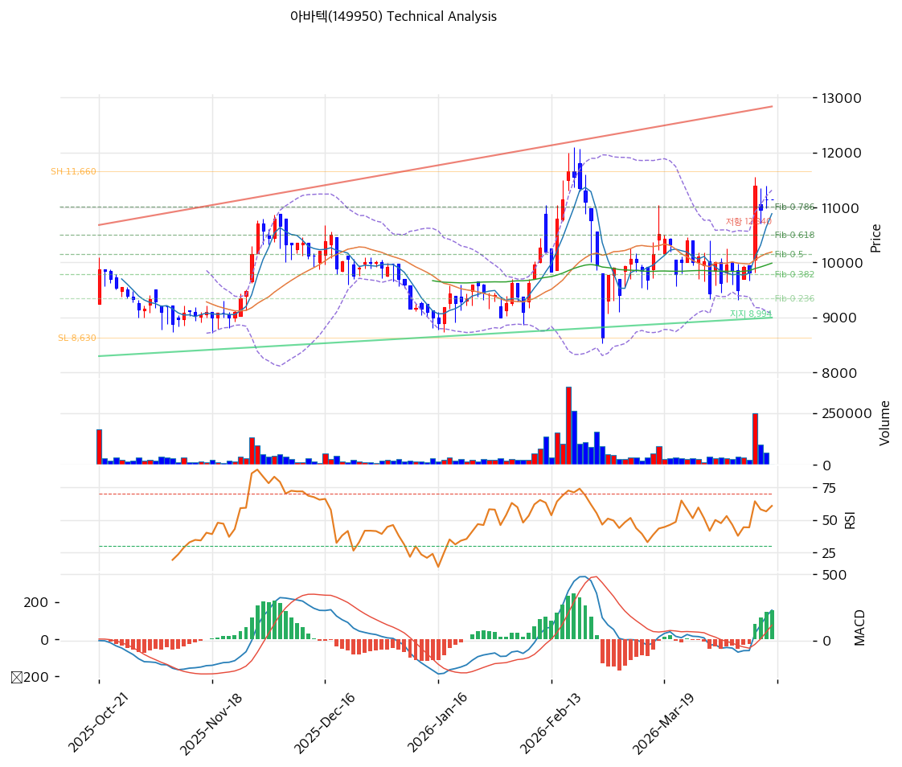

# 아바텍(149950) 기술적 분석

2026-04-15 | T2 Technical Analysis

---

## 차트

---

## 1. 가격 현황

| 항목 | 값 |
|------|-----|
| 현재가 | 11,140원 (0.00%) |
| 52주 고가 | 11,660원 |
| 52주 저가 | 7,650원 |
| 52주 범위 위치 | 87.0% |
| 거래량 | 데이터 미제공 (volume_ratio: 0.0) |

---

## 2. 차트 패턴 분석

### 2.1 캔들스틱 패턴

| 패턴 | 위치 | 신뢰도 | 해석 |
|------|------|--------|------|
| 상승 추세 지속 | 최근 4주 | 중 | 52주 저가(7,650원) 대비 +45.6% 상승 이후 고점(11,660원) 부근 횡보 — 강한 상승 모멘텀 유지 중 |
| 상단 밴드 근접 | 현재 | 중 | 볼린저밴드 상단(11,314원) 돌파 후 소폭 상회 — 단기 과열 여부 점검 필요 |

※ 주요 캔들 패턴 상세는 일봉 차트 직접 확인 권고

### 2.2 가격 구조 패턴

- **상승 추세 채널** (신뢰도: 강)
  지지 추세선(기울기 +5.89, 현재 교차가 8,994원)과 저항 추세선(기울기 +18.13, 현재 교차가 12,840원) 사이에서 상승 채널이 형성돼 있다. 현재가 11,140원은 채널 내 중상단에 위치하며, 저항선(12,840원)까지 약 15.3% 추가 상승 여력이 있다. 지지선은 현재 8,994원으로 현재가와 격차가 19.4%로 여유 있는 구간이다.

- **52주 고점 부근 저항** (신뢰도: 중)
  52주 고가(11,660원)가 현재가(11,140원) 대비 불과 4.7% 위에 위치해 직접적인 저항으로 작용할 수 있다. 해당 고점을 거래량 동반 돌파 시 채널 상단(12,840원)까지 확장 가능하며, 실패 시 단기 조정 가능성이 있다.

### 2.3 다이버전스

- **RSI 중립 구간 유지** (신뢰도: 중)
  RSI(14)가 59.3으로 중립 구간에 위치하며, 현재가가 52주 고가 근처임에도 RSI가 과매수(70 이상)에 진입하지 않은 상태다. 이는 상승 추세가 기술적 과열 없이 진행 중임을 시사하며, 추가 상승 시 다이버전스 발생 여부를 면밀히 주시해야 한다.

- **MACD 히스토그램 확대** (신뢰도: 강)
  MACD 히스토그램이 +154로 확대 중이며, MACD(229)가 시그널(75)을 상회하는 매수 구간이 유지되고 있다. 히스토그램 확대는 상승 모멘텀이 강화되고 있음을 의미한다.

### 2.4 패턴 종합 판단

현재 차트는 상승 추세 채널 내에서 52주 고가(11,660원) 돌파를 앞둔 구간이다. RSI 중립(59.3)과 MACD 히스토그램 확대(+154)가 상승 모멘텀을 지지하며, 볼린저밴드 상단 근접은 단기 과열 신호이나 과매수 진입까지는 여유가 있다. 52주 고점 저항을 돌파하면 추세선 저항(12,840원)까지 목표 확장이 가능하나, 실패 시 MA20(10,190원)∼MA60(9,985원) 지지대로의 되돌림을 경계해야 한다.

---

## 3. 이동평균선 — 정배열 (강세)

| MA | 값 | 현재가 괴리율 | 위치 |
|----|-----|--------------|------|
| MA5 | 10,886원 | +2.3% | 위 |
| MA20 | 10,190원 | +9.3% | 위 |
| MA60 | 9,985원 | +11.6% | 위 |
| MA120 | 9,826원 | +13.4% | 위 |
| MA200 | 9,344원 | +19.2% | 위 |

**해석**: 모든 이동평균선(5·20·60·120·200일) 위에 현재가가 위치하는 완전 정배열 상태다. 장기 MA200(9,344원) 대비 괴리율 +19.2%는 다소 과도한 수준으로, 중기 조정 시 MA60(9,985원) 내외가 1차 지지 역할을 할 것으로 예상된다. 단기 MA5(10,886원)가 현재가와 근접해 있어 단기 지지로 기능 중이다.

---

## 4. 보조 지표

### RSI(14) — 59.3 (중립)

RSI 59.3은 중립 구간 상단에 위치하며, 과매수(70 이상) 진입 전 추가 상승 여력이 남아 있다. 현재 상승 모멘텀이 지속되는 상황이며, 70선 돌파 시 단기 과열 경계가 필요하다.

### MACD(12,26,9)

| 항목 | 값 |
|------|-----|
| MACD | 229 |
| Signal | 75 |
| Histogram | +154 |
| 크로스 상태 | 매수 구간 (확대 중) |

**해석**: MACD가 시그널 위로 골든크로스 상태를 유지하며, 히스토그램이 +154로 확대 중이다. 상승 모멘텀이 가속화되고 있음을 의미하며 단기 강세 신호가 유효하다.

### 볼린저밴드(20, 2σ)

| 항목 | 값 |
|------|-----|
| 상단 | 11,314원 |
| 중단 (MA20) | 10,190원 |
| 하단 | 9,065원 |
| 밴드 폭 | 22.1% |
| 현재 위치 | 상단 근접 |

**해석**: 밴드 폭 22.1%로 확장된 상태이며, 현재가(11,140원)가 볼린저 상단(11,314원)에 근접해 있다. 밴드 확장은 추세 강도가 높음을 의미하나, 상단 근접은 단기 숨 고르기 가능성을 내포한다. 스퀴즈 이후 확장 국면으로 해석된다.

### 스토캐스틱(14, 3, 3)

| 항목 | 값 |
|------|-----|
| Slow %K | 78.9 |
| Slow %D | 77.1 |
| 크로스 상태 | 골든크로스 |
| 판단 | 중립 (80 미만) |

---

## 5. 지지/저항 — 추세선 · 피보나치 · PRZ 통합

### 5.1 피보나치 되돌림/확장

※ 피보나치 기준: 하락 추세 (Swing High 11,660원 → Swing Low 8,630원)

| 구분 | 비율 | 가격 | 현재가 대비 |
|------|------|------|-----------|
| Swing High | — | 11,660원 | +4.7% |
| 되돌림 | 0.236 | 9,345원 | -16.1% |
| 되돌림 | 0.382 | 9,787원 | -12.1% |
| 되돌림 | 0.500 | 10,145원 | -9.0% |
| 되돌림 | 0.618 | 10,503원 | -5.7% |
| 되돌림 | 0.786 | 11,012원 | -1.1% |
| Swing Low | — | 8,630원 | -22.5% |
| 확장 | 1.272 | 7,806원 | -29.9% |
| 확장 | 1.382 | 7,473원 | -32.9% |
| 확장 | 1.618 | 6,757원 | -39.4% |
| 확장 | 2.0 | 5,600원 | -49.7% |

※ 현재가(11,140원)는 피보나치 되돌림 0.786(11,012원)을 상향 돌파한 상태. 다음 저항은 Swing High(11,660원)

### 5.2 추세선

| 추세선 | 방향 | 현재 교차가 | 포인트 수 | 해석 |
|--------|------|-----------|---------|------|
| 지지선 | 상승 | 8,994원 | 6개 | 6개 저점을 연결한 강한 상승 지지선. 현재가와 24% 이상 여유 — 중장기 하방 방어선 |
| 저항선 | 상승 | 12,840원 | 6개 | 6개 고점을 연결한 상승 저항선. 돌파 시 추세선 확장 모멘텀 |

### 5.3 PRZ (Potential Reversal Zone)

| 방향 | 가격 범위 | 신뢰도 | 근거 |
|------|---------|--------|------|
| 지지 | 10,886~11,140원 | 강 | MA5(10,886원) + 피보나치 0.786 되돌림(11,012원) + 피봇 R1·R2·S1·S2(11,140원) 6개 소스 중첩 |
| 지지 | 9,787~10,190원 | 강 | 피보나치 0.382(9,787원) + MA120(9,826원) + MA60(9,985원) + 피보나치 0.5(10,145원) + MA20(10,190원) 5개 소스 중첩 |
| 지지 | 9,344~9,345원 | 약 | MA200(9,344원) + 피보나치 0.236 되돌림(9,345원) 2개 소스 중첩 |

### 5.4 종합 지지/저항 테이블

| 구분 | 가격 | 근거 |
|------|------|------|
| 저항 | 12,840원 | 상승 추세선 저항 (6포인트) |
| 저항 | 11,660원 | 52주 고가 |
| **현재가** | **11,140원** | — |
| 지지 | 10,886~11,012원 | PRZ (MA5 + 피보나치 0.786 + 피봇) — 강 |
| 지지 | 10,190원 | MA20 |
| 지지 | 9,787~10,190원 | PRZ (피보나치 0.382~0.5 + MA20·60·120) — 강 |
| 지지 | 9,344~9,345원 | PRZ (MA200 + 피보나치 0.236) — 약 |
| 지지 | 8,994원 | 상승 추세선 지지 (6포인트) |

---

## 6. 시그널 종합

| 지표 | 내용 | 시그널 |
|------|------|--------|
| **차트 패턴** | 상승 채널 내 52주 고점 근접, MACD 히스토그램 확대, RSI 중립 | 🟢 |
| 이동평균선 | 완전 정배열 (MA5→MA200 모두 아래) | 🟢 |
| RSI | 59.3 — 중립 (과매수 여유 있음) | 🟢 |
| MACD | 매수 구간, 히스토그램 +154 확대 중 | 🟢 |
| 볼린저밴드 | 상단 근접 (11,314원), 밴드 확장 22.1% | ⚪ |
| 스토캐스틱 | %K 78.9 / %D 77.1 골든크로스, 80 미만 중립 | ⚪ |
| 거래량 | 데이터 미제공 | ⚪ |

**종합 판단**: 🟢 매수 4개 / 🔴 매도 0개 / ⚪ 중립 3개 → **매수 우위**

완전 정배열과 MACD 골든크로스·히스토그램 확대가 단기·중기 모두 상승 추세를 지지한다. 현재가는 52주 고가(11,660원)를 불과 4.7% 앞두고 있어 직근 저항에 대한 돌파 여부가 중요한 분기점이다. 볼린저 상단 근접과 스토캐스틱 80 접근은 단기 숨 고르기 가능성을 경고하나, 추세 붕괴 신호는 아니다. 52주 고점 돌파 성공 시 추세선 저항(12,840원)까지 +15% 목표 확장이 가능하다.

---

## 7. 전략 제안

### 보유 중인 경우
- **홀드 (52주 고점 돌파 확인 후 비중 유지)**
- 익절 라인 1차: 11,660원 (52주 고가 — 돌파 전 일부 익절 검토)
- 익절 라인 2차: 12,840원 (상승 추세선 저항)
- 손절 라인: 10,190원 (MA20 이탈 시 — PRZ 2차 지지대 붕괴 신호)
- 리스크/리워드: 진입가 11,140원 기준 익절 12,840원 / 손절 10,190원 → 약 1.8:1

### 진입 대기인 경우
- **관망 (고점 돌파 또는 PRZ 1차 지지 확인 후 진입)**
- 1차 진입가: 10,886~11,012원 (PRZ 1차 지지 — MA5 + 피보나치 0.786)
- 2차 진입가: 9,787~10,190원 (PRZ 2차 지지 — 피보나치 0.382~0.5 + MA20·60·120)
- 진입 조건: ①11,660원 거래량 동반 돌파 확인 후 추격 진입 또는 ②조정 시 PRZ 1차 지지(10,886~11,012원)에서 반등 캔들 확인 후 진입
