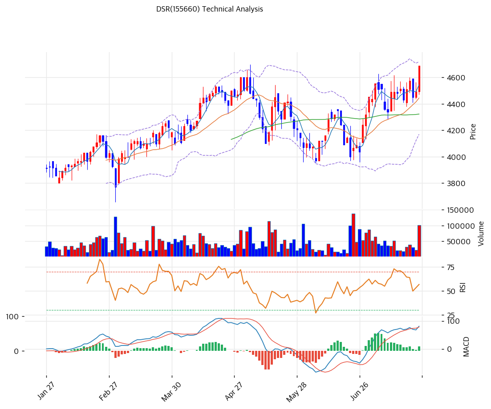

# DSR(155660) 기술적 분석

2026-07-25 | T2 Technical Analysis

---

## 차트

---

## 1. 가격 현황

| 항목 | 값 |
|------|-----|
| 현재가 | 4,690원 (+4.34%) |
| 52주 고가 | 4,690원 (**금일 신고가**) |
| 52주 저가 | 3,670원 |
| 52주 범위 위치 | 100.0% |
| 거래량 | 20일 평균 대비 2.22x |

---

## 2. 차트 패턴 분석

### 2.1 캔들스틱 패턴

| 패턴 | 위치 | 신뢰도 | 해석 |
|------|------|--------|------|
| 장대양봉 (신고가 경신) | 금일 | 강 | +4.3% 거래량 2.2배 동반 — 4,600원 매물대 돌파 |
| 저점 높이는 양봉 우위 | 7월 | 중 | 6월 말 4,050원대 → 7월 4,500원대 계단식 상승 |

### 2.2 가격 구조 패턴

- **6개월 상승 채널의 상단 돌파** (신뢰도: 강)
  1월 3,900원부터 이어진 상승 추세선(현재 지지 3,954원·저항 4,565원) 중 상단을 금일 돌파. 채널 상단 이탈은 추세 가속 신호로, 통상 새 채널 형성 또는 되돌림 후 재진입으로 이어진다.

- **4\~5월 고점(4,600원) 매물대 돌파** (신뢰도: 강)
  4월 말 4,600원 고점 → 5월 조정(3,970원) → 7월 재돌파. 3개월 컵 패턴의 완성으로 측정 목표가는 컵 깊이(630원)를 더한 5,230원 부근.

- **볼린저 폭 12.4% — 과열 없는 돌파** (신뢰도: 중)
  같은 날 급등한 종목들과 달리 밴드 폭이 좁고 MA20 괴리도 +5.5%에 불과 — 수급 이벤트가 아니라 추세 연장형 신고가다.

### 2.3 다이버전스

- **다이버전스 없음 — 완전 동행** (신뢰도: —)
  RSI 63.3·MACD 확대 모두 가격과 같은 방향. 과매수(70) 이전이라 추세 여력이 남아 있다.

### 2.4 패턴 종합 판단

정배열 + 채널 상단 돌파 + 컵 완성 + 거래량 2.2배 — 기술적으로 가장 건강한 조합이다. 특히 MA20 괴리 +5.5%·밴드 폭 12.4%로 **과열 없이 신고가를 만들었다**는 점이 중요하다: 급등 후 되돌림이 아니라 기간 조정으로 소화될 확률이 높은 구조이며, 펀더멘털(2026Q1 OPM 8.7%·배당 5.3%)이 뒷받침하는 돌파라 지속성도 우호적이다.

---

## 3. 이동평균선 — 완전 정배열 (건전한 강세)

| MA | 값 | 현재가 괴리율 | 위치 |
|----|-----|--------------|------|
| MA5 | 4,544원 | +3.2% | 위 |
| MA20 | 4,444원 | +5.5% | 위 |
| MA60 | 4,323원 | +8.5% | 위 |
| MA120 | 4,227원 | +11.0% | 위 |
| MA200 | 4,068원 | +15.3% | 위 |

**해석**: MA5 > MA20 > MA60 > MA120 > MA200의 교과서적 정배열이며, 모든 이평이 우상향 중이다. MA20 괴리 +5.5%는 과열 기준(20%)의 4분의 1 수준 — 추세의 초·중반부에 있다는 뜻으로, 눌림 시 MA20(4,444원)·MA60(4,323원)이 촘촘한 지지대로 대기한다.

---

## 4. 보조 지표

### RSI(14) — 63.3 (중립 상단)

과매수(70)까지 여유가 있는 상승 — 신고가 경신 국면에서 이 수준은 추세 지속에 유리한 위치다.

### MACD(12,26,9)

| 항목 | 값 |
|------|-----|
| MACD | 81.0 |
| Signal | 68.0 |
| Histogram | +12.0 |
| 크로스 상태 | 매수 구간 (확대 중) |

**해석**: 6월 말 골든크로스 후 히스토그램이 완만히 확대 중 — 급하지 않은 모멘텀이 오히려 지속성의 근거다.

### 볼린저밴드(20, 2σ)

| 항목 | 값 |
|------|-----|
| 상단 | 4,720원 |
| 중단 (MA20) | 4,444원 |
| 하단 | 4,169원 |
| 밴드 폭 | 12.4% |
| 현재 위치 | 상단 근접 |

**해석**: 상단(4,720원) 바로 아래 — 밴드 폭이 12.4%로 좁아 상단 돌파 시 밴드 확장(변동성 분출)이 동반될 가능성이 있다. 밴드 워킹 진입 여부가 추세 강도의 시금석.

### 스토캐스틱(14, 3, 3)

| 항목 | 값 |
|------|-----|
| Slow %K | 69.6 |
| Slow %D | 67.7 |
| 크로스 상태 | 골든크로스 |
| 판단 | 중립 (과매수 접근) |

---

## 5. 지지/저항 — 추세선 · 피보나치 · PRZ 통합

### 5.1 피보나치 되돌림/확장

| 구분 | 비율 | 가격 | 현재가 대비 |
|------|------|------|-----------|
| Swing High | — | 4,600원 | -1.9% |
| 되돌림 | 0.786 | 4,465원 | -4.8% |
| 되돌림 | 0.618 | 4,359원 | -7.1% |
| 되돌림 | 0.5 | 4,285원 | -8.6% |
| 되돌림 | 0.382 | 4,211원 | -10.2% |
| 되돌림 | 0.236 | 4,119원 | -12.2% |
| Swing Low | — | 3,970원 | -15.4% |

※ 피보나치 기준: 직전 스윙(4,600→3,970원) — 신고가 돌파로 전 레벨이 하방 지지로 전환

### 5.2 추세선

| 추세선 | 방향 | 현재 교차가 | 포인트 수 | 해석 |
|--------|------|-----------|---------|------|
| 지지선 | 상승 | 3,954원 | 6개 | 1월 저점발 — 중기 추세의 마지노선 |
| 저항선 | 상승 | 4,565원 | 6개 | 채널 상단 — **금일 돌파** |

### 5.3 PRZ (Potential Reversal Zone)

| 방향 | 가격 범위 | 신뢰도 | 근거 |
|------|---------|--------|------|
| 저항 | 4,763\~4,837원 | 약 | 피봇 R1·R2 |
| 지지 | 4,068\~4,565원 | **강** | MA20·60·120·200 + 피보나치 0.236\~0.786 + 피봇 S1·S2 — **13개 소스 밀집** |
| 지지 | 3,729\~3,799원 | 약 | 피보나치 1.272/1.382 확장 |

※ PRZ = 추세선 · 피보나치 · 피봇 · MA 등 복수 지표가 겹치는 가격 구간

### 5.4 종합 지지/저항 테이블

| 구분 | 가격 | 근거 |
|------|------|------|
| 저항 | 5,230원 | 컵 패턴 측정 목표가 |
| 저항 | 4,837원 | 피봇 R2 |
| 저항 | 4,763원 | 피봇 R1 |
| 저항 | 4,720원 | 볼린저 상단 |
| **현재가** | **4,690원** | 52주 신고가 — 상방 매물대 없음 |
| 지지 | 4,544원 | MA5 |
| 지지 | 4,444\~4,465원 | MA20 + 피보나치 0.786 |
| 지지 | 4,323\~4,359원 | MA60 + 피보나치 0.618 |
| 지지 | 4,068\~4,227원 | PRZ(강) 하단 — MA120·MA200 |
| 지지 | 3,954원 | 상승 추세선 (최후 방어선) |

---

## 6. 시그널 종합

| 지표 | 내용 | 시그널 |
|------|------|--------|
| **차트 패턴** | 채널 상단 돌파 + 컵 완성 신고가 | 🟢 |
| 이동평균선 | **완전 정배열**, MA20 +5.5% (건전) | 🟢 |
| RSI | 63.3 — 중립 상단 | ⚪ |
| MACD | 매수 구간, 히스토그램 확대 | 🟢 |
| 볼린저밴드 | 상단 근접, 폭 12.4% | ⚪ |
| 스토캐스틱 | 골든크로스, K=69.6 | ⚪ |
| 거래량 | 2.22x — 돌파 동반 | ⚪ |

**종합 판단**: 🟢 매수 3개 / 🔴 매도 0개 / ⚪ 중립 3개 → **매수우위 (과열 없는 추세형 신고가)**

매도 신호가 하나도 없는 드문 구도다 — 추세(정배열)·모멘텀(MACD)·패턴(컵 돌파)이 모두 상방이고, 과열 지표는 어디에도 없다. 여기에 PER 5.0x·PBR 0.31x·배당 5.3%라는 펀더멘털 하방까지 감안하면 눌림의 깊이가 제한되는 구조. 1차 목표는 4,763\~4,837원(피봇), 컵 패턴 목표는 5,230원이며, 4,444원(MA20) 아래로 밀리면 기간 조정 국면으로 전환된다.

---

## 7. 전략 제안

### 보유 중인 경우
- **홀드 (추세 추종)**
- 익절 라인: 5,230원 (컵 패턴 목표 — 분할 익절 시작점), 1차 4,837원(피봇 R2)에서 일부 축소 가능
- 손절 라인: 4,320원 (MA60 이탈 = 추세 훼손 1차 신호)
- 리스크/리워드: 약 1.5 (+540 / -370) — 배당 5.3%가 실질 하방 쿠션

### 진입 대기인 경우
- **눌림 분할 매수 우선 (추격은 소량)**
- 1차 진입가: 4,444\~4,465원 (MA20 + 피보나치 0.786 — 통상 눌림 하단)
- 2차 진입가: 4,323\~4,359원 (MA60 + 피보나치 0.618 — PRZ 강 상단부)
- 진입 조건: 신고가 직후라 소폭 눌림 대기가 기본이나, 과열이 없고 배당수익률 5.3%가 받쳐 현재가 부분 진입도 정당화 가능. 8월 반기 실적(OPM 8%대 유지 여부)이 비중 확대의 확인점 — 유통물량이 40% 미만으로 얇으니 포지션 규모는 일 거래대금 이내로 제한할 것
