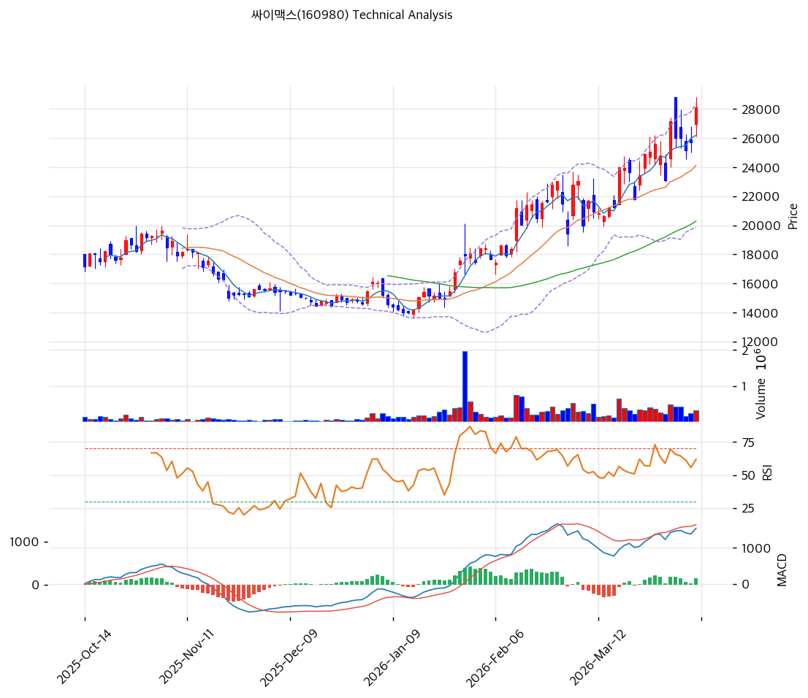

# 싸이맥스(160980) 기술적 분석

2026-04-08 | T2 Technical Analysis

---

## 차트

---

## 1. 가격 현황

| 항목 | 값 |
|------|-----|
| 현재가 | 28,100원 (+9.34%) |
| 52주 고가 | 28,800원 |
| 52주 저가 | 9,520원 |
| 52주 범위 위치 | 97.4% |
| 거래량 | 20일 평균 대비 1.04x |

---

## 2. 차트 패턴 분석

### 2.1 캔들스틱 패턴

| 패턴 | 위치 | 신뢰도 | 해석 |
|------|------|--------|------|
| 강한 양봉 | 당일 (2026-04-08) | 강 | +9.34% 대형 양봉 — 매수 세력의 강한 진입 신호. 거래량 평균 수준이어서 돌파 지속성은 확인 필요 |
| 신고가 도달 | 52주 고가 근접 | 중 | 현재가 28,100원이 52주 고가(28,800원)에 0.7% 이내 근접. 추가 돌파 시 레지스탕스 소멸로 추세 가속 가능 |

※ 주요 캔들 패턴: 망치형, 역망치형, 장악형(상승/하락), 도지, 샛별/석별, 적삼병/흑삼병, 하라미, 유성형, 교수형 등

### 2.2 가격 구조 패턴

- **52주 신고가 돌파 시도** (신뢰도: 강)
  현재가 28,100원은 52주 저가(9,520원) 대비 약 195% 상승한 수준으로 장기 상승 추세 진행 중. 52주 고가 28,800원을 일봉 종가 기준으로 돌파할 경우 다음 저항이 부재한 오픈 업사이드 구간으로 진입. 단기적으로는 28,800원 직전의 저항 매물 소화 여부가 관건.

- **가파른 상승 추세** (신뢰도: 중)
  MA5(26,190원) → MA20(24,120원) → MA60(20,285원) → MA120(18,408원) → MA200(16,399원)의 완전 정배열이 형성돼 있으며, 현재가가 모든 이동평균선 위에 위치. 단기 과열 우려가 있으나 정배열 구조 자체는 강세 추세의 근거.

### 2.3 다이버전스

- **RSI 다이버전스 없음** (신뢰도: 해당 없음)
  RSI 64.4로 과매수 구간(70 이상) 미진입. 가격 급등에 비해 RSI 수준이 아직 중립 영역이어서 상승 여력이 기술적으로 잔존. 뚜렷한 하락 다이버전스는 미형성.

- **MACD 히스토그램 확대** (신뢰도: 중)
  MACD(1,536) > Signal(1,389), 히스토그램 +147로 확대 중. 매수 신호가 지속되며 히스토그램 팽창은 상승 모멘텀의 강화를 의미. 히스토그램이 수축 전환될 경우 단기 추세 약화 조기 경보로 활용.

### 2.4 패턴 종합 판단

당일 +9.34%의 강한 양봉 발생과 함께 52주 신고가 목전에서 매수 세력의 강력한 진입이 확인됐다. MACD 히스토그램 확대, 완전 정배열, RSI 중립권 유지라는 세 가지 조건이 동시에 충족되어 단기 강세 바이어스가 뚜렷하다. 다만 현재가가 볼린저밴드 상단(28,378원)에 밀착된 상태로, 상단 돌파 후 밴드 확장 여부 또는 저항에서의 매물 소화 과정을 주의 깊게 관찰해야 한다.

---

## 3. 이동평균선 — 정배열 (강세)

| MA | 값 | 현재가 괴리율 | 위치 |
|----|-----|--------------|------|
| MA5 | 26,190원 | +7.3% | 위 |
| MA20 | 24,120원 | +16.5% | 위 |
| MA60 | 20,285원 | +38.5% | 위 |
| MA120 | 18,408원 | +52.7% | 위 |
| MA200 | 16,399원 | +71.3% | 위 |

**해석**: MA5~MA200 전 구간 완전 정배열. 현재가가 MA5 대비 +7.3%, MA200 대비 +71.3% 乖離로 모든 이동평균선 대비 대폭 상방 이탈 상태. MA5는 단기 지지선으로 26,190원, MA20은 추세 지속의 핵심 지지선으로 24,120원에 위치. 단기 과열 징후가 있으나 강세 추세 자체는 훼손되지 않음.

---

## 4. 보조 지표

### RSI(14) — 64.4 (중립)

RSI 64.4로 과매수 기준(70)에 근접하고 있으나 아직 중립권 상단. 당일 강한 양봉 발생을 감안하면 RSI가 70 이상으로 단기 진입할 가능성이 있으며, 과매수 구간 진입 시 단기 조정 가능성 점검 필요.

### MACD(12,26,9)

| 항목 | 값 |
|------|-----|
| MACD | 1,536 |
| Signal | 1,389 |
| Histogram | +147 |
| 크로스 상태 | 매수 구간 (확대 중) |

**해석**: MACD가 Signal을 상회하고 히스토그램이 양수 확대 중. 매수 구간에서 모멘텀이 강화되고 있어 단기 추세 지속 가능성을 지지. 히스토그램이 수축 전환 시 추세 약화 신호로 판단.

### 볼린저밴드(20, 2σ)

| 항목 | 값 |
|------|-----|
| 상단 | 28,378원 |
| 중단 (MA20) | 24,120원 |
| 하단 | 19,862원 |
| 밴드 폭 | 35.3% |
| 현재 위치 | 상단 근접 |

**해석**: 밴드 폭 35.3%로 이미 확장 국면. 현재가 28,100원이 상단(28,378원)에 거의 밀착. 볼린저밴드 상단 돌파 후 안착 시 추가 상승 가속 신호가 되나, 상단에서 밀릴 경우 중단(MA20, 24,120원)까지 되돌림 구간이 됨. 밴드 폭이 이미 확장 상태라 스퀴즈 이후 돌파 기대는 아닌, 추세 지속 여부의 판단 구간.

### 스토캐스틱(14, 3, 3)

| 항목 | 값 |
|------|-----|
| Slow %K | 65.0 |
| Slow %D | 60.2 |
| 크로스 상태 | 골든크로스 |
| 판단 | 중립 |

---

## 5. 지지/저항

| 구분 | 가격 | 근거 |
|------|------|------|
| 저항 | 28,800원 | 52주 고가 |
| 저항 | 29,233원 | 피봇 R1 |
| **현재가** | **28,100원** | — |
| 지지 | 26,533원 | 피봇 S1 |
| 지지 | 24,967원 | 피봇 S2 |
| 지지 | 24,120원 | MA20 |
| 지지 | 20,285원 | MA60 |

---

## 6. 시그널 종합

| 지표 | 내용 | 시그널 |
|------|------|--------|
| **차트 패턴** | +9.34% 강양봉, 52주 신고가 목전, 완전 정배열 | 🟢 |
| 이동평균선 | 정배열, MA20 +16.5% 乖離 | 🟢 |
| RSI | 64.4 — 중립 (과매수 근접) | ⚪ |
| MACD | 매수구간, 히스토그램 확대 중 | 🟢 |
| 볼린저밴드 | 상단 밀착(28,378원), 밴드 폭 35.3% | ⚪ |
| 스토캐스틱 | 골든크로스, K=65.0, 중립권 | ⚪ |
| 거래량 | 1.04x — 약함 (평균 수준) | ⚪ |

**종합 판단**: 🟢 매수 3개 / 🔴 매도 0개 / ⚪ 중립 4개 → **매수우위**

완전 정배열 + MACD 매수 확대 + 강한 양봉 발생으로 단기·중기 모두 강세 바이어스가 지배적이다. 다만 현재가가 볼린저밴드 상단 및 52주 고가에 밀착한 상태이고 거래량 동반이 평균 수준에 그쳐, 52주 고가(28,800원) 돌파 여부가 추가 상승의 핵심 확인 조건이다. RSI와 스토캐스틱이 과매수 구간에 진입하기 전 현재 중립권 상단에서 모멘텀을 유지하는 것이 단기 강세 지속의 관건.

---

## 7. 전략 제안

### 보유 중인 경우
- **홀드**
- 익절 라인: 29,233원 (피봇 R1 — 52주 고가 돌파 성공 시 다음 저항)
- 손절 라인: 24,967원 (피봇 S2 — 단기 지지 구조 붕괴 시)
- 리스크/리워드: 약 1:0.4 (현재 고점 부근 진입 특성상 R/R 불리)

### 진입 대기인 경우
- **관망 후 조건부 진입**
- 1차 진입가: 26,533원 (피봇 S1 — 단기 눌림목 지지 확인 시)
- 2차 진입가: 24,120원 (MA20 — 중기 추세 지지 확인 시)
- 진입 조건: 52주 고가(28,800원) 거래량 동반 돌파 종가 확인 후 추격 진입 또는, 피봇 S1(26,533원) 지지 확인 후 반등 캔들 발생 시 분할 진입
