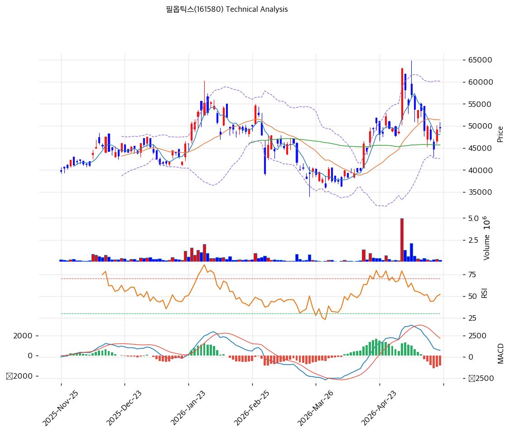

# 필옵틱스(161580) 기술적 분석

2026-05-24 | T2 Technical Analysis

---

## 차트

---

## 1. 가격 현황

| 항목 | 값 |
|------|-----|
| 현재가 | 49,600원 (+0.81%) |
| 52주 고가 | 63,000원 |
| 52주 저가 | 28,950원 |
| 52주 범위 위치 | 60.6% |
| 거래량 | 20일 평균 대비 0.30x |

---

## 2. 차트 패턴 분석

### 2.1 캔들스틱 패턴

| 패턴 | 위치 | 신뢰도 | 해석 |
|------|------|--------|------|
| 단기 하락 후 도지형 캔들 | 최근 3\~5일 | 중 | 49,000\~50,000원대 좁은 실체 형성 — 매수·매도 균형, 추세 휴면 시사 |
| 음봉 연속 (적삼병 부재) | 최근 10일 | 약 | 5월 초 63,000원 부근 고점 이후 단기 음봉 우세 — 단기 약세 잔존하나 거래량 미흡 |
| 장대 양봉 부재 | 최근 2주 | 중 | 반등 시도마다 종가 약세 마감 — 매수 모멘텀 부재 |

### 2.2 가격 구조 패턴

- **고점 이후 조정 박스권** (신뢰도: 중)
  4월 말 63,000원 고점에서 -21% 조정 후 47,400\~51,400원 박스권 형성. 약 2\~3주간 횡보 지속. 박스 상단 51,400원(MA20) 돌파 시 55,000원 회복 시도, 하단 47,400원(S2) 이탈 시 45,700원(MA60) 테스트 예상.

- **삼각수렴 (대칭) 가능성** (신뢰도: 약)
  고점 63,000원 이후 고점 점차 낮아지고(58,000원→52,000원), 저점은 47,000원대 유지 — 대칭 삼각형 초기 형성. 거래량 0.3x로 수렴 후 방향성 폭발 가능. 돌파 방향이 추세 결정.

- **MA20 하향 이탈** (신뢰도: 중)
  현재가가 MA20(51,372원) 하단에 위치(-3.5%). 단기 지지 전환 → 저항 전환 신호. 회복 실패 시 MA60(45,702원)까지 추가 조정 여지.

### 2.3 다이버전스

- **MACD 하락 다이버전스** (신뢰도: 중)
  4월 중순 가격 고점(63,000원) 형성 시 MACD는 상승 정점에서 이후 우하향 — 매도 크로스(-980) 확정. 단기 모멘텀 약화 시사.

- **RSI 중립권 수렴** (신뢰도: 약)
  RSI 50.7로 중립 — 명확한 다이버전스 부재. 다만 4월 고점 RSI 70+ → 현재 50대로 빠른 모멘텀 식음. 과매수 해소 진행 중이나 추세 전환 시그널은 미확정.

### 2.4 패턴 종합 판단

캔들은 도지형 균형, 가격구조는 박스권 + 삼각수렴, 다이버전스는 MACD 약세 시사로 **단기 약세 잠복 + 중기 방향성 미정** 국면. MA20 이탈 + MACD 매도 크로스는 명확한 약세 시그널이나, 거래량 0.3x로 본격 매도 압력은 부재. 박스 하단 47,400원 사수 여부가 추세 결정 변곡점.

---

## 3. 이동평균선 — 비정배열 (단기 약세 / 중장기 잔존 강세)

| MA | 값 | 현재가 괴리율 | 위치 |
|----|-----|--------------|------|
| MA5 | 48,100원 | +3.1% | 위 |
| MA20 | 51,372원 | -3.5% | 아래 |
| MA60 | 45,702원 | +8.5% | 위 |
| MA120 | 45,879원 | +8.1% | 위 |
| MA200 | 42,309원 | +17.2% | 위 |

**해석**: MA5 회복 후 MA20 재돌파 실패 — 단기 정배열 깨짐. MA60/120/200은 여전히 상승 추세 유지, 중장기 정배열 잔존. MA20(51,372원)이 직근 저항, MA60(45,702원)이 핵심 지지. MA200 +17.2%로 중장기 과열은 아니나 차익실현 압력 잠재.

---

## 4. 보조 지표

### RSI(14) — 50.7 (중립)

중립권 진입 — 4월 고점 70+ 이후 모멘텀 빠르게 식어 매도 압력 1차 해소. 추가 반등 시 60 돌파가 단기 추세 회복 트리거.

### MACD(12,26,9)

| 항목 | 값 |
|------|-----|
| MACD | 760 |
| Signal | 1,740 |
| Histogram | -980 |
| 크로스 상태 | 매도 구간 (확대 중) |

**해석**: 매도 크로스 확정 + 히스토그램 -980 강한 음전환. 단기 하방 모멘텀 우세 — 시그널선 하향 돌파 또는 히스토그램 축소 전까지 약세 지속 가능.

### 볼린저밴드(20, 2σ)

| 항목 | 값 |
|------|-----|
| 상단 | 60,160원 |
| 중단 (MA20) | 51,372원 |
| 하단 | 42,585원 |
| 밴드 폭 | 34.2% |
| 현재 위치 | 중간 (중단 아래) |

**해석**: 밴드 폭 34.2%로 변동성 정상권. 4월 상단 터치(63,000원) 후 중단 하향 이탈 — 평균 회귀 진행 중. 하단 42,585원까지 여유 있으나, 중단 회복 실패 시 하향 압력 가속화 가능.

### 스토캐스틱(14, 3, 3)

| 항목 | 값 |
|------|-----|
| Slow %K | 22.0 |
| Slow %D | 16.8 |
| 크로스 상태 | 골든크로스 |
| 판단 | 중립 (과매도 근접) |

---

## 5. 지지/저항 — 추세선 · 피보나치 · PRZ 통합

### 5.1 피보나치 되돌림

| 구분 | 비율 | 가격 | 현재가 대비 |
|------|------|------|-----------|
| Swing High | — | 63,000원 | +27.0% |
| 되돌림 | 0.236 | 40,466원 | -18.4% |
| 되돌림 | 0.382 | 43,167원 | -13.0% |
| 되돌림 | 0.5 | 45,350원 | -8.6% |
| 되돌림 | 0.618 | 47,533원 | -4.2% |
| 되돌림 | 0.786 | 50,641원 | +2.1% |
| Swing Low | — | 28,950원 | -41.6% |

※ 피보나치 기준: 상승 추세 (Swing Low 28,950원 → Swing High 63,000원)
※ 현재가 49,600원은 0.618\~0.786 사이 → 핵심 되돌림 구간 진입

### 5.2 추세선

| 추세선 | 방향 | 현재 교차가 | 해석 |
|--------|------|-----------|------|
| 지지선 | 상승 | 40,235원 | 장기 상승 추세선 — 이탈 시 추세 전환 |
| 저항선 | 상승 | 58,453원 | 단기 저항 채널 — 돌파 시 60,000원대 회복 시도 |

### 5.3 PRZ (Potential Reversal Zone)

| 방향 | 가격 범위 | 신뢰도 | 근거 |
|------|---------|--------|------|
| 저항 | 51,203\~51,372원 | 강 | 피보나치 0.786 + 피봇 R1 + MA20 (3개 겹침) |
| 지지 | 47,533\~47,883원 | 강 | 피봇 S2 + 피보나치 0.618 + MA5 (3개 겹침) |
| 지지 | 45,350\~45,702원 | 중 | 피보나치 0.5 + MA60 + MA120 (3개 겹침) |
| 지지 | 42,309\~42,738원 | 약 | MA200 + 피보나치 0.382 |
| 지지 | 40,235\~40,466원 | 약 | 추세선 지지 + 피보나치 0.236 |

### 5.4 종합 지지/저항 테이블

| 구분 | 가격 | 근거 |
|------|------|------|
| 저항 | 63,000원 | 52주 고가 |
| 저항 | 58,453원 | 추세선 저항 |
| 저항 | 51,203원 | **PRZ 강** (피보 0.786 + R1 + MA20) |
| **현재가** | **49,600원** | — |
| 지지 | 47,883원 | **PRZ 강** (S2 + 피보 0.618 + MA5) |
| 지지 | 45,702원 | PRZ 중 (MA60 + MA120 + 피보 0.5) |
| 지지 | 42,309원 | MA200 |
| 지지 | 40,235원 | 추세선 + 피보 0.236 |

---

## 6. 시그널 종합

| 지표 | 내용 | 시그널 |
|------|------|--------|
| **차트 패턴** | 박스권 + MA20 이탈 + MACD 약세 다이버전스 | 🔴 |
| 이동평균선 | MA20 이탈 / MA60·120·200 위 — 비정배열 | ⚪ |
| RSI | 50.7 — 중립 | ⚪ |
| MACD | -980 매도 크로스 확대 | 🔴 |
| 볼린저밴드 | 중단 하향 이탈 — 평균 회귀 진행 | ⚪ |
| 스토캐스틱 | K=22 / D=16.8 — 과매도 근접 골든크로스 | ⚪ |
| 거래량 | 0.30x — 매우 약함 (모멘텀 휴면) | ⚪ |

**종합 판단**: 🟢 매수 0개 / 🔴 매도 2개 / ⚪ 중립 5개 → **매도우위 (약세 잠복)**

MA20 이탈 + MACD 매도 크로스로 단기 약세 시그널 우세하나, 거래량 0.3x로 본격 매도 압력은 부재. 중립 시그널 5개가 다수 — 박스권 횡보 국면. PRZ 강 지지 47,883원 사수 여부가 단기 변곡점, 이탈 시 45,702원(MA60) 테스트. 상방은 51,203원(PRZ 강) 돌파 + 거래량 동반이 추세 회복 전제.

---

## 7. 전략 제안

### 보유 중인 경우
- **홀드 (비중축소 권고)**
- 익절 라인: 64,260원 (52주 고가 63,000원 돌파 시 신고가)
- 손절 라인: 47,400원 (피봇 S2 + PRZ 강 지지 이탈)
- 리스크/리워드: 약 6.7배 (상방 +29.6% / 하방 -4.4%)

### 진입 대기인 경우
- **관망 (또는 분할 진입 가능)**
- 1차 진입가: 48,500원 (피봇 S1 — 단기 지지)
- 2차 진입가: 47,883원 (PRZ 강 — S2 + 피보 0.618 + MA5)
- 진입 조건: 47,400\~48,000원 지지 확인 후 거래량 1.0x 이상 회복 동반 반등 시. 47,400원 이탈 시 진입 보류 → 45,702원(MA60) 재확인.
